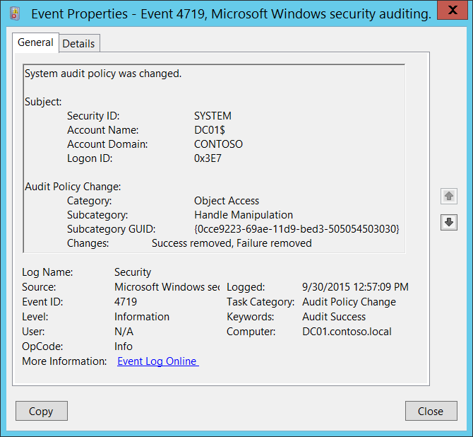

# 4719(S): システム監査ポリシーが変更されました。



***サブカテゴリ:***&nbsp;[監査ポリシーの変更](audit-audit-policy-change.md)

***イベントの説明:***

このイベントは、コンピューターの監査ポリシーが変更されたときに生成されます。

このイベントは、「監査ポリシーの変更」サブカテゴリの設定に関係なく常に記録されます。

> **注**&nbsp;&nbsp;推奨事項については、このイベントの[セキュリティ監視の推奨事項](#security-monitoring-recommendations)を参照してください。

<br clear="all">

***イベント XML:***
```xml
- <Event xmlns="http://schemas.microsoft.com/win/2004/08/events/event">
- <System>
 <Provider Name="Microsoft-Windows-Security-Auditing" Guid="{54849625-5478-4994-A5BA-3E3B0328C30D}" /> 
 <EventID>4719</EventID> 
 <Version>0</Version> 
 <Level>0</Level> 
 <Task>13568</Task> 
 <Opcode>0</Opcode> 
 <Keywords>0x8020000000000000</Keywords> 
 <TimeCreated SystemTime="2015-09-30T19:57:09.668217100Z" /> 
 <EventRecordID>1049418</EventRecordID> 
 <Correlation /> 
 <Execution ProcessID="516" ThreadID="4668" /> 
 <Channel>Security</Channel> 
 <Computer>DC01.contoso.local</Computer> 
 <Security /> 
 </System>
- <EventData>
 <Data Name="SubjectUserSid">S-1-5-18</Data> 
 <Data Name="SubjectUserName">DC01$</Data> 
 <Data Name="SubjectDomainName">CONTOSO</Data> 
 <Data Name="SubjectLogonId">0x3e7</Data> 
 <Data Name="CategoryId">%%8274</Data> 
 <Data Name="SubcategoryId">%%12807</Data> 
 <Data Name="SubcategoryGuid">{0CCE9223-69AE-11D9-BED3-505054503030}</Data> 
 <Data Name="AuditPolicyChanges">%%8448, %%8450</Data> 
 </EventData>
 </Event>

```

***必要なサーバー役割:*** なし。

***最小 OS バージョン:*** Windows Server 2008, Windows Vista。

***イベントバージョン:*** 0。

***フィールドの説明:***

**サブジェクト:**

-   **セキュリティ ID** \[タイプ = SID\]**:** ローカル監査ポリシーに変更を加えたアカウントのSID。イベントビューアーは自動的にSIDを解決し、アカウント名を表示しようとします。SIDが解決できない場合、イベントにはソースデータが表示されます。

> **注**&nbsp;&nbsp;**セキュリティ識別子 (SID)** は、トラスティ (セキュリティプリンシパル) を識別するために使用される可変長の一意の値です。各アカウントには、Active Directoryドメインコントローラーなどの権限によって発行され、セキュリティデータベースに保存される一意のSIDがあります。ユーザーがログオンするたびに、システムはデータベースからそのユーザーのSIDを取得し、そのユーザーのアクセス トークンに配置します。システムは、アクセス トークン内のSIDを使用して、以降のすべてのWindowsセキュリティとのやり取りでユーザーを識別します。ユーザーまたはグループの一意の識別子としてSIDが使用された場合、それ以降は他のユーザーまたはグループを識別するために再利用されることはありません。SIDの詳細については、[セキュリティ識別子](/windows/access-protection/access-control/security-identifiers)を参照してください。

-   **アカウント名** \[タイプ = UnicodeString\]**:** ローカル監査ポリシーに変更を加えたアカウントの名前。

-   **アカウントドメイン** \[タイプ = UnicodeString\]**:** サブジェクトのドメインまたはコンピュータ名。形式は以下のように異なります：

    -   ドメイン NETBIOS 名の例: CONTOSO

    -   小文字の完全ドメイン名: contoso.local

    -   大文字の完全ドメイン名: CONTOSO.LOCAL

    -   一部の[よく知られたセキュリティプリンシパル](/windows/security/identity-protection/access-control/security-identifiers)の場合、このフィールドの値は「NT AUTHORITY」となります（例：LOCAL SERVICE または ANONYMOUS LOGON）。

    -   ローカルユーザーアカウントの場合、このフィールドにはこのアカウントが属するコンピュータまたはデバイスの名前が含まれます。例：「Win81」。

-   **ログオンID** \[タイプ = HexInt64\]**:** 16進数の値で、最近のイベントと同じログオンIDを含む可能性のあるイベントとこのイベントを関連付けるのに役立ちます。例：「[4624](event-4624.md): アカウントが正常にログオンされました。」

**監査ポリシーの変更:**

-   **カテゴリ:** サブカテゴリが変更された監査カテゴリの名前。可能な値：

    -   アカウントログオン

    -   アカウント管理

    -   詳細トラッキング

    -   DSアクセス

    -   ログオン/ログオフ

    -   オブジェクトアクセス

    -   ポリシー変更

    -   特権使用

    -   システム

-   **サブカテゴリ:** 変更された監査サブカテゴリの名前。可能な値：

| 資格情報の検証                    | プロセス終了                           | ネットワークポリシーサーバー     |
|------------------------------------|----------------------------------------|--------------------------------|
| Kerberos 認証サービス              | RPC イベント                           | その他のログオン/ログオフイベント|
| Kerberos サービスチケット操作      | 詳細なディレクトリサービスレプリケーション | 特別なログオン                  |
| その他のログオン/ログオフイベント  | ディレクトリサービスアクセス           | アプリケーション生成            |
| アプリケーショングループ管理       | ディレクトリサービスの変更             | 認証サービス                    |
| コンピュータアカウント管理         | ディレクトリサービスレプリケーション   | 詳細なファイル共有              |
| 配布グループ管理                   | アカウントロックアウト                 | ファイル共有                    |
| その他のアカウント管理イベント     | IPsec 拡張モード                       | ファイルシステム                |
| セキュリティグループ管理           | IPsec メインモード                     | フィルタリングプラットフォーム接続|
| ユーザーアカウント管理             | IPsec クイックモード                   | フィルタリングプラットフォームパケットドロップ |
| DPAPI アクティビティ                | ログオフ                               | ハンドル操作                    |
| プロセス作成                       | ログオン                               | カーネルオブジェクト             |
| その他のオブジェクトアクセスイベント| フィルタリングプラットフォームポリシー変更 | IPsec ドライバー                |
| レジストリ                         | MPSSVC ルールレベルポリシー変更        | その他のシステムイベント        |
| SAM                                | その他のポリシー変更イベント           | セキュリティ状態の変更          |
| ポリシー変更                       | 非機密特権使用                         | セキュリティシステム拡張        |
| 認証ポリシー変更                   | 機密特権使用                           | システム整合性                  |
| 認可ポリシー変更                   | その他の特権使用イベント               | プラグアンドプレイイベント      |
| グループメンバーシップ             |                                        |                                |

-   **サブカテゴリ GUID:** 一意のサブカテゴリ GUID。サブカテゴリ GUID を確認するには、このコマンドを使用します: **auditpol /list /subcategory:\* /v**。


> **Note**&nbsp;&nbsp;**GUID** は 'Globally Unique Identifier' の略です。これは、リソース、アクティビティ、またはインスタンスを識別するために使用される 128 ビットの整数です。

-   **変更:** **“サブカテゴリ”** に対して行われた変更。可能な値:

    -   成功が削除されました

    -   失敗が削除されました

    -   成功が追加されました

    -   失敗が追加されました

        上記の項目のいずれかの組み合わせも可能で、カンマで区切られます。

## セキュリティ監視の推奨事項

4719(S): システム監査ポリシーが変更されました。

-   このタイプのすべてのイベントを監視します。特に高価値の資産やコンピュータでは、ローカル監査ポリシーの変更は計画的に行われるべきです。このアクションが計画されていなかった場合、変更の理由を調査します。
