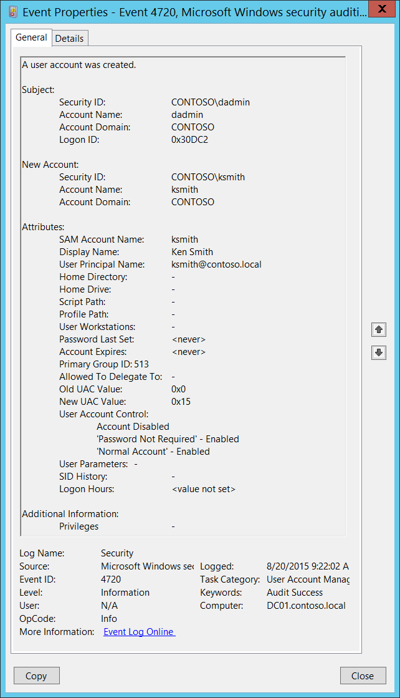

# 4720(S): ユーザーアカウントが作成されました。



***サブカテゴリ:***&nbsp;[ユーザーアカウント管理の監査](audit-user-account-management.md)

***イベントの説明:***

このイベントは、新しいユーザーオブジェクトが作成されるたびに生成されます。

このイベントは、ドメインコントローラー、メンバーサーバー、およびワークステーションで生成されます。

> **注**&nbsp;&nbsp;推奨事項については、このイベントの[セキュリティ監視の推奨事項](#security-monitoring-recommendations)を参照してください。

<br clear="all">

***イベント XML:***
```xml
- <Event xmlns="http://schemas.microsoft.com/win/2004/08/events/event">
- <System>
 <Provider Name="Microsoft-Windows-Security-Auditing" Guid="{54849625-5478-4994-A5BA-3E3B0328C30D}" /> 
 <EventID>4720</EventID> 
 <Version>0</Version> 
 <Level>0</Level> 
 <Task>13824</Task> 
 <Opcode>0</Opcode> 
 <Keywords>0x8020000000000000</Keywords> 
 <TimeCreated SystemTime="2015-08-20T16:22:02.759912000Z" /> 
 <EventRecordID>175408</EventRecordID> 
 <Correlation /> 
 <Execution ProcessID="520" ThreadID="1508" /> 
 <Channel>Security</Channel> 
 <Computer>DC01.contoso.local</Computer> 
 <Security /> 
 </System>
- <EventData>
 <Data Name="TargetUserName">ksmith</Data> 
 <Data Name="TargetDomainName">CONTOSO</Data> 
 <Data Name="TargetSid">S-1-5-21-3457937927-2839227994-823803824-6609</Data> 
 <Data Name="SubjectUserSid">S-1-5-21-3457937927-2839227994-823803824-1104</Data> 
 <Data Name="SubjectUserName">dadmin</Data> 
 <Data Name="SubjectDomainName">CONTOSO</Data> 
 <Data Name="SubjectLogonId">0x30dc2</Data> 
 <Data Name="PrivilegeList">-</Data> 
 <Data Name="SamAccountName">ksmith</Data> 
 <Data Name="DisplayName">Ken Smith</Data> 
 <Data Name="UserPrincipalName">ksmith@contoso.local</Data> 
 <Data Name="HomeDirectory">-</Data> 
 <Data Name="HomePath">-</Data> 
 <Data Name="ScriptPath">-</Data> 
 <Data Name="ProfilePath">-</Data> 
 <Data Name="UserWorkstations">-</Data> 
 <Data Name="PasswordLastSet">%%1794</Data> 
 <Data Name="AccountExpires">%%1794</Data> 
 <Data Name="PrimaryGroupId">513</Data> 
 <Data Name="AllowedToDelegateTo">-</Data> 
 <Data Name="OldUacValue">0x0</Data> 
 <Data Name="NewUacValue">0x15</Data> 
 <Data Name="UserAccountControl">%%2080 %%2082 %%2084</Data> 
 <Data Name="UserParameters">-</Data> 
 <Data Name="SidHistory">-</Data> 
 <Data Name="LogonHours">%%1793</Data> 
 </EventData>
 </Event>
```

***必要なサーバーロール:*** なし。

***最小 OS バージョン:*** Windows Server 2008, Windows Vista。

***イベントバージョン:*** 0。

***フィールドの説明:***

**サブジェクト:**

-   **セキュリティ ID** \[タイプ = SID\]**:** 「ユーザーアカウントの作成」操作を要求したアカウントのSID。イベントビューアーは自動的にSIDを解決し、アカウント名を表示しようとします。SIDが解決できない場合、イベントにはソースデータが表示されます。

> **注**&nbsp;&nbsp;**セキュリティ識別子 (SID)** は、信託者 (セキュリティプリンシパル) を識別するために使用される可変長の一意の値です。各アカウントには、Active Directoryドメインコントローラーなどの権限によって発行され、セキュリティデータベースに保存される一意のSIDがあります。ユーザーがログオンするたびに、システムはデータベースからそのユーザーのSIDを取得し、そのユーザーのアクセス トークンに配置します。システムは、アクセス トークン内のSIDを使用して、以降のすべてのWindowsセキュリティとのやり取りでユーザーを識別します。SIDがユーザーまたはグループの一意の識別子として使用された場合、それは他のユーザーまたはグループを識別するために再び使用されることはありません。SIDの詳細については、[セキュリティ識別子](/windows/access-protection/access-control/security-identifiers)を参照してください。

-   **アカウント名** \[タイプ = UnicodeString\]**:** 「ユーザーアカウントの作成」操作を要求したアカウントの名前。

-   **アカウントドメイン** \[タイプ = UnicodeString\]**:** サブジェクトのドメインまたはコンピュータ名。形式はさまざまで、以下を含みます：

    -   ドメインのNETBIOS名の例: CONTOSO

    -   小文字の完全なドメイン名: contoso.local

    -   大文字の完全なドメイン名: CONTOSO.LOCAL

    -   LOCAL SERVICEやANONYMOUS LOGONなどの[よく知られたセキュリティプリンシパル](/windows/security/identity-protection/access-control/security-identifiers)の場合、このフィールドの値は「NT AUTHORITY」となります。

    -   ローカルユーザーアカウントの場合、このフィールドにはこのアカウントが属するコンピュータまたはデバイスの名前が含まれます。例：「Win81」。

-   **ログオンID** \[タイプ = HexInt64\]**:** 16進数の値で、同じログオンIDを含む最近のイベントとこのイベントを関連付けるのに役立ちます。例：「[4624](event-4624.md): アカウントが正常にログオンされました。」

**新しいアカウント:**

-   **セキュリティID** \[タイプ = SID\]**:** 作成されたユーザーアカウントのSID。イベントビューアーは自動的にSIDを解決し、アカウント名を表示しようとします。SIDが解決できない場合、イベントにソースデータが表示されます。

-   **アカウント名** \[タイプ = UnicodeString\]**:** 作成されたユーザーアカウントの名前。例：dadmin。

-   **アカウントドメイン** \[タイプ = UnicodeString\]**:** 作成されたユーザーアカウントのドメイン名。形式はさまざまで、以下を含みます：

    -   ドメインのNETBIOS名の例: CONTOSO

    -   小文字の完全なドメイン名: contoso.local

    -   大文字の完全なドメイン名: CONTOSO.LOCAL

    -   ローカルアカウントの場合、このフィールドにはこの新しいアカウントが属するコンピュータの名前が含まれます。例：「Win81」。

**属性:**

- **SAMアカウント名** \[タイプ = UnicodeString\]: 以前のバージョンのWindows（Windows 2000以前のログオン名）をサポートするために使用されるアカウントのログオン名。新しいユーザーオブジェクトの**sAMAccountName**属性の値。例：ksmith。ローカルアカウントの場合、このフィールドには新しいユーザーアカウントの名前が含まれます。

- **表示名** \[タイプ = UnicodeString\]: 新しいユーザーオブジェクトの **displayName** 属性の値です。これは特定のアカウントのアドレス帳に表示される名前で、通常はユーザーの名、ミドルネームの頭文字、姓の組み合わせです。例えば、Ken Smith。この属性はActive Directoryユーザーとコンピュータを使用するか、スクリプトを通じて変更できます。ローカルアカウントにはこのフィールドに **フルネーム** 属性が含まれますが、新しいローカルアカウントの場合、このフィールドには通常「**&lt;値が設定されていません&gt;**」という値が入ります。

- **ユーザープリンシパル名** \[タイプ = UnicodeString\]: インターネットスタイルのアカウントのログイン名で、インターネット標準RFC 822に基づいています。慣例として、これはアカウントのメール名にマップされるべきです。このパラメータには新しいユーザーオブジェクトの **userPrincipalName** 属性の値が含まれます。例えば、ksmith@contoso.local。ローカルユーザーの場合、このフィールドは適用されず、「**-**」という値が入ります。この属性はActive Directoryユーザーとコンピュータを使用するか、スクリプトを通じて変更できます。

- **ホームディレクトリ** \[タイプ = UnicodeString\]: ユーザーのホームディレクトリです。**homeDrive** 属性が設定されていてドライブ文字を指定している場合、**homeDirectory** はUNCパスである必要があります。パスは \\\\Server\\Share\\Directory の形式のネットワークUNCでなければなりません。このパラメータには新しいユーザーオブジェクトの **homeDirectory** 属性の値が含まれます。新しいローカルアカウントの場合、このフィールドには通常「**&lt;値が設定されていません&gt;**」という値が入ります。この属性はActive Directoryユーザーとコンピュータを使用するか、スクリプトを通じて変更できます。このパラメータはイベントでキャプチャされない場合があり、その場合は「-」として表示されます。

- **ホームドライブ** \[タイプ = UnicodeString\]**:** **homeDirectory** アカウントの属性で指定されたUNCパスにマップするドライブ文字を指定します。ドライブ文字は「DRIVE\_LETTER:」の形式で指定する必要があります。例えば、「H:」。このパラメータには新しいユーザーオブジェクトの **homeDrive** 属性の値が含まれます。この属性はActive Directoryユーザーとコンピュータを使用するか、スクリプトを通じて変更できます。このパラメータはイベントでキャプチャされない場合があり、その場合は「-」として表示されます。新しいローカルアカウントの場合、このフィールドには通常「**&lt;値が設定されていません&gt;**」という値が入ります。

- **スクリプトパス** \[タイプ = UnicodeString\]**:** アカウントのログオンスクリプトのパスを指定します。このパラメータには、新しいユーザーオブジェクトの **scriptPath** 属性の値が含まれます。この属性は、Active Directory ユーザーとコンピュータを使用するか、スクリプトを通じて変更できます。このパラメータはイベントでキャプチャされない場合があり、その場合は「-」として表示されます。新しいローカルアカウントの場合、このフィールドには通常「**&lt;value not set&gt;**」の値が設定されます。

- **プロファイルパス** \[タイプ = UnicodeString\]: アカウントのプロファイルへのパスを指定します。この値は、null 文字列、ローカルの絶対パス、または UNC パスである可能性があります。このパラメータには、新しいユーザーオブジェクトの **profilePath** 属性の値が含まれます。この属性は、Active Directory ユーザーとコンピュータを使用するか、スクリプトを通じて変更できます。このパラメータはイベントでキャプチャされない場合があり、その場合は「-」として表示されます。新しいローカルアカウントの場合、このフィールドには通常「**&lt;value not set&gt;**」の値が設定されます。

- **ユーザーのワークステーション** \[タイプ = UnicodeString\]: ユーザーがログオンできるコンピュータの NetBIOS または DNS 名のリストを含みます。各コンピュータ名はカンマで区切られます。コンピュータの名前はユーザーオブジェクトの **sAMAccountName** プロパティです。このパラメータには、新しいユーザーオブジェクトの **userWorkstations** 属性の値が含まれます。この属性は、Active Directory ユーザーとコンピュータを使用するか、スクリプトを通じて変更できます。このパラメータはイベントでキャプチャされない場合があり、その場合は「-」として表示されます。ローカルユーザーの場合、このフィールドは適用されず、通常「**&lt;value not set&gt;**」の値が設定されます。

- **パスワード最終設定** \[タイプ = UnicodeString\]**:** アカウントのパスワードが最後に変更された時刻。Active Directory ユーザーとコンピュータのスナップインを使用して手動で作成されたユーザーアカウントの場合、このフィールドには通常「**&lt;never&gt;**」の値が設定されます。このパラメータには、新しいユーザーオブジェクトの **pwdLastSet** 属性の値が含まれます。

- **アカウントの有効期限** \[タイプ = UnicodeString\]: アカウントの有効期限の日付。このパラメータには、新しいユーザーオブジェクトの **accountExpires** 属性の値が含まれます。この属性は、Active Directory ユーザーとコンピュータを使用するか、スクリプトを通じて変更できます。このパラメータはイベントでキャプチャされない場合があり、その場合は「-」として表示されます。手動で作成されたローカルおよびドメインユーザーアカウントの場合、このフィールドには通常「**&lt;never&gt;**」の値が設定されます。

- **プライマリグループID** \[タイプ = UnicodeString\]: ユーザーオブジェクトのプライマリグループの相対識別子 (RID)。

> **注**&nbsp;&nbsp;**相対識別子 (RID)** は、オブジェクトの作成時に割り当てられる可変長の番号で、オブジェクトのセキュリティ識別子 (SID) の一部となり、ドメイン内のアカウントまたはグループを一意に識別します。

通常、新しいユーザーアカウントの **プライマリグループ** フィールドには次の値が設定されます:

-   513 (ドメインユーザー。ローカルアカウントの場合、このRIDはユーザーを意味します) – ドメインおよびローカルユーザー用。

    詳細については、この記事 </windows/security/identity-protection/access-control/security-identifiers> を参照してください。このパラメータには、新しいユーザーオブジェクトの **primaryGroupID** 属性の値が含まれます。

<!-- -->

-   **委任先として許可されている** \[タイプ = UnicodeString\]: このアカウントが委任された資格情報を提示できるSPNのリスト。Active Directoryユーザーとコンピュータ管理コンソールの **委任** タブで変更できますが、このアカウントに少なくとも1つのSPNが登録されている必要があります。このパラメータには、新しいユーザーオブジェクトの **AllowedToDelegateTo** 属性の値が含まれます。ローカルユーザーアカウントの場合、このフィールドは適用されず、通常は「**-**」の値を持ちます。新しいドメインユーザーアカウントの場合も通常は「**-**」の値を持ちます。詳細については、「[4738](event-4738.md)(S): ユーザーアカウントが変更されました。」イベントの **AllowedToDelegateTo** フィールドの説明を参照してください。

> **注**&nbsp;&nbsp;**サービスプリンシパル名 (SPN)** は、クライアントがサービスのインスタンスを一意に識別する名前です。フォレスト全体のコンピュータに複数のサービスインスタンスをインストールする場合、各インスタンスには独自のSPNが必要です。特定のサービスインスタンスには、クライアントが認証に使用する可能性のある複数の名前がある場合、複数のSPNを持つことができます。例えば、SPNには常にサービスインスタンスが実行されているホストコンピュータの名前が含まれるため、サービスインスタンスはホストの各名前またはエイリアスに対してSPNを登録することがあります。

-   **旧UAC値** [タイプ = UnicodeString]: 新しいアカウントの場合、常に「0x0」です。

-   **新しい UAC 値** [Type = UnicodeString]: ユーザーまたはコンピューターアカウントのパスワード、ロックアウト、無効化/有効化、スクリプト、およびその他の動作を制御するフラグを指定します。このパラメーターには、アカウントフラグの SAM 実装の値が含まれています（定義は AD の userAccountControl とは異なります）。ここで参照できるアカウントフラグのリストについては、[[MS-SAMR]: USER_ACCOUNT Codes](/openspecs/windows_protocols/ms-samr/b10cfda1-f24f-441b-8f43-80cb93e786ec) を参照してください。

-   **ユーザーパラメーター** \[Type = UnicodeString\]: ユーザーアカウントのプロパティのダイヤルインタブで Active Directory ユーザーとコンピュータ管理コンソールを使用して設定を変更した場合、このフィールドには「**&lt;値が変更されましたが表示されません&gt;**」と表示されます。このパラメーターはイベントでキャプチャされない場合があり、その場合は「-」と表示されます。新しいローカルアカウントの場合、このフィールドには通常「**&lt;値が設定されていません&gt;**」と表示されます。

-   **SID 履歴** \[Type = UnicodeString\]: オブジェクトが別のドメインから移動された場合に使用された以前の SID を含みます。オブジェクトがあるドメインから別のドメインに移動されるたびに、新しい SID が作成され、objectSID になります。以前の SID は **sIDHistory** プロパティに追加されます。このパラメーターには、新しいユーザーオブジェクトの **sIDHistory** 属性の値が含まれます。このパラメーターはイベントでキャプチャされない場合があり、その場合は「-」と表示されます。

-   **ログオン時間** \[Type = UnicodeString\]: アカウントがドメインにログオンできる時間。新しいユーザーオブジェクトの **logonHours** 属性の値です。この属性は Active Directory ユーザーとコンピュータを使用して変更することができます。また、スクリプトを使用して変更することもできます。イベント 4720 では、新しく手動で作成されたユーザーアカウントに対して通常「**&lt;値が設定されていません&gt;**」と表示されます。新しいローカルアカウントの場合、このフィールドは適用されず、通常「**All**」と表示されます。

**追加情報:**

-   **特権** \[Type = UnicodeString\]: 操作中に使用されたユーザー特権のリスト。例えば、SeBackupPrivilege。このパラメーターはイベントでキャプチャされない場合があり、その場合は「-」と表示されます。ユーザー特権の完全なリストは「Table 8. User Privileges」を参照してください。

## セキュリティ監視の推奨事項

4720(S): ユーザーアカウントが作成されました。

> **重要**&nbsp;&nbsp;このイベントについては、[付録A: 多くの監査イベントに対するセキュリティ監視の推奨事項](appendix-a-security-monitoring-recommendations-for-many-audit-events.md)も参照してください。

- 一部の組織では、すべての[4720](event-4720.md)イベントを監視します。

- 次のフィールドと値を追跡するかどうかを検討してください：

| **追跡するフィールドと値**                                                                                                                                              | **追跡する理由**                                                                                                                                                                                         |
|---------------------------------------------------------------------------------------------------------------------------------------------------------------------------|-------------------------------------------------------------------------------------------------------------------------------------------------------------------------------------------------------------|
| **SAM アカウント名** が空または -                                                                                                                                        | このフィールドにはユーザーアカウント名が含まれている必要があります。空または **-** の場合、異常を示している可能性があります。                                                                                                       |
| **ユーザープリンシパル名** が空または -                                                                                                                                     | 通常、このフィールドは新しいユーザーアカウントに対して空であってはなりません。空または **-** の場合、異常を示している可能性があります。                                                                                      |
| **ホームディレクトリ** が - ではない<br>**ホームドライブ** が - ではない<br>**スクリプトパス** が - ではない<br>**プロファイルパス** が - ではない<br>**ユーザー作業ステーション** が - ではない | 通常、これらのフィールドは新しいユーザーアカウントに対して **-** です。他の値は異常を示している可能性があり、監視する必要があります。<br>ローカルアカウントの場合、これらのフィールドは **&lt;値が設定されていません&gt;** と表示される必要があります。 |
| **パスワード最終設定** が **&lt;なし&gt;**                                                                                                                                | これは通常、手動で作成されたユーザーアカウントを意味し、監視する必要があるかもしれません。                                                                                                              |
| **パスワード最終設定** が未来の時間                                                                                                                             | これは異常を示している可能性があります。                                                                                                                                                                             |
| **アカウントの有効期限** が **&lt;なし&gt;** ではない                                                                                                                              | 通常、このフィールドは新しいユーザーアカウントに対して **&lt;なし&gt;** です。他の値は異常を示している可能性があり、監視する必要があります。                                                                            |
| **プライマリグループID** が 513 ではない                                                                                                                                           | 通常、**プライマリグループ** の値はドメインおよびローカルユーザーに対して 513 です。他の値は監視する必要があります。                                                                                                 |
| **委任先** が - ではない                                                                                                                                       | 通常、このフィールドは新しいユーザーアカウントに対して **-** です。他の値は異常を示している可能性があり、監視する必要があります。                                                                                        |
| **古いUAC値** が 0x0 ではない                                                                                                                                              | 通常、このフィールドは新しいユーザーアカウントに対して **0x0** です。他の値は異常を示している可能性があり、監視する必要があります。                                                                                      |
| **SID履歴** が - ではない                                                                                                                                                  | このフィールドは、アカウントが他のドメインから移行された場合を除き、常に - に設定されます。                                                                                                                     |
| **ログオン時間** が **&lt;値が設定されていません&gt;** または **“すべて”** 以外の値                                                                                                   | これは新しいドメインユーザーアカウントに対して常に **&lt;値が設定されていません&gt;**、新しいローカルユーザーアカウントに対して **“すべて”** である必要があります。                                                                                    |

-   次のユーザーアカウント制御フラグを追跡するかどうかを検討してください:

| **追跡するユーザーアカウント制御フラグ**                                                                                                                                                                                                                                                      | **フラグに関する情報**                                                                                                                                                                                                               |
|---------------------------------------------------------------------------------------------------------------------------------------------------------------------------------------------------------------------------------------------------------------------------------------------|----------------------------------------------------------------------------------------------------------------------------------------------------------------------------------------------------------------------------------------------|
| **「通常アカウント」** – 無効                                                                                                                                                                                                                                                             | ユーザーアカウントには無効にすべきではありません。                                                                                                                                                                                                    |
| **「暗号化テキストパスワード許可」** – 有効<br>**「スマートカード必須」** – 有効<br>**「委任不可」** – 有効<br>**「DESキーのみ使用」** – 有効<br>**「事前認証不要」** – 有効<br>**「委任のための認証を信頼」** – 有効 | これらのフラグは、デフォルトでは「Active Directory Users and Computers」スナップインで作成された新しいユーザーアカウントには有効にすべきではありません。                                                                                                         |
| **「サーバートラストアカウント」** – 有効                                                                                                                                                                                                                                                        | ユーザーアカウントには決して有効にすべきではありません。ドメインコントローラー（コンピュータ）アカウントにのみ適用されます。                                                                                                                                            |
| **「パスワードの有効期限なし」** – 有効                                                                                                                                                                                                                                                       | 重要なアカウント、または組織がこのフラグを許可しない場合はすべてのアカウントについて監視する必要があります。デフォルトでは、このフラグは「Active Directory Users and Computers」スナップインで作成された新しいユーザーアカウントには有効にすべきではありません。 |
| **「委任のための信頼」** – 有効                                                                                                                                                                                                                                                      | デフォルトでは、このフラグは「Active Directory Users and Computers」スナップインで作成された新しいユーザーアカウントには有効にすべきではありません。デフォルトでは、新しいドメインコントローラーにのみ有効です。                                                 |

It looks like you haven't pasted the Markdown content yet. Please provide the content you want translated, and I'll get started on the translation for you.
