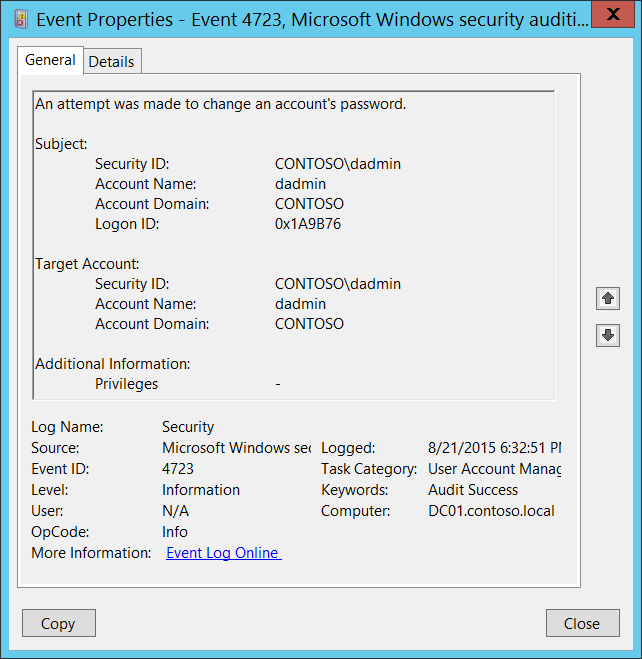

# 4723(S, F): アカウントのパスワードを変更しようとしました。



***サブカテゴリ:***&nbsp;[ユーザーアカウント管理の監査](audit-user-account-management.md)

***イベントの説明:***

このイベントは、ユーザーが自分のパスワードを変更しようとするたびに生成されます。

ユーザーアカウントの場合、このイベントはドメインコントローラー、メンバーサーバー、およびワークステーションで生成されます。

ドメインアカウントの場合、新しいパスワードがパスワードポリシーを満たしていない場合、失敗イベントが生成されます。

ローカルアカウントの場合、新しいパスワードがパスワードポリシーを満たしていないか、古いパスワードが間違っている場合、失敗イベントが生成されます。

ドメインアカウントの場合、古いパスワードが間違っていた場合、特定のサブカテゴリが有効になっている場合、ドメインコントローラーで「[4771](event-4771.md): Kerberos 事前認証に失敗しました」または「[4776](event-4776.md): コンピューターがアカウントの資格情報を検証しようとしました」が生成されます。

通常、**Subject\\Security ID** フィールドと **Target Account\\Security ID** フィールドが同じ 4723 イベントが表示されますが、これは正常な動作です。

> **注**&nbsp;&nbsp;推奨事項については、このイベントの[セキュリティ監視の推奨事項](#security-monitoring-recommendations)を参照してください。

<br clear="all">

***イベント XML:***
```xml
- <Event xmlns="http://schemas.microsoft.com/win/2004/08/events/event">
- <System>
 <Provider Name="Microsoft-Windows-Security-Auditing" Guid="{54849625-5478-4994-A5BA-3E3B0328C30D}" /> 
 <EventID>4723</EventID> 
 <Version>0</Version> 
 <Level>0</Level> 
 <Task>13824</Task> 
 <Opcode>0</Opcode> 
 <Keywords>0x8020000000000000</Keywords> 
 <TimeCreated SystemTime="2015-08-22T01:32:51.494558000Z" /> 
 <EventRecordID>175722</EventRecordID> 
 <Correlation /> 
 <Execution ProcessID="520" ThreadID="1112" /> 
 <Channel>Security</Channel> 
 <Computer>DC01.contoso.local</Computer> 
 <Security /> 
 </System>
- <EventData>
 <Data Name="TargetUserName">dadmin</Data> 
 <Data Name="TargetDomainName">CONTOSO</Data> 
 <Data Name="TargetSid">S-1-5-21-3457937927-2839227994-823803824-1104</Data> 
 <Data Name="SubjectUserSid">S-1-5-21-3457937927-2839227994-823803824-1104</Data> 
 <Data Name="SubjectUserName">dadmin</Data> 
 <Data Name="SubjectDomainName">CONTOSO</Data> 
 <Data Name="SubjectLogonId">0x1a9b76</Data> 
 <Data Name="PrivilegeList">-</Data> 
 </EventData>
 </Event>

```

***必要なサーバーロール:*** なし。

***最小 OS バージョン:*** Windows Server 2008, Windows Vista。

***イベントバージョン:*** 0。

***フィールドの説明:***

**Subject:**

-   **Security ID** \[Type = SID\]**:** ターゲットのアカウントのパスワードを変更しようとしたアカウントの SID。イベントビューアーは自動的に SID を解決してアカウント名を表示しようとします。SID を解決できない場合、イベントにソースデータが表示されます。

> **注**&nbsp;&nbsp;**セキュリティ識別子 (SID)** は、トラスティ (セキュリティプリンシパル) を識別するために使用される可変長の一意の値です。各アカウントには、Active Directory ドメイン コントローラーなどの権限によって発行され、セキュリティ データベースに保存される一意の SID があります。ユーザーがログオンするたびに、システムはデータベースからそのユーザーの SID を取得し、そのユーザーのアクセス トークンに配置します。システムは、アクセス トークン内の SID を使用して、以降のすべての Windows セキュリティとのやり取りでユーザーを識別します。SID がユーザーまたはグループの一意の識別子として使用された場合、それは他のユーザーまたはグループを識別するために再利用されることはありません。SID の詳細については、[セキュリティ識別子](/windows/access-protection/access-control/security-identifiers) を参照してください。

-   **アカウント名** \[タイプ = UnicodeString\]**:** ターゲットのアカウントのパスワードを変更しようとしたアカウントの名前。

-   **アカウント ドメイン** \[タイプ = UnicodeString\]**:** サブジェクトのドメインまたはコンピューター名。形式はさまざまで、次のようなものがあります:

    -   ドメイン NETBIOS 名の例: CONTOSO

    -   小文字の完全なドメイン名: contoso.local

    -   大文字の完全なドメイン名: CONTOSO.LOCAL

    -   LOCAL SERVICE や ANONYMOUS LOGON などの[よく知られたセキュリティ プリンシパル](/windows/security/identity-protection/access-control/security-identifiers)の場合、このフィールドの値は「NT AUTHORITY」となります。

    -   ローカル ユーザー アカウントの場合、このフィールドには、このアカウントが属するコンピューターまたはデバイスの名前が含まれます。例: 「Win81」。

-   **ログオン ID** \[タイプ = HexInt64\]**:** 16 進数の値で、最近のイベントと同じログオン ID を含む可能性のあるイベントとこのイベントを関連付けるのに役立ちます。例: 「[4624](event-4624.md): アカウントが正常にログオンされました。」

**ターゲット アカウント:** パスワード変更が要求されたアカウント。

-   **セキュリティ ID** \[タイプ = SID\]**:** パスワード変更が要求されたアカウントの SID。イベント ビューアーは自動的に SID を解決してアカウント名を表示しようとします。SID を解決できない場合、イベントにソース データが表示されます。

-   **アカウント名** \[タイプ = UnicodeString\]**:** パスワード変更が要求されたアカウントの名前。

-   **アカウントドメイン** \[タイプ = UnicodeString\]**:** 対象アカウントのドメインまたはコンピュータ名。形式はさまざまで、以下を含みます：

    -   ドメインのNETBIOS名の例: CONTOSO

    -   小文字の完全なドメイン名: contoso.local

    -   大文字の完全なドメイン名: CONTOSO.LOCAL

    -   ローカルユーザーアカウントの場合、このフィールドにはこのアカウントが属するコンピュータまたはデバイスの名前が含まれます。例: “Win81”。

**追加情報:**

-   **特権** \[タイプ = UnicodeString\]: 操作中に使用されたユーザー特権のリスト。例: SeBackupPrivilege。このパラメータはイベントでキャプチャされない場合があり、その場合は “-” と表示されます。ユーザー特権の完全なリストは「表8. ユーザー特権」を参照してください。

## セキュリティ監視の推奨事項

4723(S, F): アカウントのパスワード変更が試みられました。

> **重要**&nbsp;&nbsp;このイベントについては、[付録A: 多くの監査イベントに対するセキュリティ監視の推奨事項](appendix-a-security-monitoring-recommendations-for-many-audit-events.md)も参照してください。

-   すべてのパスワード変更試行を監視する必要がある高価値のドメインまたはローカルユーザーアカウントがある場合、**“Target Account\\Security ID”** に対応するすべての[4723](event-4723.md)イベントを監視します。

-   すべての変更を監視する必要がある高価値のドメインまたはローカルアカウントがある場合、**“Target Account\\Security ID”** に対応するすべての[4723](event-4723.md)イベントを監視します。

-   パスワードが変更されるべきでないドメインまたはローカルアカウントがある場合、**“Target Account\\Security ID”** に対応するすべての[4723](event-4723.md)イベントを監視します。
