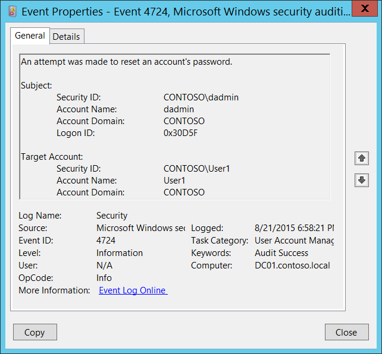

# 4724(S, F): アカウントのパスワードをリセットしようとしました。



***サブカテゴリ:***&nbsp;[ユーザーアカウント管理の監査](audit-user-account-management.md)

***イベントの説明:***

このイベントは、他のアカウントのパスワードをリセットしようとするたびに生成されます。

ユーザーアカウントの場合、このイベントはドメインコントローラー、メンバーサーバー、およびワークステーションで生成されます。

ドメインアカウントの場合、新しいパスワードがパスワードポリシーを満たさない場合、失敗イベントが生成されます。

パスワードリセット手順中にユーザーが「アクセス拒否」を受け取った場合、失敗イベントは生成されません。

コンピューターアカウントのリセット手順が実行された場合も、このイベントが生成されます。

ローカルアカウントの場合、新しいパスワードがローカルパスワードポリシーを満たさない場合、失敗イベントが生成されます。

> **注**&nbsp;&nbsp;推奨事項については、このイベントの[セキュリティ監視の推奨事項](#security-monitoring-recommendations)を参照してください。

<br clear="all">

***イベント XML:***
```xml
- <Event xmlns="http://schemas.microsoft.com/win/2004/08/events/event">
- <System>
 <Provider Name="Microsoft-Windows-Security-Auditing" Guid="{54849625-5478-4994-A5BA-3E3B0328C30D}" /> 
 <EventID>4724</EventID> 
 <Version>0</Version> 
 <Level>0</Level> 
 <Task>13824</Task> 
 <Opcode>0</Opcode> 
 <Keywords>0x8020000000000000</Keywords> 
 <TimeCreated SystemTime="2015-08-22T01:58:21.725864900Z" /> 
 <EventRecordID>175740</EventRecordID> 
 <Correlation /> 
 <Execution ProcessID="520" ThreadID="548" /> 
 <Channel>Security</Channel> 
 <Computer>DC01.contoso.local</Computer> 
 <Security /> 
 </System>
- <EventData>
 <Data Name="TargetUserName">User1</Data> 
 <Data Name="TargetDomainName">CONTOSO</Data> 
 <Data Name="TargetSid">S-1-5-21-3457937927-2839227994-823803824-1107</Data> 
 <Data Name="SubjectUserSid">S-1-5-21-3457937927-2839227994-823803824-1104</Data> 
 <Data Name="SubjectUserName">dadmin</Data> 
 <Data Name="SubjectDomainName">CONTOSO</Data> 
 <Data Name="SubjectLogonId">0x30d5f</Data> 
 </EventData>
 </Event>

```

***必要なサーバーロール:*** なし。

***最小 OS バージョン:*** Windows Server 2008, Windows Vista。

***イベントバージョン:*** 0。

***フィールドの説明:***

**サブジェクト:**

-   **セキュリティ ID** \[タイプ = SID\]**:** ターゲットのアカウントのパスワードをリセットしようとしたアカウントの SID。イベントビューアーは自動的に SID を解決してアカウント名を表示しようとします。SID を解決できない場合、イベントにソースデータが表示されます。

> **注**&nbsp;&nbsp;**セキュリティ識別子 (SID)** は、トラスティ (セキュリティプリンシパル) を識別するために使用される可変長の一意の値です。各アカウントには、Active Directory ドメインコントローラーなどの権限によって発行され、セキュリティデータベースに保存される一意の SID があります。ユーザーがログオンするたびに、システムはデータベースからそのユーザーの SID を取得し、そのユーザーのアクセストークンに配置します。システムは、アクセストークン内の SID を使用して、以降のすべての Windows セキュリティとのやり取りでユーザーを識別します。SID がユーザーまたはグループの一意の識別子として使用された場合、それは他のユーザーまたはグループを識別するために再利用されることはありません。SID の詳細については、[セキュリティ識別子](/windows/access-protection/access-control/security-identifiers)を参照してください。

-   **アカウント名** \[タイプ = UnicodeString\]**:** ターゲットのアカウントのパスワードをリセットしようとしたアカウントの名前。

-   **アカウントドメイン** \[タイプ = UnicodeString\]**:** サブジェクトのドメインまたはコンピュータ名。形式はさまざまで、以下を含みます：

    -   ドメイン NETBIOS 名の例: CONTOSO

    -   小文字の完全なドメイン名: contoso.local

    -   大文字の完全なドメイン名: CONTOSO.LOCAL

    -   一部の[よく知られたセキュリティプリンシパル](/windows/security/identity-protection/access-control/security-identifiers)の場合、例えば LOCAL SERVICE や ANONYMOUS LOGON、このフィールドの値は “NT AUTHORITY” です。

    -   ローカルユーザーアカウントの場合、このフィールドにはこのアカウントが属するコンピュータまたはデバイスの名前が含まれます。例えば: “Win81”。

-   **ログオン ID** \[タイプ = HexInt64\]**:** 16進数の値で、最近のイベントと同じログオン ID を含む可能性のあるこのイベントを関連付けるのに役立ちます。例えば、 “[4624](event-4624.md): アカウントが正常にログオンされました。”

**ターゲットアカウント:** パスワードリセットが要求されたアカウント。

-   **セキュリティ ID** \[タイプ = SID\]**:** パスワードリセットが要求されたアカウントの SID。イベントビューアーは自動的に SID を解決し、アカウント名を表示しようとします。SID が解決できない場合、イベントにソースデータが表示されます。

-   **アカウント名** \[タイプ = UnicodeString\]**:** パスワードリセットが要求されたアカウントの名前。

-   **アカウントドメイン** \[タイプ = UnicodeString\]**:** ターゲットアカウントのドメインまたはコンピュータ名。形式はさまざまで、以下を含みます：

    -   ドメイン NETBIOS 名の例: CONTOSO

    -   小文字の完全なドメイン名: contoso.local

    -   大文字の完全なドメイン名: CONTOSO.LOCAL

    -   ローカルユーザーアカウントの場合、このフィールドにはこのアカウントが属するコンピュータまたはデバイスの名前が含まれます。例えば: “Win81”。

## セキュリティ監視の推奨事項

4724(S, F): アカウントのパスワードをリセットしようとしました。

> **重要**&nbsp;&nbsp;このイベントについては、[付録 A: 多くの監査イベントのためのセキュリティ監視の推奨事項](appendix-a-security-monitoring-recommendations-for-many-audit-events.md)も参照してください。

-   高価値のドメインまたはローカルユーザーアカウントがあり、すべてのパスワードリセット試行を監視する必要がある場合は、アカウントに対応する**「ターゲットアカウント\\セキュリティID」**を持つすべての[4724](event-4724.md)イベントを監視します。

-   高価値のドメインまたはローカルアカウントがあり、すべての変更を監視する必要がある場合は、アカウントに対応する**「ターゲットアカウント\\セキュリティID」**を持つすべての[4724](event-4724.md)イベントを監視します。

-   パスワードをリセットしてはならないドメインまたはローカルアカウントがある場合は、アカウントに対応する**「ターゲットアカウント\\セキュリティID」**を持つすべての[4724](event-4724.md)イベントを監視できます。

-   ローカルアカウントのすべての[4724](event-4724.md)イベントを監視することをお勧めします。なぜなら、これらのパスワードは通常あまり変更されないからです。これは特に重要なサーバー、管理用ワークステーション、およびその他の高価値資産に関連しています。
