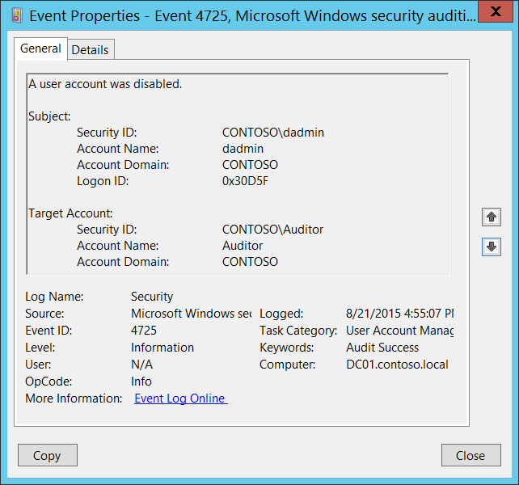

# 4725(S): ユーザーアカウントが無効化されました。



***サブカテゴリ:***&nbsp;[ユーザーアカウント管理の監査](audit-user-account-management.md)

***イベントの説明:***

このイベントは、ユーザーまたはコンピュータオブジェクトが無効化されるたびに生成されます。

ユーザーアカウントの場合、このイベントはドメインコントローラー、メンバーサーバー、およびワークステーションで生成されます。

コンピュータアカウントの場合、このイベントはドメインコントローラーでのみ生成されます。

> **注**&nbsp;&nbsp;推奨事項については、このイベントの[セキュリティ監視の推奨事項](#security-monitoring-recommendations)を参照してください。

<br clear="all">

***イベント XML:***
```xml
- <Event xmlns="http://schemas.microsoft.com/win/2004/08/events/event">
- <System>
 <Provider Name="Microsoft-Windows-Security-Auditing" Guid="{54849625-5478-4994-A5BA-3E3B0328C30D}" /> 
 <EventID>4725</EventID> 
 <Version>0</Version> 
 <Level>0</Level> 
 <Task>13824</Task> 
 <Opcode>0</Opcode> 
 <Keywords>0x8020000000000000</Keywords> 
 <TimeCreated SystemTime="2015-08-21T23:55:07.657358900Z" /> 
 <EventRecordID>175714</EventRecordID> 
 <Correlation /> 
 <Execution ProcessID="520" ThreadID="1112" /> 
 <Channel>Security</Channel> 
 <Computer>DC01.contoso.local</Computer> 
 <Security /> 
 </System>
- <EventData>
 <Data Name="TargetUserName">Auditor</Data> 
 <Data Name="TargetDomainName">CONTOSO</Data> 
 <Data Name="TargetSid">S-1-5-21-3457937927-2839227994-823803824-2104</Data> 
 <Data Name="SubjectUserSid">S-1-5-21-3457937927-2839227994-823803824-1104</Data> 
 <Data Name="SubjectUserName">dadmin</Data> 
 <Data Name="SubjectDomainName">CONTOSO</Data> 
 <Data Name="SubjectLogonId">0x30d5f</Data> 
 </EventData>
 </Event>

```

***必要なサーバー役割:*** なし。

***最小 OS バージョン:*** Windows Server 2008, Windows Vista。

***イベントバージョン:*** 0。

***フィールドの説明:***

**サブジェクト:**

-   **セキュリティ ID** \[タイプ = SID\]**:** 「アカウントの無効化」操作を要求したアカウントの SID。イベントビューアーは自動的に SID を解決し、アカウント名を表示しようとします。SID を解決できない場合、イベントにソースデータが表示されます。

> **注**&nbsp;&nbsp;**セキュリティ識別子 (SID)** は、トラスティ (セキュリティプリンシパル) を識別するために使用される可変長の一意の値です。各アカウントには、Active Directory ドメインコントローラーなどの権限によって発行され、セキュリティデータベースに保存される一意の SID があります。ユーザーがログオンするたびに、システムはデータベースからそのユーザーの SID を取得し、そのユーザーのアクセストークンに配置します。システムはアクセストークン内の SID を使用して、以降のすべての Windows セキュリティとのやり取りでユーザーを識別します。SID がユーザーまたはグループの一意の識別子として使用された場合、それは他のユーザーまたはグループを識別するために再利用されることはありません。SID についての詳細は、[セキュリティ識別子](/windows/access-protection/access-control/security-identifiers)を参照してください。

-   **アカウント名** \[タイプ = UnicodeString\]**:** 「アカウント無効化」操作を要求したアカウントの名前。

-   **アカウントドメイン** \[タイプ = UnicodeString\]**:** サブジェクトのドメインまたはコンピュータ名。形式はさまざまで、以下を含みます：

    -   ドメイン NETBIOS 名の例：CONTOSO

    -   小文字の完全ドメイン名：contoso.local

    -   大文字の完全ドメイン名：CONTOSO.LOCAL

    -   一部の[よく知られたセキュリティプリンシパル](/windows/security/identity-protection/access-control/security-identifiers)の場合、例えば LOCAL SERVICE や ANONYMOUS LOGON、このフィールドの値は「NT AUTHORITY」となります。

    -   ローカルユーザーアカウントの場合、このフィールドにはこのアカウントが属するコンピュータまたはデバイスの名前が含まれます。例えば：「Win81」。

-   **ログオンID** \[タイプ = HexInt64\]**:** 16進数の値で、同じログオンIDを含む最近のイベントとこのイベントを関連付けるのに役立ちます。例えば、「[4624](event-4624.md): アカウントが正常にログオンされました。」

**ターゲットアカウント:**

-   **セキュリティID** \[タイプ = SID\]**:** 無効化されたアカウントのSID。イベントビューアは自動的にSIDを解決してアカウント名を表示しようとします。SIDが解決できない場合、イベントにはソースデータが表示されます。

-   **アカウント名** \[タイプ = UnicodeString\]**:** 無効化されたアカウントの名前。

-   **アカウントドメイン** \[タイプ = UnicodeString\]**:** ターゲットアカウントのドメインまたはコンピュータ名。形式はさまざまで、以下を含みます：

    -   ドメイン NETBIOS 名の例：CONTOSO

    -   小文字の完全ドメイン名：contoso.local

    -   大文字の完全ドメイン名：CONTOSO.LOCAL

    -   ローカルユーザーアカウントの場合、このフィールドにはこのアカウントが属するコンピュータまたはデバイスの名前が含まれます。例えば：「Win81」。

## セキュリティ監視の推奨事項

4725(S): ユーザーアカウントが無効化されました。

> **重要**&nbsp;&nbsp;このイベントについては、[付録A: 多くの監査イベントに対するセキュリティ監視の推奨事項](appendix-a-security-monitoring-recommendations-for-many-audit-events.md)も参照してください。

-   すべての変更を監視する必要がある高価値のドメインまたはローカルアカウントがある場合、アカウントに対応する**「ターゲットアカウント\\セキュリティID」**を持つすべての[4725](event-4725.md)イベントを監視します。

-   ドメインまたはローカルアカウントで、絶対に無効にしてはいけないアカウント（例えば、サービスアカウント）がある場合は、アカウントに対応する**「ターゲットアカウント\\セキュリティID」**を持つすべての[4725](event-4725.md)イベントを監視できます。

-   ローカルアカウントのすべての[4725](event-4725.md)イベントを監視することをお勧めします。これらのアカウントは通常、頻繁に変更されないためです。これは特に、重要なサーバー、管理用ワークステーション、およびその他の高価値資産に関連しています。
