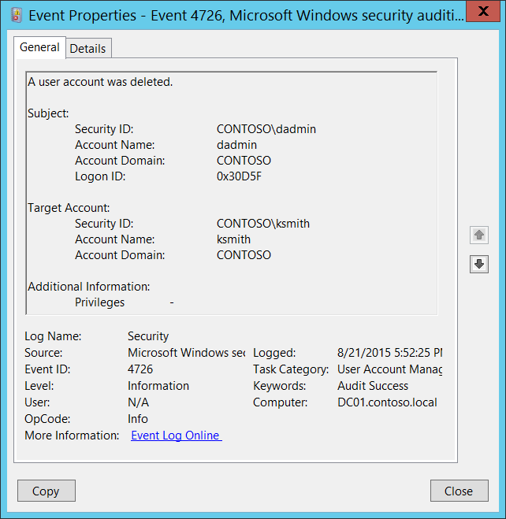

# 4726(S): ユーザーアカウントが削除されました。



***サブカテゴリ:***&nbsp;[ユーザーアカウント管理の監査](audit-user-account-management.md)

***イベントの説明:***

このイベントはユーザーオブジェクトが削除されるたびに生成されます。

このイベントはドメインコントローラー、メンバーサーバー、およびワークステーションで生成されます。

> **注**&nbsp;&nbsp;推奨事項については、このイベントの[セキュリティ監視の推奨事項](#security-monitoring-recommendations)を参照してください。

<br clear="all">

***イベント XML:***
```xml
- <Event xmlns="http://schemas.microsoft.com/win/2004/08/events/event">
- <System>
 <Provider Name="Microsoft-Windows-Security-Auditing" Guid="{54849625-5478-4994-A5BA-3E3B0328C30D}" /> 
 <EventID>4726</EventID> 
 <Version>0</Version> 
 <Level>0</Level> 
 <Task>13824</Task> 
 <Opcode>0</Opcode> 
 <Keywords>0x8020000000000000</Keywords> 
 <TimeCreated SystemTime="2015-08-22T00:52:25.104613800Z" /> 
 <EventRecordID>175720</EventRecordID> 
 <Correlation /> 
 <Execution ProcessID="520" ThreadID="1112" /> 
 <Channel>Security</Channel> 
 <Computer>DC01.contoso.local</Computer> 
 <Security /> 
 </System>
- <EventData>
 <Data Name="TargetUserName">ksmith</Data> 
 <Data Name="TargetDomainName">CONTOSO</Data> 
 <Data Name="TargetSid">S-1-5-21-3457937927-2839227994-823803824-6609</Data> 
 <Data Name="SubjectUserSid">S-1-5-21-3457937927-2839227994-823803824-1104</Data> 
 <Data Name="SubjectUserName">dadmin</Data> 
 <Data Name="SubjectDomainName">CONTOSO</Data> 
 <Data Name="SubjectLogonId">0x30d5f</Data> 
 <Data Name="PrivilegeList">-</Data> 
 </EventData>
 </Event>

```

***必要なサーバーロール:*** なし。

***最小 OS バージョン:*** Windows Server 2008, Windows Vista。

***イベントバージョン:*** 0。

***フィールドの説明:***

**サブジェクト:**

-   **セキュリティ ID** \[タイプ = SID\]**:** 「ユーザーアカウントの削除」操作を要求したアカウントのSID。イベントビューアーは自動的にSIDを解決し、アカウント名を表示しようとします。SIDが解決できない場合、イベントにソースデータが表示されます。

> **注**&nbsp;&nbsp;**セキュリティ識別子 (SID)** は、信託者 (セキュリティプリンシパル) を識別するために使用される可変長の一意の値です。各アカウントには、Active Directoryドメインコントローラーなどの権限によって発行され、セキュリティデータベースに保存される一意のSIDがあります。ユーザーがログオンするたびに、システムはデータベースからそのユーザーのSIDを取得し、そのユーザーのアクセストークンに配置します。システムはアクセストークン内のSIDを使用して、以降のすべてのWindowsセキュリティとのやり取りでユーザーを識別します。SIDがユーザーまたはグループの一意の識別子として使用された場合、それは他のユーザーまたはグループを識別するために再利用されることはありません。SIDの詳細については、[セキュリティ識別子](/windows/access-protection/access-control/security-identifiers)を参照してください。

-   **アカウント名** \[型 = UnicodeString\]**:** 「ユーザーアカウントの削除」操作を要求したアカウントの名前。

-   **アカウントドメイン** \[型 = UnicodeString\]**:** サブジェクトのドメインまたはコンピュータ名。形式はさまざまで、以下を含みます：

    -   ドメインのNETBIOS名の例: CONTOSO

    -   小文字の完全ドメイン名: contoso.local

    -   大文字の完全ドメイン名: CONTOSO.LOCAL

    -   LOCAL SERVICEやANONYMOUS LOGONなどの[よく知られたセキュリティプリンシパル](/windows/security/identity-protection/access-control/security-identifiers)の場合、このフィールドの値は「NT AUTHORITY」となります。

    -   ローカルユーザーアカウントの場合、このフィールドにはこのアカウントが属するコンピュータまたはデバイスの名前が含まれます。例: 「Win81」。

-   **ログオンID** \[型 = HexInt64\]**:** 16進数の値で、最近のイベントと同じログオンIDを含む可能性のあるイベントとこのイベントを関連付けるのに役立ちます。例: 「[4624](event-4624.md): アカウントが正常にログオンされました。」

**ターゲットアカウント:**

-   **セキュリティID** \[型 = SID\]**:** 削除されたアカウントのSID。イベントビューアーは自動的にSIDを解決し、アカウント名を表示しようとします。SIDが解決できない場合、イベントにはソースデータが表示されます。

-   **アカウント名** \[型 = UnicodeString\]**:** 削除されたアカウントの名前。

-   **アカウントドメイン** \[型 = UnicodeString\]**:** ターゲットアカウントのドメインまたはコンピュータ名。形式はさまざまで、以下を含みます：

    -   ドメインのNETBIOS名の例: CONTOSO

    -   小文字の完全ドメイン名: contoso.local

    -   大文字の完全ドメイン名: CONTOSO.LOCAL

    -   ローカルユーザーアカウントの場合、このフィールドにはこのアカウントが属するコンピュータまたはデバイスの名前が含まれます。例: 「Win81」。

**追加情報:**

-   **特権** \[型 = UnicodeString\]: 操作中に使用されたユーザー特権のリスト。例: SeBackupPrivilege。このパラメータはイベントにキャプチャされない場合があり、その場合は「-」と表示されます。ユーザー特権の完全なリストは「表8. ユーザー特権」を参照してください。

## セキュリティ監視の推奨事項

4726(S): ユーザーアカウントが削除されました。

> **重要**&nbsp;&nbsp;このイベントについては、[付録A: 多くの監査イベントに対するセキュリティ監視の推奨事項](appendix-a-security-monitoring-recommendations-for-many-audit-events.md)も参照してください。

- 高価値のドメインまたはローカルアカウントがあり、その変更（または削除）をすべて監視する必要がある場合は、アカウントに対応する**「ターゲットアカウント\\セキュリティID」**を持つすべての[4726](event-4726.md)イベントを監視します。

- 削除されるべきではないドメインまたはローカルアカウント（たとえば、サービスアカウント）がある場合は、アカウントに対応する**「ターゲットアカウント\\セキュリティID」**を持つすべての[4726](event-4726.md)イベントを監視します。

- ローカルアカウントのすべての[4726](event-4726.md)イベントを監視することをお勧めします。これらのアカウントは通常、頻繁に削除されることはありません。これは特に、重要なサーバー、管理用ワークステーション、およびその他の高価値資産に関連しています。
