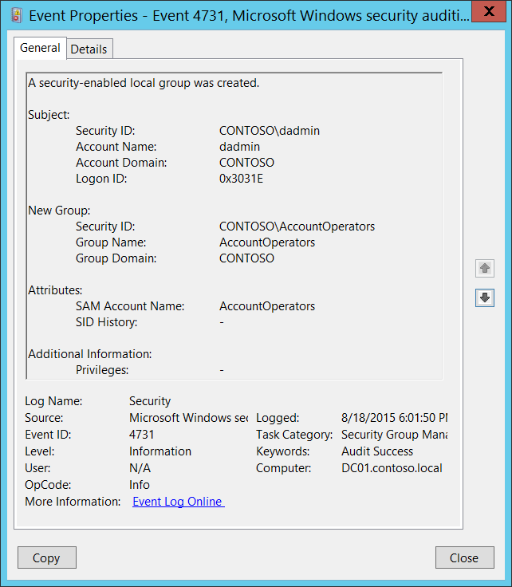

# 4731(S): セキュリティ有効なローカルグループが作成されました。



***サブカテゴリ:***&nbsp;[セキュリティグループ管理の監査](audit-security-group-management.md)

***イベントの説明:***

このイベントは、新しいセキュリティ有効（セキュリティ）ローカルグループが作成されるたびに生成されます。

このイベントは、ドメインコントローラー、メンバーサーバー、およびワークステーションで生成されます。

> **注**&nbsp;&nbsp;推奨事項については、このイベントの[セキュリティ監視の推奨事項](#security-monitoring-recommendations)を参照してください。

<br clear="all">

***イベント XML:***
```xml
- <Event xmlns="http://schemas.microsoft.com/win/2004/08/events/event">
- <System>
 <Provider Name="Microsoft-Windows-Security-Auditing" Guid="{54849625-5478-4994-A5BA-3E3B0328C30D}" /> 
 <EventID>4731</EventID> 
 <Version>0</Version> 
 <Level>0</Level> 
 <Task>13826</Task> 
 <Opcode>0</Opcode> 
 <Keywords>0x8020000000000000</Keywords> 
 <TimeCreated SystemTime="2015-08-19T01:01:50.646049700Z" /> 
 <EventRecordID>174849</EventRecordID> 
 <Correlation /> 
 <Execution ProcessID="512" ThreadID="1092" /> 
 <Channel>Security</Channel> 
 <Computer>DC01.contoso.local</Computer> 
 <Security /> 
 </System>
- <EventData>
 <Data Name="TargetUserName">AccountOperators</Data> 
 <Data Name="TargetDomainName">CONTOSO</Data> 
 <Data Name="TargetSid">S-1-5-21-3457937927-2839227994-823803824-6605</Data> 
 <Data Name="SubjectUserSid">S-1-5-21-3457937927-2839227994-823803824-1104</Data> 
 <Data Name="SubjectUserName">dadmin</Data> 
 <Data Name="SubjectDomainName">CONTOSO</Data> 
 <Data Name="SubjectLogonId">0x3031e</Data> 
 <Data Name="PrivilegeList">-</Data> 
 <Data Name="SamAccountName">AccountOperators</Data> 
 <Data Name="SidHistory">-</Data> 
 </EventData>
 </Event>

```

***必要なサーバーの役割:*** なし。

***最小 OS バージョン:*** Windows Server 2008, Windows Vista。

***イベントバージョン:*** 0。

***フィールドの説明:***

**サブジェクト:**

-   **セキュリティ ID** \[タイプ = SID\]**:** 「グループ作成」操作を要求したアカウントの SID。イベントビューアーは自動的に SID を解決し、アカウント名を表示しようとします。SID を解決できない場合、イベントにはソースデータが表示されます。

> **注**&nbsp;&nbsp;**セキュリティ識別子 (SID)** は、トラスティ（セキュリティプリンシパル）を識別するために使用される可変長の一意の値です。各アカウントには、Active Directory ドメインコントローラーなどの権限によって発行され、セキュリティデータベースに保存される一意の SID があります。ユーザーがログオンするたびに、システムはデータベースからそのユーザーの SID を取得し、そのユーザーのアクセストークンに配置します。システムは、以降のすべての Windows セキュリティとのやり取りでユーザーを識別するために、アクセストークン内の SID を使用します。SID がユーザーまたはグループの一意の識別子として使用された場合、それは他のユーザーまたはグループを識別するために再利用されることはありません。SID の詳細については、[セキュリティ識別子](/windows/access-protection/access-control/security-identifiers)を参照してください。

-   **アカウント名** \[タイプ = UnicodeString\]**:** 「グループ作成」操作を要求したアカウントの名前。

-   **アカウントドメイン** \[タイプ = UnicodeString\]**:** サブジェクトのドメインまたはコンピュータ名。形式はさまざまで、以下を含みます：

    -   ドメイン NETBIOS 名の例: CONTOSO

    -   小文字の完全ドメイン名: contoso.local

    -   大文字の完全ドメイン名: CONTOSO.LOCAL

    -   LOCAL SERVICE や ANONYMOUS LOGON などの[よく知られたセキュリティプリンシパル](/windows/security/identity-protection/access-control/security-identifiers)の場合、このフィールドの値は「NT AUTHORITY」となります。

    -   ローカルユーザーアカウントの場合、このフィールドにはこのアカウントが属するコンピュータまたはデバイスの名前が含まれます。例: 「Win81」。

-   **ログオンID** \[タイプ = HexInt64\]**:** 16進数の値で、同じログオンIDを含む最近のイベントとこのイベントを関連付けるのに役立ちます。例: 「[4624](event-4624.md): アカウントが正常にログオンされました。」

**新しいグループ:**

-   **セキュリティID** \[タイプ = SID\]**:** 作成されたグループのSID。イベントビューアーは自動的にSIDを解決し、グループ名を表示しようとします。SIDが解決できない場合、イベントにソースデータが表示されます。

-   **グループ名** \[タイプ = UnicodeString\]**:** 作成されたグループの名前。例: ServiceDesk

-   **グループドメイン** \[タイプ = UnicodeString\]: 作成されたグループのドメインまたはコンピュータ名。形式はさまざまで、以下を含みます：

    -   ドメイン NETBIOS 名の例: CONTOSO

    -   小文字の完全ドメイン名: contoso.local

    -   大文字の完全ドメイン名: CONTOSO.LOCAL

    -   ローカルグループの場合、このフィールドにはこの新しいグループが属するコンピュータの名前が含まれます。例: 「Win81」。

**属性:**

-   **SAM アカウント名** \[タイプ = UnicodeString\]: これは、以前のバージョンの Windows（Windows 2000 以前のログオン名）をサポートするために使用される新しいグループの名前です。新しいグループオブジェクトの **sAMAccountName** 属性の値。例: ServiceDesk。ローカルグループの場合、それは単に新しいグループの名前です。

- **SID History** \[Type = UnicodeString\]: オブジェクトが別のドメインから移動された場合に使用された以前のSIDを含みます。オブジェクトがあるドメインから別のドメインに移動されるたびに、新しいSIDが作成され、objectSIDになります。以前のSIDは**sIDHistory**プロパティに追加されます。このパラメータには、新しいグループオブジェクトの**sIDHistory**属性の値が含まれます。このパラメータはイベントでキャプチャされない場合があり、その場合は「-」として表示されます。ローカルグループには適用されず、常に「**-**」の値を持ちます。

**追加情報:**

- **Privileges** \[Type = UnicodeString\]: 操作中に使用されたユーザー特権のリストです。例えば、SeBackupPrivilege。このパラメータはイベントでキャプチャされない場合があり、その場合は「-」として表示されます。ユーザー特権の完全なリストは「Table 8. User Privileges」を参照してください。

## セキュリティ監視の推奨事項

4731(S): セキュリティ有効なローカルグループが作成されました。

> **重要**&nbsp;&nbsp;このイベントについては、[付録A: 多くの監査イベントに対するセキュリティ監視の推奨事項](appendix-a-security-monitoring-recommendations-for-many-audit-events.md)も参照してください。

- 新しいセキュリティグループが作成されるたびに、誰がいつグループを作成したかを確認する必要がある場合、このイベントを監視してください。

- 異なるサーバーでローカルセキュリティグループの作成を監視する必要があり、Windows Event Forwardingを使用してイベントを中央の場所に収集する場合、「**New Group\\Group Domain**」を確認してください。それはドメイン名ではなく、コンピュータ名であるべきです。

- 組織がアカウント名の命名規則を持っている場合、「**Attributes\\SAM Account Name**」で命名規則に従わない名前を監視してください。
