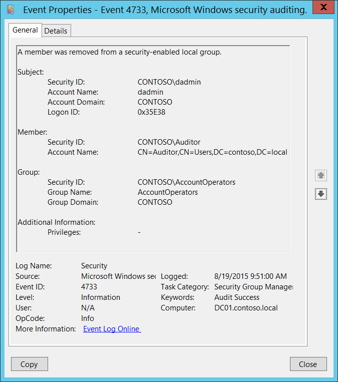

# 4733(S): セキュリティ有効なローカルグループからメンバーが削除されました。



***サブカテゴリ:***&nbsp;[セキュリティグループ管理の監査](audit-security-group-management.md)

***イベントの説明:***

このイベントは、セキュリティ有効な（セキュリティ）ローカルグループからメンバーが削除されるたびに生成されます。

このイベントは、ドメインコントローラー、メンバーサーバー、およびワークステーションで生成されます。

削除されたメンバーごとに、別々の4733イベントが生成されます。

通常、4733イベントの前に変更なしで「[4735](event-4735.md): セキュリティ有効なローカルグループが変更されました。」イベントが表示されます。

> **注**&nbsp;&nbsp;推奨事項については、このイベントの[セキュリティ監視の推奨事項](#security-monitoring-recommendations)を参照してください。

<br clear="all">

***イベント XML:***
```
- <Event xmlns="http://schemas.microsoft.com/win/2004/08/events/event">
- <System>
 <Provider Name="Microsoft-Windows-Security-Auditing" Guid="{54849625-5478-4994-A5BA-3E3B0328C30D}" /> 
 <EventID>4733</EventID> 
 <Version>0</Version> 
 <Level>0</Level> 
 <Task>13826</Task> 
 <Opcode>0</Opcode> 
 <Keywords>0x8020000000000000</Keywords> 
 <TimeCreated SystemTime="2015-08-19T16:51:00.376806500Z" /> 
 <EventRecordID>175037</EventRecordID> 
 <Correlation /> 
 <Execution ProcessID="520" ThreadID="1524" /> 
 <Channel>Security</Channel> 
 <Computer>DC01.contoso.local</Computer> 
 <Security /> 
 </System>
- <EventData>
 <Data Name="MemberName">CN=Auditor,CN=Users,DC=contoso,DC=local</Data> 
 <Data Name="MemberSid">S-1-5-21-3457937927-2839227994-823803824-2104</Data> 
 <Data Name="TargetUserName">AccountOperators</Data> 
 <Data Name="TargetDomainName">CONTOSO</Data> 
 <Data Name="TargetSid">S-1-5-21-3457937927-2839227994-823803824-6605</Data> 
 <Data Name="SubjectUserSid">S-1-5-21-3457937927-2839227994-823803824-1104</Data> 
 <Data Name="SubjectUserName">dadmin</Data> 
 <Data Name="SubjectDomainName">CONTOSO</Data> 
 <Data Name="SubjectLogonId">0x35e38</Data> 
 <Data Name="PrivilegeList">-</Data> 
 </EventData>
 </Event>
```

***必要なサーバーの役割:*** なし。

***最小 OS バージョン:*** Windows Server 2008, Windows Vista。

***イベントバージョン:*** 0。

***フィールドの説明:***

**サブジェクト:**

-   **セキュリティ ID** \[タイプ = SID\]**:** 「グループからメンバーを削除する」操作を要求したアカウントのSID。イベントビューアーは自動的にSIDを解決し、アカウント名を表示しようとします。SIDを解決できない場合、イベントにソースデータが表示されます。

> **注**&nbsp;&nbsp;**セキュリティ識別子 (SID)** は、トラスティ (セキュリティプリンシパル) を識別するために使用される可変長の一意の値です。各アカウントには、Active Directory ドメインコントローラーなどの権限によって発行され、セキュリティデータベースに保存される一意のSIDがあります。ユーザーがログオンするたびに、システムはデータベースからそのユーザーのSIDを取得し、そのユーザーのアクセス トークンに配置します。システムは、アクセス トークン内のSIDを使用して、以降のすべてのWindowsセキュリティとのやり取りでユーザーを識別します。SIDがユーザーまたはグループの一意の識別子として使用された場合、それは他のユーザーまたはグループを識別するために再び使用されることはありません。SIDの詳細については、[セキュリティ識別子](/windows/access-protection/access-control/security-identifiers)を参照してください。

-   **アカウント名** \[タイプ = UnicodeString\]**:** 「グループからメンバーを削除」操作を要求したアカウントの名前。

-   **アカウントドメイン** \[タイプ = UnicodeString\]**:** サブジェクトのドメインまたはコンピュータ名。形式はさまざまで、以下のようなものがあります：

    -   ドメインのNETBIOS名の例: CONTOSO

    -   小文字の完全なドメイン名: contoso.local

    -   大文字の完全なドメイン名: CONTOSO.LOCAL

    -   一部の[よく知られたセキュリティプリンシパル](/windows/security/identity-protection/access-control/security-identifiers)の場合、例えばLOCAL SERVICEやANONYMOUS LOGON、このフィールドの値は「NT AUTHORITY」となります。

    -   ローカルユーザーアカウントの場合、このフィールドにはこのアカウントが属するコンピュータまたはデバイスの名前が含まれます。例えば：「Win81」。

-   **ログオンID** \[タイプ = HexInt64\]**:** 16進数の値で、最近のイベントとこのイベントを関連付けるのに役立ちます。例えば、「[4624](event-4624.md): アカウントが正常にログオンされました。」のように、同じログオンIDを含む可能性があります。

**メンバー:**

-   **セキュリティID** \[タイプ = SID\]**:** グループから削除されたアカウントのSID。イベントビューアーは自動的にSIDを解決し、グループ名を表示しようとします。SIDが解決できない場合、イベントにはソースデータが表示されます。

-   **アカウント名** \[タイプ = UnicodeString\]: グループから削除されたアカウントの識別名。例えば：「CN=Auditor,CN=Users,DC=contoso,DC=local」。ローカルグループの場合、このフィールドは通常「**-**」の値を持ちます。削除されたメンバーがドメインアカウントであっても同様です。一部の[よく知られたセキュリティプリンシパル](/windows/security/identity-protection/access-control/security-identifiers)の場合、例えばLOCAL SERVICEやANONYMOUS LOGON、このフィールドの値は「-」となります。

> **注**&nbsp;&nbsp;LDAP APIはLDAPオブジェクトを**識別名 (DN)**で参照します。DNはカンマで接続された相対識別名 (RDN) のシーケンスです。
> 
> RDNは属性とその値の形式 attribute=value; で構成されます。以下はRDN属性の例です：
> 
> • DC - domainComponent
> 
> • CN - commonName
> 
> • OU - organizationalUnitName
> 
> • O - organizationName

**グループ:**

-   **セキュリティID** \[タイプ = SID\]**:** メンバーが削除されたグループのSID。イベントビューアーは自動的にSIDを解決し、グループ名を表示しようとします。SIDが解決できない場合、イベントにはソースデータが表示されます。

-   **グループ名** \[タイプ = UnicodeString\]**:** メンバーが削除されたグループの名前。例: ServiceDesk

<!-- -->

-   **グループドメイン** \[タイプ = UnicodeString\]: メンバーが削除されたグループのドメインまたはコンピュータ名。形式はさまざまで、以下のようなものがあります:

    -   ドメインNETBIOS名の例: CONTOSO

    -   小文字の完全ドメイン名: contoso.local

    -   大文字の完全ドメイン名: CONTOSO.LOCAL

    <!-- -->

    -   ローカルグループの場合、このフィールドにはこの新しいグループが属するコンピュータの名前が含まれます。例: “Win81”。

    <!-- -->

    -   [組み込みグループ](/previous-versions/windows/it-pro/windows-server-2008-R2-and-2008/dn169025(v=ws.10)): Builtin

**追加情報:**

-   **特権** \[タイプ = UnicodeString\]: 操作中に使用されたユーザー特権のリスト。例: SeBackupPrivilege。このパラメータはイベントにキャプチャされない場合があり、その場合は「-」と表示されます。「表8. ユーザー特権」に完全なユーザー特権のリストがあります。

## セキュリティ監視の推奨事項

4733(S): セキュリティが有効なローカルグループからメンバーが削除されました。

| **必要な監視の種類**                                                                                                                                                                                                                                                                                                                                                     | **推奨事項**                                                                                                                                                                                                                                 |
|--------------------------------------------------------------------------------------------------------------------------------------------------------------------------------------------------------------------------------------------------------------------------------------------------------------------------------------------------------------------------|----------------------------------------------------------------------------------------------------------------------------------------------------------------------------------------------------------------------------------------------|
| **ローカルまたはドメインセキュリティグループからのメンバーの削除:** ローカルまたはドメインセキュリティグループからのメンバーの削除を監視する必要があるかもしれません。                                                                                                                                                                                                                     | ローカルまたはドメインセキュリティグループからメンバーが削除されるたびに、誰がメンバーを追加し、いつ追加したかを確認する必要がある場合、このイベントを監視します。<br>通常、このイベントは情報提供イベントとして使用され、必要に応じてレビューされます。 |
| **高価値のローカルまたはドメインセキュリティグループ:** 組織内の重要なローカルまたはドメインセキュリティグループのリストがあり、これらのグループのメンバーの削除（またはその他の変更）を特に監視する必要があるかもしれません。<br>重要なローカルまたはドメイングループの例として、組み込みのローカル管理者グループ、ドメイン管理者、エンタープライズ管理者などがあります。 | 高価値のローカルまたはドメインセキュリティグループに対応する「**グループ\\グループ名**」の値でこのイベントを監視します。                                                                                                                     |
| **必要なメンバーを持つローカルまたはドメインセキュリティグループ**: 特定のローカルまたはドメインセキュリティグループに対して、特定のメンバーが削除されないことを確認する必要があるかもしれません。                                                                                                                                                                                                 | 関心のあるグループに対応する「**グループ\\グループ名**」および削除されるべきでないメンバーの「**メンバー\\セキュリティID**」でこのイベントを監視します。                                                                        |
| **高価値のアカウント**: 各アクションを監視する必要がある高価値のドメインまたはローカルアカウントがあるかもしれません。<br>高価値のアカウントの例として、データベース管理者、組み込みのローカル管理者アカウント、ドメイン管理者、サービスアカウント、ドメインコントローラーアカウントなどがあります。                                                                  | 高価値のアカウントまたはアカウントに対応する「**サブジェクト\\セキュリティID**」および「**メンバー\\セキュリティID**」でこのイベントを監視します。                                                                                                       |
| **異常または悪意のある行動**: 異常を検出したり、潜在的な悪意のある行動を監視するための特定の要件があるかもしれません。例えば、勤務時間外にアカウントが使用されることを監視する必要があるかもしれません。                                                                                                                                                 | 異常または悪意のある行動を監視する場合、「**サブジェクト\\セキュリティID**」（およびその他の情報）を使用して特定のアカウントがどのように、またはいつ使用されているかを監視します。                                                                       |
| **非アクティブアカウント**: 非アクティブ、無効、またはゲストアカウント、または使用されるべきでない他のアカウントがあるかもしれません。                                                                                                                                                                                                                              | 使用されるべきでないアカウントに対応する「**サブジェクト\\セキュリティID**」および「**メンバー\\セキュリティID**」でこのイベントを監視します。                                                                                                   |
| **アカウント許可リスト**: 特定のイベントに対応するアクションを実行することが許可されているアカウントの特定の許可リストがあるかもしれません。                                                                                                                                                                                                                       | このイベントが「許可リストのみ」のアクションに対応する場合、許可リスト外のアカウントに対して「**サブジェクト\\セキュリティID**」を確認します。                                                                                                        |
| **異なる種類のアカウント**: 特定のアクションが特定のアカウントタイプ（例: ローカルまたはドメインアカウント、マシンまたはユーザーアカウント、ベンダーまたは従業員アカウントなど）によってのみ実行されることを確認したいかもしれません。                                                                                                                                                  | このイベントが特定のアカウントタイプに対して監視したいアクションに対応する場合、「**サブジェクト\\セキュリティID**」を確認してアカウントタイプが期待通りであるかを確認します。                                                                       |
| **外部アカウント**: 別のドメインからのアカウント、または特定のアクション（特定のイベントによって表される）を実行することが許可されていない「外部」アカウントを監視しているかもしれません。                                                                                                                                                                                      | 別のドメインからのアカウントまたは「外部」アカウントに対応する「**サブジェクト\\アカウントドメイン**」に対してこのイベントを監視します。                                                                                                                    |
| **使用が制限されたコンピュータまたはデバイス**: 特定の人（アカウント）が通常はアクションを実行しない特定のコンピュータ、マシン、またはデバイスがあるかもしれません。                                                                                                                                                                                                       | 関心のある「**サブジェクト\\セキュリティID**」によって実行されたアクションに対してターゲット「コンピュータ:」（または他のターゲットデバイス）を監視します。                                                                                                   |
| **アカウント命名規則**: 組織にはアカウント名に対する特定の命名規則があるかもしれません。                                                                                                                                                                                                                                                                        | 命名規則に準拠していない名前に対して「**サブジェクト\\アカウント名**」を監視します。                                                                                                                                                          |
