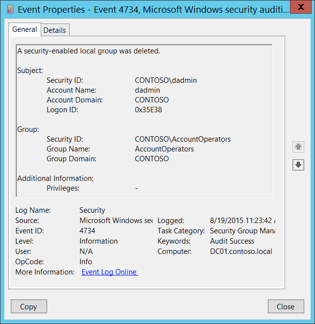

# 4734(S): セキュリティ有効なローカルグループが削除されました。



***サブカテゴリ:***&nbsp;[セキュリティグループ管理の監査](audit-security-group-management.md)

***イベントの説明:***

このイベントは、セキュリティ有効（セキュリティ）なローカルグループが削除されるたびに生成されます。

このイベントは、ドメインコントローラー、メンバーサーバー、およびワークステーションで生成されます。

> **注**&nbsp;&nbsp;推奨事項については、このイベントの[セキュリティ監視の推奨事項](#security-monitoring-recommendations)を参照してください。

<br clear="all">

***イベント XML:***
```
- <Event xmlns="http://schemas.microsoft.com/win/2004/08/events/event">
- <System>
 <Provider Name="Microsoft-Windows-Security-Auditing" Guid="{54849625-5478-4994-A5BA-3E3B0328C30D}" /> 
 <EventID>4734</EventID> 
 <Version>0</Version> 
 <Level>0</Level> 
 <Task>13826</Task> 
 <Opcode>0</Opcode> 
 <Keywords>0x8020000000000000</Keywords> 
 <TimeCreated SystemTime="2015-08-19T18:23:42.426245700Z" /> 
 <EventRecordID>175039</EventRecordID> 
 <Correlation /> 
 <Execution ProcessID="520" ThreadID="1072" /> 
 <Channel>Security</Channel> 
 <Computer>DC01.contoso.local</Computer> 
 <Security /> 
 </System>
- <EventData>
 <Data Name="TargetUserName">AccountOperators</Data> 
 <Data Name="TargetDomainName">CONTOSO</Data> 
 <Data Name="TargetSid">S-1-5-21-3457937927-2839227994-823803824-6605</Data> 
 <Data Name="SubjectUserSid">S-1-5-21-3457937927-2839227994-823803824-1104</Data> 
 <Data Name="SubjectUserName">dadmin</Data> 
 <Data Name="SubjectDomainName">CONTOSO</Data> 
 <Data Name="SubjectLogonId">0x35e38</Data> 
 <Data Name="PrivilegeList">-</Data> 
 </EventData>
 </Event>

```

***必要なサーバーの役割:*** なし。

***最小 OS バージョン:*** Windows Server 2008, Windows Vista。

***イベントバージョン:*** 0。

***フィールドの説明:***

**サブジェクト:**

-   **セキュリティ ID** \[タイプ = SID\]**:** 「グループ削除」操作を要求したアカウントの SID。イベントビューアーは自動的に SID を解決し、アカウント名を表示しようとします。SID を解決できない場合、イベントにはソースデータが表示されます。

> **注**&nbsp;&nbsp;**セキュリティ識別子 (SID)** は、信託者（セキュリティプリンシパル）を識別するために使用される可変長の一意の値です。各アカウントには、Active Directory ドメインコントローラーなどの権限によって発行され、セキュリティデータベースに保存される一意の SID があります。ユーザーがログオンするたびに、システムはデータベースからそのユーザーの SID を取得し、そのユーザーのアクセストークンに配置します。システムは、以降のすべての Windows セキュリティとのやり取りでユーザーを識別するためにアクセストークン内の SID を使用します。SID がユーザーまたはグループの一意の識別子として使用された場合、それは他のユーザーまたはグループを識別するために再利用されることはありません。SID の詳細については、[セキュリティ識別子](/windows/access-protection/access-control/security-identifiers)を参照してください。

-   **アカウント名** \[タイプ = UnicodeString\]**:** 「グループ削除」操作を要求したアカウントの名前。

-   **アカウントドメイン** \[タイプ = UnicodeString\]**:** サブジェクトのドメインまたはコンピュータ名。形式はさまざまで、以下を含みます：

    -   ドメインのNETBIOS名の例: CONTOSO

    -   小文字の完全ドメイン名: contoso.local

    -   大文字の完全ドメイン名: CONTOSO.LOCAL

    -   一部の[既知のセキュリティプリンシパル](/windows/security/identity-protection/access-control/security-identifiers)の場合、例えばLOCAL SERVICEやANONYMOUS LOGON、このフィールドの値は「NT AUTHORITY」となります。

    -   ローカルユーザーアカウントの場合、このフィールドにはこのアカウントが属するコンピュータまたはデバイスの名前が含まれます。例: “Win81”。

-   **ログオンID** \[タイプ = HexInt64\]**:** 16進数の値で、同じログオンIDを含む最近のイベントとこのイベントを関連付けるのに役立ちます。例: “[4624](event-4624.md): アカウントが正常にログオンされました。”

**グループ:**

-   **セキュリティID** \[タイプ = SID\]**:** 削除されたグループのSID。イベントビューアは自動的にSIDを解決し、グループ名を表示しようとします。SIDが解決できない場合、イベントにはソースデータが表示されます。

-   **グループ名** \[タイプ = UnicodeString\]**:** 削除されたグループの名前。例: ServiceDesk

-   **グループドメイン** \[タイプ = UnicodeString\]: 削除されたグループのドメインまたはコンピュータ名。形式はさまざまで、以下を含みます：

    -   ドメインのNETBIOS名の例: CONTOSO

    -   小文字の完全ドメイン名: contoso.local

    -   大文字の完全ドメイン名: CONTOSO.LOCAL

    -   ローカルグループの場合、このフィールドにはこの新しいグループが属するコンピュータの名前が含まれます。例: “Win81”。

    -   [組み込みグループ](/previous-versions/windows/it-pro/windows-server-2008-R2-and-2008/dn169025(v=ws.10)): Builtin

**追加情報:**

-   **特権** \[タイプ = UnicodeString\]: 操作中に使用されたユーザー特権のリスト。例: SeBackupPrivilege。このパラメータはイベントでキャプチャされない場合があり、その場合は「-」と表示されます。「表8. ユーザー特権」にユーザー特権の完全なリストがあります。

## セキュリティ監視の推奨事項

4734(S): セキュリティが有効なローカルグループが削除されました。

> **重要**&nbsp;&nbsp;このイベントについては、[付録 A: 多くの監査イベントに対するセキュリティ監視の推奨事項](appendix-a-security-monitoring-recommendations-for-many-audit-events.md)も参照してください。

- 組織内の重要なローカルまたはドメインセキュリティグループのリストがあり、これらのグループの変更、特にグループの削除を特に監視する必要がある場合は、重要なローカルまたはドメインセキュリティグループに対応する「**Group\\Group Name**」の値を持つイベントを監視します。重要なローカルまたはドメイングループの例としては、組み込みのローカル管理者グループ、ドメイン管理者、エンタープライズ管理者などがあります。

- ローカルまたはドメインセキュリティグループが削除されるたびに、誰がいつ削除したかを監視する必要がある場合は、このイベントを監視します。通常、このイベントは必要に応じて確認するための情報イベントとして使用されます。
