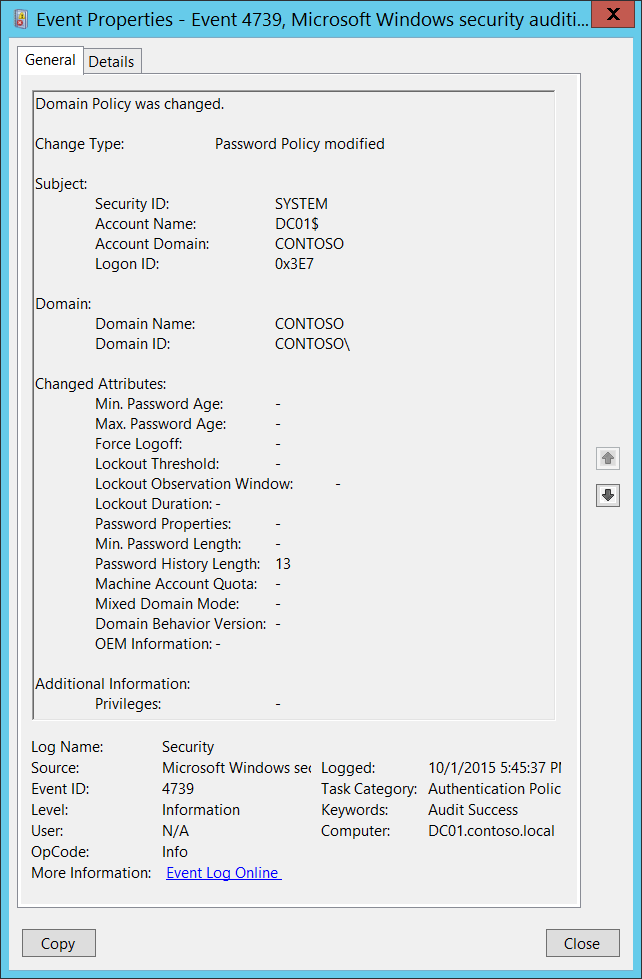

# 4739(S): ドメインポリシーが変更されました。



***サブカテゴリ:***&nbsp;[認証ポリシー変更の監査](audit-authentication-policy-change.md)

***イベントの説明:***

このイベントは、ローカルコンピューターのセキュリティポリシーに次のいずれかの変更が加えられたときに生成されます:

- コンピューターの「\\セキュリティ設定\\アカウントポリシー\\アカウントロックアウトポリシー」設定が変更されました。

- コンピューターの「\\セキュリティ設定\\アカウントポリシー\\パスワードポリシー」設定が変更されました。

- 「ネットワークセキュリティ: ログオン時間が切れたときに強制ログオフする」グループポリシー設定が変更されました。

- ドメイン機能レベルが変更されたか、その他の属性が変更されました（詳細はイベントの説明を参照してください）。

> **注**&nbsp;&nbsp;推奨事項については、このイベントの[セキュリティ監視の推奨事項](#security-monitoring-recommendations)を参照してください。

<br clear="all">

***イベント XML:***
```
- <Event xmlns="http://schemas.microsoft.com/win/2004/08/events/event">
- <System>
 <Provider Name="Microsoft-Windows-Security-Auditing" Guid="{54849625-5478-4994-A5BA-3E3B0328C30D}" /> 
 <EventID>4739</EventID> 
 <Version>0</Version> 
 <Level>0</Level> 
 <Task>13569</Task> 
 <Opcode>0</Opcode> 
 <Keywords>0x8020000000000000</Keywords> 
 <TimeCreated SystemTime="2015-10-02T00:45:37.587380900Z" /> 
 <EventRecordID>1049781</EventRecordID> 
 <Correlation /> 
 <Execution ProcessID="500" ThreadID="1648" /> 
 <Channel>Security</Channel> 
 <Computer>DC01.contoso.local</Computer> 
 <Security /> 
 </System>
- <EventData>
 <Data Name="DomainPolicyChanged">Password Policy</Data> 
 <Data Name="DomainName">CONTOSO</Data> 
 <Data Name="DomainSid">S-1-5-21-3457937927-2839227994-823803824</Data> 
 <Data Name="SubjectUserSid">S-1-5-18</Data> 
 <Data Name="SubjectUserName">DC01$</Data> 
 <Data Name="SubjectDomainName">CONTOSO</Data> 
 <Data Name="SubjectLogonId">0x3e7</Data> 
 <Data Name="PrivilegeList">-</Data> 
 <Data Name="MinPasswordAge">-</Data> 
 <Data Name="MaxPasswordAge">-</Data> 
 <Data Name="ForceLogoff">-</Data> 
 <Data Name="LockoutThreshold">-</Data> 
 <Data Name="LockoutObservationWindow">-</Data> 
 <Data Name="LockoutDuration">-</Data> 
 <Data Name="PasswordProperties">-</Data> 
 <Data Name="MinPasswordLength">-</Data> 
 <Data Name="PasswordHistoryLength">13</Data> 
 <Data Name="MachineAccountQuota">-</Data> 
 <Data Name="MixedDomainMode">-</Data> 
 <Data Name="DomainBehaviorVersion">-</Data> 
 <Data Name="OemInformation">-</Data> 
 </EventData>
 </Event>

```

***必要なサーバーロール:*** なし。

***最小 OS バージョン:*** Windows Server 2008, Windows Vista。

***イベントバージョン:*** 0。

***フィールドの説明:***

**変更タイプ** \[タイプ = UnicodeString\]**:** 変更が加えられたタイプ。形式は「**policy\_name** が変更されました」。以下は **policy\_name** のいくつかの可能な値です:

| 値               | グループポリシー名 \\ 説明                                                                                                                        |
|-----------------|---------------------------------------------------------------------------------------------------------------------------------------------------|
| ロックアウトポリシー  | コンピューターの「\\セキュリティ設定\\アカウントポリシー\\アカウントロックアウトポリシー」設定が変更されました。                                                      |
| パスワードポリシー   | コンピューターの「\\セキュリティ設定\\アカウントポリシー\\パスワードポリシー」設定が変更されました。                                                             |
| ログオフポリシー     | 「[ネットワークセキュリティ: ログオン時間が切れたときに強制ログオフする](/previous-versions/windows/it-pro/windows-server-2012-R2-and-2012/jj852195(v=ws.11))」グループポリシー設定が変更されました。 |
| -               | マシンアカウントクォータ ([ms-DS-MachineAccountQuota](/previous-versions/windows/it-pro/windows-server-2008-R2-and-2008/dd391926(v=ws.10))) ドメイン属性が変更されました。  |

**件名:**

-   **セキュリティ ID** \[タイプ = SID\]**:** 特定のローカルポリシーに変更を加えたアカウントのSID。イベントビューアーは自動的にSIDを解決し、アカウント名を表示しようとします。SIDが解決できない場合、イベントにソースデータが表示されます。

> **注**&nbsp;&nbsp;**セキュリティ識別子 (SID)** は、トラスティ (セキュリティプリンシパル) を識別するために使用される可変長の一意の値です。各アカウントには、Active Directory ドメインコントローラーなどの権限によって発行され、セキュリティデータベースに保存される一意のSIDがあります。ユーザーがログオンするたびに、システムはデータベースからそのユーザーのSIDを取得し、そのユーザーのアクセス トークンに配置します。システムは、以降のすべてのWindowsセキュリティとのやり取りでユーザーを識別するために、アクセス トークン内のSIDを使用します。ユーザーまたはグループの一意の識別子としてSIDが使用された場合、それは他のユーザーまたはグループを識別するために再利用されることはありません。SIDの詳細については、[セキュリティ識別子](/windows/access-protection/access-control/security-identifiers)を参照してください。

-   **アカウント名** \[タイプ = UnicodeString\]**:** 特定のローカルポリシーに変更を加えたアカウントの名前。

-   **アカウント ドメイン** \[タイプ = UnicodeString\]**:** 件名のドメインまたはコンピューター名。形式はさまざまで、以下を含みます:

    -   ドメイン NETBIOS 名の例: CONTOSO

    -   小文字の完全なドメイン名: contoso.local

    -   大文字の完全なドメイン名: CONTOSO.LOCAL

    -   LOCAL SERVICE や ANONYMOUS LOGON などの[よく知られたセキュリティプリンシパル](/windows/security/identity-protection/access-control/security-identifiers)の場合、このフィールドの値は「NT AUTHORITY」となります。

    -   ローカルユーザーアカウントの場合、このフィールドにはこのアカウントが属するコンピューターまたはデバイスの名前が含まれます。例: 「Win81」。

-   **ログオン ID** \[タイプ = HexInt64\]**:** このイベントを、同じログオンIDを含む可能性のある最近のイベントと関連付けるのに役立つ16進数の値。例: 「[4624](event-4624.md): アカウントが正常にログオンされました。」

**ドメイン:**

-   **ドメイン名** \[タイプ = UnicodeString\]**:** ポリシー変更が行われたドメインの名前。

<!-- -->

-   **ドメインID** \[タイプ = SID\]**:** ポリシー変更が行われたドメインのSID。イベントビューアーは自動的にSIDを解決してアカウント名を表示しようとします。SIDが解決できない場合、イベントにソースデータが表示されます。

**変更された属性:** 変更されなかった属性の値は「**-**」になります。

-   **最小パスワード年齢** \[タイプ = UnicodeString\]: “\\セキュリティ設定\\アカウントポリシー\\パスワードポリシー\\最小パスワード年齢” グループポリシー。数値。

<!-- -->

-   **最大パスワード年齢** \[タイプ = UnicodeString\]: “\\セキュリティ設定\\アカウントポリシー\\パスワードポリシー\\最大パスワード年齢” グループポリシー。数値。

-   **強制ログオフ** \[タイプ = UnicodeString\]: “\\セキュリティ設定\\ローカルポリシー\\セキュリティオプション\\ネットワークセキュリティ: ログオン時間が切れたときに強制ログオフ” グループポリシー。

-   **ロックアウトしきい値** \[タイプ = UnicodeString\]: “\\セキュリティ設定\\アカウントポリシー\\アカウントロックアウトポリシー\\アカウントロックアウトしきい値” グループポリシー。数値。

-   **ロックアウト観察ウィンドウ** \[タイプ = UnicodeString\]: “\\セキュリティ設定\\アカウントポリシー\\アカウントロックアウトポリシー\\アカウントロックアウトカウンターのリセット時間” グループポリシー。数値。

-   **ロックアウト期間** \[タイプ = UnicodeString\]: “\\セキュリティ設定\\アカウントポリシー\\アカウントロックアウトポリシー\\アカウントロックアウト期間” グループポリシー。数値。

-   **パスワードプロパティ** \[タイプ = UnicodeString\]:

| 値   | グループポリシー設定                                                                                                                                                                                                                   |
|-------|-----------------------------------------------------------------------------------------------------------------------------------------------------------------------------------------------------------------------------------------|
| 0     | \\セキュリティ設定\\アカウントポリシー\\パスワードポリシー\\可逆暗号化を使用してパスワードを保存 - 無効。<br>\\セキュリティ設定\\アカウントポリシー\\パスワードポリシー\\パスワードの複雑さの要件を満たす必要があります – 無効。 |
| 1     | \\セキュリティ設定\\アカウントポリシー\\パスワードポリシー\\可逆暗号化を使用してパスワードを保存 - 無効。<br>\\セキュリティ設定\\アカウントポリシー\\パスワードポリシー\\パスワードの複雑さの要件を満たす必要があります – 有効。  |
| 16    | \\セキュリティ設定\\アカウントポリシー\\パスワードポリシー\\可逆暗号化を使用してパスワードを保存 - 有効。<br>\\セキュリティ設定\\アカウントポリシー\\パスワードポリシー\\パスワードの複雑さの要件を満たす必要があります – 無効。  |
| 17    | \\セキュリティ設定\\アカウントポリシー\\パスワードポリシー\\可逆暗号化を使用してパスワードを保存 - 有効。<br>\\セキュリティ設定\\アカウントポリシー\\パスワードポリシー\\パスワードの複雑さの要件を満たす必要があります – 有効。   |

-   **最小パスワード長** \[タイプ = UnicodeString\]: “\\Security Settings\\Account Policies\\Password Policy\\Minimum password length” グループポリシー。数値。

-   **パスワード履歴の長さ** \[タイプ = UnicodeString\]: “\\Security Settings\\Account Policies\\Password Policy\\Enforce password history” グループポリシー。数値。

-   **マシンアカウントクォータ** \[タイプ = UnicodeString\]: [ms-DS-MachineAccountQuota](/previous-versions/windows/it-pro/windows-server-2008-R2-and-2008/dd391926(v=ws.10)) ドメイン属性が変更されました。数値。

-   **混合ドメインモード** \[タイプ = UnicodeString\]: このフィールドに関する情報はこのドキュメントにはありません。

-   **ドメイン動作バージョン** \[タイプ = UnicodeString\]: [msDS-Behavior-Version](/openspecs/windows_protocols/ms-adts/d7422d35-448a-451a-8846-6a7def0044df) ドメイン属性が変更されました。数値。可能な値:

| 値   | 識別子                                        | ドメインで許可されるドメインコントローラーのオペレーティングシステム                                                                                                                                                                                                                                                                               |
|-------|---------------------------------------------|--------------------------------------------------------------------------------------------------------------------------------------------------------------------------------------------------------------------------------------------------------------------------------------------------------------------------------------------------|
| 0     | DS\_BEHAVIOR\_WIN2000                       | Windows 2000 Server オペレーティングシステム<br>Windows Server 2003 オペレーティングシステム<br>Windows Server 2008 オペレーティングシステム<br>Windows Server 2008 R2 オペレーティングシステム<br>Windows Server 2012 オペレーティングシステム<br>Windows Server 2012 R2 オペレーティングシステム<br>Windows Server 2016 オペレーティングシステム |
| 1     | DS\_BEHAVIOR\_WIN2003\_WITH\_MIXED\_DOMAINS | Windows Server 2003<br>Windows Server 2008<br>Windows Server 2008 R2<br>Windows Server 2012<br>Windows Server 2012 R2<br>Windows Server 2016                                                                                                                                                     |
| 2     | DS\_BEHAVIOR\_WIN2003                       | Windows Server 2003<br>Windows Server 2008<br>Windows Server 2008 R2<br>Windows Server 2012<br>Windows Server 2012 R2<br>Windows Server 2016                                                                                                                                                     |
| 3     | DS\_BEHAVIOR\_WIN2008                       | Windows Server 2008<br>Windows Server 2008 R2<br>Windows Server 2012<br>Windows Server 2012 R2<br>Windows Server 2016                                                                                                                                                                                  |
| 4     | DS\_BEHAVIOR\_WIN2008R2                     | Windows Server 2008 R2<br>Windows Server 2012<br>Windows Server 2012 R2<br>Windows Server 2016                                                                                                                                                                                                               |
| 5     | DS\_BEHAVIOR\_WIN2012                       | Windows Server 2012<br>Windows Server 2012 R2<br>Windows Server 2016                                                                                                                                                                                                                                               |
| 6     | DS\_BEHAVIOR\_WIN2012R2                     | Windows Server 2012 R2<br>Windows Server 2016                                                                                                                                                                                                                                                                            |
| 7     | DS\_BEHAVIOR\_WINTHRESHOLD                  | Windows Server 2016                                                                                                                                                                                                                                                                                                            |

- **OEM Information** \[Type = UnicodeString\]: このドキュメントにはこのフィールドに関する情報はありません。

**追加情報:**

- **特権** \[Type = UnicodeString\]: 操作中に使用されたユーザー特権のリスト。例えば、SeBackupPrivilege。このパラメータはイベントでキャプチャされない場合があり、その場合は「-」として表示されます。ユーザー特権の完全なリストは以下の表を参照してください:

| 特権名                           | ユーザー権利グループポリシー名                                   | 説明                                                                                                                                                                                                                                                                                                                                                                                                                                                                                                                                                                                                                                                                                                                                                                                                                                                           |
|---------------------------------|----------------------------------------------------------------|-----------------------------------------------------------------------------------------------------------------------------------------------------------------------------------------------------------------------------------------------------------------------------------------------------------------------------------------------------------------------------------------------------------------------------------------------------------------------------------------------------------------------------------------------------------------------------------------------------------------------------------------------------------------------------------------------------------------------------------------------------------------------------------------------------------------------------------------------------------------------|
| SeAssignPrimaryTokenPrivilege   | プロセスレベルのトークンを置き換える                                  | プロセスの[*プライマリトークン*](/windows/win32/secgloss/p-gly#_security_primary_token_gly)を割り当てるために必要です。<br>この特権を持つユーザーは、開始されたサブプロセスに関連付けられたデフォルトのトークンを置き換えるためにプロセスを開始できます。                                                                                                                                                                                                                                                                                                                                                                                                                                                                                                                                                                 |
| SeAuditPrivilege                | セキュリティ監査を生成                                       | この特権を持つユーザーは、セキュリティログにエントリを追加できます。                                                                                                                                                                                                                                                                                                                                                                                                                                                                                                                                                                                                                                                                                                                                                                                                    |
| SeBackupPrivilege               | ファイルとディレクトリをバックアップ                                  | - バックアップ操作を実行するために必要です。<br>この特権を持つユーザーは、システムをバックアップする目的でファイルやディレクトリ、レジストリ、その他の永続的なオブジェクトの権限をバイパスできます。<br>この特権により、システムはファイルに指定された[*アクセス制御リスト*](/windows/win32/secgloss/a-gly#_security_access_control_list_gly) (ACL)に関係なく、すべての読み取りアクセスを許可します。読み取り以外のアクセス要求はACLで評価されます。この特権を持つ場合、以下のアクセス権が付与されます:<br>READ\_CONTROL<br>ACCESS\_SYSTEM\_SECURITY<br>FILE\_GENERIC\_READ<br>FILE\_TRAVERSE                                                                                                                |
| SeChangeNotifyPrivilege         | トラバースチェックをバイパス                                       | ファイルやディレクトリの変更通知を受け取るために必要です。この特権は、システムがすべてのトラバースアクセスチェックをスキップする原因にもなります。<br>この特権を持つユーザーは、トラバースされたディレクトリに対する権限がなくてもディレクトリツリーをトラバースできます。この特権は、ユーザーがディレクトリの内容をリストすることを許可するものではなく、ディレクトリをトラバースすることのみを許可します。                                                                                                                                                                                                                                                                                                                                                                                                                                                             |
| SeCreateGlobalPrivilege         | グローバルオブジェクトを作成                                          | ターミナルサービスセッション中にグローバル名前空間に名前付きファイルマッピングオブジェクトを作成するために必要です。                                                                                                                                                                                                                                                                                                                                                                                                                                                                                                                                                                                                                                                                                                                                                              |
| SeCreatePagefilePrivilege       | ページファイルを作成                                              | この特権を持つユーザーは、ページファイルを作成およびサイズを変更できます。                                                                                                                                                                                                                                                                                                                                                                                                                                                                                                                                                                                                                                                                                                                                                                                           |
| SeCreatePermanentPrivilege      | 永続的な共有オブジェクトを作成                                | 永続的なオブジェクトを作成するために必要です。<br>この特権は、オブジェクト名前空間を拡張するカーネルモードコンポーネントに役立ちます。カーネルモードで実行されているコンポーネントは既にこの特権を持っているため、特権を割り当てる必要はありません。                                                                                                                                                                                                                                                                                                                                                                                                                                                                                                                                                                                            |
| SeCreateSymbolicLinkPrivilege   | シンボリックリンクを作成                                          | シンボリックリンクを作成するために必要です。                                                                                                                                                                                                                                                                                                                                                                                                                                                                                                                                                                                                                                                                                                                                                                                                                                   |
| SeCreateTokenPrivilege          | トークンオブジェクトを作成                                          | プロセスがNtCreateToken()や他のトークン作成APIを使用して、任意のローカルリソースにアクセスするために使用できるトークンを作成することを許可します。<br>この特権を必要とするプロセスには、別のユーザーアカウントを作成してこの特権を割り当てるのではなく、LocalSystemアカウント（既にこの特権を含む）を使用することをお勧めします。                                                                                                                                                                                                                                                                                                                                                                                                                                                                                |
| SeDebugPrivilege                | プログラムをデバッグ                                                 | 他のアカウントが所有するプロセスのメモリをデバッグおよび調整するために必要です。<br>この特権を持つユーザーは、任意のプロセスまたはカーネルにデバッガをアタッチできます。自分のアプリケーションをデバッグしている開発者はこのユーザー権利を必要としません。新しいシステムコンポーネントをデバッグしている開発者はこのユーザー権利を必要とします。このユーザー権利は、重要で機密性の高いオペレーティングシステムコンポーネントへの完全なアクセスを提供します。                                                                                                                                                                                                                                                                                                                                                                                                                                |
| SeEnableDelegationPrivilege     | 委任のために信頼されるコンピュータおよびユーザーアカウントを有効にする | ユーザーおよびコンピュータアカウントを委任のために信頼されるようにマークするために必要です。<br>この特権を持つユーザーは、ユーザーまたはコンピュータオブジェクトの**委任のために信頼される**設定を設定できます。<br>この特権を付与されたユーザーまたはオブジェクトは、ユーザーまたはコンピュータオブジェクトのアカウント制御フラグに書き込みアクセス権を持っている必要があります。委任のために信頼されるコンピュータ（またはユーザーコンテキストで実行されているサーバープロセス）は、クライアントの委任された資格情報を使用して別のコンピュータ上のリソースにアクセスできます。ただし、クライアントのアカウントに**委任できないアカウント**のアカウント制御フラグが設定されていない場合に限ります。                                                                                                                                                                                                                      |
| SeImpersonatePrivilege          | 認証後にクライアントを偽装する                      | この特権を持つユーザーは、他のアカウントを偽装できます。                                                                                                                                                                                                                                                                                                                                                                                                                                                                                                                                                                                                                                                                                                                                                                                                         |
| SeIncreaseBasePriorityPrivilege | スケジューリング優先度を上げる                                   | プロセスの基本優先度を上げるために必要です。<br>この特権を持つユーザーは、他のプロセスに対して書き込みプロパティアクセスを持つプロセスを使用して、他のプロセスに割り当てられた実行優先度を上げることができます。この特権を持つユーザーは、タスクマネージャーのユーザーインターフェイスを通じてプロセスのスケジューリング優先度を変更できます。                                                                                                                                                                                                                                                                                                                                                                                                                                                                                                                     |
| SeIncreaseQuotaPrivilege        | プロセスのメモリクォータを調整                             | プロセスに割り当てられたクォータを増やすために必要です。<br>この特権を持つユーザーは、プロセスが消費できる最大メモリを変更できます。                                                                                                                                                                                                                                                                                                                                                                                                                                                                                                                                                                                                                                                                                                        |
| SeIncreaseWorkingSetPrivilege   | プロセスのワーキングセットを増やす                                 | ユーザーのコンテキストで実行されるアプリケーションに対して、より多くのメモリを割り当てるために必要です。                                                                                                                                                                                                                                                                                                                                                                                                                                                                                                                                                                                                                                                                                                                                                                                   |
| SeLoadDriverPrivilege           | デバイスドライバをロードおよびアンロード                                 | デバイスドライバをロードまたはアンロードするために必要です。<br>この特権を持つユーザーは、デバイスドライバや他のコードをカーネルモードに動的にロードおよびアンロードできます。このユーザー権利は、プラグアンドプレイデバイスドライバには適用されません。                                                                                                                                                                                                                                                                                                                                                                                                                                                                                                                                                                                                                                    |
| SeLockMemoryPrivilege           | メモリ内のページをロック                                           | 物理ページをメモリにロックするために必要です。<br>この特権を持つユーザーは、プロセスを使用してデータを物理メモリに保持し、システムがデータをディスク上の仮想メモリにページングするのを防ぎます。この特権を行使すると、利用可能なランダムアクセスメモリ（RAM）の量が減少するため、システムパフォーマンスに大きな影響を与える可能性があります。                                                                                                                                                                                                                                                                                                                                                                                                                                                                                                             |
| SeMachineAccountPrivilege       | ドメインにワークステーションを追加                                     | この特権を持つユーザーは、コンピュータアカウントを作成できます。<br>この特権はドメインコントローラーでのみ有効です。                                                                                                                                                                                                                                                                                                                                                                                                                                                                                                                                                                                                                                                                                                                                             |
| SeManageVolumePrivilege         | ボリュームメンテナンスタスクを実行                               | ボリューム上でメンテナンスタスクを実行するために必要です。例えば、リモートデフラグメンテーションなど。                                                                                                                                                                                                                                                                                                                                                                                                                                                                                                                                                                                                                                                                                                                                                                                        |
| SeProfileSingleProcessPrivilege | 単一プロセスのプロファイル                                         | 単一プロセスのプロファイル情報を収集するために必要です。<br>この特権を持つユーザーは、パフォーマンスモニタリングツールを使用して非システムプロセスのパフォーマンスを監視できます。                                                                                                                                                                                                                                                                                                                                                                                                                                                                                                                                                                                                                                                                       |
| SeRelabelPrivilege              | オブジェクトラベルを変更                                         | オブジェクトの強制整合性レベルを変更するために必要です。                                                                                                                                                                                                                                                                                                                                                                                                                                                                                                                                                                                                                                                                                                                                                                                                        |
| SeRemoteShutdownPrivilege       | リモートシステムからの強制シャットダウン                            | ネットワーク要求を使用してシステムをシャットダウンするために必要です。                                                                                                                                                                                                                                                                                                                                                                                                                                                                                                                                                                                                                                                                                                                                                                                                               |
| SeRestorePrivilege              | ファイルとディレクトリを復元                                  | 復元操作を実行するために必要です。この特権により、システムはファイルに指定されたACLに関係なく、すべての書き込みアクセスを許可します。書き込み以外のアクセス要求はACLで評価されます。さらに、この特権により、任意の有効なユーザーまたはグループSIDをファイルの所有者として設定できます。この特権を持つ場合、以下のアクセス権が付与されます:<br>WRITE\_DAC<br>WRITE\_OWNER<br>ACCESS\_SYSTEM\_SECURITY<br>FILE\_GENERIC\_WRITE<br>FILE\_ADD\_FILE<br>FILE\_ADD\_SUBDIRECTORY<br>DELETE<br>この特権を持つユーザーは、バックアップされたファイルやディレクトリを復元する際にファイル、ディレクトリ、レジストリ、その他の永続的なオブジェクトの権限をバイパスでき、任意の有効なセキュリティプリンシパルをオブジェクトの所有者として設定できるユーザーを決定します。 |
| SeSecurityPrivilege             | 監査およびセキュリティログを管理                               | セキュリティイベントログで監査イベントを制御および表示するなど、多くのセキュリティ関連機能を実行するために必要です。<br>この特権を持つユーザーは、ファイル、Active Directoryオブジェクト、レジストリキーなどの個々のリソースに対してオブジェクトアクセス監査オプションを指定できます。<br>この特権を持つユーザーは、セキュリティログを表示およびクリアすることもできます。                                                                                                                                                                                                                                                                                                                                                                                                                                                                                 |
| SeShutdownPrivilege             | システムをシャットダウン                                           | ローカルシステムをシャットダウンするために必要です。                                                                                                                                                                                                                                                                                                                                                                                                                                                                                                                                                                                                                                                                                                                                                                                                                                 |
| SeSyncAgentPrivilege            | ディレクトリサービスデータを同期                             | この特権を持つユーザーは、オブジェクトやプロパティの保護に関係なく、ディレクトリ内のすべてのオブジェクトやプロパティを読み取ることができます。デフォルトでは、ドメインコントローラーのAdministratorおよびLocalSystemアカウントに割り当てられています。<br>この特権を持つユーザーは、すべてのディレクトリサービスデータを同期できます。これはActive Directoryの同期とも呼ばれます。                                                                                                                                                                                                                                                                                                                                                                                                                                                                        |
| SeSystemEnvironmentPrivilege    | ファームウェア環境値を変更                             | この特権を持つユーザーは、構成情報を保存するためにこのタイプのメモリを使用するシステムの不揮発性RAMを変更できます。                                                                                                                                                                                                                                                                                                                                                                                                                                                                                                                                                                                                                                                                                                                                                    |
| SeSystemProfilePrivilege        | システムパフォーマンスをプロファイル                                     | システム全体のプロファイル情報を収集するために必要です。<br>この特権を持つユーザーは、パフォーマンスモニタリングツールを使用してシステムプロセスのパフォーマンスを監視できます。                                                                                                                                                                                                                                                                                                                                                                                                                                                                                                                                                                                                                                                                          |
| SeSystemtimePrivilege           | システム時間を変更                                         | システム時間を変更するために必要です。<br>この特権を持つユーザーは、コンピュータの内部時計の時間と日付を変更できます。このユーザー権利が割り当てられたユーザーは、イベントログの表示に影響を与える可能性があります。システム時間が変更されると、ログに記録されるイベントは実際に発生した時間ではなく、この新しい時間を反映します。                                                                                                                                                                                                                                                                                                                                                                                                                                                                                                       |
| SeTakeOwnershipPrivilege        | ファイルや他のオブジェクトの所有権を取得                       | 任意のアクセス権を付与されずにオブジェクトの所有権を取得するために必要です。この特権は、所有者の値をオブジェクトの所有者として正当に割り当てることができる値にのみ設定することを許可します。<br>この特権を持つユーザーは、Active Directoryオブジェクト、ファイルとフォルダ、プリンタ、レジストリキー、プロセス、およびスレッドを含むシステム内の任意のセキュリティオブジェクトの所有権を取得できます。                                                                                                                                                                                                                                                                                                                                                                                                                                  |
| SeTcbPrivilege                  | オペレーティングシステムの一部として動作                            | この特権は、その所有者を信頼されたコンピュータベースの一部として識別します。<br>このユーザー権利は、プロセスが認証なしで任意のユーザーを偽装することを許可します。したがって、プロセスはそのユーザーと同じローカルリソースにアクセスできます。                                                                                                                                                                                                                                                                                                                                                                                                                                                                                                                                                                                                                  |
| SeTimeZonePrivilege             | タイムゾーンを変更                                           | コンピュータの内部時計に関連付けられたタイムゾーンを調整するために必要です。                                                                                                                                                                                                                                                                                                                                                                                                                                                                                                                                                                                                                                                                                                                                                                                       |
| SeTrustedCredManAccessPrivilege | 信頼された呼び出し元として資格情報マネージャーにアクセス                  | 信頼された呼び出し元として資格情報マネージャーにアクセスするために必要です。                                                                                                                                                                                                                                                                                                                                                                                                                                                                                                                                                                                                                                                                                                                                                                                                            |
| SeUndockPrivilege               | ドッキングステーションからコンピュータを取り外す                           | ラップトップをドッキングステーションから取り外すために必要です。<br>この特権を持つユーザーは、ログオンせずにポータブルコンピュータをドッキングステーションから取り外すことができます。                                                                                                                                                                                                                                                                                                                                                                                                                                                                                                                                                                                                                                                                                                                       |
| SeUnsolicitedInputPrivilege     | 該当なし                                                 | [*端末*](/windows/win32/secgloss/t-gly#_security_terminal_gly)デバイスからの未承諾入力を読み取るために必要です。                                                                                                                                                                                                                                                                                                                                                                                                                                                                                                                                                                                                                                                                                                |

## セキュリティ監視の推奨事項

4739(S): ドメインポリシーが変更されました。

- 「**アカウントロックアウトポリシー**」、「**パスワードポリシー**」、または「**ネットワークセキュリティ: ログオン時間が終了したときに強制ログオフ**」の設定変更、およびこのイベントによって報告される**ドメイン機能レベルと属性**の変更はすべて監視され、アラートがトリガーされる必要があります。この変更が計画されていなかった場合は、変更の理由を調査してください。
