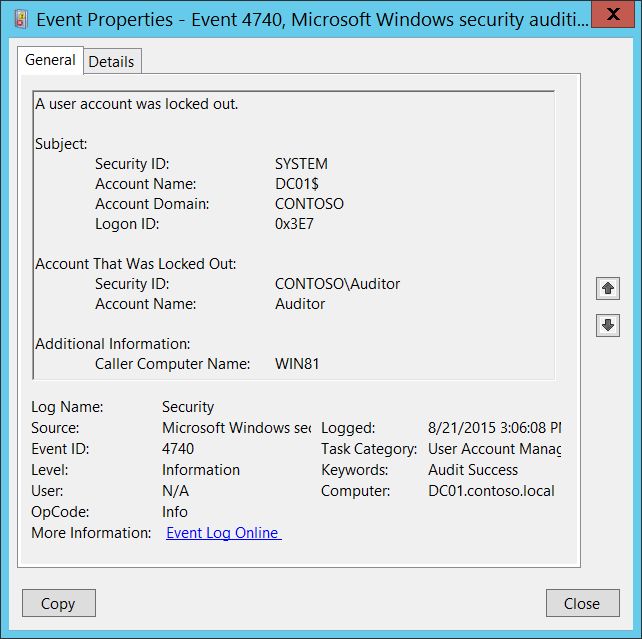

# 4740(S): ユーザーアカウントがロックアウトされました。



***サブカテゴリ:***&nbsp;[ユーザーアカウント管理の監査](audit-user-account-management.md)

***イベントの説明:***

このイベントは、ユーザーアカウントがロックアウトされるたびに生成されます。

ユーザーアカウントの場合、このイベントはドメインコントローラー、メンバーサーバー、およびワークステーションで生成されます。

> **注**&nbsp;&nbsp;推奨事項については、このイベントの[セキュリティ監視の推奨事項](#security-monitoring-recommendations)を参照してください。

<br clear="all">

***イベント XML:***
```xml
- <Event xmlns="http://schemas.microsoft.com/win/2004/08/events/event">
- <System>
 <Provider Name="Microsoft-Windows-Security-Auditing" Guid="{54849625-5478-4994-A5BA-3E3B0328C30D}" /> 
 <EventID>4740</EventID> 
 <Version>0</Version> 
 <Level>0</Level> 
 <Task>13824</Task> 
 <Opcode>0</Opcode> 
 <Keywords>0x8020000000000000</Keywords> 
 <TimeCreated SystemTime="2015-08-21T22:06:08.576887500Z" /> 
 <EventRecordID>175703</EventRecordID> 
 <Correlation /> 
 <Execution ProcessID="520" ThreadID="1112" /> 
 <Channel>Security</Channel> 
 <Computer>DC01.contoso.local</Computer> 
 <Security /> 
 </System>
- <EventData>
 <Data Name="TargetUserName">Auditor</Data> 
 <Data Name="TargetDomainName">WIN81</Data> 
 <Data Name="TargetSid">S-1-5-21-3457937927-2839227994-823803824-2104</Data> 
 <Data Name="SubjectUserSid">S-1-5-18</Data> 
 <Data Name="SubjectUserName">DC01$</Data> 
 <Data Name="SubjectDomainName">CONTOSO</Data> 
 <Data Name="SubjectLogonId">0x3e7</Data> 
 </EventData>
 </Event>

```

***必要なサーバーロール:*** なし。

***最小 OS バージョン:*** Windows Server 2008, Windows Vista。

***イベントバージョン:*** 0。

***フィールドの説明:***

**サブジェクト:**

-   **セキュリティ ID** \[タイプ = SID\]**:** ロックアウト操作を実行したアカウントの SID。イベントビューアーは自動的に SID を解決し、アカウント名を表示しようとします。SID を解決できない場合、イベントにソースデータが表示されます。

> **注**&nbsp;&nbsp;**セキュリティ識別子 (SID)** は、信託者 (セキュリティプリンシパル) を識別するために使用される可変長の一意の値です。各アカウントには、Active Directory ドメインコントローラーなどの権限によって発行され、セキュリティデータベースに保存される一意の SID があります。ユーザーがログオンするたびに、システムはデータベースからそのユーザーの SID を取得し、そのユーザーのアクセストークンに配置します。システムは、アクセストークン内の SID を使用して、以降のすべての Windows セキュリティとのやり取りでユーザーを識別します。SID がユーザーまたはグループの一意の識別子として使用された場合、それは他のユーザーまたはグループを識別するために再利用されることはありません。SID についての詳細は、[セキュリティ識別子](/windows/access-protection/access-control/security-identifiers)を参照してください。

-   **アカウント名** \[タイプ = UnicodeString\]**:** ロックアウト操作を実行したアカウントの名前。

-   **アカウントドメイン** \[タイプ = UnicodeString\]**:** ドメインまたはコンピュータ名。形式はさまざまで、以下を含みます：

    -   ドメインのNETBIOS名の例: CONTOSO

    -   小文字の完全なドメイン名: contoso.local

    -   大文字の完全なドメイン名: CONTOSO.LOCAL

    -   一部の[よく知られたセキュリティプリンシパル](/windows/security/identity-protection/access-control/security-identifiers)の場合、例えばLOCAL SERVICEやANONYMOUS LOGON、このフィールドの値は「NT AUTHORITY」となります。

    -   ローカルユーザーアカウントの場合、このフィールドにはこのアカウントが属するコンピュータまたはデバイスの名前が含まれます。例えば：「Win81」。

-   **ログオンID** \[タイプ = HexInt64\]**:** 16進数の値で、最近のイベントと同じログオンIDを含む可能性のあるイベントとこのイベントを関連付けるのに役立ちます。例えば、「[4624](event-4624.md): アカウントが正常にログオンされました。」

**ロックアウトされたアカウント:**

-   **セキュリティID** \[タイプ = SID\]**:** ロックアウトされたアカウントのSID。イベントビューアーは自動的にSIDを解決し、アカウント名を表示しようとします。SIDが解決できない場合、イベントにソースデータが表示されます。

-   **アカウント名** \[タイプ = UnicodeString\]**:** ロックアウトされたアカウントの名前。

**追加情報:**

-   **呼び出し元コンピュータ名** \[タイプ = UnicodeString\]**:** ログオン試行が受信され、その後ターゲットアカウントがロックアウトされたコンピュータアカウントの名前。例えば：WIN81。

## セキュリティ監視の推奨事項

4740(S): ユーザーアカウントがロックアウトされました。

> **重要**&nbsp;&nbsp;このイベントについては、[付録A: 多くの監査イベントのためのセキュリティ監視の推奨事項](appendix-a-security-monitoring-recommendations-for-many-audit-events.md)も参照してください。

-   このイベントは通常SYSTEMアカウントによってトリガーされるため、**「Subject\\Security ID」**がSYSTEMでない場合に報告することをお勧めします。

-   高価値のドメインまたはローカルアカウント（例えば、ドメイン管理者アカウント）を監視する必要がある場合、**「ロックアウトされたアカウント\\Security ID」**の値がこれらのアカウントに対応するすべての[4740](event-4740.md)イベントを監視してください。

<!-- -->

-   高価値のドメインまたはローカルアカウントがあり、その変更をすべて監視する必要がある場合は、アカウントに対応する **“Account That Was Locked Out \\Security ID”** を持つすべての [4740](event-4740.md) イベントを監視します。

-   ユーザーアカウント **“Account That Was Locked Out\\Security ID”** が **Additional Information\\Caller Computer Name** からの認証試行に使用されるべきでない場合、アラートをトリガーします。

-   **Additional Information\\Caller Computer Name** がドメイン外からのものであるすべての [4740](event-4740.md) イベントを監視します。ただし、コンピュータがドメインに属していない場合でも、[4740](event-4740.md) イベントではIPアドレスの代わりにコンピュータ名が表示されることに注意してください。
