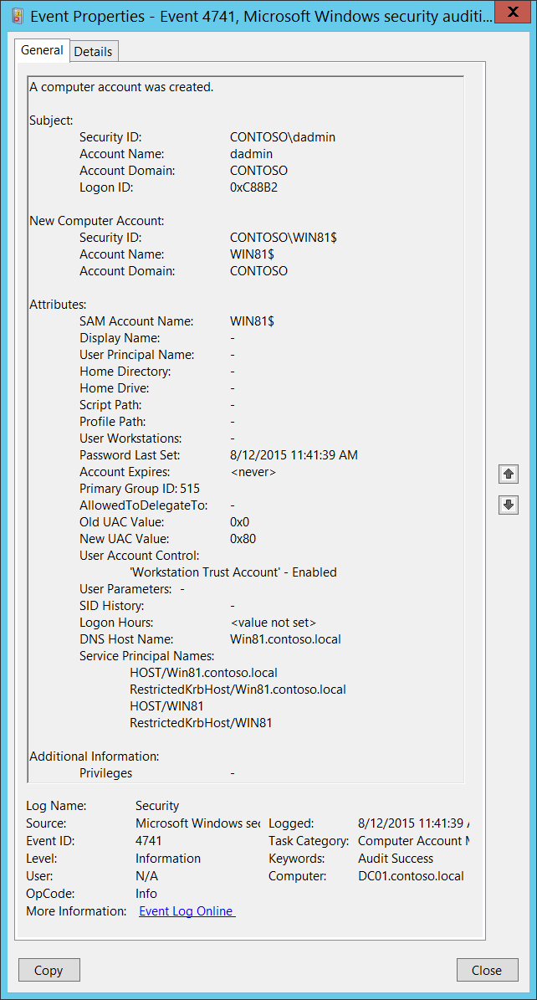

# 4741(S): コンピューターアカウントが作成されました。



***サブカテゴリ:***&nbsp;[コンピューターアカウント管理の監査](audit-computer-account-management.md)

***イベントの説明:***

このイベントは、新しいコンピューターオブジェクトが作成されるたびに生成されます。

このイベントはドメインコントローラーでのみ生成されます。

> [!NOTE]
> 推奨事項については、このイベントの[セキュリティ監視の推奨事項](#security-monitoring-recommendations)を参照してください。

***イベント XML:***

```xml
- <Event xmlns="http://schemas.microsoft.com/win/2004/08/events/event">
- <System>
 <Provider Name="Microsoft-Windows-Security-Auditing" Guid="{54849625-5478-4994-A5BA-3E3B0328C30D}" /> 
 <EventID>4741</EventID> 
 <Version>0</Version> 
 <Level>0</Level> 
 <Task>13825</Task> 
 <Opcode>0</Opcode> 
 <Keywords>0x8020000000000000</Keywords> 
 <TimeCreated SystemTime="2015-08-12T18:41:39.201898100Z" /> 
 <EventRecordID>170254</EventRecordID> 
 <Correlation /> 
 <Execution ProcessID="520" ThreadID="1096" /> 
 <Channel>Security</Channel> 
 <Computer>DC01.contoso.local</Computer> 
 <Security /> 
 </System>
- <EventData>
 <Data Name="TargetUserName">WIN81$</Data> 
 <Data Name="TargetDomainName">CONTOSO</Data> 
 <Data Name="TargetSid">S-1-5-21-3457937927-2839227994-823803824-6116</Data> 
 <Data Name="SubjectUserSid">S-1-5-21-3457937927-2839227994-823803824-1104</Data> 
 <Data Name="SubjectUserName">dadmin</Data> 
 <Data Name="SubjectDomainName">CONTOSO</Data> 
 <Data Name="SubjectLogonId">0xc88b2</Data> 
 <Data Name="PrivilegeList">-</Data> 
 <Data Name="SamAccountName">WIN81$</Data> 
 <Data Name="DisplayName">-</Data> 
 <Data Name="UserPrincipalName">-</Data> 
 <Data Name="HomeDirectory">-</Data> 
 <Data Name="HomePath">-</Data> 
 <Data Name="ScriptPath">-</Data> 
 <Data Name="ProfilePath">-</Data> 
 <Data Name="UserWorkstations">-</Data> 
 <Data Name="PasswordLastSet">8/12/2015 11:41:39 AM</Data> 
 <Data Name="AccountExpires">%%1794</Data> 
 <Data Name="PrimaryGroupId">515</Data> 
 <Data Name="AllowedToDelegateTo">-</Data> 
 <Data Name="OldUacValue">0x0</Data> 
 <Data Name="NewUacValue">0x80</Data> 
 <Data Name="UserAccountControl">%%2087</Data> 
 <Data Name="UserParameters">-</Data> 
 <Data Name="SidHistory">-</Data> 
 <Data Name="LogonHours">%%1793</Data> 
 <Data Name="DnsHostName">Win81.contoso.local</Data> 
 <Data Name="ServicePrincipalNames">HOST/Win81.contoso.local RestrictedKrbHost/Win81.contoso.local HOST/WIN81 RestrictedKrbHost/WIN81</Data> 
 </EventData>
 </Event>
```

***必要なサーバーロール:*** Active Directory ドメインコントローラー。

***最小 OS バージョン:*** Windows Server 2008。

***イベントバージョン:*** 0。

***フィールドの説明:***

**サブジェクト:**

-   **セキュリティ ID** \[タイプ = SID\]**:** 「コンピューターオブジェクトの作成」操作を要求したアカウントの SID。イベントビューアーは自動的に SID を解決してアカウント名を表示しようとします。SID を解決できない場合、イベントにはソースデータが表示されます。

  > [!NOTE]
  > **セキュリティ識別子 (SID)** は、トラスティ (セキュリティプリンシパル) を識別するために使用される可変長の一意の値です。各アカウントには、Active Directory ドメインコントローラーなどの権限によって発行され、セキュリティデータベースに保存される一意の SID があります。ユーザーがログオンするたびに、システムはデータベースからそのユーザーの SID を取得し、そのユーザーのアクセス トークンに配置します。システムは、アクセス トークン内の SID を使用して、以降のすべての Windows セキュリティとのやり取りでユーザーを識別します。SID がユーザーまたはグループの一意の識別子として使用された場合、それは他のユーザーまたはグループを識別するために再利用されることはありません。SID の詳細については、[セキュリティ識別子](/windows/access-protection/access-control/security-identifiers)を参照してください。

-   **アカウント名** \[型 = UnicodeString\]**:** “コンピュータオブジェクトの作成”操作を要求したアカウントの名前。

-   **アカウントドメイン** \[型 = UnicodeString\]**:** サブジェクトのドメイン名。形式はさまざまで、以下のようなものがあります：

    -   ドメイン NETBIOS 名の例: CONTOSO

    -   小文字の完全ドメイン名: contoso.local

    -   大文字の完全ドメイン名: CONTOSO.LOCAL

    -   一部の[既知のセキュリティプリンシパル](/windows/security/identity-protection/access-control/security-identifiers)の場合、例えば LOCAL SERVICE や ANONYMOUS LOGON、このフィールドの値は “NT AUTHORITY” です。

-   **ログオンID** \[型 = HexInt64\]**:** 16進数の値で、同じログオンIDを含む最近のイベントとこのイベントを関連付けるのに役立ちます。例えば、“[4624](event-4624.md): アカウントが正常にログオンされました。”

**新しいコンピュータアカウント:**

-   **セキュリティID** \[型 = SID\]**:** 作成されたコンピュータアカウントのSID。イベントビューアーは自動的にSIDを解決してアカウント名を表示しようとします。SIDが解決できない場合、イベントにソースデータが表示されます。

-   **アカウント名** \[型 = UnicodeString\]**:** 作成されたコンピュータアカウントの名前。例えば: WIN81$

-   **アカウントドメイン** \[型 = UnicodeString\]**:** 作成されたコンピュータアカウントのドメイン名。形式はさまざまで、以下のようなものがあります：

    -   ドメイン NETBIOS 名の例: CONTOSO

    -   小文字の完全ドメイン名: contoso.local

    -   大文字の完全ドメイン名: CONTOSO.LOCAL

**属性:**

-   **SAMアカウント名** \[型 = UnicodeString\]: 以前のバージョンのWindows（Windows 2000以前のログオン名）をサポートするために使用されるアカウントのログオン名。新しいコンピュータオブジェクトの **sAMAccountName** 属性の値。例えば: WIN81$。

-   **表示名** \[型 = UnicodeString\]: 新しいコンピュータオブジェクトの **displayName** 属性の値。特定のアカウント（通常はユーザーアカウント）のアドレス帳に表示される名前です。通常、ユーザーの名前、ミドルイニシャル、および姓の組み合わせです。コンピュータオブジェクトの場合、これはオプションであり、通常は設定されません。この属性は、Active Directory ユーザーとコンピュータを使用して変更するか、スクリプトを通じて変更できます。このパラメータはイベントにキャプチャされない場合があり、その場合は `-` として表示されます。

-   **ユーザープリンシパル名** \[タイプ = UnicodeString\]: アカウントのインターネットスタイルのログイン名で、インターネット標準のRFC 822に基づいています。慣例として、これはアカウントのメール名に対応するべきです。このパラメータには、新しいコンピュータオブジェクトの**userPrincipalName**属性の値が含まれます。コンピュータオブジェクトの場合、これはオプションであり、通常は設定されません。この属性は、Active Directoryユーザーとコンピュータを使用するか、スクリプトを通じて変更できます。このパラメータはイベントでキャプチャされない場合があり、その場合は `-` と表示されます。

-   **ホームディレクトリ** \[タイプ = UnicodeString\]: ユーザーのホームディレクトリです。**homeDrive**属性が設定されており、ドライブ文字を指定している場合、**homeDirectory**はUNCパスである必要があります。パスは \\\\Server\\Share\\Directory の形式のネットワークUNCでなければなりません。このパラメータには、新しいコンピュータオブジェクトの**homeDirectory**属性の値が含まれます。コンピュータオブジェクトの場合、これはオプションであり、通常は設定されません。この属性は、Active Directoryユーザーとコンピュータを使用するか、スクリプトを通じて変更できます。このパラメータはイベントでキャプチャされない場合があり、その場合は `-` と表示されます。

-   **ホームドライブ** \[タイプ = UnicodeString\]**:** **homeDirectory**アカウントの属性で指定されたUNCパスにマップするドライブ文字を指定します。ドライブ文字は `DRIVE\_LETTER:` の形式で指定する必要があります。例えば – `H:`。このパラメータには、新しいコンピュータオブジェクトの**homeDrive**属性の値が含まれます。コンピュータオブジェクトの場合、これはオプションであり、通常は設定されません。この属性は、Active Directoryユーザーとコンピュータを使用するか、スクリプトを通じて変更できます。このパラメータはイベントでキャプチャされない場合があり、その場合は `-` と表示されます。

-   **スクリプトパス** \[タイプ = UnicodeString\]**:** アカウントのログオンスクリプトのパスを指定します。このパラメータには、新しいコンピュータオブジェクトの**scriptPath**属性の値が含まれます。コンピュータオブジェクトの場合、これはオプションであり、通常は設定されません。この属性は、Active Directoryユーザーとコンピュータを使用するか、スクリプトを通じて変更できます。このパラメータはイベントでキャプチャされない場合があり、その場合は `-` と表示されます。

-   **プロファイルパス** \[タイプ = UnicodeString\]: アカウントのプロファイルへのパスを指定します。この値は、null文字列、ローカルの絶対パス、またはUNCパスである可能性があります。このパラメーターには、新しいコンピューターオブジェクトの**profilePath**属性の値が含まれます。コンピューターオブジェクトの場合、これはオプションであり、通常は設定されません。この属性は、Active Directoryユーザーとコンピューターを使用するか、スクリプトを使用して変更できます。このパラメーターはイベントでキャプチャされない場合があり、その場合は`-`として表示されます。

-   **ユーザーのワークステーション** \[タイプ = UnicodeString\]: ユーザーがログオンできるコンピューターのNetBIOSまたはDNS名のリストが含まれています。各コンピューター名はカンマで区切られています。コンピューターの名前は、コンピューターオブジェクトの**sAMAccountName**プロパティです。このパラメーターには、新しいコンピューターオブジェクトの**userWorkstations**属性の値が含まれます。コンピューターオブジェクトの場合、これはオプションであり、通常は設定されません。この属性は、Active Directoryユーザーとコンピューターを使用するか、スクリプトを使用して変更できます。このパラメーターはイベントでキャプチャされない場合があり、その場合は`-`として表示されます。

-   **パスワード最終設定** \[タイプ = UnicodeString\]**:** アカウントのパスワードが最後に変更された時刻。Active Directoryユーザーとコンピュータースナップインを使用して手動で作成されたコンピューターアカウントの場合、このフィールドには通常`<never>`という値が含まれます。標準のドメイン参加手順中に作成されたコンピューターアカウントの場合、このフィールドにはコンピューターオブジェクトが作成された時刻が含まれます。パスワードはドメイン参加手順中に作成されるためです。例: 2015年8月12日 11:41:39 AM。このパラメーターには、新しいコンピューターオブジェクトの**pwdLastSet**属性の値が含まれます。

-   **アカウントの有効期限** \[タイプ = UnicodeString\]: アカウントの有効期限の日付。このパラメーターには、新しいコンピューターオブジェクトの**accountExpires**属性の値が含まれます。コンピューターオブジェクトの場合、これはオプションであり、通常は設定されません。この属性は、Active Directoryユーザーとコンピューターを使用するか、スクリプトを使用して変更できます。このパラメーターはイベントでキャプチャされない場合があり、その場合は`-`として表示されます。

-   **Primary Group ID** \[Type = UnicodeString\]: コンピュータオブジェクトのプライマリグループの相対識別子 (RID)。

  > [!NOTE]
  > **相対識別子 (RID)** は、オブジェクトの作成時に割り当てられる可変長の番号で、オブジェクトのセキュリティ識別子 (SID) の一部となり、ドメイン内のアカウントまたはグループを一意に識別します。

通常、新しいコンピュータアカウントの **Primary Group** フィールドには次の値が設定されます：

-   516 (ドメインコントローラー) – ドメインコントローラー用。

-   521 (読み取り専用ドメインコントローラー) – 読み取り専用ドメインコントローラー (RODC) 用。

-   515 (ドメインコンピュータ) – メンバーサーバーおよびワークステーション用。

    詳細については、[よく知られたセキュリティプリンシパル](/windows/security/identity-protection/access-control/security-identifiers) を参照してください。このパラメータには、新しいコンピュータオブジェクトの **primaryGroupID** 属性の値が含まれます。

<!-- -->

-   **AllowedToDelegateTo** \[Type = UnicodeString\]: このアカウントが委任された資格情報を提示できる SPN のリスト。Active Directory ユーザーとコンピュータ管理コンソールのコンピュータアカウントの **委任** タブを使用して変更できます。通常、新しいコンピュータオブジェクトには `-` が設定されます。このパラメータには、新しいコンピュータオブジェクトの **AllowedToDelegateTo** 属性の値が含まれます。詳細については、「[4742](event-4742.md): コンピュータアカウントが変更されました」イベントの **AllowedToDelegateTo** フィールドの説明を参照してください。

  > [!NOTE]
  > **サービスプリンシパル名 (SPN)** は、クライアントがサービスのインスタンスを一意に識別する名前です。フォレスト全体のコンピュータに複数のサービスインスタンスをインストールする場合、各インスタンスには独自の SPN が必要です。特定のサービスインスタンスには、クライアントが認証に使用する可能性のある複数の名前がある場合、複数の SPN を持つことができます。たとえば、SPN には常にサービスインスタンスが実行されているホストコンピュータの名前が含まれるため、サービスインスタンスはホストの各名前またはエイリアスに対して SPN を登録することがあります。

-   **Old UAC Value** [Type = UnicodeString]: 新しいアカウントの場合は常に “0x0” です。

-   **New UAC Value** [Type = UnicodeString]: ユーザーまたはコンピュータアカウントのパスワード、ロックアウト、無効/有効、スクリプト、およびその他の動作を制御するフラグを指定します。このパラメータには、SAM 実装のアカウントフラグの値が含まれます (定義は AD の userAccountControl とは異なります)。アカウントフラグのリストについては、[[MS-SAMR]: USER_ACCOUNT Codes](/openspecs/windows_protocols/ms-samr/b10cfda1-f24f-441b-8f43-80cb93e786ec) を参照してください。

- **ユーザーパラメータ** \[タイプ = UnicodeString\]: Active Directory ユーザーとコンピュータ管理コンソールを使用してコンピュータのアカウントプロパティのダイヤルインタブで設定を変更した場合、このフィールドには「<value changed, but not displayed>」と表示されます。このパラメータはイベントにキャプチャされない場合があり、その場合は `-` と表示されます。

- **SID 履歴** \[タイプ = UnicodeString\]: オブジェクトが別のドメインから移動された場合に使用された以前の SID を含みます。オブジェクトがあるドメインから別のドメインに移動されるたびに、新しい SID が作成され、objectSID になります。以前の SID は **sIDHistory** プロパティに追加されます。このパラメータには新しいコンピュータオブジェクトの **sIDHistory** 属性の値が含まれます。このパラメータはイベントにキャプチャされない場合があり、その場合は `-` と表示されます。

- **ログオン時間** \[タイプ = UnicodeString\]: アカウントがドメインにログオンできる時間。新しいコンピュータオブジェクトの **logonHours** 属性の値。コンピュータオブジェクトの場合、これはオプションであり、通常は設定されていません。この属性は Active Directory ユーザーとコンピュータを使用して変更するか、スクリプトを使用して変更できます。イベント 4741 では、新しく作成されたコンピュータアカウントに対して `<value not set>` 値が表示されます。

- **DNS ホスト名** \[タイプ = UnicodeString\]: DNS に登録されたコンピュータアカウントの名前。新しいコンピュータオブジェクトの **dNSHostName** 属性の値。手動で作成されたコンピュータアカウントオブジェクトの場合、このフィールドの値は `-` です。

- **サービスプリンシパル名** \[タイプ = UnicodeString\]**:** コンピュータアカウントに登録された SPN のリスト。新しいコンピュータアカウントには通常、HOST SPN と RestrictedKrbHost SPN が含まれます。新しいコンピュータオブジェクトの **servicePrincipalName** 属性の値。手動で作成されたコンピュータオブジェクトの場合、通常は `-` です。新しいドメインに参加したワークステーションの **サービスプリンシパル名** フィールドの例は次のとおりです：

  HOST/Win81.contoso.local

  RestrictedKrbHost/Win81.contoso.local

  HOST/WIN81

  RestrictedKrbHost/WIN81

**追加情報:**

-   **特権** \[Type = UnicodeString\]: 操作中に使用されたユーザー特権のリスト。例えば、SeBackupPrivilege。このパラメータはイベントでキャプチャされない場合があり、その場合は `-` と表示されます。ユーザー特権の完全なリストは以下の表を参照してください:

| 特権名  | ユーザー権利グループポリシー名  | 説明  |
|---|---|---|
| SeAssignPrimaryTokenPrivilege   | プロセスレベルのトークンを置き換える  | プロセスの[*プライマリトークン*](/windows/win32/secgloss/p-gly#_security_primary_token_gly)を割り当てるために必要です。<br>この特権を持つユーザーは、開始されたサブプロセスに関連付けられたデフォルトのトークンを置き換えるためにプロセスを開始できます。  |
| SeAuditPrivilege | セキュリティ監査を生成する | この特権を持つユーザーは、セキュリティログにエントリを追加できます。  |
| SeBackupPrivilege  | ファイルとディレクトリをバックアップする  | -   バックアップ操作を実行するために必要です。<br>この特権を持つユーザーは、システムをバックアップする目的でファイルやディレクトリ、レジストリ、その他の永続的なオブジェクトの権限をバイパスできます。<br>この特権により、システムはファイルに指定された[*アクセス制御リスト*](/windows/win32/secgloss/a-gly#_security_access_control_list_gly) (ACL) に関係なく、すべての読み取りアクセス権を付与します。読み取り以外のアクセス要求はACLで評価されます。この特権を持つ場合、以下のアクセス権が付与されます:<br>READ\_CONTROL<br>ACCESS\_SYSTEM\_SECURITY<br>FILE\_GENERIC\_READ<br>FILE\_TRAVERSE  |
| SeChangeNotifyPrivilege         | トラバースチェックをバイパスする  | ファイルやディレクトリの変更通知を受け取るために必要です。この特権により、システムはすべてのトラバースアクセスチェックをスキップします。<br>この特権を持つユーザーは、トラバースされたディレクトリに対する権限がなくてもディレクトリツリーをトラバースできます。この特権は、ディレクトリの内容をリストすることはできず、ディレクトリをトラバースするだけです。  |
| SeCreateGlobalPrivilege         | グローバルオブジェクトを作成する  | ターミナルサービスセッション中にグローバル名前空間で名前付きファイルマッピングオブジェクトを作成するために必要です。   |
| SeCreatePagefilePrivilege       | ページファイルを作成する | この特権を持つユーザーは、ページファイルを作成およびサイズ変更できます。  |
| SeCreatePermanentPrivilege      | 永続的な共有オブジェクトを作成する  | 永続的なオブジェクトを作成するために必要です。<br>この特権は、オブジェクト名前空間を拡張するカーネルモードコンポーネントに役立ちます。カーネルモードで実行されているコンポーネントは、この特権を既に持っているため、特権を割り当てる必要はありません。 |
| SeCreateSymbolicLinkPrivilege   | シンボリックリンクを作成する  | シンボリックリンクを作成するために必要です。  |
| SeCreateTokenPrivilege          | トークンオブジェクトを作成する | プロセスがNtCreateToken()や他のトークン作成APIを使用して、任意のローカルリソースにアクセスするために使用できるトークンを作成することを許可します。<br>プロセスがこの特権を必要とする場合、別のユーザーアカウントを作成してこの特権を割り当てるのではなく、既にこの特権を含むLocalSystemアカウントを使用することをお勧めします。 |
| SeDebugPrivilege                | プログラムをデバッグする  | 他のアカウントが所有するプロセスのメモリをデバッグおよび調整するために必要です。<br>この特権を持つユーザーは、任意のプロセスまたはカーネルにデバッガをアタッチできます。自分のアプリケーションをデバッグする開発者は、このユーザー権利を必要としません。新しいシステムコンポーネントをデバッグする開発者は、このユーザー権利を必要とします。このユーザー権利は、重要なオペレーティングシステムコンポーネントへの完全なアクセスを提供します。  |
| SeEnableDelegationPrivilege     | 委任のためにコンピュータおよびユーザーアカウントを信頼する  | ユーザーおよびコンピュータアカウントを委任のために信頼するようにマークするために必要です。<br>この特権を持つユーザーは、ユーザーまたはコンピュータオブジェクトの**委任のために信頼**設定を設定できます。<br>この特権を持つユーザーまたはオブジェクトは、ユーザーまたはコンピュータオブジェクトのアカウント制御フラグに書き込みアクセス権を持っている必要があります。委任のために信頼されているコンピュータ（またはユーザーコンテキストで実行されているサーバープロセス）は、クライアントの委任された資格情報を使用して他のコンピュータ上のリソースにアクセスできます。ただし、クライアントのアカウントに**アカウントは委任できません**アカウント制御フラグが設定されていない場合に限ります。  |
| SeImpersonatePrivilege | 認証後にクライアントを偽装する  | この特権を持つユーザーは、他のアカウントを偽装できます。  |
| SeIncreaseBasePriorityPrivilege | スケジューリング優先度を上げる  | プロセスの基本優先度を上げるために必要です。<br>この特権を持つユーザーは、他のプロセスの実行優先度を上げるために、書き込みプロパティアクセスを持つプロセスを使用できます。この特権を持つユーザーは、タスクマネージャーのユーザーインターフェイスを通じてプロセスのスケジューリング優先度を変更できます。  |
| SeIncreaseQuotaPrivilege        | プロセスのメモリクォータを調整する  | プロセスに割り当てられたクォータを増やすために必要です。<br>この特権を持つユーザーは、プロセスが消費できる最大メモリを変更できます。  |
| SeIncreaseWorkingSetPrivilege   | プロセスのワーキングセットを増やす  | ユーザーのコンテキストで実行されるアプリケーションに対して、より多くのメモリを割り当てるために必要です。  |
| SeLoadDriverPrivilege           | デバイスドライバをロードおよびアンロードする  | デバイスドライバをロードまたはアンロードするために必要です。<br>この特権を持つユーザーは、デバイスドライバや他のコードをカーネルモードに動的にロードおよびアンロードできます。このユーザー権利は、プラグアンドプレイデバイスドライバには適用されません。  |
| SeLockMemoryPrivilege           | メモリ内のページをロックする | 物理ページをメモリにロックするために必要です。<br>この特権を持つユーザーは、プロセスを使用してデータを物理メモリに保持し、システムがデータをディスク上の仮想メモリにページングするのを防ぎます。この特権を行使すると、利用可能なランダムアクセスメモリ（RAM）の量が減少するため、システムパフォーマンスに大きな影響を与える可能性があります。  |
| SeMachineAccountPrivilege       | ドメインにワークステーションを追加する  | この特権を持つユーザーは、コンピュータアカウントを作成できます。<br>この特権はドメインコントローラーでのみ有効です。  |
| SeManageVolumePrivilege         | ボリュームメンテナンスタスクを実行する  | リモートデフラグメンテーションなどのボリュームメンテナンスタスクを実行するために必要です。  |
| SeProfileSingleProcessPrivilege | 単一プロセスをプロファイルする  | 単一プロセスのプロファイリング情報を収集するために必要です。<br>この特権を持つユーザーは、パフォーマンスモニタリングツールを使用して非システムプロセスのパフォーマンスを監視できます。   |
| SeRelabelPrivilege              | オブジェクトラベルを変更する | オブジェクトの強制整合性レベルを変更するために必要です。  |
| SeRemoteShutdownPrivilege       | リモートシステムからのシャットダウンを強制する | ネットワーク要求を使用してシステムをシャットダウンするために必要です。  |
| SeRestorePrivilege              | ファイルとディレクトリを復元する                                  | 復元操作を実行するために必要です。この特権により、システムはファイルに指定されたACLに関係なく、すべての書き込みアクセス権を付与します。書き込み以外のアクセス要求はACLで評価されます。さらに、この特権により、任意の有効なユーザーまたはグループSIDをファイルの所有者として設定できます。この特権を持つ場合、以下のアクセス権が付与されます:<br>WRITE\_DAC<br>WRITE\_OWNER<br>ACCESS\_SYSTEM\_SECURITY<br>FILE\_GENERIC\_WRITE<br>FILE\_ADD\_FILE<br>FILE\_ADD\_SUBDIRECTORY<br>DELETE<br>この特権を持つユーザーは、バックアップされたファイルやディレクトリを復元する際にファイル、ディレクトリ、レジストリ、その他の永続的なオブジェクトの権限をバイパスし、任意の有効なセキュリティプリンシパルをオブジェクトの所有者として設定できます。 |
| SeSecurityPrivilege             | 監査およびセキュリティログを管理する                               | セキュリティイベントログの監査イベントを制御および表示するなど、いくつかのセキュリティ関連の機能を実行するために必要です。<br>この特権を持つユーザーは、ファイル、Active Directoryオブジェクト、レジストリキーなどの個々のリソースに対してオブジェクトアクセス監査オプションを指定できます。<br>この特権を持つユーザーは、セキュリティログを表示およびクリアすることもできます。  |
| SeShutdownPrivilege             | システムをシャットダウンする                                           | ローカルシステムをシャットダウンするために必要です。  |
| SeSyncAgentPrivilege            | ディレクトリサービスデータを同期する                             | この特権により、保有者はオブジェクトおよびプロパティの保護に関係なく、ディレクトリ内のすべてのオブジェクトおよびプロパティを読み取ることができます。デフォルトでは、ドメインコントローラーの管理者およびLocalSystemアカウントに割り当てられています。<br>この特権を持つユーザーは、すべてのディレクトリサービスデータを同期できます。これはActive Directory同期とも呼ばれます。  |
| SeSystemEnvironmentPrivilege    | ファームウェア環境値を変更する  | このタイプのメモリを使用して構成情報を保存するシステムの不揮発性RAMを変更するために必要です。 |
| SeSystemProfilePrivilege        | システムパフォーマンスをプロファイルする  | システム全体のプロファイリング情報を収集するために必要です。<br>この特権を持つユーザーは、パフォーマンスモニタリングツールを使用してシステムプロセスのパフォーマンスを監視できます。  |
| SeSystemtimePrivilege           | システム時間を変更する  | システム時間を変更するために必要です。<br>この特権を持つユーザーは、コンピュータの内部時計の時間と日付を変更できます。このユーザー権利を割り当てられたユーザーは、イベントログの表示に影響を与える可能性があります。システム時間が変更されると、ログに記録されたイベントは実際に発生した時間ではなく、新しい時間を反映します。   |
| SeTakeOwnershipPrivilege        | ファイルまたは他のオブジェクトの所有権を取得する                       | 任意のアクセスを付与されずにオブジェクトの所有権を取得するために必要です。この特権により、保有者が正当にオブジェクトの所有者として割り当てることができる値にのみ所有者値を設定できます。<br>この特権を持つユーザーは、Active Directoryオブジェクト、ファイルおよびフォルダー、プリンター、レジストリキー、プロセス、およびスレッドを含むシステム内の任意のセキュリティオブジェクトの所有権を取得できます。  |
| SeTcbPrivilege                  | オペレーティングシステムの一部として動作する                            | この特権は、保有者を信頼されたコンピュータベースの一部として識別します。<br>このユーザー権利により、プロセスは認証なしで任意のユーザーを偽装できます。したがって、プロセスはそのユーザーと同じローカルリソースにアクセスできます。  |
| SeTimeZonePrivilege             | タイムゾーンを変更する   | コンピュータの内部時計に関連付けられたタイムゾーンを調整するために必要です。  |
| SeTrustedCredManAccessPrivilege | 信頼された呼び出し元として資格情報マネージャーにアクセスする  | 信頼された呼び出し元として資格情報マネージャーにアクセスするために必要です。  |
| SeUndockPrivilege               | ドッキングステーションからコンピュータを取り外す  | ラップトップを取り外すために必要です。<br>この特権を持つユーザーは、ログオンせずにポータブルコンピュータをドッキングステーションから取り外すことができます。  |
| SeUnsolicitedInputPrivilege     | 該当なし  | [*端末*](/windows/win32/secgloss/t-gly#_security_terminal_gly)デバイスからの未承諾入力を読み取るために必要です。  |

> <span id="_Ref433296229" class="anchor"></span>表8. ユーザー権限。

## セキュリティ監視の推奨事項

4741(S): コンピューターアカウントが作成されました。

> [!IMPORTANT]
> このイベントについては、[付録A: 多くの監査イベントに対するセキュリティ監視の推奨事項](appendix-a-security-monitoring-recommendations-for-many-audit-events.md)も参照してください。

- 情報セキュリティ監視ポリシーがコンピューターアカウントの作成を監視することを要求する場合、このイベントを監視してください。

- 次のフィールドと値を追跡するかどうかを検討してください：

  | **追跡するフィールドと値**   | **追跡する理由**  |
  |---|---|
  | **SAMアカウント名**: 空または `-`  | このフィールドにはコンピューターアカウント名が含まれている必要があります。空または **-** の場合、異常を示している可能性があります。  |
  | **表示名** が - でない<br>**ユーザープリンシパル名** が - でない<br>**ホームディレクトリ** が - でない<br>**ホームドライブ** が - でない<br>**スクリプトパス** が - でない<br>**プロファイルパス** が - でない<br>**ユーザーの作業ステーション** が - でない<br>**委任先** が - でない | これらのフィールドは通常、新しいコンピューターアカウントの場合 **-** です。他の値は異常を示している可能性があり、監視する必要があります。  |
  | **パスワード最終設定** が `<never>`  | これは通常、手動で作成されたコンピューターアカウントを意味し、監視が必要な場合があります。 |
  | **アカウントの有効期限** が `<never>` でない  | 通常、このフィールドは新しいコンピューターアカウントの場合 `<never>` です。他の値は異常を示している可能性があり、監視する必要があります。  |
  | **プライマリグループID** が 515 以外の値 | 通常、**プライマリグループID** の値は次のいずれかです：<br>**516** ドメインコントローラーの場合<br>**521** 読み取り専用ドメインコントローラー（RODC）の場合<br>**515** サーバーおよびワークステーション（ドメインコンピューター）の場合<br>**プライマリグループID** が 516 または 521 の場合、新しいドメインコントローラーまたはRODCであり、イベントを監視する必要があります。<br>値が 516、521、または 515 でない場合、通常の値ではなく、監視する必要があります。 |
  | **旧UAC値** が 0x0 でない  | 通常、このフィールドは新しいコンピューターアカウントの場合 **0x0** です。他の値は異常を示している可能性があり、監視する必要があります。  |
  | **SID履歴** が `-` でない  | このフィールドは常に - に設定されますが、アカウントが他のドメインから移行された場合を除きます。  |
  | **ログオン時間** が `<value not set>` 以外の値  | これは新しいコンピューターアカウントの場合、常に `<value not set>` である必要があります。  |

-   次のアカウント制御フラグを追跡するかどうかを検討してください:

  | **追跡するユーザーアカウント制御フラグ** | **フラグに関する情報** |
  |---|---|
  | **'暗号化テキストパスワード許可'** – 有効  | コンピューターアカウントには設定しないでください。デフォルトでは設定されておらず、Active Directory ユーザーとコンピューターのアカウントプロパティで設定することはできません。  |
  | **'サーバートラストアカウント'** – 有効  | ドメインコントローラーに**のみ**有効にする必要があります。  |
  | **'パスワードの有効期限なし'** – 有効  | 新しいコンピューターアカウントには有効にしないでください。デフォルトではパスワードは30日ごとに自動的に変更されます。コンピューターアカウントの場合、Active Directory ユーザーとコンピューターのアカウントプロパティでこのフラグを設定することはできません。 |
  | **'スマートカード必須'** – 有効 | 新しいコンピューターアカウントには有効にしないでください。  |
  | **'委任のために信頼された'** – 有効   | 新しいメンバーサーバーおよびワークステーションには有効にしないでください。新しいドメインコントローラーにはデフォルトで有効になっています。  |
  | **'委任されない'** – 有効  | 新しいコンピューターアカウントには有効にしないでください。  |
  | **'DESキーのみ使用'** – 有効  | 新しいコンピューターアカウントには有効にしないでください。コンピューターアカウントの場合、Active Directory ユーザーとコンピューターのアカウントプロパティで設定することはできません。  |
  | **'事前認証不要'** – 有効 | 新しいコンピューターアカウントには有効にしないでください。コンピューターアカウントの場合、Active Directory ユーザーとコンピューターのアカウントプロパティで設定することはできません。  |
  | **'委任のために認証する信頼'** – 有効 | デフォルトでは新しいコンピューターアカウントには有効にしないでください。   |
