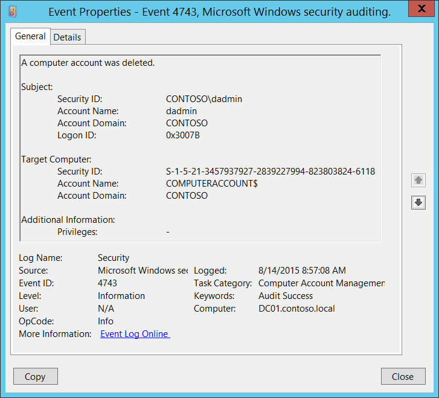

# 4743(S): コンピューターアカウントが削除されました。



***サブカテゴリ:***&nbsp;[コンピューターアカウント管理の監査](audit-computer-account-management.md)

***イベントの説明:***

このイベントは、コンピューターオブジェクトが削除されるたびに生成されます。

このイベントはドメインコントローラーでのみ生成されます。

> **注**&nbsp;&nbsp;推奨事項については、このイベントの[セキュリティ監視の推奨事項](#security-monitoring-recommendations)を参照してください。

<br clear="all">

***イベント XML:***
```xml
- <Event xmlns="http://schemas.microsoft.com/win/2004/08/events/event">
- <System>
 <Provider Name="Microsoft-Windows-Security-Auditing" Guid="{54849625-5478-4994-A5BA-3E3B0328C30D}" /> 
 <EventID>4743</EventID> 
 <Version>0</Version> 
 <Level>0</Level> 
 <Task>13825</Task> 
 <Opcode>0</Opcode> 
 <Keywords>0x8020000000000000</Keywords> 
 <TimeCreated SystemTime="2015-08-14T15:57:08.104214100Z" /> 
 <EventRecordID>172103</EventRecordID> 
 <Correlation /> 
 <Execution ProcessID="520" ThreadID="1108" /> 
 <Channel>Security</Channel> 
 <Computer>DC01.contoso.local</Computer> 
 <Security /> 
 </System>
- <EventData>
 <Data Name="TargetUserName">COMPUTERACCOUNT$</Data> 
 <Data Name="TargetDomainName">CONTOSO</Data> 
 <Data Name="TargetSid">S-1-5-21-3457937927-2839227994-823803824-6118</Data> 
 <Data Name="SubjectUserSid">S-1-5-21-3457937927-2839227994-823803824-1104</Data> 
 <Data Name="SubjectUserName">dadmin</Data> 
 <Data Name="SubjectDomainName">CONTOSO</Data> 
 <Data Name="SubjectLogonId">0x3007b</Data> 
 <Data Name="PrivilegeList">-</Data> 
 </EventData>
 </Event>

```

***必要なサーバーロール:*** Active Directory ドメインコントローラー。

***最小 OS バージョン:*** Windows Server 2008。

***イベントバージョン:*** 0。

***フィールドの説明:***

**サブジェクト:**

-   **セキュリティ ID** \[タイプ = SID\]**:** 「コンピューターオブジェクトの削除」操作を要求したアカウントの SID。イベントビューアーは自動的に SID を解決し、アカウント名を表示しようとします。SID を解決できない場合、イベントにはソースデータが表示されます。

> **注**&nbsp;&nbsp;**セキュリティ識別子 (SID)** は、トラスティ (セキュリティプリンシパル) を識別するために使用される可変長の一意の値です。各アカウントには、Active Directory ドメインコントローラーなどの権限によって発行され、セキュリティデータベースに保存される一意の SID があります。ユーザーがログオンするたびに、システムはデータベースからそのユーザーの SID を取得し、そのユーザーのアクセス トークンに配置します。システムはアクセス トークン内の SID を使用して、以降のすべての Windows セキュリティとのやり取りでユーザーを識別します。SID がユーザーまたはグループの一意の識別子として使用された場合、それは他のユーザーまたはグループを識別するために再利用されることはありません。SID の詳細については、[セキュリティ識別子](/windows/access-protection/access-control/security-identifiers)を参照してください。

-   **アカウント名** \[タイプ = UnicodeString\]**:** 「コンピュータオブジェクトの削除」操作を要求したアカウントの名前。

-   **アカウントドメイン** \[タイプ = UnicodeString\]**:** サブジェクトのドメイン名。形式は以下のように異なります：

    -   ドメイン NETBIOS 名の例: CONTOSO

    -   小文字の完全ドメイン名: contoso.local

    -   大文字の完全ドメイン名: CONTOSO.LOCAL

    -   LOCAL SERVICE や ANONYMOUS LOGON などの[よく知られたセキュリティプリンシパル](/windows/security/identity-protection/access-control/security-identifiers)の場合、このフィールドの値は「NT AUTHORITY」となります。

-   **ログオンID** \[タイプ = HexInt64\]**:** 16進数の値で、同じログオンIDを含む最近のイベントとこのイベントを関連付けるのに役立ちます。例えば、「[4624](event-4624.md): アカウントが正常にログオンされました。」

**ターゲットコンピュータ:**

-   **セキュリティID** \[タイプ = SID\]**:** 削除されたコンピュータアカウントのSID。イベントビューアは自動的にSIDを解決し、アカウント名を表示しようとします。SIDが解決できない場合、イベントにはソースデータが表示されます。

-   **アカウント名** \[タイプ = UnicodeString\]**:** 削除されたコンピュータアカウントの名前。例: WIN81$

-   **アカウントドメイン** \[タイプ = UnicodeString\]**:** 削除されたコンピュータアカウントのドメイン名。形式は以下のように異なります：

    -   ドメイン NETBIOS 名の例: CONTOSO

    -   小文字の完全ドメイン名: contoso.local

    -   大文字の完全ドメイン名: CONTOSO.LOCAL

**追加情報:**

-   **特権** \[タイプ = UnicodeString\]: 操作中に使用されたユーザー特権のリスト。例: SeBackupPrivilege。このパラメータはイベントにキャプチャされない場合があり、その場合は「-」と表示されます。ユーザー特権の完全なリストは「表8. ユーザー特権」を参照してください。

## セキュリティ監視の推奨事項

4743(S): コンピュータアカウントが削除されました。

> **重要**&nbsp;&nbsp;このイベントについては、[付録A: 多くの監査イベントに対するセキュリティ監視の推奨事項](appendix-a-security-monitoring-recommendations-for-many-audit-events.md)も参照してください。

-   重要なドメインコンピューターアカウント（データベースサーバー、ドメインコントローラー、管理ワークステーションなど）があり、それぞれのアクション（特に削除）を監視する必要がある場合は、高価値のアカウントに対応する**「Target Computer\\Security ID」**または**「Target Computer\\Account Name」**でこのイベントを監視します。
