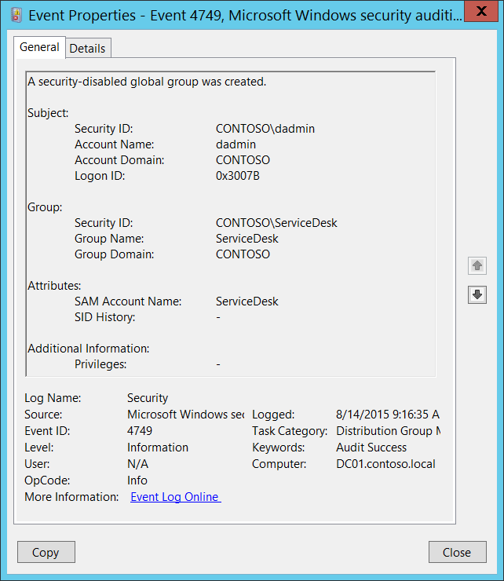

# 4749(S): セキュリティ無効のグローバルグループが作成されました。



***サブカテゴリ:***&nbsp;[配布グループ管理の監査](audit-distribution-group-management.md)

***イベントの説明:***

このイベントは、新しいセキュリティ無効（配布）グローバルグループが作成されるたびに生成されます。

このイベントはドメインコントローラーでのみ生成されます。

> **注**&nbsp;&nbsp;推奨事項については、このイベントの[セキュリティ監視の推奨事項](#security-monitoring-recommendations)を参照してください。

<br clear="all">

***イベント XML:***
```xml
- <Event xmlns="http://schemas.microsoft.com/win/2004/08/events/event">
- <System>
 <Provider Name="Microsoft-Windows-Security-Auditing" Guid="{54849625-5478-4994-A5BA-3E3B0328C30D}" /> 
 <EventID>4749</EventID> 
 <Version>0</Version> 
 <Level>0</Level> 
 <Task>13827</Task> 
 <Opcode>0</Opcode> 
 <Keywords>0x8020000000000000</Keywords> 
 <TimeCreated SystemTime="2015-08-14T16:16:35.568878700Z" /> 
 <EventRecordID>172181</EventRecordID> 
 <Correlation /> 
 <Execution ProcessID="520" ThreadID="1108" /> 
 <Channel>Security</Channel> 
 <Computer>DC01.contoso.local</Computer> 
 <Security /> 
 </System>
- <EventData>
 <Data Name="TargetUserName">ServiceDesk</Data> 
 <Data Name="TargetDomainName">CONTOSO</Data> 
 <Data Name="TargetSid">S-1-5-21-3457937927-2839227994-823803824-6119</Data> 
 <Data Name="SubjectUserSid">S-1-5-21-3457937927-2839227994-823803824-1104</Data> 
 <Data Name="SubjectUserName">dadmin</Data> 
 <Data Name="SubjectDomainName">CONTOSO</Data> 
 <Data Name="SubjectLogonId">0x3007b</Data> 
 <Data Name="PrivilegeList">-</Data> 
 <Data Name="SamAccountName">ServiceDesk</Data> 
 <Data Name="SidHistory">-</Data> 
 </EventData>
 </Event>

```

***必要なサーバー役割:*** Active Directory ドメインコントローラー。

***最小 OS バージョン:*** Windows Server 2008。

***イベントバージョン:*** 0。

***フィールドの説明:***

**サブジェクト:**

-   **セキュリティ ID** \[タイプ = SID\]**:** 「グループ作成」操作を要求したアカウントの SID。イベントビューアーは自動的に SID を解決してアカウント名を表示しようとします。SID を解決できない場合、イベントにソースデータが表示されます。

> **注**&nbsp;&nbsp;**セキュリティ識別子 (SID)** は、トラスティ（セキュリティプリンシパル）を識別するために使用される可変長の一意の値です。各アカウントには、Active Directory ドメインコントローラーなどの権限によって発行され、セキュリティデータベースに保存される一意の SID があります。ユーザーがログオンするたびに、システムはデータベースからそのユーザーの SID を取得し、そのユーザーのアクセス トークンに配置します。システムは、アクセス トークン内の SID を使用して、以降のすべての Windows セキュリティとのやり取りでユーザーを識別します。SID がユーザーまたはグループの一意の識別子として使用された場合、それは他のユーザーまたはグループを識別するために再利用されることはありません。SID の詳細については、[セキュリティ識別子](/windows/access-protection/access-control/security-identifiers)を参照してください。

-   **アカウント名** \[タイプ = UnicodeString\]**:** 「グループ作成」操作を要求したアカウントの名前。

-   **アカウントドメイン** \[タイプ = UnicodeString\]**:** サブジェクトのドメイン名。形式はさまざまで、以下のようなものが含まれます：

    -   ドメイン NETBIOS 名の例: CONTOSO

    -   小文字の完全なドメイン名: contoso.local

    -   大文字の完全なドメイン名: CONTOSO.LOCAL

    -   LOCAL SERVICE や ANONYMOUS LOGON などの[よく知られたセキュリティプリンシパル](/windows/security/identity-protection/access-control/security-identifiers)の場合、このフィールドの値は「NT AUTHORITY」となります。

-   **ログオンID** \[タイプ = HexInt64\]**:** 16進数の値で、同じログオンIDを含む最近のイベントとこのイベントを関連付けるのに役立ちます。例えば、「[4624](event-4624.md): アカウントが正常にログオンされました。」

**グループ:**

-   **セキュリティID** \[タイプ = SID\]**:** 作成されたグループのSID。イベントビューアーは自動的にSIDを解決してグループ名を表示しようとします。SIDが解決できない場合、イベントにはソースデータが表示されます。

-   **グループ名** \[タイプ = UnicodeString\]**:** 作成されたグループの名前。例: ServiceDesk

-   **グループドメイン** \[タイプ = UnicodeString\]**:** 作成されたグループのドメイン名。形式はさまざまで、以下のようなものが含まれます：

    -   ドメイン NETBIOS 名の例: CONTOSO

    -   小文字の完全なドメイン名: contoso.local

    -   大文字の完全なドメイン名: CONTOSO.LOCAL

**属性:**

-   **SAM アカウント名** \[タイプ = UnicodeString\]: これは、新しいグループの名前で、以前のバージョンの Windows（Windows 2000 以前のログオン名）をサポートするために使用されます。新しいグループオブジェクトの **sAMAccountName** 属性の値。例: ServiceDesk

-   **SID 履歴** \[タイプ = UnicodeString\]: オブジェクトが別のドメインから移動された場合に使用された以前のSIDを含みます。オブジェクトがあるドメインから別のドメインに移動されるたびに、新しいSIDが作成され、objectSID になります。以前のSIDは **sIDHistory** プロパティに追加されます。このパラメータには、新しいグループオブジェクトの **sIDHistory** 属性の値が含まれます。このパラメータはイベントでキャプチャされない場合があり、その場合は「-」として表示されます。

**追加情報:**

-   **特権** \[Type = UnicodeString\]: 操作中に使用されたユーザー特権のリスト。例えば、SeBackupPrivilege。このパラメータはイベントでキャプチャされない場合があり、その場合は「-」として表示されます。ユーザー特権の完全なリストについては、「表8. ユーザー特権」を参照してください。

## セキュリティ監視の推奨事項

4749(S): セキュリティ無効化グローバルグループが作成されました。

> **重要**&nbsp;&nbsp;このイベントについては、[付録A: 多くの監査イベントに対するセキュリティ監視の推奨事項](appendix-a-security-monitoring-recommendations-for-many-audit-events.md)も参照してください。

-   新しい配布グループが作成されるたびに、誰がいつグループを作成したかを確認する必要がある場合、このイベントを監視します。通常、このイベントは必要に応じてレビューされる情報イベントとして使用されます。

-   組織がアカウント名の命名規則を持っている場合、「**Attributes\\SAM Account Name**」を監視し、命名規則に従わない名前を確認します。
