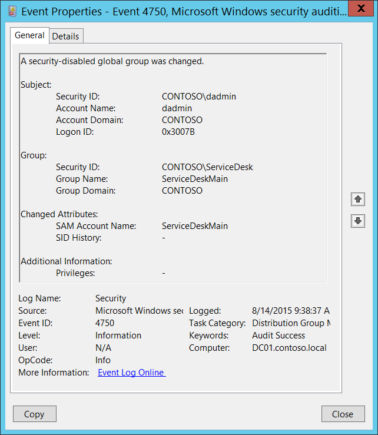

# 4750(S): セキュリティ無効のグローバルグループが変更されました。



***サブカテゴリ:***&nbsp;[配布グループ管理の監査](audit-distribution-group-management.md)

***イベントの説明:***

このイベントは、セキュリティ無効（配布）グローバルグループが変更されるたびに生成されます。

このイベントはドメインコントローラーでのみ生成されます。

いくつかの変更は 4750 イベントを呼び出しません。たとえば、グループアカウントプロパティの **管理者** タブで Active Directory ユーザーとコンピューター管理コンソールを使用して行われた変更などです。

グループの名前（SAM アカウント名）を変更すると、「[4781](event-4781.md): アカウントの名前が変更されました」が生成されます。「[ユーザーアカウント管理の監査](audit-user-account-management.md)」サブカテゴリの成功監査が有効になっている場合です。

グループの種類を変更すると、4750 の代わりに新しいグループタイプ監査サブカテゴリから変更イベントが生成されます。グループタイプの変更を監視する必要がある場合は、「[4764](event-4764.md): グループの種類が変更されました」を監視する方が良いです。これらのイベントは、グループタイプが変更されたときに任意のグループタイプに対して生成されます。「[セキュリティグループ管理の監査](audit-security-group-management.md)」サブカテゴリの成功監査が有効になっている必要があります。

4750 イベントからは、**sAMAccountName** および **sIDHistory** 属性の変更に関する情報を取得するか、何かが変更されたことを確認できますが、具体的に何が変更されたかは確認できません。

> **注**&nbsp;&nbsp;推奨事項については、このイベントの[セキュリティ監視の推奨事項](#security-monitoring-recommendations)を参照してください。

<br clear="all">

***イベント XML:***
```xml
- <Event xmlns="http://schemas.microsoft.com/win/2004/08/events/event">
- <System>
 <Provider Name="Microsoft-Windows-Security-Auditing" Guid="{54849625-5478-4994-A5BA-3E3B0328C30D}" /> 
 <EventID>4750</EventID> 
 <Version>0</Version> 
 <Level>0</Level> 
 <Task>13827</Task> 
 <Opcode>0</Opcode> 
 <Keywords>0x8020000000000000</Keywords> 
 <TimeCreated SystemTime="2015-08-14T16:38:37.902710700Z" /> 
 <EventRecordID>172188</EventRecordID> 
 <Correlation /> 
 <Execution ProcessID="520" ThreadID="1108" /> 
 <Channel>Security</Channel> 
 <Computer>DC01.contoso.local</Computer> 
 <Security /> 
 </System>
- <EventData>
 <Data Name="TargetUserName">ServiceDeskMain</Data> 
 <Data Name="TargetDomainName">CONTOSO</Data> 
 <Data Name="TargetSid">S-1-5-21-3457937927-2839227994-823803824-6119</Data> 
 <Data Name="SubjectUserSid">S-1-5-21-3457937927-2839227994-823803824-1104</Data> 
 <Data Name="SubjectUserName">dadmin</Data> 
 <Data Name="SubjectDomainName">CONTOSO</Data> 
 <Data Name="SubjectLogonId">0x3007b</Data> 
 <Data Name="PrivilegeList">-</Data> 
 <Data Name="SamAccountName">ServiceDeskMain</Data> 
 <Data Name="SidHistory">-</Data> 
 </EventData>
 </Event>
```

***必要なサーバーロール:*** Active Directory ドメインコントローラー。

***最小 OS バージョン:*** Windows Server 2008。

***イベントバージョン:*** 0。

***フィールドの説明:***

**サブジェクト:**

-   **セキュリティ ID** \[タイプ = SID\]**:** 「グループ変更」操作を要求したアカウントの SID。イベントビューアーは自動的に SID を解決し、アカウント名を表示しようとします。SID が解決できない場合、イベントにはソースデータが表示されます。

> **注**&nbsp;&nbsp;**セキュリティ識別子 (SID)** は、トラスティ (セキュリティプリンシパル) を識別するために使用される可変長の一意の値です。各アカウントには、Active Directory ドメインコントローラーなどの権限によって発行され、セキュリティデータベースに保存される一意の SID があります。ユーザーがログオンするたびに、システムはデータベースからそのユーザーの SID を取得し、そのユーザーのアクセス トークンに配置します。システムは、アクセス トークン内の SID を使用して、以降のすべての Windows セキュリティとのやり取りでユーザーを識別します。SID がユーザーまたはグループの一意の識別子として使用された場合、それは他のユーザーまたはグループを識別するために再利用されることはありません。SID の詳細については、[セキュリティ識別子](/windows/access-protection/access-control/security-identifiers) を参照してください。

-   **アカウント名** \[タイプ = UnicodeString\]**:** 「グループ変更」操作を要求したアカウントの名前。

-   **アカウント ドメイン** \[タイプ = UnicodeString\]**:** サブジェクトのドメイン名。形式はさまざまで、以下のものが含まれます:

    -   ドメイン NETBIOS 名の例: CONTOSO

    -   小文字の完全なドメイン名: contoso.local

    -   大文字の完全なドメイン名: CONTOSO.LOCAL

    -   LOCAL SERVICE や ANONYMOUS LOGON などの[よく知られたセキュリティプリンシパル](/windows/security/identity-protection/access-control/security-identifiers)の場合、このフィールドの値は「NT AUTHORITY」となります。

-   **ログオン ID** \[タイプ = HexInt64\]**:** このイベントを、同じログオン ID を含む可能性のある最近のイベントと関連付けるのに役立つ 16 進数の値。例えば、「[4624](event-4624.md): アカウントが正常にログオンしました。」

**グループ:**

-   **セキュリティID** \[タイプ = SID\]**:** 変更されたグループのSID。イベントビューアーは自動的にSIDを解決し、グループ名を表示しようとします。SIDが解決できない場合、イベントにはソースデータが表示されます。

> **注**&nbsp;&nbsp;イベントビューアーの**グループ\\セキュリティID**フィールドに古いグループ名が表示されることがあります（イベントの例で確認できます）。これは、イベントビューアーが現在のセッションで既に解決したSIDの名前をキャッシュしているためです。
> 
> **注**&nbsp;&nbsp;**セキュリティID**フィールドは新しいグループ名（**変更された属性&gt;SAMアカウント名**）と同じ値を持ちます。これは、名前が変更された後にイベントが生成され、SIDが新しい名前に解決されるためです。クエリやイベントのフィルタリングにはグループ名の代わりにSIDを使用する方が常に良いです。なぜなら、探しているオブジェクトや監視したいオブジェクトが確実に正しいことがわかるからです。

-   **グループ名** \[タイプ = UnicodeString\]**:** 変更されたグループの名前。例: ServiceDesk

-   **グループドメイン** \[タイプ = UnicodeString\]**:** 変更されたグループのドメイン名。形式はさまざまで、以下のようなものがあります:

    -   ドメインNETBIOS名の例: CONTOSO

    -   小文字の完全ドメイン名: contoso.local

    -   大文字の完全ドメイン名: CONTOSO.LOCAL

    -   [組み込みグループ](/previous-versions/windows/it-pro/windows-server-2008-R2-and-2008/dn169025(v=ws.10)): Builtin

**変更された属性:**

> **注**&nbsp;&nbsp;属性が変更されていない場合、「-」の値を持ちます。
> 
> **注**&nbsp;&nbsp;変更がない4750イベントを見ることがあります。つまり、すべての**変更された属性**が「-」として表示される場合です。これは、イベントにリストされていない属性が変更された場合に通常発生します。この場合、どの属性が変更されたかを特定する方法はありません。例えば、Active Directoryユーザーとコンピューター管理コンソールを使用してグループオブジェクトの説明を変更した場合に発生します。また、[任意アクセス制御リスト](/windows/win32/secauthz/access-control-lists) (DACL) が変更された場合、4750イベントが生成されますが、すべての属性は「-」となります。

-   **SAM アカウント名** \[タイプ = UnicodeString\]: これは、以前のバージョンの Windows クライアントおよびサーバーをサポートするために変更されたグループの新しい名前です (Windows 2000 以前のログオン名)。グループオブジェクトの **sAMAccountName** 属性の値が変更された場合、ここに新しい値が表示されます。例: ServiceDesk。

-   **SID 履歴** \[タイプ = UnicodeString\]: オブジェクトが別のドメインから移動された場合に使用された以前の SID を含みます。オブジェクトがあるドメインから別のドメインに移動されるたびに、新しい SID が作成され、objectSID になります。以前の SID は **sIDHistory** プロパティに追加されます。グループオブジェクトの **sIDHistory** 属性の値が変更された場合、ここに新しい値が表示されます。

**追加情報:**

-   **特権** \[タイプ = UnicodeString\]: 操作中に使用されたユーザー特権のリスト。例: SeBackupPrivilege。このパラメータはイベントでキャプチャされない場合があり、その場合は「-」として表示されます。ユーザー特権の完全なリストは「表 8. ユーザー特権」を参照してください。

## セキュリティ監視の推奨事項

4750(S): セキュリティ無効のグローバルグループが変更されました。

> **重要**&nbsp;&nbsp;このイベントについては、[付録 A: 多くの監査イベントのセキュリティ監視の推奨事項](appendix-a-security-monitoring-recommendations-for-many-audit-events.md)も参照してください。

-   組織内の重要な配布グループのリストがあり、これらのグループの変更を特に監視する必要がある場合は、重要な配布グループに対応する「**Group\\Group Name**」の値を持つイベントを監視します。

-   配布グループにメンバーが追加されるたびに、誰がいつメンバーを追加したかを監視する必要がある場合は、このイベントを監視します。通常、このイベントは情報提供のためのイベントとして使用され、必要に応じてレビューされます。

-   組織にアカウント名の命名規則がある場合、命名規則に従わない名前について「**Attributes\\SAM Account Name**」を監視します。
