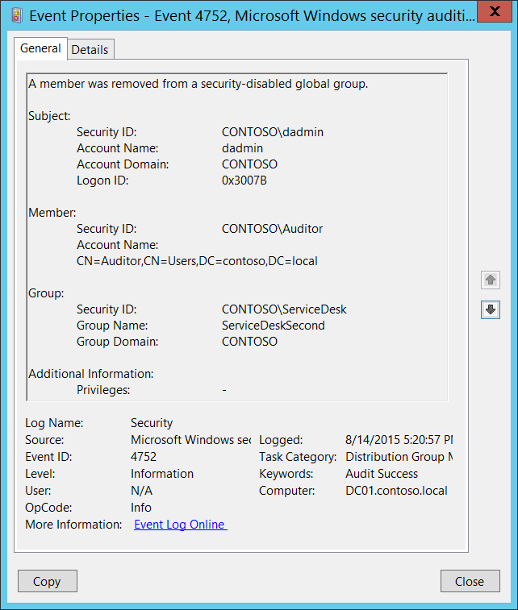

# 4752(S): セキュリティ無効のグローバル グループからメンバーが削除されました。



***サブカテゴリ:***&nbsp;[配布グループ管理の監査](audit-distribution-group-management.md)

***イベントの説明:***

このイベントは、セキュリティ無効（配布）グローバル グループからメンバーが削除されるたびに生成されます。

このイベントはドメイン コントローラーでのみ生成されます。

削除されたメンバーごとに別々の4752イベントが生成されます。

> **注**&nbsp;&nbsp;推奨事項については、このイベントの[セキュリティ監視の推奨事項](#security-monitoring-recommendations)を参照してください。

<br clear="all">

***イベント XML:***
```
- <Event xmlns="http://schemas.microsoft.com/win/2004/08/events/event">
- <System>
 <Provider Name="Microsoft-Windows-Security-Auditing" Guid="{54849625-5478-4994-A5BA-3E3B0328C30D}" /> 
 <EventID>4752</EventID> 
 <Version>0</Version> 
 <Level>0</Level> 
 <Task>13827</Task> 
 <Opcode>0</Opcode> 
 <Keywords>0x8020000000000000</Keywords> 
 <TimeCreated SystemTime="2015-08-15T00:20:57.315863900Z" /> 
 <EventRecordID>172229</EventRecordID> 
 <Correlation /> 
 <Execution ProcessID="520" ThreadID="1108" /> 
 <Channel>Security</Channel> 
 <Computer>DC01.contoso.local</Computer> 
 <Security /> 
 </System>
- <EventData>
 <Data Name="MemberName">CN=Auditor,CN=Users,DC=contoso,DC=local</Data> 
 <Data Name="MemberSid">S-1-5-21-3457937927-2839227994-823803824-2104</Data> 
 <Data Name="TargetUserName">ServiceDeskSecond</Data> 
 <Data Name="TargetDomainName">CONTOSO</Data> 
 <Data Name="TargetSid">S-1-5-21-3457937927-2839227994-823803824-6119</Data> 
 <Data Name="SubjectUserSid">S-1-5-21-3457937927-2839227994-823803824-1104</Data> 
 <Data Name="SubjectUserName">dadmin</Data> 
 <Data Name="SubjectDomainName">CONTOSO</Data> 
 <Data Name="SubjectLogonId">0x3007b</Data> 
 <Data Name="PrivilegeList">-</Data> 
 </EventData>
 </Event>
```

***必要なサーバー ロール:*** Active Directory ドメイン コントローラー。

***最小 OS バージョン:*** Windows Server 2008。

***イベント バージョン:*** 0。

***フィールドの説明:***

**サブジェクト:**

-   **セキュリティ ID** \[タイプ = SID\]**:** 「グループからメンバーを削除する」操作を要求したアカウントのSID。イベント ビューアーは自動的にSIDを解決し、アカウント名を表示しようとします。SIDを解決できない場合、イベントにはソース データが表示されます。

> **注**&nbsp;&nbsp;**セキュリティ識別子 (SID)** は、トラスティ (セキュリティ プリンシパル) を識別するために使用される可変長の一意の値です。各アカウントには、Active Directory ドメイン コントローラーなどの権限によって発行され、セキュリティ データベースに保存される一意のSIDがあります。ユーザーがログオンするたびに、システムはデータベースからそのユーザーのSIDを取得し、そのユーザーのアクセストークンに配置します。システムはアクセストークン内のSIDを使用して、以降のすべてのWindowsセキュリティとのやり取りでユーザーを識別します。ユーザーまたはグループの一意の識別子としてSIDが使用された場合、それは他のユーザーまたはグループを識別するために再利用されることはありません。SIDの詳細については、[セキュリティ識別子](/windows/access-protection/access-control/security-identifiers)を参照してください。

-   **アカウント名** \[タイプ = UnicodeString\]**:** 「グループからメンバーを削除する」操作を要求したアカウントの名前。

-   **アカウントドメイン** \[タイプ = UnicodeString\]**:** サブジェクトのドメイン名。形式は様々で、以下のようなものがあります：

    -   ドメイン NETBIOS 名の例: CONTOSO

    -   小文字の完全ドメイン名: contoso.local

    -   大文字の完全ドメイン名: CONTOSO.LOCAL

    -   LOCAL SERVICE や ANONYMOUS LOGON などの[よく知られたセキュリティプリンシパル](/windows/security/identity-protection/access-control/security-identifiers)の場合、このフィールドの値は「NT AUTHORITY」となります。

-   **ログオンID** \[タイプ = HexInt64\]**:** 16進数の値で、同じログオンIDを含む最近のイベントとこのイベントを関連付けるのに役立ちます。例えば、「[4624](event-4624.md): アカウントが正常にログオンされました。」

**メンバー:**

-   **セキュリティID** \[タイプ = SID\]**:** グループから削除されたアカウントのSID。イベントビューアーは自動的にSIDを解決してグループ名を表示しようとします。SIDが解決できない場合、イベントにはソースデータが表示されます。

-   **アカウント名** \[タイプ = UnicodeString\]: グループから削除されたアカウントの識別名。例えば、「CN=Auditor,CN=Users,DC=contoso,DC=local」。LOCAL SERVICE や ANONYMOUS LOGON などの[よく知られたセキュリティプリンシパル](/windows/security/identity-protection/access-control/security-identifiers)の場合、このフィールドの値は「-」となります。

> **注**&nbsp;&nbsp;LDAP API は LDAP オブジェクトをその**識別名 (DN)** で参照します。DN はカンマで接続された相対識別名 (RDN) のシーケンスです。
> 
> RDN は属性とその値の形式 attribute=value; で構成されます。以下は RDN 属性の例です：
> 
> • DC - domainComponent
> 
> • CN - commonName
> 
> • OU - organizationalUnitName
> 
> • O - organizationName

**グループ:**

-   **セキュリティID** \[タイプ = SID\]**:** メンバーが削除されたグループのSID。イベントビューアーは自動的にSIDを解決してグループ名を表示しようとします。SIDが解決できない場合、イベントにはソースデータが表示されます。

-   **グループ名** \[タイプ = UnicodeString\]**:** メンバーが削除されたグループの名前。例: ServiceDesk

-   **グループドメイン** \[タイプ = UnicodeString\]**:** メンバーが削除されたグループのドメイン名。形式は以下のように異なります:

    -   ドメイン NETBIOS 名の例: CONTOSO

    -   小文字の完全ドメイン名: contoso.local

    -   大文字の完全ドメイン名: CONTOSO.LOCAL

    -   [組み込みグループ](/previous-versions/windows/it-pro/windows-server-2008-R2-and-2008/dn169025(v=ws.10)): Builtin

**追加情報:**

-   **特権** \[タイプ = UnicodeString\]: 操作中に使用されたユーザー特権のリスト。例: SeBackupPrivilege。このパラメータはイベントでキャプチャされない場合があり、その場合は「-」として表示されます。ユーザー特権の完全なリストは「表8. ユーザー特権」を参照してください。

## セキュリティ監視の推奨事項

4752(S): セキュリティ無効のグローバルグループからメンバーが削除されました。

| **必要な監視の種類**                                                                                                                                                                                                                                                                                   | **推奨事項**                                                                                                                                                                                                                      |
|-------------------------------------------------------------------------------------------------------------------------------------------------------------------------------------------------------------------------------------------------------------------------------------------------------------------|-----------------------------------------------------------------------------------------------------------------------------------------------------------------------------------------------------------------------------------------|
| **配布グループからのメンバー削除:** 配布グループからのメンバー削除を監視する必要があるかもしれません。                                                                                                                                                                                       | 配布グループからメンバーが削除されるたびに、誰がいつ削除したかを確認するためにこのイベントを監視します。<br>通常、このイベントは情報提供イベントとして使用され、必要に応じてレビューされます。 |
| **高価値の配布グループ:** 組織内の重要な配布グループのリストがあり、これらのグループのメンバー削除（またはその他の変更）を特に監視する必要があるかもしれません。                                                                                                   | 高価値の配布グループに対応する「**グループ\\グループ名**」の値でこのイベントを監視します。                                                                                                                       |
| **必須メンバーを持つ配布グループ**: 特定の配布グループに対して、特定のメンバーが削除されないことを確認する必要があるかもしれません。                                                                                                                                                               | 関心のあるグループに対応する「**グループ\\グループ名**」および削除されるべきでないメンバーの「**メンバー\\セキュリティID**」でこのイベントを監視します。                                                              |
| **高価値のアカウント**: 各アクションを監視する必要がある高価値のドメインまたはローカルアカウントがあるかもしれません。<br>高価値のアカウントの例としては、データベース管理者、組み込みのローカル管理者アカウント、ドメイン管理者、サービスアカウント、ドメインコントローラーアカウントなどがあります。 | 高価値のアカウントまたはアカウントに対応する「**サブジェクト\\セキュリティID**」および「**メンバー\\セキュリティID**」でこのイベントを監視します。                                                                                             |
| **異常または悪意のある行動**: 異常を検出するため、または潜在的な悪意のある行動を監視するための特定の要件があるかもしれません。例えば、勤務時間外のアカウント使用を監視する必要があるかもしれません。                                                                                | 異常または悪意のある行動を監視する場合、特定のアカウントがどのようにまたはいつ使用されているかを監視するために「**サブジェクト\\セキュリティID**」（およびその他の情報）を使用します。                                                             |
| **非アクティブアカウント**: 非アクティブ、無効、またはゲストアカウント、または使用されるべきでない他のアカウントがあるかもしれません。                                                                                                                                                                                     | 使用されるべきでないアカウントに対応する「**サブジェクト\\セキュリティID**」および「**メンバー\\セキュリティID**」でこのイベントを監視します。                                                                                         |
| **アカウント許可リスト**: 特定のイベントに対応するアクションを実行することが許可されているアカウントの特定の許可リストがあるかもしれません。                                                                                                                                                      | このイベントが「許可リストのみ」のアクションに対応する場合、許可リスト外のアカウントに対して「**サブジェクト\\セキュリティID**」を確認します。                                                                                              |
| **異なる種類のアカウント**: 特定のアクションが特定のアカウント種類（例: ローカルまたはドメインアカウント、マシンまたはユーザーアカウント、ベンダーまたは従業員アカウントなど）によってのみ実行されることを確認したいかもしれません。                                                                                 | このイベントが特定のアカウント種類に対して監視したいアクションに対応する場合、「**サブジェクト\\セキュリティID**」を確認してアカウント種類が期待通りであるかを確認します。                                                             |
| **外部アカウント**: 別のドメインからのアカウント、または特定のアクション（特定のイベントによって表される）を実行することが許可されていない「外部」アカウントを監視しているかもしれません。                                                                                                                     | 別のドメインからのアカウントまたは「外部」アカウントに対応する「**サブジェクト\\アカウントドメイン**」に対してこのイベントを監視します。                                                                                                          |
| **使用制限のあるコンピュータまたはデバイス**: 特定の人（アカウント）が通常はアクションを実行しない特定のコンピュータ、マシン、またはデバイスがあるかもしれません。                                                                                                                                      | 関心のある「**サブジェクト\\セキュリティID**」によって実行されたアクションに対してターゲット「コンピュータ:」（または他のターゲットデバイス）を監視します。                                                                                         |
| **アカウント命名規則**: 組織にはアカウント名に対する特定の命名規則があるかもしれません。                                                                                                                                                                                                       | 命名規則に従わない名前に対して「**サブジェクト\\アカウント名**」を監視します。                                                                                                                                                |
