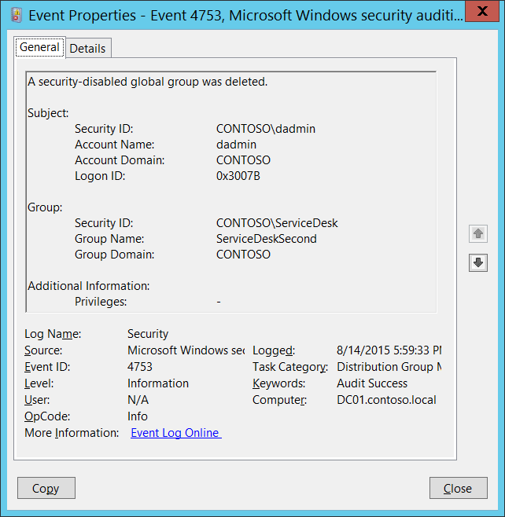

# 4753(S): セキュリティ無効のグローバルグループが削除されました。




***サブカテゴリ:***&nbsp;[配布グループ管理の監査](audit-distribution-group-management.md)

***イベントの説明:***

このイベントは、セキュリティ無効（配布）グローバルグループが削除されるたびに生成されます。

このイベントはドメインコントローラーでのみ生成されます。

> **注**&nbsp;&nbsp;推奨事項については、このイベントの[セキュリティ監視の推奨事項](#security-monitoring-recommendations)を参照してください。

<br clear="all">

***イベント XML:***
```xml
- <Event xmlns="http://schemas.microsoft.com/win/2004/08/events/event">
- <System>
 <Provider Name="Microsoft-Windows-Security-Auditing" Guid="{54849625-5478-4994-A5BA-3E3B0328C30D}" /> 
 <EventID>4753</EventID> 
 <Version>0</Version> 
 <Level>0</Level> 
 <Task>13827</Task> 
 <Opcode>0</Opcode> 
 <Keywords>0x8020000000000000</Keywords> 
 <TimeCreated SystemTime="2015-08-15T00:59:33.621155200Z" /> 
 <EventRecordID>172230</EventRecordID> 
 <Correlation /> 
 <Execution ProcessID="520" ThreadID="1504" /> 
 <Channel>Security</Channel> 
 <Computer>DC01.contoso.local</Computer> 
 <Security /> 
 </System>
- <EventData>
 <Data Name="TargetUserName">ServiceDeskSecond</Data> 
 <Data Name="TargetDomainName">CONTOSO</Data> 
 <Data Name="TargetSid">S-1-5-21-3457937927-2839227994-823803824-6119</Data> 
 <Data Name="SubjectUserSid">S-1-5-21-3457937927-2839227994-823803824-1104</Data> 
 <Data Name="SubjectUserName">dadmin</Data> 
 <Data Name="SubjectDomainName">CONTOSO</Data> 
 <Data Name="SubjectLogonId">0x3007b</Data> 
 <Data Name="PrivilegeList">-</Data> 
 </EventData>
 </Event>

```

***必要なサーバーロール:*** Active Directory ドメインコントローラー。

***最小 OS バージョン:*** Windows Server 2008。

***イベントバージョン:*** 0。

***フィールドの説明:***

**サブジェクト:**

-   **セキュリティ ID** \[タイプ = SID\]**:** 「グループ削除」操作を要求したアカウントの SID。イベントビューアーは自動的に SID を解決し、アカウント名を表示しようとします。SID を解決できない場合、イベントにはソースデータが表示されます。

> **注**&nbsp;&nbsp;**セキュリティ識別子 (SID)** は、トラスティ（セキュリティプリンシパル）を識別するために使用される可変長の一意の値です。各アカウントには、Active Directory ドメインコントローラーなどの権限によって発行され、セキュリティデータベースに保存される一意の SID があります。ユーザーがログオンするたびに、システムはデータベースからそのユーザーの SID を取得し、そのユーザーのアクセストークンに配置します。システムはアクセストークン内の SID を使用して、以降のすべての Windows セキュリティとのやり取りでユーザーを識別します。SID がユーザーまたはグループの一意の識別子として使用された場合、それは他のユーザーまたはグループを識別するために再利用されることはありません。SID についての詳細は、[セキュリティ識別子](/windows/access-protection/access-control/security-identifiers)を参照してください。

-   **アカウント名** \[タイプ = UnicodeString\]**:** 「グループ削除」操作を要求したアカウントの名前。

-   **アカウントドメイン** \[タイプ = UnicodeString\]**:** サブジェクトのドメイン名。形式は様々で、以下のようなものが含まれます：

    -   ドメイン NETBIOS 名の例：CONTOSO

    -   小文字の完全なドメイン名：contoso.local

    -   大文字の完全なドメイン名：CONTOSO.LOCAL

    -   一部の[よく知られたセキュリティプリンシパル](/windows/security/identity-protection/access-control/security-identifiers)の場合、例えば LOCAL SERVICE や ANONYMOUS LOGON、このフィールドの値は「NT AUTHORITY」となります。

-   **ログオンID** \[タイプ = HexInt64\]**:** 16進数の値で、最近のイベントと同じログオンIDを含む可能性のあるイベントとこのイベントを関連付けるのに役立ちます。例えば、「[4624](event-4624.md): アカウントが正常にログオンされました。」

**グループ:**

-   **セキュリティID** \[タイプ = SID\]**:** 削除されたグループのSID。イベントビューアーは自動的にSIDを解決し、グループ名を表示しようとします。SIDが解決できない場合、イベントにはソースデータが表示されます。

-   **グループ名** \[タイプ = UnicodeString\]**:** 削除されたグループの名前。例えば：ServiceDesk

-   **グループドメイン** \[タイプ = UnicodeString\]**:** 削除されたグループのドメイン名。形式は様々で、以下のようなものが含まれます：

    -   ドメイン NETBIOS 名の例：CONTOSO

    -   小文字の完全なドメイン名：contoso.local

    -   大文字の完全なドメイン名：CONTOSO.LOCAL

    -   [組み込みグループ](/previous-versions/windows/it-pro/windows-server-2008-R2-and-2008/dn169025(v=ws.10))：Builtin

**追加情報:**

-   **特権** \[タイプ = UnicodeString\]: 操作中に使用されたユーザー特権のリスト。例えば、SeBackupPrivilege。このパラメータはイベントでキャプチャされない場合があり、その場合は「-」と表示されます。「表8. ユーザー特権」の完全なリストを参照してください。

## セキュリティ監視の推奨事項

4753(S): セキュリティ無効のグローバルグループが削除されました。

> **重要**&nbsp;&nbsp;このイベントについては、[付録A: 多くの監査イベントに対するセキュリティ監視の推奨事項](appendix-a-security-monitoring-recommendations-for-many-audit-events.md)も参照してください。

-   組織内の重要な配布グループのリストがあり、これらのグループの変更、特にグループの削除を特に監視する必要がある場合は、重要な配布グループに対応する「**Group\\Group Name**」の値を持つイベントを監視します。

-   配布グループが削除されるたびに、誰がいつ削除したかを確認する必要がある場合は、このイベントを監視します。通常、このイベントは必要に応じて確認する情報イベントとして使用されます。
