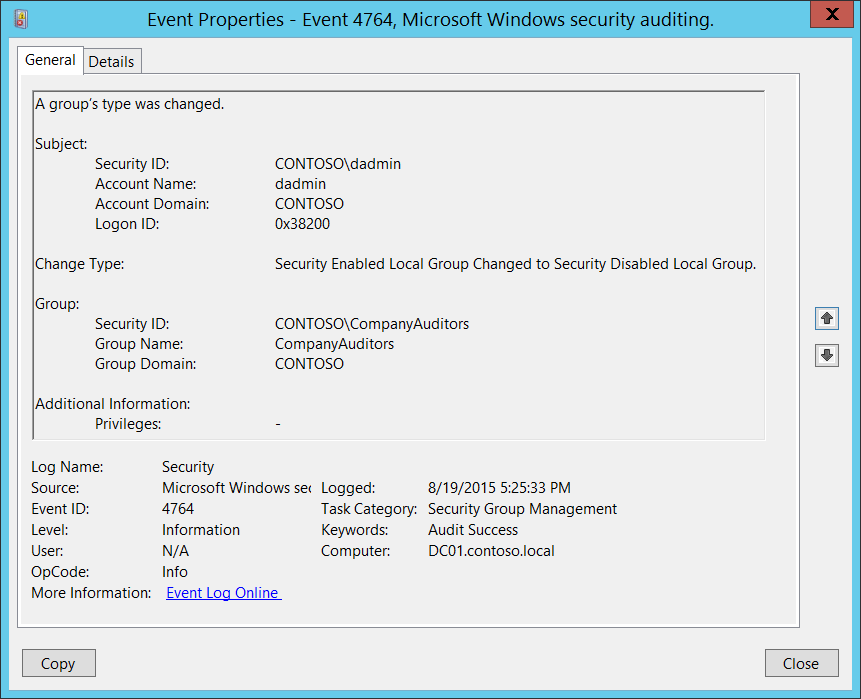

# 4764(S): グループの種類が変更されました。



***サブカテゴリ:***&nbsp;[セキュリティグループ管理の監査](audit-security-group-management.md)

***イベントの説明:***

このイベントは、グループの種類が変更されるたびに生成されます。

このイベントは、セキュリティグループと配布グループの両方に対して生成されます。

このイベントは、ドメインコントローラーでのみ生成されます。

> **注**&nbsp;&nbsp;推奨事項については、このイベントの[セキュリティ監視の推奨事項](#security-monitoring-recommendations)を参照してください。

<br clear="all">

***イベント XML:***
```xml
- <Event xmlns="http://schemas.microsoft.com/win/2004/08/events/event">
- <System>
 <Provider Name="Microsoft-Windows-Security-Auditing" Guid="{54849625-5478-4994-A5BA-3E3B0328C30D}" /> 
 <EventID>4764</EventID> 
 <Version>0</Version> 
 <Level>0</Level> 
 <Task>13826</Task> 
 <Opcode>0</Opcode> 
 <Keywords>0x8020000000000000</Keywords> 
 <TimeCreated SystemTime="2015-08-20T00:25:33.459568000Z" /> 
 <EventRecordID>175221</EventRecordID> 
 <Correlation /> 
 <Execution ProcessID="516" ThreadID="1072" /> 
 <Channel>Security</Channel> 
 <Computer>DC01.contoso.local</Computer> 
 <Security /> 
 </System>
- <EventData>
 <Data Name="GroupTypeChange">Security Enabled Local Group Changed to Security Disabled Local Group.</Data> 
 <Data Name="TargetUserName">CompanyAuditors</Data> 
 <Data Name="TargetDomainName">CONTOSO</Data> 
 <Data Name="TargetSid">S-1-5-21-3457937927-2839227994-823803824-6608</Data> 
 <Data Name="SubjectUserSid">S-1-5-21-3457937927-2839227994-823803824-1104</Data> 
 <Data Name="SubjectUserName">dadmin</Data> 
 <Data Name="SubjectDomainName">CONTOSO</Data> 
 <Data Name="SubjectLogonId">0x38200</Data> 
 <Data Name="PrivilegeList">-</Data> 
 </EventData>
 </Event>

```

***必要なサーバーの役割:*** Active Directory ドメインコントローラー。

***最小 OS バージョン:*** Windows Server 2008。

***イベントバージョン:*** 0。

***フィールドの説明:***

**サブジェクト:**

-   **セキュリティ ID** \[タイプ = SID\]**:** 「グループの種類を変更する」操作を要求したアカウントの SID。イベントビューアーは自動的に SID を解決してアカウント名を表示しようとします。SID を解決できない場合、イベントにはソースデータが表示されます。

> **注**&nbsp;&nbsp;**セキュリティ識別子 (SID)** は、トラスティ (セキュリティプリンシパル) を識別するために使用される可変長の一意の値です。各アカウントには、Active Directory ドメインコントローラーなどの権限によって発行され、セキュリティデータベースに保存される一意の SID があります。ユーザーがログオンするたびに、システムはデータベースからそのユーザーの SID を取得し、そのユーザーのアクセス トークンに配置します。システムは、アクセス トークン内の SID を使用して、以降のすべての Windows セキュリティとのやり取りでユーザーを識別します。SID がユーザーまたはグループの一意の識別子として使用された場合、それは他のユーザーまたはグループを識別するために再び使用されることはありません。SID の詳細については、[セキュリティ識別子](/windows/access-protection/access-control/security-identifiers)を参照してください。

-   **アカウント名** \[タイプ = UnicodeString\]**:** 「グループタイプの変更」操作を要求したアカウントの名前。

-   **アカウントドメイン** \[タイプ = UnicodeString\]**:** サブジェクトのドメインまたはコンピュータ名。形式はさまざまで、以下を含みます：

    -   ドメイン NETBIOS 名の例: CONTOSO

    -   小文字の完全ドメイン名: contoso.local

    -   大文字の完全ドメイン名: CONTOSO.LOCAL

    -   LOCAL SERVICE や ANONYMOUS LOGON などの[よく知られたセキュリティプリンシパル](/windows/security/identity-protection/access-control/security-identifiers)の場合、このフィールドの値は「NT AUTHORITY」となります。

    -   ローカルユーザーアカウントの場合、このフィールドにはこのアカウントが属するコンピュータまたはデバイスの名前が含まれます。例: 「Win81」。

-   **ログオンID** \[タイプ = HexInt64\]**:** 16進数の値で、同じログオンIDを含む最近のイベントとこのイベントを関連付けるのに役立ちます。例: 「[4624](event-4624.md): アカウントが正常にログオンされました。」

**変更タイプ** \[タイプ = UnicodeString\]**:** 「&lt;Param1&gt; **Changed To** &lt;Param2&gt;」の3つの部分で構成されます。これらの2つのパラメータは以下の値を持つことができます（同時に同じ値を持つことはできません）：

-   セキュリティ無効のローカルグループ

-   セキュリティ無効のユニバーサルグループ

-   セキュリティ無効のグローバルグループ

-   セキュリティ有効のローカルグループ

-   セキュリティ有効のユニバーサルグループ

-   セキュリティ有効のグローバルグループ

**グループ:**

-   **セキュリティID** \[タイプ = SID\]**:** 変更されたグループのSID。イベントビューアーは自動的にSIDを解決し、グループ名を表示しようとします。SIDが解決できない場合、イベントにはソースデータが表示されます。

-   **グループ名** \[タイプ = UnicodeString\]**:** タイプが変更されたグループの名前。例: ServiceDesk

-   **グループドメイン** \[タイプ = UnicodeString\]: 変更されたグループのドメインまたはコンピュータ名。形式はさまざまで、以下を含みます：

    -   ドメイン NETBIOS 名の例: CONTOSO

    -   小文字の完全ドメイン名: contoso.local

    -   大文字の完全ドメイン名: CONTOSO.LOCAL

-   ローカルグループの場合、このフィールドにはこの新しいグループが属するコンピュータの名前が含まれます。例えば、「Win81」のように。

-   [組み込みグループ](/previous-versions/windows/it-pro/windows-server-2008-R2-and-2008/dn169025(v=ws.10)): Builtin

**追加情報:**

-   **特権** \[Type = UnicodeString\]: 操作中に使用されたユーザー特権のリスト。例えば、SeBackupPrivilege。このパラメータはイベントでキャプチャされない場合があり、その場合は「-」として表示されます。ユーザー特権の完全なリストは「表8. ユーザー特権」を参照してください。

## セキュリティ監視の推奨事項

4764(S): グループの種類が変更されました。

> **重要**&nbsp;&nbsp;このイベントについては、[付録A: 多くの監査イベントに対するセキュリティ監視の推奨事項](appendix-a-security-monitoring-recommendations-for-many-audit-events.md)も参照してください。

-   組織内の重要なローカルまたはドメイングループのリストがあり、特にグループの種類の変更を監視する必要がある場合は、重要な配布グループに対応する「**Group\\Group Name**」値を持つイベントを監視します。重要なローカルまたはドメイングループの例としては、組み込みのローカル管理者グループ、ドメイン管理者、エンタープライズ管理者、重要な配布グループなどがあります。

-   任意のグループの種類が変更されるたびに、誰がいつ変更したかを監視する必要がある場合は、このイベントを監視します。通常、このイベントは情報提供のためのイベントとして使用され、必要に応じてレビューされます。
