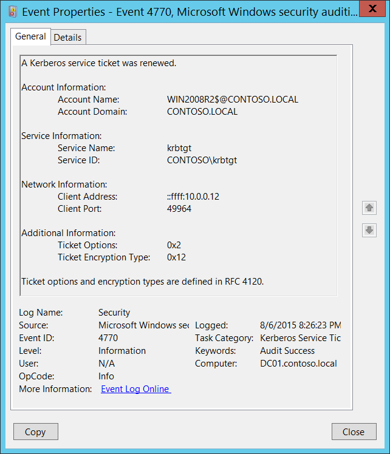

# 4770(S): Kerberos サービス チケットが更新されました。



***サブカテゴリ:***&nbsp;[Kerberos サービス チケット操作の監査](audit-kerberos-service-ticket-operations.md)

***イベントの説明:***

このイベントは、チケット グランティング サービス (TGS) チケットの更新ごとに生成されます。

このイベントは、ドメイン コントローラーでのみ生成されます。

> **注**&nbsp;&nbsp;推奨事項については、このイベントの[セキュリティ監視の推奨事項](#security-monitoring-recommendations)を参照してください。

<br clear="all">

***イベント XML:***
```xml
- <Event xmlns="http://schemas.microsoft.com/win/2004/08/events/event">
- <System>
 <Provider Name="Microsoft-Windows-Security-Auditing" Guid="{54849625-5478-4994-A5BA-3E3B0328C30D}" /> 
 <EventID>4770</EventID> 
 <Version>0</Version> 
 <Level>0</Level> 
 <Task>14337</Task> 
 <Opcode>0</Opcode> 
 <Keywords>0x8020000000000000</Keywords> 
 <TimeCreated SystemTime="2015-08-07T03:26:23.466552900Z" /> 
 <EventRecordID>166481</EventRecordID> 
 <Correlation /> 
 <Execution ProcessID="520" ThreadID="1084" /> 
 <Channel>Security</Channel> 
 <Computer>DC01.contoso.local</Computer> 
 <Security /> 
 </System>
- <EventData>
 <Data Name="TargetUserName">WIN2008R2$@CONTOSO.LOCAL</Data> 
 <Data Name="TargetDomainName">CONTOSO.LOCAL</Data> 
 <Data Name="ServiceName">krbtgt</Data> 
 <Data Name="ServiceSid">S-1-5-21-3457937927-2839227994-823803824-502</Data> 
 <Data Name="TicketOptions">0x2</Data> 
 <Data Name="TicketEncryptionType">0x12</Data> 
 <Data Name="IpAddress">::ffff:10.0.0.12</Data> 
 <Data Name="IpPort">49964</Data> 
 </EventData>
 </Event>
```

***必要なサーバー ロール:*** Active Directory ドメイン コントローラー。

***最小 OS バージョン:*** Windows Server 2008。

***イベント バージョン:*** 0。

***フィールドの説明:***

**アカウント情報:**

- **アカウント名** \[タイプ = UnicodeString\]**:** チケットの更新を要求したアカウントのユーザー プリンシパル名 (UPN)。コンピューター アカウント名は UPN で **$** 文字で終わります。このフィールドは通常、次の形式の値を持ちます: user\_account\_name@FULL\_DOMAIN\_NAME。

  - ユーザー アカウントの例: dadmin@CONTOSO.LOCAL

  - コンピューター アカウントの例: WIN81$@CONTOSO.LOCAL

    このイベントのこのパラメーターはオプションであり、場合によっては空であることがあります。

- **アカウント ドメイン** \[タイプ = UnicodeString\]**:** **アカウント名** が属する Kerberos 領域の名前。これは、次のようなさまざまな形式で表示されることがあります:

  -   ドメイン NETBIOS 名の例: CONTOSO

  -   小文字の完全なドメイン名: contoso.local

  -   大文字の完全なドメイン名: CONTOSO.LOCAL

      このイベントのこのパラメーターはオプションであり、場合によっては空であることがあります。

**サービス情報:**

-   **サービス名** \[タイプ = UnicodeString\]: TGSチケットが更新されたアカウントまたはコンピュータの名前。

    -   このイベントのこのパラメータはオプションであり、場合によっては空であることがあります。

-   **サービスID** \[タイプ = SID\]**:** TGSチケットが更新されたアカウントまたはコンピュータオブジェクトのSID。イベントビューアは自動的にSIDを解決し、アカウント名を表示しようとします。SIDが解決できない場合、イベントにはソースデータが表示されます。

> **注**&nbsp;&nbsp;**セキュリティ識別子 (SID)** は、信託者（セキュリティプリンシパル）を識別するために使用される可変長の一意の値です。各アカウントには、Active Directoryドメインコントローラなどの権限によって発行され、セキュリティデータベースに保存される一意のSIDがあります。ユーザーがログオンするたびに、システムはデータベースからそのユーザーのSIDを取得し、そのユーザーのアクセス トークンに配置します。システムは、以降のすべてのWindowsセキュリティとのやり取りでユーザーを識別するために、アクセス トークン内のSIDを使用します。ユーザーまたはグループの一意の識別子としてSIDが使用された場合、それは他のユーザーまたはグループを識別するために再利用されることはありません。SIDの詳細については、[セキュリティ識別子](/windows/access-protection/access-control/security-identifiers)を参照してください。

**ネットワーク情報:**

-   **クライアントアドレス** \[タイプ = UnicodeString\]**:** TGS更新要求が受信されたコンピュータのIPアドレス。形式はさまざまで、以下を含みます:

    -   **IPv6** または **IPv4** アドレス。

    -   **::ffff:IPv4\_address**。

    -   **::1** - ローカルホスト。

-   **クライアントポート** \[タイプ = UnicodeString\]: クライアントネットワーク接続（TGS更新要求接続）のソースポート番号。

    -   ローカル（ローカルホスト）要求の場合は0。

**追加情報:**

-   **チケットオプション**: \[タイプ = HexInt32\]: これは16進数形式のさまざまなチケットフラグのセットです。

    例:

    -   チケットオプション: 0x40810010

    -   バイナリビュー: 01000000100000010000000000010000

    -   **MSB 0** ビット番号付けを使用すると、ビット1、8、15、および27が設定されます = Forwardable、Renewable、Canonicalize、Renewable-ok。

> **Note**&nbsp;&nbsp;以下の表では、RFC文書がこのスタイルを使用しているため、**「MSB 0」**ビット番号付けが使用されています。「MSB 0」スタイルでは、ビット番号付けは左から始まります。<br>

最も一般的な値:

-   0x40810010 - 転送可能、更新可能、正規化、更新可能-ok

-   0x40810000 - 転送可能、更新可能、正規化

-   0x60810010 - 転送可能、転送済み、更新可能、正規化、更新可能-ok

| ビット | フラグ名                  | 説明                                                                                                                                                                                                                                                                                                                                                                                                                                                                                                                                                                                                                                                  |
|-------|--------------------------|--------------------------------------------------------------------------------------------------------------------------------------------------------------------------------------------------------------------------------------------------------------------------------------------------------------------------------------------------------------------------------------------------------------------------------------------------------------------------------------------------------------------------------------------------------------------------------------------------------------------------------------------------------------|
| 0     | 予約済み                 | -                                                                                                                                                                                                                                                                                                                                                                                                                                                                                                                                                                                                                                                            |
| 1     | 転送可能                 | (TGTのみ)。提示されたTGTに基づいて異なるネットワークアドレスを持つ新しいTGTを発行できることをチケット発行サービスに伝えます。                                                                                                                                                                                                                                                                                                                                                                                                                                                                                            |
| 2     | 転送済み                 | TGTが転送されたか、転送されたTGTに基づいてチケットが発行されたことを示します。                                                                                                                                                                                                                                                                                                                                                                                                                                                                                                                                                             |
| 3     | 代理可能                 | (TGTのみ)。提示されたTGTに基づいて異なるネットワークアドレスを持つチケットを発行できることをチケット発行サービスに伝えます。                                                                                                                                                                                                                                                                                                                                                                                                                                                                                                                         |
| 4     | 代理                    | チケットのネットワークアドレスが、チケットを取得するために使用されたTGTのものと異なることを示します。                                                                                                                                                                                                                                                                                                                                                                                                                                                                                                                                             |
| 5     | 後日付け許可           | 後日付けチケットは[KILE](/openspecs/windows_protocols/ms-kile/2a32282e-dd48-4ad9-a542-609804b02cc9) (Microsoft Kerberos Protocol Extension)でサポートされるべきではありません。                                                                                                                                                                                                                                                                                                                                                                                                                                                                                                         |
| 6     | 後日付け                | 後日付けチケットは[KILE](/openspecs/windows_protocols/ms-kile/2a32282e-dd48-4ad9-a542-609804b02cc9) (Microsoft Kerberos Protocol Extension)でサポートされるべきではありません。                                                                                                                                                                                                                                                                                                                                                                                                                                                                                                         |
| 7     | 無効                  | このフラグはチケットが無効であることを示し、使用前にKDCによって検証される必要があります。アプリケーションサーバーはこのフラグが設定されたチケットを拒否する必要があります。                                                                                                                                                                                                                                                                                                                                                                                                                                                                                              |
| 8     | 更新可能                | 長期間のチケットをKDCで定期的に更新するために、終了時間と更新期限フィールドと組み合わせて使用されます。                                                                                                                                                                                                                                                                                                                                                                                                                                                                                                                     |
| 9     | 初期                  | チケットがTGTに基づいて発行されたのではなく、認証サービス（AS）交換を使用して発行されたことを示します。                                                                                                                                                                                                                                                                                                                                                                                                                                                                                                                                             |
| 10    | 事前認証              | クライアントがチケット発行前にKDCによって認証されたことを示します。このフラグは通常、チケット内の認証子の存在を示します。また、スマートカードログオンから取得された資格情報の存在を示すこともできます。                                                                                                                                                                                                                                                                                                                                                                                                                   |
| 11    | オプションハードウェア認証        | このフラグは元々、事前認証中にハードウェアサポートの認証が使用されたことを示すために意図されていました。このフラグはKerberos V5プロトコルでは推奨されなくなりました。KDCはこのフラグが設定されたチケットを発行してはなりません。他のKDCによって設定された場合でも、このフラグを保持してはなりません。                                                                                                                                                                                                                                                                                                                                                    |
| 12    | 通過ポリシーチェック済み | KILEはサーバーやKDCで通過ドメインをチェックしてはなりません。アプリケーションサーバーはTRANSITED-POLICY-CHECKEDフラグを無視する必要があります。                                                                                                                                                                                                                                                                                                                                                                                                                                                                                                                            |
| 13    | デリゲートとしてOK           | サービスアカウントが委任のために信頼されている場合、KDCはOK-AS-DELEGATEフラグを設定する必要があります。                                                                                                                                                                                                                                                                                                                                                                                                                                                                                                                                                                   |
| 14    | 匿名要求        | KILEはこのフラグを使用しません。                                                                                                                                                                                                                                                                                                                                                                                                                                                                                                                                                                                                                                      |
| 15    | 名前正規化        | リファラルを要求するために、KerberosクライアントはAS-REQまたはTGS-REQのために「正規化」KDCオプションを明示的に要求する必要があります。                                                                                                                                                                                                                                                                                                                                                                                                                                                                                                                           |
| 16-25 | 未使用                   | -                                                                                                                                                                                                                                                                                                                                                                                                                                                                                                                                                                                                                                                            |
| 26    | 通過チェック無効  | デフォルトでは、KDCはTGTに基づいて派生チケットを発行する前に、TGTの通過フィールドをローカル領域のポリシーと照合します。このフラグがリクエストに設定されている場合、通過フィールドのチェックは無効になります。このチェックを行わずに発行されたチケットは、TRANSITED-POLICY-CHECKEDフラグのリセット（0）値によって示され、アプリケーションサーバーは通過フィールドをローカルでチェックする必要があります。KDCはDISABLE-TRANSITED-CHECKオプションを尊重することが推奨されますが、必須ではありません。<br>使用されるべきではありません、なぜならTransited-policy-checkedフラグはKILEでサポートされていないからです。 |
| 27    | 更新可能-ok             | RENEWABLE-OKオプションは、要求された期間のチケットが提供できない場合に、更新可能なチケットが受け入れられることを示します。この場合、要求された終了時間に等しい更新期限を持つ更新可能なチケットが発行されることがあります。更新期限フィールドの値は、ローカルの制限や個々のプリンシパルまたはサーバーによって選択された制限によって制限されることがあります。                                                                                                                                                                                                                                                                           |
| 28    | Enc-tkt-in-skey          | 情報なし。                                                                                                                                                                                                                                                                                                                                                                                                                                                                                                                                                                                                                                              |
| 29    | 未使用                   | -                                                                                                                                                                                                                                                                                                                                                                                                                                                                                                                                                                                                                                                            |
| 30    | 更新                    | RENEWオプションは、現在のリクエストが更新のためのものであることを示します。提供されたチケットは、それが有効なサーバーの秘密鍵で暗号化されています。このオプションは、更新されるチケットがそのRENEWABLEフラグを設定しており、その更新期限フィールドの時間が過ぎていない場合にのみ尊重されます。更新されるチケットは、認証ヘッダーの一部としてpadataフィールドに渡されます。                                                                                                                                                                                                                                                  |
| 31    | 検証                 | このオプションはチケット発行サービスによってのみ使用されます。VALIDATEオプションは、後日付けチケットを検証するためのリクエストであることを示します。後日付けチケットはKILEでサポートされていないため、使用されるべきではありません。                                                                                                                                                                                                                                                                                                                                                                                                                                        |

-   **チケット暗号化タイプ**: \[Type = HexInt32\]: 更新されたTGSで使用された暗号スイート。

| タイプ                   | タイプ名                 | 説明                                                                                 |
|--------------------------|-------------------------|--------------------------------------------------------------------------------------|
| 0x1                      | DES-CBC-CRC             | Windows 7およびWindows Server 2008 R2からデフォルトで無効化されています。             |
| 0x3                      | DES-CBC-MD5             | Windows 7およびWindows Server 2008 R2からデフォルトで無効化されています。             |
| 0x11                     | AES128-CTS-HMAC-SHA1-96 | Windows Server 2008およびWindows Vistaからサポートされています。                      |
| 0x12                     | AES256-CTS-HMAC-SHA1-96 | Windows Server 2008およびWindows Vistaからサポートされています。                      |
| 0x17                     | RC4-HMAC                | Windows Server 2008およびWindows Vista以前のオペレーティングシステムのデフォルトスイート。 |
| 0x18                     | RC4-HMAC-EXP            | Windows Server 2008およびWindows Vista以前のオペレーティングシステムのデフォルトスイート。 |
| 0xFFFFFFFF or 0xffffffff | -                       | このタイプは監査失敗イベントに表示されます。                                          |


## セキュリティ監視の推奨事項

4770(S): Kerberosサービスチケットが更新されました。

-   このイベントは通常、情報提供のみを目的としています。
