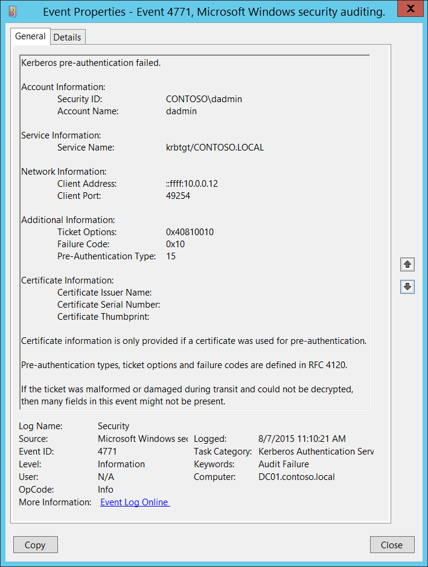

# 4771(F): Kerberos 事前認証に失敗しました。



***サブカテゴリ:***&nbsp;[Kerberos 認証サービスの監査](audit-kerberos-authentication-service.md)

***イベントの説明:***

このイベントは、Key Distribution Center が Kerberos チケット授与チケット (TGT) の発行に失敗するたびに生成されます。この問題は、ドメイン コントローラーにスマート カード認証用の証明書がインストールされていない場合 (たとえば、「ドメイン コントローラー」または「ドメイン コントローラー認証」テンプレートを使用)、ユーザーのパスワードが期限切れになっている場合、または間違ったパスワードが提供された場合に発生する可能性があります。

このイベントはドメイン コントローラーでのみ生成されます。

アカウントに「Kerberos 事前認証を要求しない」オプションが設定されている場合、このイベントは生成されません。

> **注**&nbsp;&nbsp;推奨事項については、このイベントの[セキュリティ監視の推奨事項](#security-monitoring-recommendations)を参照してください。

<br clear="all">

***イベント XML:***
```
- <Event xmlns="http://schemas.microsoft.com/win/2004/08/events/event">
- <System>
 <Provider Name="Microsoft-Windows-Security-Auditing" Guid="{54849625-5478-4994-A5BA-3E3B0328C30D}" /> 
 <EventID>4771</EventID> 
 <Version>0</Version> 
 <Level>0</Level> 
 <Task>14339</Task> 
 <Opcode>0</Opcode> 
 <Keywords>0x8010000000000000</Keywords> 
 <TimeCreated SystemTime="2015-08-07T18:10:21.495462300Z" /> 
 <EventRecordID>166708</EventRecordID> 
 <Correlation /> 
 <Execution ProcessID="520" ThreadID="1084" /> 
 <Channel>Security</Channel> 
 <Computer>DC01.contoso.local</Computer> 
 <Security /> 
 </System>
- <EventData>
 <Data Name="TargetUserName">dadmin</Data> 
 <Data Name="TargetSid">S-1-5-21-3457937927-2839227994-823803824-1104</Data> 
 <Data Name="ServiceName">krbtgt/CONTOSO.LOCAL</Data> 
 <Data Name="TicketOptions">0x40810010</Data> 
 <Data Name="Status">0x10</Data> 
 <Data Name="PreAuthType">15</Data> 
 <Data Name="IpAddress">::ffff:10.0.0.12</Data> 
 <Data Name="IpPort">49254</Data> 
 <Data Name="CertIssuerName" /> 
 <Data Name="CertSerialNumber" /> 
 <Data Name="CertThumbprint" /> 
 </EventData>
 </Event>
```

***必要なサーバー ロール:*** Active Directory ドメイン コントローラー。

***最小 OS バージョン:*** Windows Server 2008。

***イベント バージョン:*** 0。

***フィールドの説明:***

**アカウント情報:**

-   **セキュリティ ID** \[タイプ = SID\]**:** (TGT) チケットが要求されたアカウント オブジェクトの SID。イベント ビューアーは自動的に SID を解決してアカウント名を表示しようとします。SID を解決できない場合、イベントにソース データが表示されます。

    例: CONTOSO\\dadmin または CONTOSO\\WIN81$。

> **注**&nbsp;&nbsp;**セキュリティ識別子 (SID)** は、信託者 (セキュリティ プリンシパル) を識別するために使用される可変長の一意の値です。各アカウントには、Active Directory ドメイン コントローラーなどの権限によって発行され、セキュリティ データベースに保存される一意の SID があります。ユーザーがログオンするたびに、システムはデータベースからそのユーザーの SID を取得し、そのユーザーのアクセス トークンに配置します。システムは、アクセス トークン内の SID を使用して、以降のすべての Windows セキュリティとのやり取りでユーザーを識別します。SID がユーザーまたはグループの一意の識別子として使用された場合、それが再び別のユーザーまたはグループを識別するために使用されることはありません。SID の詳細については、[セキュリティ識別子](/windows/access-protection/access-control/security-identifiers)を参照してください。

-   **アカウント名:** \[Type = UnicodeString\]**:** TGTチケットが要求されたアカウントの名前。コンピュータアカウント名は**$**文字で終わります。

    -   ユーザーアカウントの例: dadmin

    -   コンピュータアカウントの例: WIN81$

**サービス情報:**

-   **サービス名** \[Type = UnicodeString\]: TGT要求が送信されたKerberos Realmのサービス名。通常、以下の形式のいずれかになります:

    -   krbtgt/DOMAIN\_NETBIOS\_NAME. 例: krbtgt/CONTOSO

    -   krbtgt/DOMAIN\_FULL\_NAME. 例: krbtgt/CONTOSO.LOCAL

**ネットワーク情報:**

-   **クライアントアドレス** \[Type = UnicodeString\]**:** TGT要求が受信されたコンピュータのIPアドレス。以下は形式の例です:

    -   **IPv6**または**IPv4**アドレス。

    -   **::ffff:IPv4\_address**。

    -   **::1** - ローカルホスト。

-   **クライアントポート** \[Type = UnicodeString\]: クライアントネットワーク接続（TGT要求接続）のソースポート番号。

    -   ローカル（localhost）要求の場合は0。

**追加情報:**

-   **チケットオプション**: \[Type = HexInt32\]: これは16進数形式の異なるチケットフラグのセットです。

    例:

    -   チケットオプション: 0x40810010

    -   バイナリビュー: 01000000100000010000000000010000

    -   **MSB 0**ビット番号付けを使用すると、ビット1、8、15、27が設定されており、Forwardable、Renewable、Canonicalize、Renewable-okとなります。

> **注**&nbsp;&nbsp;以下の表では**"MSB 0"**ビット番号付けが使用されています。これはRFCドキュメントで使用されるスタイルです。"MSB 0"スタイルではビット番号付けは左から始まります。<br>

最も一般的な値:

-   0x40810010 - Forwardable、Renewable、Canonicalize、Renewable-ok

-   0x40810000 - Forwardable、Renewable、Canonicalize

-   0x60810010 - Forwardable、Forwarded、Renewable、Canonicalize、Renewable-ok

| ビット | フラグ名                  | 説明                                                                                                                                                                                                                                                                                                                                                                                                                                                                                                                                                                                                                                                  |
|-------|--------------------------|--------------------------------------------------------------------------------------------------------------------------------------------------------------------------------------------------------------------------------------------------------------------------------------------------------------------------------------------------------------------------------------------------------------------------------------------------------------------------------------------------------------------------------------------------------------------------------------------------------------------------------------------------------------|
| 0     | 予約済み                 | -                                                                                                                                                                                                                                                                                                                                                                                                                                                                                                                                                                                                                                                            |
| 1     | Forwardable              | (TGTのみ)。提示されたTGTに基づいて異なるネットワークアドレスを持つ新しいTGTを発行できることをチケット発行サービスに伝えます。                                                                                                                                                                                                                                                                                                                                                                                                                                                                                            |
| 2     | Forwarded                | TGTが転送されたか、転送されたTGTからチケットが発行されたことを示します。                                                                                                                                                                                                                                                                                                                                                                                                                                                                                                                                                             |
| 3     | Proxiable                | (TGTのみ)。提示されたTGTに基づいて異なるネットワークアドレスを持つチケットを発行できることをチケット発行サービスに伝えます。                                                                                                                                                                                                                                                                                                                                                                                                                                                                                                                         |
| 4     | Proxy                    | チケットのネットワークアドレスがチケットを取得するために使用されたTGTのものと異なることを示します。                                                                                                                                                                                                                                                                                                                                                                                                                                                                                                                                             |
| 5     | Allow-postdate           | ポストデートチケットは[KILE](/openspecs/windows_protocols/ms-kile/2a32282e-dd48-4ad9-a542-609804b02cc9)（Microsoft Kerberosプロトコル拡張）でサポートされるべきではありません。                                                                                                                                                                                                                                                                                                                                                                                                                                                                                                         |
| 6     | Postdated                | ポストデートチケットは[KILE](/openspecs/windows_protocols/ms-kile/2a32282e-dd48-4ad9-a542-609804b02cc9)（Microsoft Kerberosプロトコル拡張）でサポートされるべきではありません。                                                                                                                                                                                                                                                                                                                                                                                                                                                                                                         |
| 7     | Invalid                  | このフラグはチケットが無効であり、使用前にKDCによって検証される必要があることを示します。アプリケーションサーバーはこのフラグが設定されたチケットを拒否する必要があります。                                                                                                                                                                                                                                                                                                                                                                                                                                                                                              |
| 8     | Renewable                | 長期間のチケットをKDCで定期的に更新するために、終了時間と更新期限フィールドと組み合わせて使用されます。                                                                                                                                                                                                                                                                                                                                                                                                                                                                                                                     |
| 9     | Initial                  | チケットが認証サービス（AS）交換を使用して発行されたことを示し、TGTに基づいて発行されたものではありません。                                                                                                                                                                                                                                                                                                                                                                                                                                                                                                                                             |
| 10    | Pre-authent              | クライアントがチケット発行前にKDCによって認証されたことを示します。このフラグは通常、チケット内の認証者の存在を示します。また、スマートカードログオンから取得された資格情報の存在を示すこともできます。                                                                                                                                                                                                                                                                                                                                                                                                                   |
| 11    | Opt-hardware-auth        | このフラグは元々、事前認証中にハードウェアサポートの認証が使用されたことを示すために意図されていました。このフラグはKerberos V5プロトコルでは推奨されなくなりました。KDCはこのフラグが設定されたチケットを発行してはなりません。他のKDCによって設定された場合、このフラグを保持してはなりません。                                                                                                                                                                                                                                                                                                                                                    |
| 12    | Transited-policy-checked | KILEはサーバーやKDCで通過ドメインをチェックしてはなりません。アプリケーションサーバーはTRANSITED-POLICY-CHECKEDフラグを無視する必要があります。                                                                                                                                                                                                                                                                                                                                                                                                                                                                                                                            |
| 13    | Ok-as-delegate           | サービスアカウントが委任のために信頼されている場合、KDCはOK-AS-DELEGATEフラグを設定する必要があります。                                                                                                                                                                                                                                                                                                                                                                                                                                                                                                                                                                   |
| 14    | Request-anonymous        | KILEはこのフラグを使用しません。                                                                                                                                                                                                                                                                                                                                                                                                                                                                                                                                                                                                                                      |
| 15    | Name-canonicalize        | リファラルを要求するために、KerberosクライアントはAS-REQまたはTGS-REQのために明示的に"canonicalize" KDCオプションを要求する必要があります。                                                                                                                                                                                                                                                                                                                                                                                                                                                                                                                           |
| 16-25 | 未使用                   | -                                                                                                                                                                                                                                                                                                                                                                                                                                                                                                                                                                                                                                                            |
| 26    | Disable-transited-check  | デフォルトでは、KDCはTGTの通過フィールドをローカルレルムのポリシーに対してチェックし、そのTGTに基づいて派生チケットを発行する前にチェックします。このフラグが要求に設定されている場合、通過フィールドのチェックは無効になります。このチェックを行わずに発行されたチケットは、TRANSITED-POLICY-CHECKEDフラグのリセット（0）値によって示され、アプリケーションサーバーに通過フィールドをローカルでチェックする必要があることを示します。KDCはこのDISABLE-TRANSITED-CHECKオプションを尊重することが推奨されますが、必須ではありません。<br>使用されるべきではありません。なぜなら、Transited-policy-checkedフラグはKILEでサポートされていないからです。 |
| 27    | Renewable-ok             | RENEWABLE-OKオプションは、要求された期間のチケットが提供できない場合に、更新可能なチケットが受け入れられることを示します。この場合、要求された終了時間と等しい更新期限を持つ更新可能なチケットが発行されることがあります。更新期限フィールドの値は、ローカルの制限や個々のプリンシパルまたはサーバーによって選択された制限によって制限されることがあります。                                                                                                                                                                                                                                                                           |
| 28    | Enc-tkt-in-skey          | 情報なし。                                                                                                                                                                                                                                                                                                                                                                                                                                                                                                                                                                                                                                              |
| 29    | 未使用                   | -                                                                                                                                                                                                                                                                                                                                                                                                                                                                                                                                                                                                                                                            |
| 30    | Renew                    | RENEWオプションは、現在の要求が更新のためであることを示します。提供されたチケットは、それが有効なサーバーの秘密鍵で暗号化されています。このオプションは、更新されるチケットにRENEWABLEフラグが設定されており、その更新期限フィールドの時間が経過していない場合にのみ尊重されます。更新されるチケットは、認証ヘッダーの一部としてpadataフィールドに渡されます。                                                                                                                                                                                                                                                   |
| 31    | Validate                 | このオプションはチケット発行サービスによってのみ使用されます。VALIDATEオプションは、ポストデートチケットを検証するための要求であることを示します。ポストデートチケットはKILEでサポートされていないため、使用されるべきではありません。                                                                                                                                                                                                                                                                                                                                                                                                                                        |

> 表6. Kerberosチケットフラグ。

-   **失敗コード** \[Type = HexInt32\]**:** 失敗したTGT発行操作の16進数の失敗コード。以下の表には、[RFC 4120](https://tools.ietf.org/html/rfc4120#section-7.5.9)で定義されたこのイベントのエラーコードのリストが含まれています：

| コード | コード名                          | 説明                                                      | 可能な原因                                                                                                                                                                                                                                                                                                                                                                                                                                                                                   |
|-------|-----------------------------------|----------------------------------------------------------|------------------------------------------------------------------------------------------------------------------------------------------------------------------------------------------------------------------------------------------------------------------------------------------------------------------------------------------------------------------------------------------------------------------------------------------------------------------------------------------------|
| 0x0   | KDC\_ERR\_NONE                    | エラーなし                                               |
| 0x1   | KDC\_ERR\_NAME\_EXP               | データベース内のクライアントのエントリが期限切れ         |
| 0x2   | KDC\_ERR\_SERVICE\_EXP            | データベース内のサーバーのエントリが期限切れ             |
| 0x3   | KDC\_ERR\_BAD\_PVNO               | 要求されたプロトコルバージョン番号がサポートされていない |
| 0x4   | KDC\_ERR\_C\_OLD\_MAST\_KVNO      | クライアントのキーが古いマスターキーで暗号化されている   |
| 0x5   | KDC\_ERR\_S\_OLD\_MAST\_KVNO      | サーバーのキーが古いマスターキーで暗号化されている       |
| 0x6   | KDC\_ERR\_C\_PRINCIPAL\_UNKNOWN   | Kerberosデータベースにクライアントが見つからない         |
| 0x7   | KDC\_ERR\_S\_PRINCIPAL\_UNKNOWN   | Kerberosデータベースにサーバーが見つからない             |
| 0x8   | KDC\_ERR\_PRINCIPAL\_NOT\_UNIQUE  | データベースに複数のプリンシパルエントリがある           |
| 0x9   | KDC\_ERR\_NULL\_KEY               | クライアントまたはサーバーがヌルキーを持っている         |
| 0xa   | KDC\_ERR\_CANNOT\_POSTDATE        | チケットが後日付に適さない                               |
| 0xb   | KDC\_ERR\_NEVER\_VALID            | 要求された開始時間が終了時間より後                       |
| 0xc   | KDC\_ERR\_POLICY                  | KDCポリシーが要求を拒否                                   |
| 0xd   | KDC\_ERR\_BADOPTION               | KDCが要求されたオプションに対応できない                   |
| 0xe   | KDC\_ERR\_ETYPE\_NOSUPP           | KDCが暗号化タイプをサポートしていない                     |
| 0xf   | KDC\_ERR\_SUMTYPE\_NOSUPP         | KDCがチェックサムタイプをサポートしていない               |
| 0x10  | KDC\_ERR\_PADATA\_TYPE\_NOSUPP    | KDCがPADATAタイプ（事前認証データ）をサポートしていない  | スマートカードログオンが試行されており、適切な証明書が見つからない。この問題は、誤った認証局（CA）が照会されているか、適切なCAに接続できないために発生する可能性があります。<br>また、ドメインコントローラーにスマートカード用の証明書（ドメインコントローラーまたはドメインコントローラー認証テンプレート）がインストールされていない場合にも発生します。
| 0x11  | KDC\_ERR\_TRTYPE\_NOSUPP          | KDCがトランジットタイプをサポートしていない               |
| 0x12  | KDC\_ERR\_CLIENT\_REVOKED         | クライアントの資格情報が取り消された                       |
| 0x13  | KDC\_ERR\_SERVICE\_REVOKED        | サーバーの資格情報が取り消された                           |
| 0x14  | KDC\_ERR\_TGT\_REVOKED            | TGTが取り消された                                         |
| 0x15  | KDC\_ERR\_CLIENT\_NOTYET          | クライアントがまだ有効でない；後でもう一度試してください |
| 0x16  | KDC\_ERR\_SERVICE\_NOTYET         | サーバーがまだ有効でない；後でもう一度試してください     |
| 0x17  | KDC\_ERR\_KEY\_EXPIRED            | パスワードが期限切れ—パスワードを変更してリセット        | ユーザーのパスワードが期限切れです。
| 0x18  | KDC\_ERR\_PREAUTH\_FAILED         | 事前認証情報が無効                                        | 間違ったパスワードが提供されました。
| 0x19  | KDC\_ERR\_PREAUTH\_REQUIRED       | 追加の事前認証が必要                                      |
| 0x1a  | KDC\_ERR\_SERVER\_NOMATCH         | 要求されたサーバーとチケットが一致しない                 |
| 0x1b  | KDC\_ERR\_MUST\_USE\_USER2USER    | サーバープリンシパルがuser2userのみに有効                 |
| 0x1c  | KDC\_ERR\_PATH\_NOT\_ACCEPTED     | KDCポリシーがトランジットパスを拒否                       |
| 0x1d  | KDC\_ERR\_SVC\_UNAVAILABLE        | サービスが利用できない                                    |
| 0x1f  | KRB\_AP\_ERR\_BAD\_INTEGRITY      | 復号化されたフィールドの整合性チェックに失敗             |
| 0x20  | KRB\_AP\_ERR\_TKT\_EXPIRED        | チケットが期限切れ                                        |
| 0x21  | KRB\_AP\_ERR\_TKT\_NYV            | チケットがまだ有効でない                                  |
| 0x22  | KRB\_AP\_ERR\_REPEAT              | 要求がリプレイ                                            |
| 0x23  | KRB\_AP\_ERR\_NOT\_US             | チケットが私たちのものではない                            |
| 0x24  | KRB\_AP\_ERR\_BADMATCH            | チケットと認証者が一致しない                              |
| 0x25  | KRB\_AP\_ERR\_SKEW                | クロックスキューが大きすぎる                              |
| 0x26  | KRB\_AP\_ERR\_BADADDR             | ネットアドレスが間違っている                              |
| 0x27  | KRB\_AP\_ERR\_BADVERSION          | プロトコルバージョンの不一致                              |
| 0x28  | KRB\_AP\_ERR\_MSG\_TYPE           | 無効なメッセージタイプ                                    |
| 0x29  | KRB\_AP\_ERR\_MODIFIED            | メッセージストリームが変更された                          |
| 0x2a  | KRB\_AP\_ERR\_BADORDER            | メッセージの順序が間違っている                            |
| 0x2c  | KRB\_AP\_ERR\_BADKEYVER           | 指定されたキーのバージョンが利用できない                  |
| 0x2d  | KRB\_AP\_ERR\_NOKEY               | サービスキーが利用できない                                |
| 0x2e  | KRB\_AP\_ERR\_MUT\_FAIL           | 相互認証に失敗                                            |
| 0x2f  | KRB\_AP\_ERR\_BADDIRECTION        | メッセージの方向が間違っている                            |
| 0x30  | KRB\_AP\_ERR\_METHOD              | 代替認証方法が必要                                        |
| 0x31  | KRB\_AP\_ERR\_BADSEQ              | メッセージ内のシーケンス番号が間違っている                |
| 0x32  | KRB\_AP\_ERR\_INAPP\_CKSUM        | メッセージ内のチェックサムの種類が不適切                  |
| 0x33  | KRB\_AP\_PATH\_NOT\_ACCEPTED      | ポリシーがトランジットパスを拒否                          |
| 0x34  | KRB\_ERR\_RESPONSE\_TOO\_BIG      | 応答がUDPに対して大きすぎる；TCPで再試行                  |
| 0x3c  | KRB\_ERR\_GENERIC                 | 一般的なエラー（e-textに説明あり）                        |
| 0x3d  | KRB\_ERR\_FIELD\_TOOLONG          | この実装にはフィールドが長すぎる                          |
| 0x3e  | KDC\_ERROR\_CLIENT\_NOT\_TRUSTED  | PKINIT用に予約済み                                        |
| 0x3f  | KDC\_ERROR\_KDC\_NOT\_TRUSTED     | PKINIT用に予約済み                                        |
| 0x40  | KDC\_ERROR\_INVALID\_SIG          | PKINIT用に予約済み                                        |
| 0x41  | KDC\_ERR\_KEY\_TOO\_WEAK          | PKINIT用に予約済み                                        |
| 0x42  | KDC\_ERR\_CERTIFICATE\_MISMATCH   | PKINIT用に予約済み                                        |
| 0x43  | KRB\_AP\_ERR\_NO\_TGT             | USER-TO-USERを検証するためのTGTが利用できない             |
| 0x44  | KDC\_ERR\_WRONG\_REALM            | 将来の使用のために予約済み                                |
| 0x45  | KRB\_AP\_ERR\_USER\_TO\_USER\_REQUIRED | チケットはUSER-TO-USER用でなければならない               |
| 0x46  | KDC\_ERR\_CANT\_VERIFY\_CERTIFICATE | PKINIT用に予約済み                                        |
| 0x47  | KDC\_ERR\_INVALID\_CERTIFICATE    | PKINIT用に予約済み                                        |
| 0x48  | KDC\_ERR\_REVOKED\_CERTIFICATE    | PKINIT用に予約済み                                        |
| 0x49  | KDC\_ERR\_REVOCATION\_STATUS\_UNKNOWN | PKINIT用に予約済み                                        |
| 0x4a  | KDC\_ERR\_REVOCATION\_STATUS\_UNAVAILABLE | PKINIT用に予約済み                                        |
| 0x4b  | KDC\_ERR\_CLIENT\_NAME\_MISMATCH  | PKINIT用に予約済み                                        |
| 0x4c  | KDC\_ERR\_KDC\_NAME\_MISMATCH     | PKINIT用に予約済み                                        |

-   **事前認証タイプ** \[Type = UnicodeString\]: TGTリクエストで使用された[事前認証](/previous-versions/windows/it-pro/windows-server-2003/cc772815(v=ws.10))タイプのコード。

<span id="kerberos-preauthentication-types" />
## 表5. Kerberos事前認証タイプ。

| タイプ | タイプ名              | 説明                                                                                                                                                                                                                                                                                                                                                                                                              |
|--------|------------------------|------------------------------------------------------------------------------------------------------------------------------------------------------------------------------------------------------------------------------------------------------------------------------------------------------------------------------------------------------------------------------------------------------------------|
| 0      | -                      | 事前認証なしでのログオン。                                                                                                                                                                                                                                                                                                                                                                                        |
| 2      | PA-ENC-TIMESTAMP       | このタイプは標準のパスワード認証に通常使用されます。                                                                                                                                                                                                                                                                                                                                                              |
| 11     | PA-ETYPE-INFO          | ETYPE-INFO事前認証タイプは、追加の事前認証が必要であることを示すKRB-ERRORでKDCによって送信されます。通常、PA-ENC-TIMESTAMP事前認証値を送信するために暗号化されたタイムスタンプの暗号化に使用するキーをクライアントに通知するために使用されます。<br>Microsoft Active Directory環境ではこの事前認証タイプは見たことがありません。  |
| 15     | PA-PK-AS-REP\_OLD      | スマートカードログオン認証に使用されます。                                                                                                                                                                                                                                                                                                                                                                        |
| 16     | PA-PK-AS-REQ           | スマートカード認証シナリオでKDCに送信されるリクエスト。|
| 17     | PA-PK-AS-REP           | このタイプもスマートカード認証に使用されるべきですが、特定のActive Directory環境では見られないことがあります。                                                                                                                                                                                                                                                                                                   |
| 19     | PA-ETYPE-INFO2         | ETYPE-INFO2事前認証タイプは、追加の事前認証が必要であることを示すKRB-ERRORでKDCによって送信されます。通常、PA-ENC-TIMESTAMP事前認証値を送信するために暗号化されたタイムスタンプの暗号化に使用するキーをクライアントに通知するために使用されます。<br>Microsoft Active Directory環境ではこの事前認証タイプは見たことがありません。 |
| 20     | PA-SVR-REFERRAL-INFO   | KDCリファーラルチケットで使用されます。                                                                                                                                                                                                                                                                                                                                                                           |
| 138    | PA-ENCRYPTED-CHALLENGE | Kerberos Armoring（FAST）を使用したログオン。Windows Server 2012ドメインコントローラーおよびWindows 8クライアントからサポートされています。                                                                                                                                                                                                                                                                          |
| -      |                        | このタイプは監査失敗イベントに表示されます。                                                                                                                                                                                                                                                                                                                                                                     |

**証明書情報:**

- **証明書発行者名** \[タイプ = UnicodeString\]**:** スマートカード証明書を発行した認証局の名前。証明書の**発行者**フィールドに入力されます。[4771](event-4771.md) イベントでは常に空です。

- **証明書シリアル番号** \[タイプ = UnicodeString\]**:** スマートカード証明書のシリアル番号。証明書の**シリアル番号**フィールドに記載されています。[4771](event-4771.md) イベントでは常に空です。

- **証明書サムプリント** \[タイプ = UnicodeString\]**:** スマートカード証明書のサムプリント。証明書の**サムプリント**フィールドに記載されています。[4771](event-4771.md) イベントでは常に空です。

## セキュリティ監視の推奨事項

4771(F): Kerberos 事前認証に失敗しました。

| **必要な監視の種類**                                                                                                                                                                                                                                                                                   | **推奨事項**                                                                                                                                                 |
|-------------------------------------------------------------------------------------------------------------------------------------------------------------------------------------------------------------------------------------------------------------------------------------------------------------------|--------------------------------------------------------------------------------------------------------------------------------------------------------------------|
| **高価値アカウント**: 各アクションを監視する必要がある高価値のドメインまたはローカルアカウントがあるかもしれません。<br>高価値アカウントの例としては、データベース管理者、組み込みのローカル管理者アカウント、ドメイン管理者、サービスアカウント、ドメインコントローラーアカウントなどがあります。 | 高価値アカウントまたはアカウントに対応する**"セキュリティID"**でこのイベントを監視します。                                                              |
| **異常または悪意のある行動**: 異常を検出したり、潜在的な悪意のある行動を監視するための特定の要件があるかもしれません。例えば、勤務時間外のアカウント使用を監視する必要があるかもしれません。                                                                                | 異常または悪意のある行動を監視する際には、特定のアカウントがどのようにまたはいつ使用されているかを監視するために**"セキュリティID"**（他の情報と共に）を使用します。 |
| **非アクティブアカウント**: 非アクティブ、無効、またはゲストアカウント、その他使用されるべきでないアカウントがあるかもしれません。                                                                                                                                                                                     | 使用されるべきでないアカウントに対応する**"セキュリティID"**でこのイベントを監視します。                                                          |
| **アカウント許可リスト**: 特定のイベントに対応するアクションを実行することが許可されているアカウントの特定の許可リストがあるかもしれません。                                                                                                                                                      | このイベントが「許可リストのみ」のアクションに対応する場合、許可リスト外のアカウントに対して**"セキュリティID"**を確認します。                                  |
| **アカウント命名規則**: 組織にはアカウント名に関する特定の命名規則があるかもしれません。                                                                                                                                                                                                       | 命名規則に従わない名前について**"サブジェクト\\アカウント名"**を監視します。                                                                           |

-   内部IP範囲やプライベートIP範囲外からの**クライアントアドレス**がある[4771](event-4771.md)イベントをすべて追跡できます。

-   **アカウント名**が特定のIPアドレスリストからのみ使用されるべきであることがわかっている場合、[4771](event-4771.md)イベントでこの**アカウント名**のすべての**クライアントアドレス**値を追跡します。**クライアントアドレス**が許可リストにない場合、アラートを生成します。

-   すべての**クライアントアドレス** = ::1はローカル認証を意味します。ドメインコントローラーにログオンするべきアカウントのリストがわかっている場合、**クライアントアドレス** = ::1で**アカウント名**がどのドメインコントローラーにもログオンすることが許可されていないすべての違反を監視する必要があります。

-   **クライアントポート**フィールドの値が0より大きく1024未満のすべての[4771](event-4771.md)イベントを調査する必要があります。これは、アウトバウンド接続に既知のポートが使用されたことを意味します。

-   また、以下の表に示すフィールドを監視して、リストされた問題を発見します：

| **フィールド**              | **発見する問題**                                                                                                                                                                                                                   |
|-----------------------------|------------------------------------------------------------------------------------------------------------------------------------------------------------------------------------------------------------------------------------|
| **事前認証タイプ**          | アカウントが認証にスマートカードを使用する必要がある場合、値が**15ではない**。詳細については、[表5. Kerberos事前認証タイプ](#kerberos-preauthentication-types)を参照してください。                                               |
| **事前認証タイプ**          | 組織で標準のパスワード認証のみが使用されている場合、値が**2ではない**。詳細については、[表5. Kerberos事前認証タイプ](#kerberos-preauthentication-types)を参照してください。                                               |
| **事前認証タイプ**          | 組織内のすべてのKerberos通信にKerberos Armoringが有効になっている場合、値が**138ではない**。詳細については、[表5. Kerberos事前認証タイプ](#kerberos-preauthentication-types)を参照してください。                                |
| **失敗コード**              | **0x10**（KDCがPADATAタイプ（事前認証データ）をサポートしていない）。このエラーは、Kerberos認証に関連するスマートカードの問題をより迅速に特定するのに役立ちます。                                                                 |
| **失敗コード**              | **0x18**（事前認証情報が無効）、例えば、最後のN分間にNイベントが発生した場合。この問題は、特に非常に重要なアカウントに対するブルートフォース攻撃を示している可能性があります。                                               |
