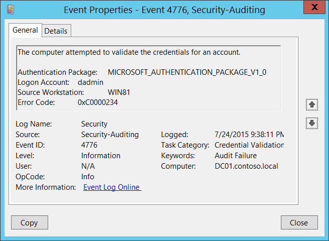

# 4776(S, F): コンピューターがアカウントの資格情報を検証しようとしました。



***サブカテゴリ:***&nbsp;[資格情報検証の監査](audit-credential-validation.md)

***イベントの説明:***

このイベントは、NTLM 認証を使用して資格情報の検証が行われるたびに生成されます。

このイベントは、提供された資格情報に対して権限を持つコンピューターでのみ発生します。ドメイン アカウントの場合、ドメイン コントローラーが権限を持ちます。ローカル アカウントの場合、ローカル コンピューターが権限を持ちます。

成功した資格情報の検証試行と失敗した資格情報の検証試行の両方が表示されます。

認証試行が行われたコンピューター名 (**ソース ワークステーション**) のみが表示されます (認証ソース)。たとえば、ドメイン アカウントを使用して CLIENT-1 から SERVER-1 に認証する場合、**ソース ワークステーション** フィールドには CLIENT-1 が表示されます。宛先コンピューター (SERVER-1) に関する情報はこのイベントには表示されません。

資格情報の検証試行が失敗した場合、**エラー コード** パラメーターの値が "**0x0**" 以外の失敗イベントが表示されます。

このイベントの主な利点は、ドメイン コントローラーで NTLM 認証が使用されたドメイン アカウントのすべての認証試行を確認できることです。

ローカル アカウントのログオン試行を監視するには、より詳細で情報量が多いイベント "[4624](event-4624.md): アカウントが正常にログオンしました" を使用する方が良いです。

このイベントは、ワークステーションのロック解除イベントが発生したときにも生成されます。

このイベントは、ドメインアカウントがドメインコントローラーにローカルでログオンしたときには生成されません。

> **注**&nbsp;&nbsp;推奨事項については、このイベントの[セキュリティ監視の推奨事項](#security-monitoring-recommendations)を参照してください。

<br clear="all">

***イベント XML:***
```
- <Event xmlns="http://schemas.microsoft.com/win/2004/08/events/event">
- <System>
 <Provider Name="Microsoft-Windows-Security-Auditing" Guid="{54849625-5478-4994-A5BA-3E3B0328C30D}" /> 
 <EventID>4776</EventID> 
 <Version>0</Version> 
 <Level>0</Level> 
 <Task>14336</Task> 
 <Opcode>0</Opcode> 
 <Keywords>0x8010000000000000</Keywords> 
 <TimeCreated SystemTime="2015-07-25T04:38:11.003163100Z" /> 
 <EventRecordID>165437</EventRecordID> 
 <Correlation /> 
 <Execution ProcessID="500" ThreadID="532" /> 
 <Channel>Security</Channel> 
 <Computer>DC01.contoso.local</Computer> 
 <Security /> 
 </System>
- <EventData>
 <Data Name="PackageName">MICROSOFT\_AUTHENTICATION\_PACKAGE\_V1\_0</Data> 
 <Data Name="TargetUserName">dadmin</Data> 
 <Data Name="Workstation">WIN81</Data> 
 <Data Name="Status">0xc0000234</Data> 
 </EventData>
 </Event>

```

***必要なサーバーロール:*** 特定の要件はありません。

***最小 OS バージョン:*** Windows Server 2008, Windows Vista。

***イベントバージョン:*** 0。

***フィールドの説明:***

-   **認証パッケージ** \[タイプ = UnicodeString\]: 資格情報の検証に使用された[認証パッケージ](/windows/win32/secauthn/authentication-packages)の名前。 [4776](event-4776.md) イベントの場合、常に "**MICROSOFT\_AUTHENTICATION\_PACKAGE\_V1\_0**" です。

> **注**&nbsp;&nbsp;**認証パッケージ**は、ユーザーのログオンを許可するかどうかを決定するための認証ロジックをカプセル化するDLLです。[ローカルセキュリティ機関](/windows/win32/secgloss/l-gly#_security_local_security_authority_gly) (LSA) は、認証パッケージにリクエストを送信することでユーザーログオンを認証します。認証パッケージはログオン情報を調べ、ユーザーログオンの試行を認証または拒否します。

-   **ログオンアカウント** \[タイプ = UnicodeString\]: **認証パッケージ**によって資格情報が検証されたアカウントの名前。ユーザー名、コンピューターアカウント名、または[よく知られたセキュリティプリンシパル](/windows/security/identity-protection/access-control/security-identifiers)アカウント名である可能性があります。例:

    -   ユーザー例: dadmin

    -   コンピューターアカウント例: WIN81$

    -   ローカルシステムアカウント例: Local

    -   ローカルサービスアカウント例: Local Service

-   **ソースワークステーション** \[タイプ = UnicodeString\]: ログオン試行が発生したコンピューターの名前。

-   **エラーコード** \[タイプ = HexInt32\]: 失敗イベントのエラーコードを含みます。成功イベントの場合、このパラメーターは "**0x0**" の値を持ちます。以下の表は、このイベントの最も一般的なエラーコードを含みます:

| エラーコード | 説明                                                                                                                                                                                                                                                                               |
|------------|-------------------------------------------------------------------------------------------------------------------------------------------------------------------------------------------------------------------------------------------------------------------------------------------|
| 0xC0000064 | 入力したユーザー名が存在しません。無効なユーザー名です。                                                                                                                                                                                                                                      |
| 0xC000006A | スペルミスまたは無効なパスワードでのアカウントログオン。                                                                                                                                                                                                                                            |
| 0xC000006D | -   一般的なログオン失敗。<br>考えられる原因の一部:<br>無効なユーザー名および/またはパスワードが使用された<br>ソースとターゲットコンピューター間の[LAN マネージャー認証レベル](/previous-versions/windows/it-pro/windows-server-2012-R2-and-2012/jj852207(v=ws.11)) の不一致。 |
| 0xC000006F | 許可された時間外でのアカウントログオン。                                                                                                                                                                                                                                                   |
| 0xC0000070 | 許可されていないワークステーションからのアカウントログオン。                                                                                                                                                                                                                                              |
| 0xC0000071 | 期限切れのパスワードでのアカウントログオン。                                                                                                                                                                                                                                                      |
| 0xC0000072 | 管理者によって無効にされたアカウントへのログオン。                                                                                                                                                                                                                                       |
| 0xC0000193 | 期限切れのアカウントでのアカウントログオン。                                                                                                                                                                                                                                                       |
| 0xC0000224 | "次回ログオン時にパスワードを変更する" フラグが設定されたアカウントでのログオン。                                                                                                                                                                                                                               |
| 0xC0000234 | ロックされたアカウントでのアカウントログオン。                                                                                                                                                                                                                                                        |
| 0xC0000371 | 指定されたアカウントの秘密情報がローカルアカウントストアに含まれていません。                                                                                                                                                                                                       |
| 0x0        | エラーなし。                                                                                                                                                                                                                                                                                |

> 表1. Winlogon エラーコード。

## セキュリティ監視の推奨事項

4776(S, F): コンピューターがアカウントの資格情報を検証しようとしました。

| **必要な監視の種類**     | **推奨事項**          |
|-----------------|---------|
| **高価値アカウント**: 各アクションを監視する必要がある高価値のドメインまたはローカルアカウントがあるかもしれません。<br>高価値アカウントの例としては、データベース管理者、組み込みのローカル管理者アカウント、ドメイン管理者、サービスアカウント、ドメインコントローラーアカウントなどがあります。 | 高価値アカウントに対応する**"ログオンアカウント"**でこのイベントを監視します。        |
| **異常または悪意のある行動**: 異常を検出したり、潜在的な悪意のある行動を監視するための特定の要件があるかもしれません。例えば、勤務時間外のアカウント使用を監視する必要があるかもしれません。                                                                                | 異常や悪意のある行動を監視する際には、特定のアカウントがどのように、またはいつ使用されているかを監視するために、**"ログオンアカウント"**の値（他の情報と共に）を使用します。<br>勤務時間外の特定のユーザーアカウントの活動を監視するには、適切な**ログオンアカウント + ソースワークステーション**のペアを監視します。 |
| **非アクティブアカウント**: 非アクティブ、無効、またはゲストアカウント、または決して使用されるべきでない他のアカウントがあるかもしれません。 | 決して使用されるべきでない**"ログオンアカウント"**でこのイベントを監視します。   |
| **アカウント許可リスト**: 特定のイベントに対応するアクションを実行することが許可されているアカウントの特定の許可リストがあるかもしれません。   | このイベントが「許可リストのみ」のアクションに対応する場合、許可リスト外のアカウントについて**"ログオンアカウント"**を確認します。     |
| **使用制限コンピューター**: 特定の人（アカウント）がログオンしてはいけない特定のコンピューターがあるかもしれません。   | 懸念している**"ログオンアカウント"**からの資格情報検証要求について、対象の**ソースワークステーション**を監視します。  |
| **アカウント命名規則**: 組織にはアカウント名の特定の命名規則があるかもしれません。  | 命名規則に準拠していない名前について**"ログオンアカウント"**を監視します。 |

- 特定のアカウントに対してNTLM認証を使用しない場合、そのアカウントを監視してください。アカウントがそのユーザーアカウントが保存されているデバイスにログオンする場合、ローカルログオンは常にNTLM認証を使用することを忘れないでください。

- 必要に応じて、このイベントを使用してドメイン内のすべてのNTLM認証試行を収集できます。アカウントがそのユーザーアカウントが保存されているデバイスにログオンする場合、ローカルログオンは常にNTLM認証を使用することを忘れないでください。

- ローカルアカウントがローカルでのみ使用されるべき場合（例えば、ネットワークログオンやターミナルサービスログオンが許可されていない場合）、**Source Workstation** と **Computer**（イベントが生成された場所と資格情報が保存されている場所）の値が異なるすべてのイベントを監視する必要があります。

- 以下のエラーを追跡することを検討してください。理由は以下の通りです：

| **追跡するエラー**  | **エラーが示す可能性のあるもの**   |
|----------|----------------|
| **ユーザーアカウントのスペルミスまたは不正なユーザーアカウントでのログオン**  | 例えば、過去N分間にN回のイベントが発生した場合、特に重要なアカウントに対するアカウント列挙攻撃の指標となる可能性があります。 |
| **スペルミスまたは不正なパスワードでのユーザーログオン**      | 例えば、過去N分間にN回のイベントが発生した場合、特に重要なアカウントに対するブルートフォースパスワード攻撃の指標となる可能性があります。 |
| **許可された時間外でのユーザーログオン**             | 特に重要なアカウントに対して、アカウントが侵害されたことを示す可能性があります。  |
| **許可されていないワークステーションからのユーザーログオン**        | 特に重要なアカウントに対して、アカウントが侵害されたことを示す可能性があります。    |
| **管理者によって無効にされたアカウントへのユーザーログオン** | 例えば、過去N分間にN回のイベントが発生した場合、特に重要なアカウントに対するアカウント侵害の試みの指標となる可能性があります。     |
| **期限切れのアカウントでのユーザーログオン**                 | 特に重要なアカウントに対して、アカウント侵害の試みを示す可能性があります。   |
| **ロックされたアカウントでのユーザーログオン**                  | 特に重要なアカウントに対して、ブルートフォースパスワード攻撃を示す可能性があります。  |


