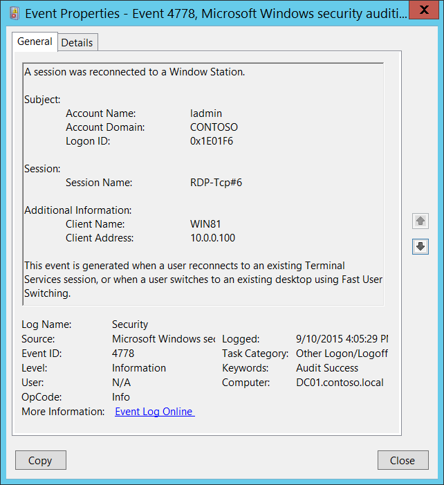
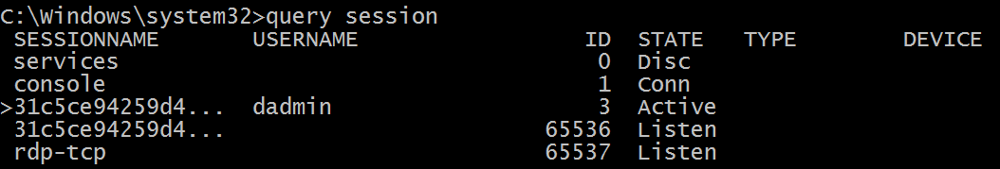

# 4778(S): セッションがウィンドウステーションに再接続されました。



***サブカテゴリ:***&nbsp;[その他のログオン/ログオフイベントの監査](audit-other-logonlogoff-events.md)

***イベントの説明:***

このイベントは、ユーザーが既存のターミナルサービスセッションに再接続するか、[高速ユーザー切り替え](/windows-hardware/drivers/display/fast-user-switching)を使用して既存のデスクトップに切り替えるときに生成されます。

このイベントは、たとえばユーザーが仮想ホスト Hyper-V Enhanced Session に再接続する場合にも生成されます。

> **注**&nbsp;&nbsp;推奨事項については、このイベントの[セキュリティ監視の推奨事項](#security-monitoring-recommendations)を参照してください。

<br clear="all">

***イベント XML:***
```
- <Event xmlns="http://schemas.microsoft.com/win/2004/08/events/event">
- <System>
 <Provider Name="Microsoft-Windows-Security-Auditing" Guid="{54849625-5478-4994-A5BA-3E3B0328C30D}" /> 
 <EventID>4778</EventID> 
 <Version>0</Version> 
 <Level>0</Level> 
 <Task>12551</Task> 
 <Opcode>0</Opcode> 
 <Keywords>0x8020000000000000</Keywords> 
 <TimeCreated SystemTime="2015-09-10T23:05:29.743867200Z" /> 
 <EventRecordID>237651</EventRecordID> 
 <Correlation /> 
 <Execution ProcessID="504" ThreadID="2212" /> 
 <Channel>Security</Channel> 
 <Computer>DC01.contoso.local</Computer> 
 <Security /> 
 </System>
- <EventData>
 <Data Name="AccountName">ladmin</Data> 
 <Data Name="AccountDomain">CONTOSO</Data> 
 <Data Name="LogonID">0x1e01f6</Data> 
 <Data Name="SessionName">RDP-Tcp\#6</Data> 
 <Data Name="ClientName">WIN81</Data> 
 <Data Name="ClientAddress">10.0.0.100</Data> 
 </EventData>
 </Event>

```

***必要なサーバーロール:*** なし。

***最小 OS バージョン:*** Windows Server 2008, Windows Vista。

***イベントバージョン:*** 0。

***フィールドの説明:***

**サブジェクト:**

-   **アカウント名** \[タイプ = UnicodeString\]**:** セッションが再接続されたアカウントの名前。

-   **アカウントドメイン** \[タイプ = UnicodeString\]**:** サブジェクトのドメインまたはコンピュータ名。形式はさまざまで、以下を含みます:

    -   ドメイン NETBIOS 名の例: CONTOSO

    -   小文字の完全なドメイン名: contoso.local

    -   大文字の完全なドメイン名: CONTOSO.LOCAL

    -   一部の[よく知られたセキュリティプリンシパル](/windows/security/identity-protection/access-control/security-identifiers)の場合、このフィールドの値は「NT AUTHORITY」となります。例えば、LOCAL SERVICE や ANONYMOUS LOGON など。

    -   ローカルユーザーアカウントの場合、このフィールドにはこのアカウントが属するコンピュータまたはデバイスの名前が含まれます。例えば、「Win81」。

-   **ログオンID** \[タイプ = HexInt64\]**:** このイベントを最近のイベントと関連付けるのに役立つ16進数の値。例えば、「[4624](event-4624.md): アカウントが正常にログオンされました。」など。

**セッション:**

-   **セッション名** \[タイプ = UnicodeString\]**:** ユーザーが再接続されたセッションの名前。例:

    -   **RDP-Rcp\#N**、ここでNはセッションの番号 – 典型的なRDPセッション名。

    -   **Console** – コンソールセッション、Fast User Switchingに典型的。

    -   **31C5CE94259D4006A9E4\#3** – 「Hyper-V Enhanced Session」セッション名の例。

        現在のセッションのリストはコマンドプロンプトで「**query session**」コマンドを使用して確認できます。出力例（**SESSIONNAME**列を参照）:



**追加情報:**

-   **クライアント名** \[タイプ = UnicodeString\]: ユーザーが再接続されたコンピュータ名。コンソールセッションの場合は「**Unknown**」値を持つ。

-   **クライアントアドレス** \[タイプ = UnicodeString\]: ユーザーが再接続されたコンピュータのIPアドレス。

    -   クライアントのIPv6アドレスまたは::ffff:IPv4アドレス。

    -   ::1または127.0.0.1はlocalhostを意味する。

    -   コンソールセッションの場合は「**LOCAL**」値を持つ。

## セキュリティ監視の推奨事項

4778(S): ウィンドウステーションにセッションが再接続されました。

| **必要な監視の種類**                                                                                                                                                                                                                                                                                   | **推奨事項**                                                                                                                                                           |
|-------------------------------------------------------------------------------------------------------------------------------------------------------------------------------------------------------------------------------------------------------------------------------------------------------------------|------------------------------------------------------------------------------------------------------------------------------------------------------------------------------|
| **高価値アカウント**: 各アクションを監視する必要がある高価値のドメインまたはローカルアカウントがあるかもしれません。<br>高価値アカウントの例としては、データベース管理者、組み込みのローカル管理者アカウント、ドメイン管理者、サービスアカウント、ドメインコントローラアカウントなどがあります。 | 高価値アカウントに対応する**「Subject\\Account Name」**でこのイベントを監視します。                                                              |
| **異常または悪意のある行動**: 異常を検出したり、潜在的な悪意のある行動を監視するための特定の要件があるかもしれません。例えば、勤務時間外のアカウント使用を監視する必要があるかもしれません。                                                                                | 異常や悪意のある行動を監視する際には、特定のアカウントがどのようにまたはいつ使用されているかを監視するために**「Subject\\Account Name」**（他の情報と共に）を使用します。 |
| **非アクティブアカウント**: 非アクティブ、無効、またはゲストアカウント、または決して使用されるべきではない他のアカウントがあるかもしれません。                                                                                                                                                                                     | 使用されるべきではないアカウントに対応する**「Subject\\Account Name」**でこのイベントを監視します。                                                          |
| **アカウント許可リスト**: 特定のイベントに対応するアクションを実行することが許可されているアカウントの特定の許可リストがあるかもしれません。                                                                                                                                                      | このイベントが「許可リストのみ」のアクションに対応する場合、許可リスト外のアカウントについて**「Subject\\Account Name」**を確認します。                                  |
| **異なる種類のアカウント**: 特定のアクションが特定のアカウントタイプ（例えば、ローカルまたはドメインアカウント、マシンまたはユーザーアカウント、ベンダーまたは従業員アカウントなど）によってのみ実行されることを確認したいかもしれません。                                                                                 | このイベントが特定のアカウントタイプに対して監視したいアクションに対応する場合、アカウントタイプが期待通りであるかどうかを確認するために**「Subject\\Account Name」**を確認します。 |
| **外部アカウント**: 別のドメインからのアカウントや、特定のアクション（特定のイベントによって表される）を実行することが許可されていない「外部」アカウントを監視しているかもしれません。                                                                                                                     | 別のドメインからのアカウントや「外部」アカウントに対応する**「Subject\\Account Domain」**でこのイベントを監視します。                                               |
| **使用が制限されたコンピュータやデバイス**: 特定の人（アカウント）が通常はアクションを実行しない特定のコンピュータ、マシン、またはデバイスがあるかもしれません。                                                                                                                                      | 懸念される**「Subject\\Account Name」**によって実行されたアクションについて、対象の**コンピュータ:**（または他の対象デバイス）を監視します。                             |
| **アカウント命名規則**: 組織にはアカウント名に関する特定の命名規則があるかもしれません。                                                                                                                                                                                                       | 命名規則に従わない名前について**「Subject\\Account Name」**を監視します。                                                                                     |

-   ワークステーションや特定のコンピュータで高速ユーザー切り替えが無効になっている場合、**Session Name** = Console のイベントを監視します。

-   特定のユーザー（**Subject\\Account Name**）に対してリモートデスクトップ接続が許可されていない場合、または一部のコンピュータで無効になっている場合、**Session Name** = RDP-Tcp\#（部分文字列）のイベントを監視します。

-   特定のコンピュータまたはデバイス（**Client Name** または **Client Address**）がこのコンピュータ（**Computer**）に接続してはならない場合、その **Client Name** または **Client Address** のイベントを監視します。

-   **Additional Information\\Client Address** が内部IPアドレスリストからのものであることを確認します。
