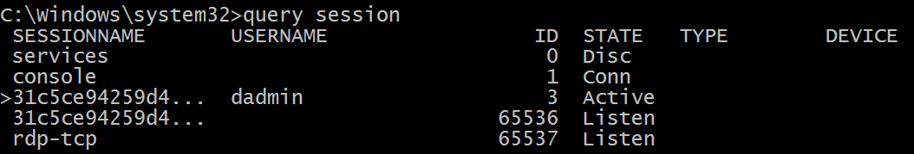

# 4779(S): ウィンドウステーションからセッションが切断されました。


***サブカテゴリ:***&nbsp;[その他のログオン/ログオフイベントの監査](audit-other-logonlogoff-events.md)

***イベントの説明:***

このイベントは、ユーザーが既存のターミナルサービスセッションから切断したとき、または[高速ユーザー切り替え](/windows-hardware/drivers/display/fast-user-switching)を使用して既存のデスクトップから切り替えたときに生成されます。

このイベントは、たとえばユーザーが仮想ホスト Hyper-V Enhanced Session から切断したときにも生成されます。

> **注**&nbsp;&nbsp;推奨事項については、このイベントの[セキュリティ監視の推奨事項](#security-monitoring-recommendations)を参照してください。

<br clear="all">

***イベント XML:***
```
- <Event xmlns="http://schemas.microsoft.com/win/2004/08/events/event">
- <System>
 <Provider Name="Microsoft-Windows-Security-Auditing" Guid="{54849625-5478-4994-A5BA-3E3B0328C30D}" /> 
 <EventID>4779</EventID> 
 <Version>0</Version> 
 <Level>0</Level> 
 <Task>12551</Task> 
 <Opcode>0</Opcode> 
 <Keywords>0x8020000000000000</Keywords> 
 <TimeCreated SystemTime="2015-09-10T23:04:41.044489800Z" /> 
 <EventRecordID>237646</EventRecordID> 
 <Correlation /> 
 <Execution ProcessID="504" ThreadID="524" /> 
 <Channel>Security</Channel> 
 <Computer>DC01.contoso.local</Computer> 
 <Security /> 
 </System>
- <EventData>
 <Data Name="AccountName">ladmin</Data> 
 <Data Name="AccountDomain">CONTOSO</Data> 
 <Data Name="LogonID">0x1e01f6</Data> 
 <Data Name="SessionName">RDP-Tcp\#3</Data> 
 <Data Name="ClientName">WIN81</Data> 
 <Data Name="ClientAddress">10.0.0.100</Data> 
 </EventData>
 </Event>

```

***必要なサーバーロール:*** なし。

***最小 OS バージョン:*** Windows Server 2008, Windows Vista。

***イベントバージョン:*** 0。

***フィールドの説明:***

**サブジェクト:**

-   **アカウント名** \[タイプ = UnicodeString\]**:** セッションが切断されたアカウントの名前。

-   **アカウントドメイン** \[タイプ = UnicodeString\]**:** サブジェクトのドメインまたはコンピュータ名。形式はさまざまで、以下を含みます:

    -   ドメイン NETBIOS 名の例: CONTOSO

    -   小文字の完全なドメイン名: contoso.local

    -   大文字の完全なドメイン名: CONTOSO.LOCAL

    -   LOCAL SERVICE や ANONYMOUS LOGON などの[よく知られたセキュリティプリンシパル](/windows/security/identity-protection/access-control/security-identifiers)の場合、このフィールドの値は「NT AUTHORITY」となります。

    -   ローカルユーザーアカウントの場合、このフィールドにはこのアカウントが属するコンピュータまたはデバイスの名前が含まれます。たとえば、「Win81」のように。

-   **ログオンID** \[タイプ = HexInt64\]**:** 16進数の値で、このイベントを最近のイベントと関連付けるのに役立ちます。たとえば、「[4624](event-4624.md): アカウントが正常にログオンされました。」などです。

**セッション:**

-   **セッション名** \[タイプ = UnicodeString\]**:** 切断されたセッションの名前。例:

    -   **RDP-Rcp\#N**、ここでNはセッションの番号です。典型的なRDPセッション名です。

    -   **コンソール** – コンソールセッション、Fast User Switchingに典型的です。

    -   **31C5CE94259D4006A9E4\#3** – 「Hyper-V Enhanced Session」セッション名の例です。

        現在のセッションのリストは、コマンドプロンプトで「**query session**」コマンドを使用して確認できます。出力例（**SESSIONNAME**列を参照）:



**追加情報:**

-   **クライアント名** \[タイプ = UnicodeString\]: セッションが切断されたマシン名。コンソールセッションの場合は「**不明**」の値を持ちます。

<!-- -->

-   **クライアントアドレス** \[タイプ = UnicodeString\]: セッションが切断されたコンピュータのIPアドレス。

    -   クライアントのIPv6アドレスまたは::ffff:IPv4アドレス。

    -   ::1または127.0.0.1はローカルホストを意味します。

    <!-- -->

    -   コンソールセッションの場合は「**LOCAL**」の値を持ちます。

## セキュリティ監視の推奨事項

4779(S): ウィンドウステーションからセッションが切断されました。

| **必要な監視の種類**                                                                                                                                                                                                                                                                                   | **推奨事項**                                                                                                                                                                                                                                                                                                                                                                |
|-------------------------------------------------------------------------------------------------------------------------------------------------------------------------------------------------------------------------------------------------------------------------------------------------------------------|-----------------------------------------------------------------------------------------------------------------------------------------------------------------------------------------------------------------------------------------------------------------------------------------------------------------------------------------------------------------------------------|
| **高価値アカウント**: 各アクションを監視する必要がある高価値のドメインまたはローカルアカウントがあるかもしれません。<br>高価値アカウントの例としては、データベース管理者、組み込みのローカル管理者アカウント、ドメイン管理者、サービスアカウント、ドメインコントローラアカウントなどがあります。 | 高価値アカウントまたはアカウントに対応する**「サブジェクト\\アカウント名」**でこのイベントを監視します。                                                                                                                                                                                                                                                                   |
| **異常または悪意のある行動**: 異常を検出したり、潜在的な悪意のある行動を監視するための特定の要件があるかもしれません。たとえば、勤務時間外のアカウント使用を監視する必要があるかもしれません。                                                                                | 異常または悪意のある行動を監視する際には、特定のアカウントがどのようにまたはいつ使用されているかを監視するために、**「サブジェクト\\アカウント名」**（他の情報と共に）を使用します。                                                                                                                                                                                                      |
| **非アクティブアカウント**: 非アクティブ、無効、またはゲストアカウント、または使用されるべきでない他のアカウントがあるかもしれません。                                                                                                                                                                                     | 使用されるべきでないアカウントに対応する**「サブジェクト\\アカウント名」**でこのイベントを監視します。                                                                                                                                                                                                                                                               |
| **アカウントの許可リスト**: 特定のイベントに対応するアクションを実行することが許可されているアカウントの特定の許可リストがあるかもしれません。                                                                                                                                                      | このイベントが「許可リストのみ」のアクションに対応する場合、許可リスト外のアカウントについて**「サブジェクト\\アカウント名」**を確認します。                                                                                                                                                                                                                                       |
| **異なる種類のアカウント**: 特定のアクションが特定のアカウントタイプ（たとえば、ローカルまたはドメインアカウント、マシンまたはユーザーアカウント、ベンダーまたは従業員アカウントなど）によってのみ実行されることを確認したいかもしれません。                                                                                 | このイベントが特定のアカウントタイプの監視対象のアクションに対応する場合、**「サブジェクト\\アカウント名」**を確認して、アカウントタイプが期待通りであるかどうかを確認します。                                                                                                                                                                                                      |
| **外部アカウント**: 別のドメインからのアカウントや、特定のアクション（特定のイベントで表される）を実行することが許可されていない「外部」アカウントを監視しているかもしれません。                                                                                                                     | 別のドメインからのアカウントや「外部」アカウントに対応する**「サブジェクト\\アカウントドメイン」**についてこのイベントを監視します。                                                                                                                                                                                                                                                    |
| **使用が制限されたコンピュータまたはデバイス**: 特定の人（アカウント）が通常はアクションを実行しない特定のコンピュータ、マシン、またはデバイスがあるかもしれません。<br>たとえば、特定のアカウントやアドレスから接続されるべきでないコンピュータがあるかもしれません。           | **「サブジェクト\\アカウント名」**によって実行されたアクションについて、対象の**コンピュータ:**（または他の対象デバイス）を監視します。<br>特定のアカウントやアドレスから接続されるべきでない対象の**コンピュータ:**（または他の対象デバイス）がある場合、このイベントを対応する**クライアント名**または**クライアントアドレス**について監視します。 |
| **アカウント命名規則**: 組織にはアカウント名の特定の命名規則があるかもしれません。                                                                                                                                                                                                       | 命名規則に従わない名前について**「サブジェクト\\アカウント名」**を監視します。                                                                                                                                                                                                                                                                                          |

-   ワークステーションや特定のコンピュータで高速ユーザー切り替えが無効になっている場合、**Session Name** = Console のイベントを監視します。

-   特定のユーザー（**Subject\\Account Name**）に対してリモートデスクトップ接続が許可されていない場合や、いくつかのコンピュータで無効になっている場合、**Session Name** = RDP-Tcp\#（部分文字列）を監視します。

-   接続が内部のIPアドレスリストからのみ行われることを確認するために、このイベントの **Additional Information\\Client Address** を監視します。
