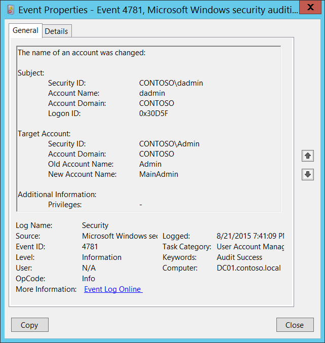

# 4781(S): アカウントの名前が変更されました。



***サブカテゴリ:***&nbsp;[ユーザー アカウント管理の監査](audit-user-account-management.md)

***イベントの説明:***

このイベントは、ユーザーまたはコンピューター アカウント名 (**sAMAccountName** 属性) が変更されるたびに生成されます。

ユーザー アカウントの場合、このイベントはドメイン コントローラー、メンバー サーバー、およびワークステーションで生成されます。

コンピューター アカウントの場合、このイベントはドメイン コントローラーでのみ生成されます。

> **注**&nbsp;&nbsp;推奨事項については、このイベントの[セキュリティ監視の推奨事項](#security-monitoring-recommendations)を参照してください。

<br clear="all">

***イベント XML:***
```
- <Event xmlns="http://schemas.microsoft.com/win/2004/08/events/event">
- <System>
 <Provider Name="Microsoft-Windows-Security-Auditing" Guid="{54849625-5478-4994-A5BA-3E3B0328C30D}" /> 
 <EventID>4781</EventID> 
 <Version>0</Version> 
 <Level>0</Level> 
 <Task>13824</Task> 
 <Opcode>0</Opcode> 
 <Keywords>0x8020000000000000</Keywords> 
 <TimeCreated SystemTime="2015-08-22T02:41:09.737420900Z" /> 
 <EventRecordID>175754</EventRecordID> 
 <Correlation /> 
 <Execution ProcessID="520" ThreadID="1112" /> 
 <Channel>Security</Channel> 
 <Computer>DC01.contoso.local</Computer> 
 <Security /> 
 </System>
- <EventData>
 <Data Name="OldTargetUserName">Admin</Data> 
 <Data Name="NewTargetUserName">MainAdmin</Data> 
 <Data Name="TargetDomainName">CONTOSO</Data> 
 <Data Name="TargetSid">S-1-5-21-3457937927-2839227994-823803824-6117</Data> 
 <Data Name="SubjectUserSid">S-1-5-21-3457937927-2839227994-823803824-1104</Data> 
 <Data Name="SubjectUserName">dadmin</Data> 
 <Data Name="SubjectDomainName">CONTOSO</Data> 
 <Data Name="SubjectLogonId">0x30d5f</Data> 
 <Data Name="PrivilegeList">-</Data> 
 </EventData>
 </Event>

```

***必要なサーバー ロール:*** なし。

***最小 OS バージョン:*** Windows Server 2008、Windows Vista。

***イベント バージョン:*** 0。

***フィールドの説明:***

**サブジェクト:**

-   **セキュリティ ID** \[タイプ = SID\]**:** 「アカウント名の変更」操作を実行したアカウントの SID。イベント ビューアーは自動的に SID を解決してアカウント名を表示しようとします。SID を解決できない場合、イベントにソース データが表示されます。

> **注**&nbsp;&nbsp;**セキュリティ識別子 (SID)** は、トラスティ (セキュリティ プリンシパル) を識別するために使用される可変長の一意の値です。各アカウントには、Active Directory ドメイン コントローラーなどの権限によって発行され、セキュリティ データベースに保存される一意の SID があります。ユーザーがログオンするたびに、システムはデータベースからそのユーザーの SID を取得し、そのユーザーのアクセス トークンに配置します。システムは、アクセス トークン内の SID を使用して、以降のすべての Windows セキュリティとのやり取りでユーザーを識別します。SID がユーザーまたはグループの一意の識別子として使用された場合、それは他のユーザーまたはグループを識別するために再利用されることはありません。SID の詳細については、[セキュリティ識別子](/windows/access-protection/access-control/security-identifiers)を参照してください。

-   **アカウント名** \[型 = UnicodeString\]**:** 「アカウント名の変更」操作を実行したアカウントの名前。

-   **アカウントドメイン** \[型 = UnicodeString\]**:** サブジェクトのドメインまたはコンピュータ名。形式はさまざまで、以下のようなものが含まれます：

    -   ドメイン NETBIOS 名の例: CONTOSO

    -   小文字の完全ドメイン名: contoso.local

    -   大文字の完全ドメイン名: CONTOSO.LOCAL

    -   一部の[既知のセキュリティプリンシパル](/windows/security/identity-protection/access-control/security-identifiers)（例えば、LOCAL SERVICE や ANONYMOUS LOGON）の場合、このフィールドの値は「NT AUTHORITY」となります。

    -   ローカルユーザーアカウントの場合、このフィールドにはこのアカウントが属するコンピュータまたはデバイスの名前が含まれます。例えば、「Win81」。

-   **ログオンID** \[型 = HexInt64\]**:** 16進数の値で、同じログオンIDを含む最近のイベントとこのイベントを関連付けるのに役立ちます。例えば、「[4624](event-4624.md): アカウントが正常にログオンされました。」

**ターゲットアカウント:**

-   **セキュリティID** \[型 = SID\]**:** 名前が変更されたアカウントのSID。イベントビューアーは自動的にSIDを解決してアカウント名を表示しようとします。SIDが解決できない場合、イベントにはソースデータが表示されます。

-   **アカウントドメイン** \[型 = UnicodeString\]**:** ターゲットアカウントのドメインまたはコンピュータ名。形式はさまざまで、以下のようなものが含まれます：

    -   ドメイン NETBIOS 名の例: CONTOSO

    -   小文字の完全ドメイン名: contoso.local

    -   大文字の完全ドメイン名: CONTOSO.LOCAL

    -   ローカルユーザーアカウントの場合、このフィールドにはこのアカウントが属するコンピュータまたはデバイスの名前が含まれます。例えば、「Win81」。

-   **旧アカウント名** \[型 = UnicodeString\]**:** ターゲットアカウントの旧名。

-   **新アカウント名** \[型 = UnicodeString\]**:** ターゲットアカウントの新名。

**追加情報:**

-   **特権** \[型 = UnicodeString\]: 操作中に使用されたユーザー特権のリスト。例えば、SeBackupPrivilege。このパラメータはイベントにキャプチャされない場合があり、その場合は「-」と表示されます。「表8. ユーザー特権」の完全なリストを参照してください。

## セキュリティ監視の推奨事項

4781(S): アカウントの名前が変更されました。

> **重要**&nbsp;&nbsp;このイベントについては、[付録A: 多くの監査イベントに対するセキュリティ監視の推奨事項](appendix-a-security-monitoring-recommendations-for-many-audit-events.md)も参照してください。

- 高価値のユーザーまたはコンピューターアカウント（またはローカルユーザーアカウント）について、アカウントの変更を監視する必要がある場合は、このイベントを**「ターゲットアカウント\\セキュリティID」**で監視し、高価値のアカウントに対応させます。
