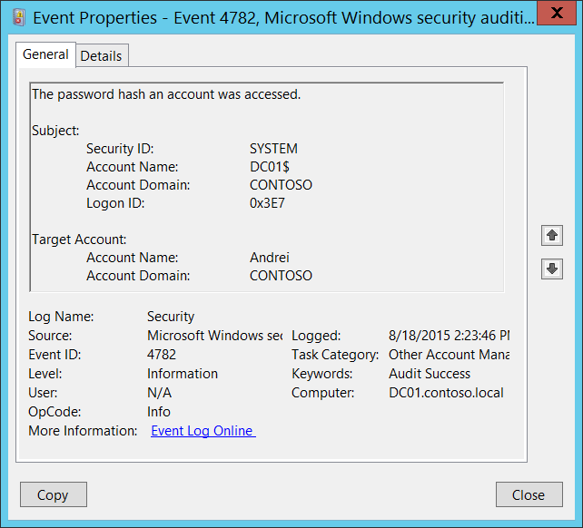

# 4782(S): アカウントのパスワードハッシュがアクセスされました。



***サブカテゴリ:***&nbsp;[その他のアカウント管理イベントの監査](audit-other-account-management-events.md)

***イベントの説明:***

このイベントは、[Active Directory Migration Toolkit](/previous-versions/windows/it-pro/windows-server-2008-R2-and-2008/cc974332(v=ws.10))を使用してアカウントのパスワードを移行する際にドメインコントローラーで生成されます。

通常、**「Subject\\Security ID」** は SYSTEM アカウントです。

> **注**&nbsp;&nbsp;推奨事項については、このイベントの[セキュリティ監視の推奨事項](#security-monitoring-recommendations)を参照してください。

<br clear="all">

***イベント XML:***
```
- <Event xmlns="http://schemas.microsoft.com/win/2004/08/events/event">
- <System>
 <Provider Name="Microsoft-Windows-Security-Auditing" Guid="{54849625-5478-4994-A5BA-3E3B0328C30D}" /> 
 <EventID>4782</EventID> 
 <Version>0</Version> 
 <Level>0</Level> 
 <Task>13829</Task> 
 <Opcode>0</Opcode> 
 <Keywords>0x8020000000000000</Keywords> 
 <TimeCreated SystemTime="2015-08-18T21:23:46.435367800Z" /> 
 <EventRecordID>174829</EventRecordID> 
 <Correlation /> 
 <Execution ProcessID="512" ThreadID="1232" /> 
 <Channel>Security</Channel> 
 <Computer>DC01.contoso.local</Computer> 
 <Security /> 
 </System>
- <EventData>
 <Data Name="TargetUserName">Andrei</Data> 
 <Data Name="TargetDomainName">CONTOSO</Data> 
 <Data Name="SubjectUserSid">S-1-5-18</Data> 
 <Data Name="SubjectUserName">DC01$</Data> 
 <Data Name="SubjectDomainName">CONTOSO</Data> 
 <Data Name="SubjectLogonId">0x3e7</Data> 
 </EventData>
 </Event>

```

***必要なサーバー役割:*** Active Directory ドメインコントローラー。

***最小 OS バージョン:*** Windows Server 2008。

***イベントバージョン:*** 0。

***フィールドの説明:***

**サブジェクト:**

-   **セキュリティ ID** \[タイプ = SID\]**:** ハッシュ移行操作を要求したアカウントの SID。イベントビューアーは自動的に SID を解決し、アカウント名を表示しようとします。SID を解決できない場合、イベントにはソースデータが表示されます。

> **注**&nbsp;&nbsp;**セキュリティ識別子 (SID)** は、信託者 (セキュリティプリンシパル) を識別するために使用される可変長の一意の値です。各アカウントには、Active Directory ドメインコントローラーなどの権限によって発行され、セキュリティデータベースに保存される一意の SID があります。ユーザーがログオンするたびに、システムはデータベースからそのユーザーの SID を取得し、そのユーザーのアクセス トークンに配置します。システムは、アクセス トークン内の SID を使用して、以降のすべての Windows セキュリティとのやり取りでユーザーを識別します。SID がユーザーまたはグループの一意の識別子として使用された場合、それは他のユーザーまたはグループを識別するために再利用されることはありません。SID の詳細については、[セキュリティ識別子](/windows/access-protection/access-control/security-identifiers)を参照してください。

-   **アカウント名** \[タイプ = UnicodeString\]**:** ハッシュ移行操作を要求したアカウントの名前。

-   **アカウントドメイン** \[タイプ = UnicodeString\]**:** サブジェクトのドメイン名。形式はさまざまで、以下を含みます：

    -   ドメイン NETBIOS 名の例: CONTOSO

    -   小文字の完全なドメイン名: contoso.local

    -   大文字の完全なドメイン名: CONTOSO.LOCAL

    -   ANONYMOUS LOGON の場合、このフィールドには **NT AUTHORITY** の値が表示されます。

-   **ログオンID** \[タイプ = HexInt64\]**:** 16進数の値で、最近のイベントと同じログオンIDを含む可能性のあるイベントとこのイベントを関連付けるのに役立ちます。例えば、「[4624](event-4624.md): アカウントが正常にログオンされました。」

**ターゲットアカウント:**

-   **アカウント名** \[タイプ = UnicodeString\]**:** パスワードハッシュが移行されたアカウントの名前。例えば: ServiceDesk

    -   ユーザーアカウントの例: Andrei

    -   コンピューターアカウントの例: DC01$

-   **アカウントドメイン** \[タイプ = UnicodeString\]**:** パスワードハッシュが移行されたアカウントのドメイン名。形式はさまざまで、以下を含みます：

    -   ドメイン NETBIOS 名の例: FABRIKAM

    -   小文字の完全なドメイン名: fabrikam.local

    -   大文字の完全なドメイン名: FABRIKAM.LOCAL

## セキュリティ監視の推奨事項

4782(S): アカウントのパスワードハッシュがアクセスされました。

-   このタイプのすべてのイベントを監視します。アカウントのパスワードハッシュに関する操作は計画されているべきです。この操作が計画されていなかった場合、変更の理由を調査します。
