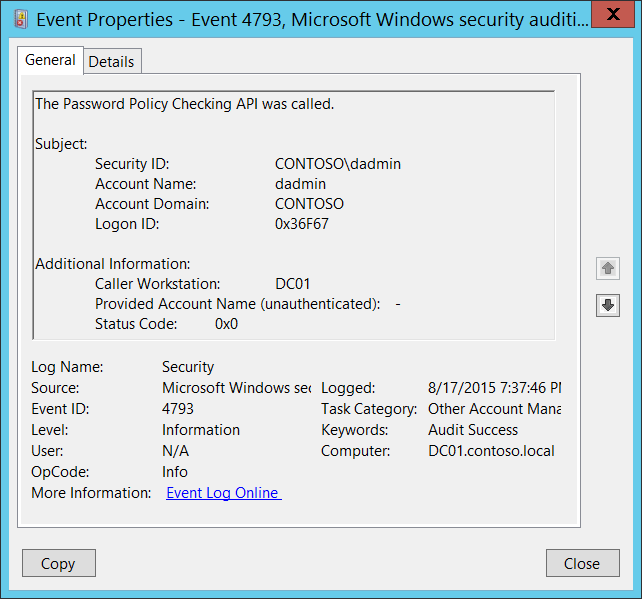

# 4793(S): パスワードポリシーチェックAPIが呼び出されました。



***サブカテゴリ:***&nbsp;[その他のアカウント管理イベントの監査](audit-other-account-management-events.md)

***イベントの説明:***

このイベントは、[パスワードポリシーチェックAPI](/windows/win32/api/lmaccess/nf-lmaccess-netvalidatepasswordpolicy)が呼び出されるたびに生成されます。

パスワードポリシーチェックAPIは、アプリケーションが提供するアカウントデータベースまたは単一のアカウントに対してパスワードの準拠性をチェックし、パスワードポリシーの複雑さ、エージング、最小長、および履歴再利用要件を満たしていることを確認することを可能にします。

例えば、このイベントは、ディレクトリサービス復元モード([DSRM](/archive/blogs/askds/ds-restore-mode-password-maintenance))アカウントのパスワードリセット手順中に新しいDSRMパスワードをチェックするために生成されます。

このイベントは、パスワードポリシーチェックAPIが呼び出されたコンピューターで生成されます。

Microsoft SQL Server 2005以降、「SQL Serverパスワードポリシー」機能がSQL Server上で多くの4793イベントを生成する可能性があることに注意してください。

> **注**&nbsp;&nbsp;推奨事項については、このイベントの[セキュリティ監視の推奨事項](#security-monitoring-recommendations)を参照してください。

<br clear="all">

***イベントXML:***
```
- <Event xmlns="http://schemas.microsoft.com/win/2004/08/events/event">
- <System>
 <Provider Name="Microsoft-Windows-Security-Auditing" Guid="{54849625-5478-4994-A5BA-3E3B0328C30D}" /> 
 <EventID>4793</EventID> 
 <Version>0</Version> 
 <Level>0</Level> 
 <Task>13829</Task> 
 <Opcode>0</Opcode> 
 <Keywords>0x8020000000000000</Keywords> 
 <TimeCreated SystemTime="2015-08-18T02:37:46.322424300Z" /> 
 <EventRecordID>172342</EventRecordID> 
 <Correlation /> 
 <Execution ProcessID="520" ThreadID="2964" /> 
 <Channel>Security</Channel> 
 <Computer>DC01.contoso.local</Computer> 
 <Security /> 
 </System>
- <EventData>
 <Data Name="SubjectUserSid">S-1-5-21-3457937927-2839227994-823803824-1104</Data> 
 <Data Name="SubjectUserName">dadmin</Data> 
 <Data Name="SubjectDomainName">CONTOSO</Data> 
 <Data Name="SubjectLogonId">0x36f67</Data> 
 <Data Name="Workstation">DC01</Data> 
 <Data Name="TargetUserName">-</Data> 
 <Data Name="Status">0x0</Data> 
 </EventData>
 </Event>

```

***必要なサーバーロール:*** なし。

***最小OSバージョン:*** Windows Server 2008, Windows Vista。

***イベントバージョン:*** 0。

***フィールドの説明:***

**サブジェクト:**

-   **セキュリティID** \[タイプ = SID\]**:** パスワードポリシーチェックAPI操作を要求したアカウントのSID。イベントビューアーは自動的にSIDを解決し、アカウント名を表示しようとします。SIDが解決できない場合、イベントにソースデータが表示されます。

> **注**&nbsp;&nbsp;**セキュリティ識別子 (SID)** は、トラスティ (セキュリティプリンシパル) を識別するために使用される可変長の一意の値です。各アカウントには、Active Directory ドメイン コントローラーなどの権限によって発行され、セキュリティ データベースに保存される一意の SID があります。ユーザーがログオンするたびに、システムはデータベースからそのユーザーの SID を取得し、そのユーザーのアクセストークンに配置します。システムは、アクセストークン内の SID を使用して、以降のすべての Windows セキュリティとのやり取りでユーザーを識別します。SID がユーザーまたはグループの一意の識別子として使用された場合、それは他のユーザーまたはグループを識別するために再び使用されることはありません。SID の詳細については、[セキュリティ識別子](/windows/access-protection/access-control/security-identifiers) を参照してください。

-   **アカウント名** \[タイプ = UnicodeString\]**:** パスワード ポリシー チェック API 操作を要求したアカウントの名前。

-   **アカウント ドメイン** \[タイプ = UnicodeString\]**:** サブジェクトのドメイン名。形式はさまざまで、以下を含みます:

    -   ドメイン NETBIOS 名の例: CONTOSO

    -   小文字の完全なドメイン名: contoso.local

    -   大文字の完全なドメイン名: CONTOSO.LOCAL

    -   LOCAL SERVICE や ANONYMOUS LOGON などの[よく知られたセキュリティプリンシパル](/windows/security/identity-protection/access-control/security-identifiers)の場合、このフィールドの値は「NT AUTHORITY」です。

    -   ローカル ユーザー アカウントの場合、このフィールドには、このアカウントが属するコンピューターまたはデバイスの名前が含まれます。例: 「Win81」。

-   **ログオン ID** \[タイプ = HexInt64\]**:** このイベントを、同じログオン ID を含む可能性のある最近のイベントと関連付けるのに役立つ 16 進数値。例: 「[4624](event-4624.md): アカウントが正常にログオンされました。」

**追加情報:**

-   **呼び出し元ワークステーション** \[タイプ = UnicodeString\]**:** パスワード ポリシー チェック API が呼び出されたコンピューターの名前。通常、これはこのイベントが生成されたのと同じコンピューターです。例: DC01。ここでのコンピューター名には、末尾に **$** 記号が含まれていません。また、IP アドレスやコンピューターの DNS 名である場合もあります。

-   **提供されたアカウント名（認証されていない）** \[タイプ = UnicodeString\]**:** 検証のためにパスワードが提供/要求されたアカウントの名前。このパラメータはイベントでキャプチャされない場合があり、その場合は「-」として表示されます。

-   **ステータスコード** \[タイプ = HexInt32\]**:** 通常は「**0x0**」の値を持ちます。ステータスコードは、パスワードがドメインのパスワードポリシーを満たしているかどうかに関係なく「**0x0**」です。

## セキュリティ監視の推奨事項

4793(S): パスワードポリシーチェックAPIが呼び出されました。

> **重要**&nbsp;&nbsp;このイベントについては、[付録A: 多くの監査イベントに対するセキュリティ監視の推奨事項](appendix-a-security-monitoring-recommendations-for-many-audit-events.md)も参照してください。

-   通常、これは情報提供のイベントであり、パスワードポリシーチェックAPIがいつ呼び出されたか、誰が呼び出したかについての情報を提供します。**提供されたアカウント名**は常に値を持つわけではなく、パスワードポリシーチェックがどのアカウントに対して行われたかを特定することが本当に不可能な場合もあります。
