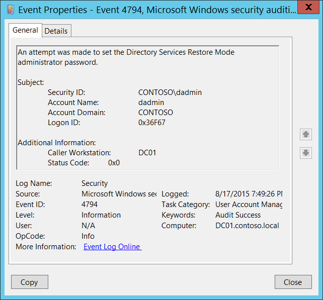

# 4794(S, F): ディレクトリサービス復元モード管理者パスワードの設定が試行されました。



***サブカテゴリ:***&nbsp;[ユーザーアカウント管理の監査](audit-user-account-management.md)

***イベントの説明:***

このイベントは、ディレクトリサービス復元モード (DSRM) 管理者パスワードが変更されるたびに生成されます。

このイベントはドメインコントローラーでのみ生成されます。

> **注**&nbsp;&nbsp;推奨事項については、このイベントの[セキュリティ監視の推奨事項](#security-monitoring-recommendations)を参照してください。

<br clear="all">

***イベント XML:***
```xml
- <Event xmlns="http://schemas.microsoft.com/win/2004/08/events/event">
- <System>
 <Provider Name="Microsoft-Windows-Security-Auditing" Guid="{54849625-5478-4994-A5BA-3E3B0328C30D}" /> 
 <EventID>4794</EventID> 
 <Version>0</Version> 
 <Level>0</Level> 
 <Task>13824</Task> 
 <Opcode>0</Opcode> 
 <Keywords>0x8020000000000000</Keywords> 
 <TimeCreated SystemTime="2015-08-18T02:49:26.087748900Z" /> 
 <EventRecordID>172348</EventRecordID> 
 <Correlation /> 
 <Execution ProcessID="520" ThreadID="2964" /> 
 <Channel>Security</Channel> 
 <Computer>DC01.contoso.local</Computer> 
 <Security /> 
 </System>
- <EventData>
 <Data Name="SubjectUserSid">S-1-5-21-3457937927-2839227994-823803824-1104</Data> 
 <Data Name="SubjectUserName">dadmin</Data> 
 <Data Name="SubjectDomainName">CONTOSO</Data> 
 <Data Name="SubjectLogonId">0x36f67</Data> 
 <Data Name="Workstation">DC01</Data> 
 <Data Name="Status">0x0</Data> 
 </EventData>
 </Event>

```

***必要なサーバーロール:*** Active Directory ドメインコントローラー。

***最小 OS バージョン:*** Windows Server 2008。

***イベントバージョン:*** 0。

***フィールドの説明:***

**サブジェクト:**

-   **セキュリティ ID** \[タイプ = SID\]**:** ディレクトリサービス復元モード管理者パスワードの設定を試みたアカウントの SID。イベントビューアーは自動的に SID を解決してアカウント名を表示しようとします。SID が解決できない場合、イベントにソースデータが表示されます。

> **注**&nbsp;&nbsp;**セキュリティ識別子 (SID)** は、トラスティ (セキュリティプリンシパル) を識別するために使用される可変長の一意の値です。各アカウントには、Active Directory ドメインコントローラーなどの権限によって発行され、セキュリティデータベースに保存される一意の SID があります。ユーザーがログオンするたびに、システムはデータベースからそのユーザーの SID を取得し、そのユーザーのアクセス トークンに配置します。システムは、アクセス トークン内の SID を使用して、以降のすべての Windows セキュリティとのやり取りでユーザーを識別します。SID がユーザーまたはグループの一意の識別子として使用された場合、それは他のユーザーまたはグループを識別するために再利用されることはありません。SID の詳細については、[セキュリティ識別子](/windows/access-protection/access-control/security-identifiers)を参照してください。

-   **アカウント名** \[タイプ = UnicodeString\]**:** ディレクトリ サービス復元モード管理者パスワードの設定を試みたアカウントの名前。

-   **アカウント ドメイン** \[タイプ = UnicodeString\]**:** サブジェクトのドメインまたはコンピュータ名。形式はさまざまで、以下を含みます：

    -   ドメイン NETBIOS 名の例: CONTOSO

    -   小文字の完全なドメイン名: contoso.local

    -   大文字の完全なドメイン名: CONTOSO.LOCAL

    -   一部の[既知のセキュリティ プリンシパル](/windows/security/identity-protection/access-control/security-identifiers)の場合、例えば LOCAL SERVICE や ANONYMOUS LOGON、このフィールドの値は “NT AUTHORITY” です。

    -   ローカル ユーザー アカウントの場合、このフィールドにはこのアカウントが属するコンピュータまたはデバイスの名前が含まれます。例えば: “Win81”。

-   **ログオン ID** \[タイプ = HexInt64\]**:** 16 進数の値で、同じログオン ID を含む最近のイベントとこのイベントを関連付けるのに役立ちます。例えば、 “[4624](event-4624.md): アカウントが正常にログオンされました。”

**追加情報:**

-   **呼び出し元ワークステーション** \[タイプ = UnicodeString\]**:** ディレクトリ サービス復元モード (DSRM) 管理者パスワード変更要求が受信されたコンピュータ アカウントの名前。例えば: “**DC01**”。変更要求がローカル (同じサーバー) から送信された場合、このフィールドにはコンピュータ アカウントと同じ名前が表示されます。

-   **ステータス コード** \[タイプ = HexInt32\]**:** 成功イベントの場合、値は “**0x0**” です。

## セキュリティ監視の推奨事項

4794(S, F): ディレクトリ サービス復元モード管理者パスワードの設定が試行されました。

-   常に 4794 イベントを監視し、それらが発生したときにアラートをトリガーします。
