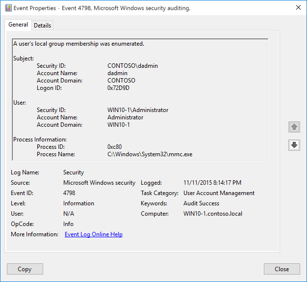

# 4798(S): ユーザーのローカルグループメンバーシップが列挙されました。



***サブカテゴリ:***&nbsp;[ユーザーアカウント管理の監査](audit-user-account-management.md)

***イベントの説明:***

このイベントは、プロセスがコンピューターまたはデバイス上のユーザーのセキュリティ有効なローカルグループを列挙したときに生成されます。

> **注**&nbsp;&nbsp;推奨事項については、このイベントの[セキュリティ監視の推奨事項](#security-monitoring-recommendations)を参照してください。

<br clear="all">

***イベント XML:***
```xml
- <Event xmlns="http://schemas.microsoft.com/win/2004/08/events/event">
- <System>
 <Provider Name="Microsoft-Windows-Security-Auditing" Guid="{54849625-5478-4994-A5BA-3E3B0328C30D}" /> 
 <EventID>4798</EventID> 
 <Version>0</Version> 
 <Level>0</Level> 
 <Task>13824</Task> 
 <Opcode>0</Opcode> 
 <Keywords>0x8020000000000000</Keywords> 
 <TimeCreated SystemTime="2015-11-12T04:14:17.436787700Z" /> 
 <EventRecordID>691</EventRecordID> 
 <Correlation ActivityID="{CBAEDE08-1CF0-0000-50DE-AECBF01CD101}" /> 
 <Execution ProcessID="744" ThreadID="3928" /> 
 <Channel>Security</Channel> 
 <Computer>WIN10-1.contoso.local</Computer> 
 <Security /> 
 </System>
- <EventData>
 <Data Name="TargetUserName">Administrator</Data> 
 <Data Name="TargetDomainName">WIN10-1</Data> 
 <Data Name="TargetSid">S-1-5-21-1694160624-234216347-2203645164-500</Data> 
 <Data Name="SubjectUserSid">S-1-5-21-1377283216-344919071-3415362939-1104</Data> 
 <Data Name="SubjectUserName">dadmin</Data> 
 <Data Name="SubjectDomainName">CONTOSO</Data> 
 <Data Name="SubjectLogonId">0x72d9d</Data> 
 <Data Name="CallerProcessId">0xc80</Data> 
 <Data Name="CallerProcessName">C:\\Windows\\System32\\mmc.exe</Data> 
 </EventData>
</Event>

```

***必要なサーバーロール:*** なし。

***最小 OS バージョン:*** Windows Server 2016, Windows 10。

***イベントバージョン:*** 0。

***フィールドの説明:***

**サブジェクト:**

-   **セキュリティ ID** \[タイプ = SID\]**:** 「ユーザーのセキュリティ有効なローカルグループを列挙する」操作を要求したアカウントの SID。イベントビューアーは自動的に SID を解決し、アカウント名を表示しようとします。SID を解決できない場合、イベントにはソースデータが表示されます。

> **注**&nbsp;&nbsp;**セキュリティ識別子 (SID)** は、信託者 (セキュリティプリンシパル) を識別するために使用される可変長の一意の値です。各アカウントには、Active Directory ドメインコントローラーなどの権限によって発行され、セキュリティデータベースに保存される一意の SID があります。ユーザーがログオンするたびに、システムはデータベースからそのユーザーの SID を取得し、そのユーザーのアクセストークンに配置します。システムはアクセストークン内の SID を使用して、以降のすべての Windows セキュリティとのやり取りでユーザーを識別します。SID がユーザーまたはグループの一意の識別子として使用された場合、それは他のユーザーまたはグループを識別するために再利用されることはありません。SID の詳細については、[セキュリティ識別子](/windows/access-protection/access-control/security-identifiers)を参照してください。

-   **アカウント名** \[タイプ = UnicodeString\]**:** 「ユーザーのセキュリティ有効なローカルグループを列挙する」操作を要求したアカウントの名前。

-   **アカウントドメイン** \[タイプ = UnicodeString\]**:** サブジェクトのドメインまたはコンピュータ名。形式はさまざまで、以下を含みます：

    -   ドメイン NETBIOS 名の例: CONTOSO

    -   小文字の完全ドメイン名: contoso.local

    -   大文字の完全ドメイン名: CONTOSO.LOCAL

    -   一部の[よく知られたセキュリティプリンシパル](/windows/security/identity-protection/access-control/security-identifiers)の場合、例えば LOCAL SERVICE や ANONYMOUS LOGON、このフィールドの値は「NT AUTHORITY」となります。

    -   ローカルユーザーアカウントの場合、このフィールドにはこのアカウントが属するコンピュータまたはデバイスの名前が含まれます。例えば：「Win81」。

-   **ログオンID** \[タイプ = HexInt64\]**:** 16進数の値で、最近のイベントと同じログオンIDを含む可能性のあるイベントとこのイベントを関連付けるのに役立ちます。例えば、「[4624](event-4624.md): アカウントが正常にログオンされました。」

**ユーザー:**

-   **セキュリティID** \[タイプ = SID\]: グループが列挙されたアカウントのSID。イベントビューアは自動的にSIDを解決してアカウント名を表示しようとします。SIDを解決できない場合、イベントにはソースデータが表示されます。

-   **アカウント名** \[タイプ = UnicodeString\]: グループが列挙されたアカウントの名前。

-   **アカウントドメイン** \[タイプ = UnicodeString\]: グループのドメインまたはコンピュータ名。形式はさまざまで、以下を含みます：

    -   ローカルグループの場合、このフィールドにはこのグループが属するコンピュータの名前が含まれます。例えば：「Win81」。

    -   ドメイン NETBIOS 名の例: CONTOSO

    -   小文字の完全ドメイン名: contoso.local

    -   大文字の完全ドメイン名: CONTOSO.LOCAL

**プロセス情報:**

-   **プロセスID** \[タイプ = Pointer\]: グループのメンバーを列挙したプロセスの16進数のプロセスID。プロセスID (PID) は、オペレーティングシステムがアクティブなプロセスを一意に識別するために使用する番号です。特定のプロセスのPIDを確認するには、例えばタスクマネージャー（詳細タブ、PID列）を使用できます。


> 16進数の値を10進数に変換すると、タスクマネージャーの値と比較できます。

このプロセスIDを他のイベントのプロセスIDと関連付けることもできます。例えば、「[4688](event-4688.md): 新しいプロセスが作成されました」**プロセス情報\\新しいプロセスID**。

-   **プロセス名** \[タイプ = UnicodeString\]**:** プロセスの実行ファイルのフルパスと名前。

## セキュリティ監視の推奨事項

4798(S): ユーザーのローカルグループメンバーシップが列挙されました。

> **重要**&nbsp;&nbsp;このイベントについては、[付録A: 多くの監査イベントのセキュリティ監視の推奨事項](appendix-a-security-monitoring-recommendations-for-many-audit-events.md)も参照してください。

-   グループメンバーシップの列挙やアクセス試行を監視する必要がある高価値のドメインまたはローカルアカウントがある場合、その高価値アカウントに対応する**「サブジェクト\\セキュリティID」**のイベントを監視します。

-   このイベントで報告されたプロセスの事前定義された「**プロセス名**」がある場合、定義された値と異なる「**プロセス名**」のすべてのイベントを監視します。

-   「**プロセス名**」が標準フォルダ（例えば、**System32**や**Program Files**）にないか、制限されたフォルダ（例えば、**Temporary Internet Files**）にあるかを監視できます。

-   プロセス名に制限された部分文字列や単語（例えば、「**mimikatz**」や「**cain.exe**」）の事前定義リストがある場合、「**プロセス名**」にこれらの部分文字列が含まれているかを確認します。
