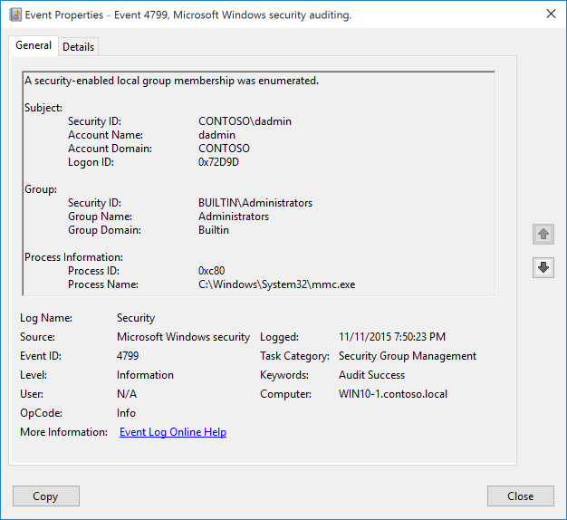

# 4799(S): セキュリティ有効なローカルグループのメンバーシップが列挙されました。



***サブカテゴリ:***&nbsp;[セキュリティグループ管理の監査](audit-security-group-management.md)

***イベントの説明:***

このイベントは、プロセスがコンピューターまたはデバイス上のセキュリティ有効なローカルグループのメンバーを列挙したときに生成されます。

このイベントは、Active Directory ユーザーとコンピューターのスナップインを使用してグループメンバーが列挙された場合には生成されません。

> **注**&nbsp;&nbsp;推奨事項については、このイベントの[セキュリティ監視の推奨事項](#security-monitoring-recommendations)を参照してください。

<br clear="all">

***イベント XML:***
```xml
- <Event xmlns="http://schemas.microsoft.com/win/2004/08/events/event">
- <System>
 <Provider Name="Microsoft-Windows-Security-Auditing" Guid="{54849625-5478-4994-A5BA-3E3B0328C30D}" /> 
 <EventID>4799</EventID> 
 <Version>0</Version> 
 <Level>0</Level> 
 <Task>13826</Task> 
 <Opcode>0</Opcode> 
 <Keywords>0x8020000000000000</Keywords> 
 <TimeCreated SystemTime="2015-11-12T03:50:23.625407600Z" /> 
 <EventRecordID>685</EventRecordID> 
 <Correlation ActivityID="{CBAEDE08-1CF0-0000-50DE-AECBF01CD101}" /> 
 <Execution ProcessID="744" ThreadID="188" /> 
 <Channel>Security</Channel> 
 <Computer>WIN10-1.contoso.local</Computer> 
 <Security /> 
 </System>
- <EventData>
 <Data Name="TargetUserName">Administrators</Data> 
 <Data Name="TargetDomainName">Builtin</Data> 
 <Data Name="TargetSid">S-1-5-32-544</Data> 
 <Data Name="SubjectUserSid">S-1-5-21-1377283216-344919071-3415362939-1104</Data> 
 <Data Name="SubjectUserName">dadmin</Data> 
 <Data Name="SubjectDomainName">CONTOSO</Data> 
 <Data Name="SubjectLogonId">0x72d9d</Data> 
 <Data Name="CallerProcessId">0xc80</Data> 
 <Data Name="CallerProcessName">C:\\Windows\\System32\\mmc.exe</Data> 
 </EventData>
</Event>

```

***必要なサーバー役割:*** なし。

***最小 OS バージョン:*** Windows Server 2016, Windows 10。

***イベントバージョン:*** 0。

***フィールドの説明:***

**サブジェクト:**

-   **セキュリティ ID** \[タイプ = SID\]**:** 「セキュリティ有効なローカルグループメンバーの列挙」操作を要求したアカウントの SID。イベントビューアーは自動的に SID を解決し、アカウント名を表示しようとします。SID を解決できない場合、イベントにはソースデータが表示されます。

> **注**&nbsp;&nbsp;**セキュリティ識別子 (SID)** は、トラスティ (セキュリティプリンシパル) を識別するために使用される可変長の一意の値です。各アカウントには、Active Directory ドメインコントローラーなどの権限によって発行され、セキュリティデータベースに保存される一意の SID があります。ユーザーがログオンするたびに、システムはデータベースからそのユーザーの SID を取得し、そのユーザーのアクセストークンに配置します。システムはアクセストークン内の SID を使用して、以降のすべての Windows セキュリティとのやり取りでユーザーを識別します。SID がユーザーまたはグループの一意の識別子として使用された場合、それは他のユーザーまたはグループを識別するために再利用されることはありません。SID についての詳細は、[セキュリティ識別子](/windows/access-protection/access-control/security-identifiers)を参照してください。

-   **アカウント名** \[タイプ = UnicodeString\]**:** 「セキュリティ有効なローカルグループメンバーを列挙する」操作を要求したアカウントの名前。

-   **アカウントドメイン** \[タイプ = UnicodeString\]**:** サブジェクトのドメインまたはコンピュータ名。形式はさまざまで、以下を含みます：

    -   ドメイン NETBIOS 名の例: CONTOSO

    -   小文字の完全ドメイン名: contoso.local

    -   大文字の完全ドメイン名: CONTOSO.LOCAL

    -   一部の[よく知られたセキュリティプリンシパル](/windows/security/identity-protection/access-control/security-identifiers)の場合、例えば LOCAL SERVICE や ANONYMOUS LOGON、このフィールドの値は「NT AUTHORITY」となります。

    -   ローカルユーザーアカウントの場合、このフィールドにはこのアカウントが属するコンピュータまたはデバイスの名前が含まれます。例えば、「Win81」。

-   **ログオンID** \[タイプ = HexInt64\]**:** 16進数の値で、最近のイベントと同じログオンIDを含む可能性のあるイベントとこのイベントを関連付けるのに役立ちます。例えば、「[4624](event-4624.md): アカウントが正常にログオンされました。」

**グループ:**

-   **セキュリティID \[タイプ = SID\]:** メンバーが列挙されたグループのSID。イベントビューアーは自動的にSIDを解決し、アカウント名を表示しようとします。SIDが解決できない場合、イベントにソースデータが表示されます。

-   **グループ名 \[タイプ = UnicodeString\]:** メンバーが列挙されたグループの名前。

-   **グループドメイン \[タイプ = UnicodeString\]: グループのドメインまたはコンピュータ名。形式はさまざまで、以下を含みます：**

    -   ビルトイングループの場合、このフィールドには「Builtin」の値が含まれます。

    -   ドメイン NETBIOS 名の例: CONTOSO

    -   小文字の完全ドメイン名: contoso.local

    -   大文字の完全ドメイン名: CONTOSO.LOCAL

    -   ローカルグループの場合、このフィールドにはこのグループが属するコンピュータの名前が含まれます。例えば、「Win81」。

**プロセス情報:**

-   **プロセスID** \[タイプ = Pointer\]: グループのメンバーを列挙したプロセスの16進数のプロセスID。プロセスID (PID) は、オペレーティングシステムがアクティブなプロセスを一意に識別するために使用する番号です。特定のプロセスのPIDを確認するには、例えばタスクマネージャー（詳細タブ、PID列）を使用できます。

    

> 16進数の値を10進数に変換すると、タスクマネージャーの値と比較できます。

このプロセスIDを他のイベントのプロセスIDと関連付けることもできます。例えば、「[4688](event-4688.md): 新しいプロセスが作成されました」**プロセス情報\\新しいプロセスID**。

-   **プロセス名** \[Type = UnicodeString\]**:** プロセスの実行ファイルのフルパスと名前。

## セキュリティ監視の推奨事項

4799(S): セキュリティが有効なローカルグループのメンバーシップが列挙されました。

> **重要**&nbsp;&nbsp;このイベントについては、[付録A: 多くの監査イベントのセキュリティ監視の推奨事項](appendix-a-security-monitoring-recommendations-for-many-audit-events.md)も参照してください。

-   組織内の重要なローカルセキュリティグループのリストがあり、これらのグループへのアクセス（この場合、グループメンバーシップの列挙）を特に監視する必要がある場合は、重要なローカルセキュリティグループに対応する「**グループ\\グループ名**」の値を持つイベントを監視します。重要なローカルグループの例としては、組み込みのローカル管理者、組み込みのバックアップオペレーターなどがあります。

-   ローカルまたはドメインセキュリティグループのメンバーシップが列挙されるたびに、誰がいつメンバーシップを列挙したかを監視する必要がある場合は、このイベントを監視します。通常、このイベントは必要に応じてレビューされる情報イベントとして使用されます。
