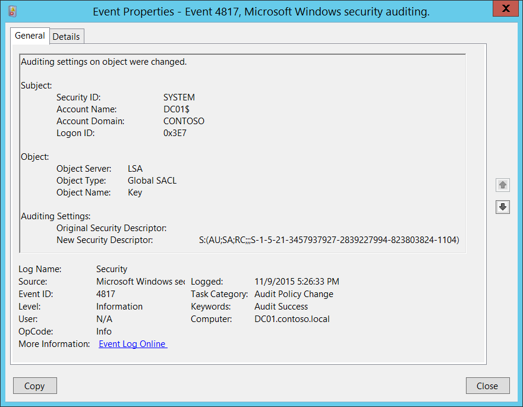

# 4817(S): オブジェクトの監査設定が変更されました。




***サブカテゴリ:***&nbsp;[監査ポリシーの変更](audit-audit-policy-change.md)

***イベントの説明:***

このイベントは、コンピューター上の[グローバルオブジェクトアクセス監査](/previous-versions/windows/it-pro/windows-server-2008-R2-and-2008/dd772630(v=ws.10))ポリシーが変更されたときに生成されます。

「レジストリ」と「ファイルシステム」のポリシー変更については、別々のイベントが生成されます。

> **注**&nbsp;&nbsp;推奨事項については、このイベントの[セキュリティ監視の推奨事項](#security-monitoring-recommendations)を参照してください。

<br clear="all">

***イベント XML:***
```xml
- <Event xmlns="http://schemas.microsoft.com/win/2004/08/events/event">
- <System>
 <Provider Name="Microsoft-Windows-Security-Auditing" Guid="{54849625-5478-4994-A5BA-3E3B0328C30D}" /> 
 <EventID>4817</EventID> 
 <Version>0</Version> 
 <Level>0</Level> 
 <Task>13568</Task> 
 <Opcode>0</Opcode> 
 <Keywords>0x8020000000000000</Keywords> 
 <TimeCreated SystemTime="2015-11-10T01:26:33.191368500Z" /> 
 <EventRecordID>1192270</EventRecordID> 
 <Correlation /> 
 <Execution ProcessID="516" ThreadID="3048" /> 
 <Channel>Security</Channel> 
 <Computer>DC01.contoso.local</Computer> 
 <Security /> 
 </System>
- <EventData>
 <Data Name="SubjectUserSid">S-1-5-18</Data> 
 <Data Name="SubjectUserName">DC01$</Data> 
 <Data Name="SubjectDomainName">CONTOSO</Data> 
 <Data Name="SubjectLogonId">0x3e7</Data> 
 <Data Name="ObjectServer">LSA</Data> 
 <Data Name="ObjectType">Global SACL</Data> 
 <Data Name="ObjectName">Key</Data> 
 <Data Name="OldSd" /> 
 <Data Name="NewSd">S:(AU;SA;RC;;;S-1-5-21-3457937927-2839227994-823803824-1104)</Data> 
 </EventData>
 </Event>
```

***必要なサーバー役割:*** なし。

***最小 OS バージョン:*** Windows Server 2008 R2, Windows 7。

***イベントバージョン:*** 0。

***フィールドの説明:***

**サブジェクト:**

-   **セキュリティ ID** \[タイプ = SID\]**:** グローバルオブジェクトアクセス監査ポリシーを変更したアカウントの SID。イベントビューアーは自動的に SID を解決し、アカウント名を表示しようとします。SID を解決できない場合、イベントにソースデータが表示されます。

> **注**&nbsp;&nbsp;**セキュリティ識別子 (SID)** は、トラスティ (セキュリティプリンシパル) を識別するために使用される可変長の一意の値です。各アカウントには、Active Directory ドメインコントローラーなどの権限によって発行され、セキュリティデータベースに保存される一意の SID があります。ユーザーがログオンするたびに、システムはデータベースからそのユーザーの SID を取得し、そのユーザーのアクセストークンに配置します。システムは、アクセストークン内の SID を使用して、以降のすべての Windows セキュリティとのやり取りでユーザーを識別します。SID がユーザーまたはグループの一意の識別子として使用された場合、それは他のユーザーまたはグループを識別するために再利用されることはありません。SID についての詳細は、[セキュリティ識別子](/windows/access-protection/access-control/security-identifiers)を参照してください。

-   **アカウント名** \[タイプ = UnicodeString\]**:** グローバルオブジェクトアクセス監査ポリシーに変更を加えたアカウントの名前。

-   **アカウントドメイン** \[タイプ = UnicodeString\]**:** サブジェクトのドメインまたはコンピュータ名。形式は以下のように異なります：

    -   ドメインのNETBIOS名の例: CONTOSO

    -   小文字の完全なドメイン名: contoso.local

    -   大文字の完全なドメイン名: CONTOSO.LOCAL

    -   一部の[よく知られたセキュリティプリンシパル](/windows/security/identity-protection/access-control/security-identifiers)の場合、例えばLOCAL SERVICEやANONYMOUS LOGON、このフィールドの値は「NT AUTHORITY」となります。

    -   ローカルユーザーアカウントの場合、このフィールドにはこのアカウントが属するコンピュータまたはデバイスの名前が含まれます。例えば：「Win81」。

-   **ログオンID** \[タイプ = HexInt64\]**:** 16進数の値で、最近のイベントとこのイベントを関連付けるのに役立ちます。同じログオンIDを含む可能性のあるイベントの例として、「[4624](event-4624.md): アカウントが正常にログオンされました。」

**オブジェクト:**

-   **オブジェクトサーバー** \[タイプ = UnicodeString\]: このイベントの「**LSA**」値を持ちます。

-   **オブジェクトタイプ** \[タイプ = UnicodeString\]: このイベントが適用されるオブジェクトのタイプ。常にこのイベントでは「**Global SACL**」です。

    以下の表は、最も一般的な**オブジェクトタイプ**のリストを含んでいます：

| ディレクトリ           | イベント    | タイマー            | デバイス                |
|-------------------------|--------------|----------------------|-------------------------|
| ミュータント            | タイプ       | ファイル             | トークン                |
| スレッド                | セクション   | ウィンドウステーション | デバッグオブジェクト    |
| フィルター通信ポート    | イベントペア | ドライバー           | IoCompletion            |
| コントローラー          | シンボリックリンク | WmiGuid              | プロセス                |
| プロファイル            | デスクトップ | キードイベント       | 中央アクセスポリシー    |
| キー                    | 待機可能ポート | コールバック         | グローバルSACL          |
| ジョブ                  | ポート       | フィルター接続ポート |                         |
| ALPCポート              | セマフォ     | アダプター           |                         |

-   **オブジェクト名:**

    -   レジストリ – 「レジストリ」グローバルオブジェクトアクセス監査ポリシーが変更された場合。

    -   ファイル – 「ファイルシステム」グローバルオブジェクトアクセス監査ポリシーが変更された場合。

**監査設定:**

-   **元のセキュリティ記述子** \[タイプ = UnicodeString\]**:** グローバルオブジェクトアクセス監査ポリシーの古いセキュリティ記述子定義言語 (SDDL) 値。グローバルオブジェクトアクセス監査ポリシーの SACL が設定されていない場合は空です。

-   **新しいセキュリティ記述子** \[タイプ = UnicodeString\]**:** グローバルオブジェクトアクセス監査ポリシーの新しいセキュリティ記述子定義言語 (SDDL) 値。

> **注**&nbsp;&nbsp;**セキュリティ記述子定義言語 (SDDL)** は、セキュリティ記述子に含まれる情報を列挙するための文字列要素を定義します。
> 
> 例:
> 
> *O*:BA*G*:SY*D*:(D;;0xf0007;;;AN)(D;;0xf0007;;;BG)(A;;0xf0007;;;SY)(A;;0×7;;;BA)*S*:ARAI(AU;SAFA;DCLCRPCRSDWDWO;;;WD)
> 
> - *O*: = 所有者。特定のセキュリティプリンシパルの SID、または予約済み（事前定義済み）の値。例: BA (BUILTIN\_ADMINISTRATORS)、WD (Everyone)、SY (LOCAL\_SYSTEM) など。可能な値のリストは以下の表を参照してください:

| 値   | 説明                                    | 値   | 説明                             |
|------|-----------------------------------------|------|----------------------------------|
| "AO" | アカウントオペレーター                  | "PA" | グループポリシー管理者           |
| "RU" | 以前の Windows 2000 を許可するエイリアス | "IU" | インタラクティブにログオンしたユーザー |
| "AN" | 匿名ログオン                            | "LA" | ローカル管理者                   |
| "AU" | 認証されたユーザー                      | "LG" | ローカルゲスト                   |
| "BA" | 組み込み管理者                          | "LS" | ローカルサービスアカウント       |
| "BG" | 組み込みゲスト                          | "SY" | ローカルシステム                 |
| "BO" | バックアップオペレーター                | "NU" | ネットワークログオンユーザー     |
| "BU" | 組み込みユーザー                        | "NO" | ネットワーク構成オペレーター     |
| "CA" | 証明書サーバー管理者                    | "NS" | ネットワークサービスアカウント   |
| "CG" | クリエーターグループ                    | "PO" | プリンターオペレーター           |
| "CO" | クリエーター所有者                      | "PS" | 個人自身                         |
| "DA" | ドメイン管理者                          | "PU" | パワーユーザー                   |
| "DC" | ドメインコンピューター                  | "RS" | RAS サーバーグループ             |
| "DD" | ドメインコントローラー                  | "RD" | ターミナルサーバーユーザー       |
| "DG" | ドメインゲスト                          | "RE" | レプリケーター                   |
| "DU" | ドメインユーザー                        | "RC" | 制限付きコード                   |
| "EA" | エンタープライズ管理者                  | "SA" | スキーマ管理者                   |
| "ED" | エンタープライズドメインコントローラー  | "SO" | サーバーオペレーター             |
| "WD" | すべてのユーザー                        | "SU" | サービスログオンユーザー         |

- *G*: = プライマリグループ。
- *D*: = DACLエントリ。
- *S*: = SACLエントリ。

*DACL/SACLエントリ形式:* entry\_type:inheritance\_flags(ace\_type;ace\_flags;rights;object\_guid;inherit\_object\_guid;account\_sid)

例: D:(A;;FA;;;WD)

- entry\_type:

“D” - DACL

“S” - SACL

- inheritance\_flags:

"P” - SDDL\_PROTECTED、フォルダ階層の上位コンテナからの継承がブロックされる。

"AI" - SDDL\_AUTO\_INHERITED、継承が許可される。ただし、「P」が設定されていない場合に限る。

"AR" - SDDL\_AUTO\_INHERIT\_REQ、このオブジェクトから子オブジェクトが権限を継承する。

- ace\_type:

"A" - アクセス許可

"D" - アクセス拒否

"OA" - オブジェクトアクセス許可: オブジェクトのサブセットにのみ適用される。

"OD" - オブジェクトアクセス拒否: オブジェクトのサブセットにのみ適用される。

"AU" - システム監査

"A" - システムアラーム

"OU" - オブジェクトシステム監査

"OL" - オブジェクトシステムアラーム

- ace\_flags:

"CI" - コンテナ継承: ディレクトリなどのコンテナである子オブジェクトがACEを明示的なACEとして継承する。

"OI" - オブジェクト継承: コンテナでない子オブジェクトがACEを明示的なACEとして継承する。

"NP" - 継承しない: 直接の子オブジェクトのみがこのACEを継承する。

"IO" - 継承のみ: このオブジェクトには適用されないが、継承を通じて子オブジェクトに影響を与える可能性がある。

"ID" - ACEが継承されている

"SA" - 成功したアクセス監査

"FA" - 失敗したアクセス監査
- rights: アクセスマスクまたは予約値を示す16進文字列。例: FA (ファイル全アクセス), FX (ファイル実行), FW (ファイル書き込み)など。

| 値                        | 説明                             | 値                  | 説明                      |
|---------------------------|----------------------------------|---------------------|---------------------------|
| 一般的なアクセス権        | ディレクトリサービスアクセス権   |
| "GA"                      | 全般アクセス                     | "RC"                | 読み取り権限              |
| "GR"                      | 全般読み取り                     | "SD"                | 削除                      |
| "GW"                      | 全般書き込み                     | "WD"                | 権限の変更                |
| "GX"                      | 全般実行                         | "WO"                | 所有者の変更              |
| ファイルアクセス権        | "RP"                             | すべてのプロパティの読み取り |
| "FA"                      | ファイル全アクセス               | "WP"                | すべてのプロパティの書き込み |
| "FR"                      | ファイル一般読み取り             | "CC"                | すべての子オブジェクトの作成 |
| "FW"                      | ファイル一般書き込み             | "DC"                | すべての子オブジェクトの削除 |
| "FX"                      | ファイル一般実行                 | "LC"                | コンテンツのリスト         |
| レジストリキーアクセス権  | "SW"                             | すべての検証済み書き込み |
| "KA"                      |                                  | "LO"                | オブジェクトのリスト       |
| "K"                       | キー読み取り                     | "DT"                | サブツリーの削除           |
| "KW"                      | キー書き込み                     | "CR"                | すべての拡張権限           |
| "KX"                      | キー実行                         |                     |                           |

- object\_guid: 該当なし
- inherit\_object\_guid: 該当なし
- account\_sid: 特定のセキュリティプリンシパルのSID、または予約値。例えば、AN（匿名）、WD（全員）、SY（LOCAL\_SYSTEM）など。詳細は上記の表を参照してください。

SDDL構文の詳細については、以下の記事を参照してください: <https://msdn.microsoft.com/library/cc230374.aspx>, <https://msdn.microsoft.com/library/windows/hardware/aa374892(v=vs.85).aspx>.

## セキュリティ監視の推奨事項

4817(S): オブジェクトの監査設定が変更されました。

-   グローバルオブジェクトアクセス監査ポリシーを使用している場合、このイベントは常に監視する必要があります。特に高価値資産やコンピュータ上での監視が重要です。この変更が計画されていなかった場合、変更の理由を調査してください。

-   グローバルオブジェクトアクセス監査ポリシーを使用していない場合、このイベントは常に監視する必要があります。これは標準手順外でグローバルオブジェクトアクセス監査ポリシーが使用されたことを示すためです。
