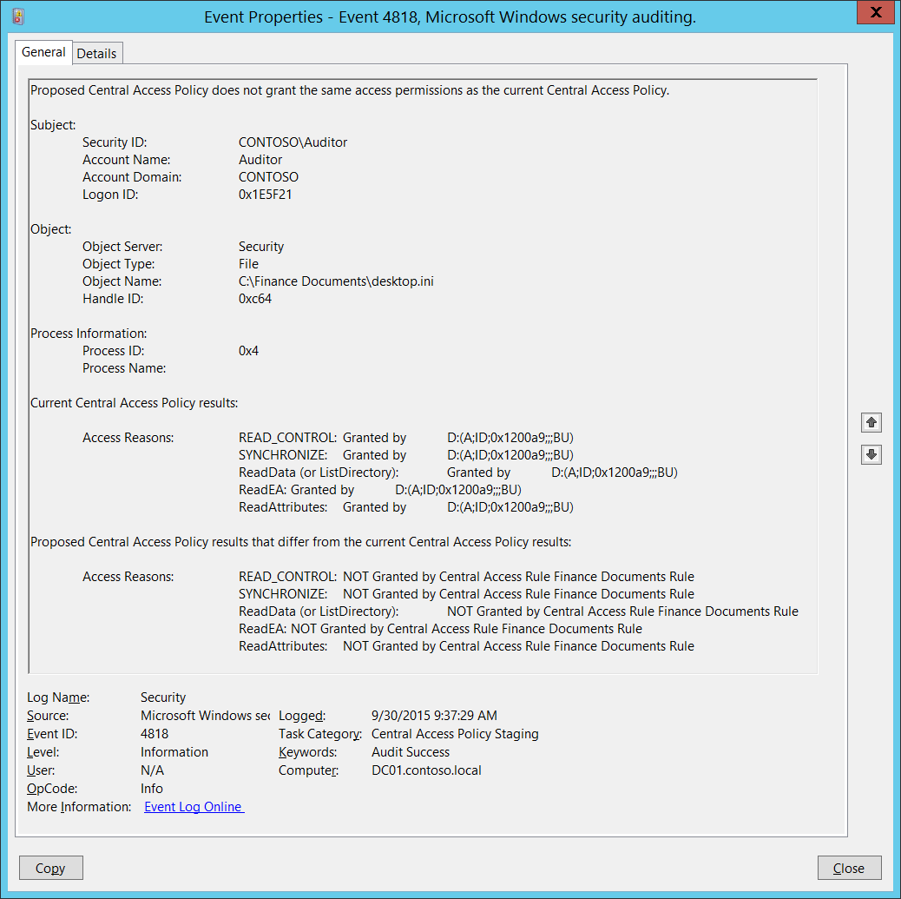

# 4818(S): 提案された中央アクセスポリシーは現在の中央アクセスポリシーと同じアクセス許可を付与しません。



***サブカテゴリ:***&nbsp;[中央ポリシーステージングの監査](audit-central-access-policy-staging.md)

***イベントの説明:***

このイベントは、動的アクセス制御の提案された[中央アクセスポリシー](/windows-server/identity/solution-guides/scenario--central-access-policy)が有効になっており、提案された中央アクセスポリシーによってアクセスが許可されなかった場合に生成されます。

> **注**&nbsp;&nbsp;推奨事項については、このイベントの[セキュリティ監視の推奨事項](#security-monitoring-recommendations)を参照してください。

<br clear="all">

***イベント XML:***
```xml
- <Event xmlns="http://schemas.microsoft.com/win/2004/08/events/event">
- <System>
 <Provider Name="Microsoft-Windows-Security-Auditing" Guid="{54849625-5478-4994-A5BA-3E3B0328C30D}" /> 
 <EventID>4818</EventID> 
 <Version>0</Version> 
 <Level>0</Level> 
 <Task>12813</Task> 
 <Opcode>0</Opcode> 
 <Keywords>0x8020000000000000</Keywords> 
 <TimeCreated SystemTime="2015-09-30T16:37:29.473472100Z" /> 
 <EventRecordID>1049324</EventRecordID> 
 <Correlation /> 
 <Execution ProcessID="516" ThreadID="524" /> 
 <Channel>Security</Channel> 
 <Computer>DC01.contoso.local</Computer> 
 <Security /> 
 </System>
- <EventData>
 <Data Name="SubjectUserSid">S-1-5-21-3457937927-2839227994-823803824-2104</Data> 
 <Data Name="SubjectUserName">Auditor</Data> 
 <Data Name="SubjectDomainName">CONTOSO</Data> 
 <Data Name="SubjectLogonId">0x1e5f21</Data> 
 <Data Name="ObjectServer">Security</Data> 
 <Data Name="ObjectType">File</Data> 
 <Data Name="ObjectName">C:\\Finance Documents\\desktop.ini</Data> 
 <Data Name="HandleId">0xc64</Data> 
 <Data Name="ProcessId">0x4</Data> 
 <Data Name="ProcessName" /> 
 <Data Name="AccessReason">%%1538: %%1801 D:(A;ID;0x1200a9;;;BU) %%1541: %%1801 D:(A;ID;0x1200a9;;;BU) %%4416: %%1801 D:(A;ID;0x1200a9;;;BU) %%4419: %%1801 D:(A;ID;0x1200a9;;;BU) %%4423: %%1801 D:(A;ID;0x1200a9;;;BU)</Data> 
 <Data Name="StagingReason">%%1538: %%1814Finance Documents Rule %%1541: %%1814Finance Documents Rule %%4416: %%1814Finance Documents Rule %%4419: %%1814Finance Documents Rule %%4423: %%1814Finance Documents Rule</Data> 
 </EventData>
 </Event>

```

***必要なサーバー役割:*** なし。

***最小 OS バージョン:*** Windows Server 2012, Windows 8。

***イベントバージョン:*** 0。

***フィールドの説明:***

**サブジェクト:**

-   **セキュリティ ID** \[タイプ = SID\]**:** アクセス要求を行ったアカウントのSID。イベントビューアーは自動的にSIDを解決し、アカウント名を表示しようとします。SIDを解決できない場合、イベントにソースデータが表示されます。

> **注**&nbsp;&nbsp;**セキュリティ識別子 (SID)** は、トラスティ (セキュリティプリンシパル) を識別するために使用される可変長の一意の値です。各アカウントには、Active Directoryドメインコントローラーなどの権限によって発行され、セキュリティデータベースに保存される一意のSIDがあります。ユーザーがログオンするたびに、システムはデータベースからそのユーザーのSIDを取得し、そのユーザーのアクセス トークンに配置します。システムは、アクセス トークン内のSIDを使用して、以降のすべてのWindowsセキュリティとのやり取りでユーザーを識別します。SIDがユーザーまたはグループの一意の識別子として使用された場合、それは他のユーザーまたはグループを識別するために再び使用されることはありません。SIDの詳細については、[セキュリティ識別子](/windows/access-protection/access-control/security-identifiers)を参照してください。

-   **アカウント名** \[タイプ = UnicodeString\]**:** アクセス要求を行ったアカウントの名前。

-   **アカウントドメイン** \[タイプ = UnicodeString\]**:** サブジェクトのドメインまたはコンピュータ名。形式はさまざまで、以下のようなものが含まれます：

    -   ドメインのNETBIOS名の例: CONTOSO

    -   小文字の完全なドメイン名: contoso.local

    -   大文字の完全なドメイン名: CONTOSO.LOCAL

    -   一部の[よく知られたセキュリティプリンシパル](/windows/security/identity-protection/access-control/security-identifiers)の場合、例えばLOCAL SERVICEやANONYMOUS LOGON、このフィールドの値は「NT AUTHORITY」となります。

    -   ローカルユーザーアカウントの場合、このフィールドにはこのアカウントが属するコンピュータまたはデバイスの名前が含まれます。例えば：「Win81」。

-   **ログオンID** \[タイプ = HexInt64\]**:** 16進数の値で、最近のイベントと同じログオンIDを含む可能性のあるイベントとこのイベントを関連付けるのに役立ちます。例えば、「[4624](event-4624.md): アカウントが正常にログオンされました。」

**オブジェクト**:

-   **オブジェクトサーバー** \[タイプ = UnicodeString\]: このイベントの「**Security**」値を持ちます。

-   **オブジェクトタイプ** \[タイプ = UnicodeString\]: 操作中にアクセスされたオブジェクトのタイプ。このイベントでは常に「**File**」です。

    以下の表は、最も一般的な**オブジェクトタイプ**のリストを含んでいます：

| ディレクトリ           | イベント      | タイマー            | デバイス      |
|-------------------------|--------------|----------------------|--------------|
| ミュータント            | タイプ        | ファイル             | トークン      |
| スレッド                | セクション    | ウィンドウステーション | デバッグオブジェクト |
| フィルター通信ポート    | イベントペア  | ドライバー           | IoCompletion |
| コントローラー          | シンボリックリンク | WmiGuid              | プロセス      |
| プロファイル            | デスクトップ  | キードイベント       | アダプター    |
| キー                    | 待機可能ポート | コールバック         | セマフォ      |
| ジョブ                  | ポート        | フィルター接続ポート | ALPCポート    |

-   **オブジェクト名** \[タイプ = UnicodeString\]: アクセス要求が行われたファイルまたはフォルダーのフルパスと名前。

-   **ハンドル ID** \[型 = ポインタ\]: **オブジェクト名**へのハンドルの16進数値。このフィールドは、例えば「[4663](event-4663.md)(S): オブジェクトへのアクセスが試みられました。」など、同じハンドル ID を含む他のイベントとこのイベントを関連付けるのに役立ちます。このパラメータはイベントでキャプチャされない場合があり、その場合は「0x0」と表示されます。

**プロセス情報:**

-   **プロセス ID** \[型 = ポインタ\]: アクセスが要求されたプロセスの16進数プロセス ID。プロセス ID (PID) は、オペレーティングシステムがアクティブなプロセスを一意に識別するために使用する番号です。特定のプロセスの PID を確認するには、例えばタスクマネージャー（詳細タブ、PID 列）を使用します。

    

    16進数値を10進数に変換すると、タスクマネージャーの値と比較できます。

    また、このプロセス ID を他のイベントのプロセス ID と関連付けることもできます。例えば、「[4688](event-4688.md): 新しいプロセスが作成されました」**プロセス情報\\新しいプロセス ID**。

-   **プロセス名** \[型 = UnicodeString\]**:** プロセスの実行可能ファイルのフルパスと名前。

**現在の中央アクセスポリシーの結果:**

-   **アクセス理由** \[型 = UnicodeString\]: 現在のアクセスポリシーに対するアクセスチェック結果のリスト。結果の形式は以下の通りです:<br><br>
REQUESTED\_ACCESS: RESULT ACE\_WHICH\_PROVIDED\_OR\_DENIED\_ACCESS.

REQUESTED\_ACCESS の可能な値は以下の表に記載されています。

## ファイルアクセスコードの表

| アクセス                                                | 16進数値           | 説明                                                                                                                                                                                                                                                                                                                                                                                                                                                                                                                                                                                                                                                                                                                         |
|-------------------------------------------------------|--------------------|-------------------------------------------------------------------------------------------------------------------------------------------------------------------------------------------------------------------------------------------------------------------------------------------------------------------------------------------------------------------------------------------------------------------------------------------------------------------------------------------------------------------------------------------------------------------------------------------------------------------------------------------------------------------------------------------------------------------------------------|
| ReadData (または ListDirectory)                           | 0x1                | **ReadData -** ファイルオブジェクトの場合、対応するファイルデータを読み取る権利。ディレクトリオブジェクトの場合、対応するディレクトリデータを読み取る権利。<br>**ListDirectory -** ディレクトリの場合、ディレクトリの内容を一覧表示する権利。                                                                                                                                                                                                                                                                                                                                                                                                                                                                         |
| WriteData (または AddFile)                                | 0x2                | **WriteData -** ファイルオブジェクトの場合、ファイルにデータを書き込む権利。ディレクトリオブジェクトの場合、ディレクトリにファイルを作成する権利（**FILE\_ADD\_FILE**）。<br>**AddFile -** ディレクトリの場合、ディレクトリにファイルを作成する権利。                                                                                                                                                                                                                                                                                                                                                                                                                                                                             |
| AppendData (または AddSubdirectory または CreatePipeInstance) | 0x4                | **AppendData -** ファイルオブジェクトの場合、ファイルにデータを追加する権利。（ローカルファイルの場合、このフラグが **FILE\_WRITE\_DATA** なしで指定されると、書き込み操作は既存のデータを上書きしません。）ディレクトリオブジェクトの場合、サブディレクトリを作成する権利（**FILE\_ADD\_SUBDIRECTORY**）。 <br>**AddSubdirectory -** ディレクトリの場合、サブディレクトリを作成する権利。<br>**CreatePipeInstance -** 名前付きパイプの場合、パイプを作成する権利。                                                                                                                                                                                                                                                              |
| ReadEA                                                | 0x8                | 拡張ファイル属性を読み取る権利。                                                                                                                                                                                                                                                                                                                                                                                                                                                                                                                                                                                                                                                                                         |
| WriteEA                                               | 0x10               | 拡張ファイル属性を書き込む権利。                                                                                                                                                                                                                                                                                                                                                                                                                                                                                                                                                                                                                                                                                        |
| Execute/Traverse                                      | 0x20               | **Execute** - ネイティブコードファイルの場合、ファイルを実行する権利。このアクセス権がスクリプトに与えられると、スクリプトインタープリタに応じてスクリプトが実行可能になる場合があります。<br>**Traverse -** ディレクトリの場合、ディレクトリをトラバースする権利。デフォルトでは、ユーザーには **BYPASS\_TRAVERSE\_CHECKING**&thinsp; [特権](/windows/win32/secauthz/privileges) が割り当てられており、**FILE\_TRAVERSE**&thinsp; [アクセス権](/windows/win32/secauthz/access-rights-and-access-masks) を無視します。詳細は [ファイルセキュリティとアクセス権](/windows/win32/fileio/file-security-and-access-rights) の備考を参照してください。 |
| DeleteChild                                           | 0x40               | ディレクトリの場合、ディレクトリとその中のすべてのファイル（読み取り専用ファイルを含む）を削除する権利。                                                                                                                                                                                                                                                                                                                                                                                                                                                                                                                                                                                                                          |
| ReadAttributes                                        | 0x80               | ファイル属性を読み取る権利。                                                                                                                                                                                                                                                                                                                                                                                                                                                                                                                                                                                                                                                                                                  |
| WriteAttributes                                       | 0x100              | ファイル属性を書き込む権利。                                                                                                                                                                                                                                                                                                                                                                                                                                                                                                                                                                                                                                                                                                 |
| DELETE                                                | 0x10000            | オブジェクトを削除する権利。                                                                                                                                                                                                                                                                                                                                                                                                                                                                                                                                                                                                                                                                                                     |
| READ\_CONTROL                                         | 0x20000            | オブジェクトのセキュリティ記述子の情報を読み取る権利（システムアクセス制御リスト (SACL) の情報を除く）。                                                                                                                                                                                                                                                                                                                                                                                                                                                                                                                                                                                      |
| WRITE\_DAC                                            | 0x40000            | オブジェクトのセキュリティ記述子の任意アクセス制御リスト (DACL) を変更する権利。                                                                                                                                                                                                                                                                                                                                                                                                                                                                                                                                                                                                                               |
| WRITE\_OWNER                                          | 0x80000            | オブジェクトのセキュリティ記述子の所有者を変更する権利。                                                                                                                                                                                                                                                                                                                                                                                                                                                                                                                                                                                                                                                                   |
| SYNCHRONIZE                                           | 0x100000<br> | オブジェクトを同期に使用する権利。これにより、スレッドがオブジェクトがシグナル状態になるまで待機できるようになります。一部のオブジェクトタイプはこのアクセス権をサポートしていません。                                                                                                                                                                                                                                                                                                                                                                                                                                                                                                                                                       |
| ACCESS\_SYS\_SEC                                      | 0x1000000          | ACCESS\_SYS\_SEC アクセス権は、オブジェクトのセキュリティ記述子の SACL を取得または設定する能力を制御します。                                                                                                                                                                                                                                                                                                                                                                                                                                                                                                                                                                                                                   |

-   結果:

    -   によって許可されました

    -   によって拒否されました

    -   親フォルダーのACEによって許可されました

    -   不足しているため許可されませんでした – この文の後には通常、SeSecurityPrivilegeなどの不足しているユーザー権限が表示されます。

    -   不明または未確認

-   アクセスを許可または拒否したACE:

    -   所有権 – オブジェクトの所有権によってアクセスが許可された場合。

    -   ユーザー権限名、例えばSeSecurityPrivilege。

    -   アクセスを許可または拒否したアクセス制御エントリ (ACE) の[セキュリティ記述子定義言語](event-5145.md#sddl-values-for-access-control-entry) (SDDL) 値。

**現在の中央アクセスポリシーの結果と異なる提案された中央アクセスポリシーの結果:**

-   **アクセス理由** \[タイプ = UnicodeString\]: 提案された中央アクセスポリシーのアクセスチェック結果のリスト。ここには***拒否された***リクエストのみが表示されます。結果の形式は以下の通りです:<br><br>

要求されたアクセス: ルール名ルールによって許可されませんでした。

要求されたアクセスの可能な値は以下の表に記載されています:

| アクセス                                                | 16進数の値         | 説明                                                                                                                                                                                                                                                                                                                                                                                                                                                                                                                                                                                                                                                                                                                         |
|-------------------------------------------------------|--------------------|-------------------------------------------------------------------------------------------------------------------------------------------------------------------------------------------------------------------------------------------------------------------------------------------------------------------------------------------------------------------------------------------------------------------------------------------------------------------------------------------------------------------------------------------------------------------------------------------------------------------------------------------------------------------------------------------------------------------------------------|
| ReadData (または ListDirectory)                           | 0x1                | **ReadData -** ファイルオブジェクトの場合、対応するファイルデータを読み取る権利。ディレクトリオブジェクトの場合、対応するディレクトリデータを読み取る権利。<br>**ListDirectory -** ディレクトリの場合、ディレクトリの内容を一覧表示する権利。                                                                                                                                                                                                                                                                                                                                                                                                                                                                         |
| WriteData (または AddFile)                                | 0x2                | **WriteData -** ファイルオブジェクトの場合、ファイルにデータを書き込む権利。ディレクトリオブジェクトの場合、ディレクトリにファイルを作成する権利 (**FILE\_ADD\_FILE**)。<br>**AddFile -** ディレクトリの場合、ディレクトリにファイルを作成する権利。                                                                                                                                                                                                                                                                                                                                                                                                                                                                             |
| AppendData (または AddSubdirectory または CreatePipeInstance) | 0x4                | **AppendData -** ファイルオブジェクトの場合、ファイルにデータを追加する権利。（ローカルファイルの場合、このフラグが**FILE\_WRITE\_DATA**なしで指定されていると、書き込み操作は既存のデータを上書きしません。）ディレクトリオブジェクトの場合、サブディレクトリを作成する権利 (**FILE\_ADD\_SUBDIRECTORY**)。 <br>**AddSubdirectory -** ディレクトリの場合、サブディレクトリを作成する権利。<br>**CreatePipeInstance -** 名前付きパイプの場合、パイプを作成する権利。                                                                                                                                                                                                                                                              |
| ReadEA                                                | 0x8                | 拡張ファイル属性を読み取る権利。                                                                                                                                                                                                                                                                                                                                                                                                                                                                                                                                                                                                                                                                                         |
| WriteEA                                               | 0x10               | 拡張ファイル属性を書き込む権利。                                                                                                                                                                                                                                                                                                                                                                                                                                                                                                                                                                                                                                                                                        |
| Execute/Traverse                                      | 0x20               | **Execute** - ネイティブコードファイルの場合、ファイルを実行する権利。このアクセス権がスクリプトに与えられると、スクリプトインタープリターによってスクリプトが実行可能になる場合があります。<br>**Traverse -** ディレクトリの場合、ディレクトリをトラバースする権利。デフォルトでは、ユーザーには**BYPASS\_TRAVERSE\_CHECKING**&thinsp; [特権](/windows/win32/secauthz/privileges)が割り当てられており、これは**FILE\_TRAVERSE**&thinsp; [アクセス権](/windows/win32/secauthz/access-rights-and-access-masks)を無視します。詳細については、[ファイルセキュリティとアクセス権](/windows/win32/fileio/file-security-and-access-rights)の備考を参照してください。 |
| DeleteChild                                           | 0x40               | ディレクトリの場合、ディレクトリとその中に含まれるすべてのファイル（読み取り専用ファイルを含む）を削除する権利。                                                                                                                                                                                                                                                                                                                                                                                                                                                                                                                                                                                                                          |
| ReadAttributes                                        | 0x80               | ファイル属性を読み取る権利。                                                                                                                                                                                                                                                                                                                                                                                                                                                                                                                                                                                                                                                                                                  |
| WriteAttributes                                       | 0x100              | ファイル属性を書き込む権利。                                                                                                                                                                                                                                                                                                                                                                                                                                                                                                                                                                                                                                                                                                 |
| DELETE                                                | 0x10000            | オブジェクトを削除する権利。                                                                                                                                                                                                                                                                                                                                                                                                                                                                                                                                                                                                                                                                                                     |
| READ\_CONTROL                                         | 0x20000            | オブジェクトのセキュリティ記述子の情報を読み取る権利（システムアクセス制御リスト (SACL) の情報を含まない）。                                                                                                                                                                                                                                                                                                                                                                                                                                                                                                                                                                                      |
| WRITE\_DAC                                            | 0x40000            | オブジェクトのセキュリティ記述子の任意アクセス制御リスト (DACL) を変更する権利。                                                                                                                                                                                                                                                                                                                                                                                                                                                                                                                                                                                                                               |
| WRITE\_OWNER                                          | 0x80000            | オブジェクトのセキュリティ記述子の所有者を変更する権利                                                                                                                                                                                                                                                                                                                                                                                                                                                                                                                                                                                                                                                                   |
| SYNCHRONIZE                                           | 0x100000<br> | オブジェクトを同期に使用する権利。これにより、スレッドはオブジェクトがシグナル状態になるまで待機できます。一部のオブジェクトタイプはこのアクセス権をサポートしていません。                                                                                                                                                                                                                                                                                                                                                                                                                                                                                                                                                       |
| ACCESS\_SYS\_SEC                                      | 0x1000000          | ACCESS\_SYS\_SECアクセス権は、オブジェクトのセキュリティ記述子のSACLを取得または設定する能力を制御します。                                                                                                                                                                                                                                                                                                                                                                                                                                                                                                                                                                                                                   |

-   RULE\_NAME: アクセスを拒否した中央アクセスルールの名前。

## セキュリティ監視の推奨事項

4818(S): 提案された中央アクセスポリシーが現在の中央アクセスポリシーと同じアクセス許可を付与していません。

-   このイベントは通常、動的アクセス制御のための提案された中央アクセスポリシーのトラブルシューティングとテストに使用されます。
