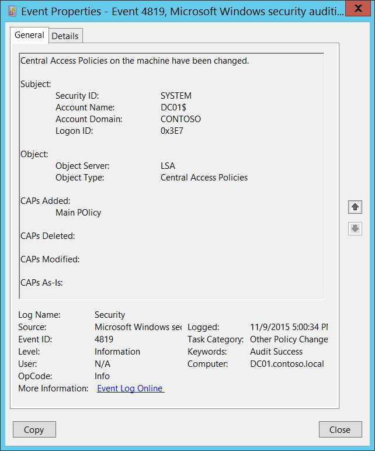

# 4819(S): マシン上の中央アクセスポリシーが変更されました。




***サブカテゴリ:***&nbsp;[その他のポリシー変更イベントの監査](audit-other-policy-change-events.md)

***イベントの説明:***

このイベントは、マシン上の[中央アクセスポリシー](/windows-server/identity/solution-guides/scenario--central-access-policy)が変更されたときに生成されます。

例えば、新しい[中央アクセスポリシー](/windows-server/identity/solution-guides/scenario--central-access-policy)がグループポリシーを通じてマシンに適用されたときに生成されます。

> **注**&nbsp;&nbsp;推奨事項については、このイベントの[セキュリティ監視の推奨事項](#security-monitoring-recommendations)を参照してください。

<br clear="all">

***イベント XML:***
```xml
- <Event xmlns="http://schemas.microsoft.com/win/2004/08/events/event">
- <System>
 <Provider Name="Microsoft-Windows-Security-Auditing" Guid="{54849625-5478-4994-A5BA-3E3B0328C30D}" /> 
 <EventID>4819</EventID> 
 <Version>0</Version> 
 <Level>0</Level> 
 <Task>13573</Task> 
 <Opcode>0</Opcode> 
 <Keywords>0x8020000000000000</Keywords> 
 <TimeCreated SystemTime="2015-11-10T01:00:34.352877700Z" /> 
 <EventRecordID>1187659</EventRecordID> 
 <Correlation /> 
 <Execution ProcessID="516" ThreadID="3500" /> 
 <Channel>Security</Channel> 
 <Computer>DC01.contoso.local</Computer> 
 <Security /> 
 </System>
- <EventData>
 <Data Name="SubjectUserSid">S-1-5-18</Data> 
 <Data Name="SubjectUserName">DC01$</Data> 
 <Data Name="SubjectDomainName">CONTOSO</Data> 
 <Data Name="SubjectLogonId">0x3e7</Data> 
 <Data Name="ObjectServer">LSA</Data> 
 <Data Name="ObjectType">Central Access Policies</Data> 
 <Data Name="AddedCAPs">Main POlicy</Data> 
 <Data Name="DeletedCAPs" /> 
 <Data Name="ModifiedCAPs" /> 
 <Data Name="AsIsCAPs" /> 
 </EventData>
</Event>

```

***必要なサーバー役割:*** なし。

***最小 OS バージョン:*** Windows Server 2012, Windows 8。

***イベントバージョン:*** 0。

***フィールドの説明:***

**サブジェクト:**

-   **セキュリティ ID** \[タイプ = SID\]**:** マシン上の中央アクセスポリシーを変更したアカウントのSID。イベントビューアーは自動的にSIDを解決し、アカウント名を表示しようとします。SIDが解決できない場合、イベントにはソースデータが表示されます。

> **注**&nbsp;&nbsp;**セキュリティ識別子 (SID)** は、トラスティ (セキュリティプリンシパル) を識別するために使用される可変長の一意の値です。各アカウントには、Active Directory ドメインコントローラーなどの権限によって発行され、セキュリティデータベースに保存される一意のSIDがあります。ユーザーがログオンするたびに、システムはデータベースからそのユーザーのSIDを取得し、そのユーザーのアクセス トークンに配置します。システムは、アクセス トークン内のSIDを使用して、以降のすべてのWindowsセキュリティとのやり取りでユーザーを識別します。SIDがユーザーまたはグループの一意の識別子として使用された場合、それは他のユーザーまたはグループを識別するために再利用されることはありません。SIDの詳細については、[セキュリティ識別子](/windows/access-protection/access-control/security-identifiers)を参照してください。

-   **アカウント名** \[タイプ = UnicodeString\]**:** マシン上の中央アクセスポリシーを変更したアカウントの名前。

-   **アカウントドメイン** \[タイプ = UnicodeString\]**:** ドメインまたはコンピュータ名。形式は以下のように異なります：

    -   ドメインのNETBIOS名の例: CONTOSO

    -   小文字の完全なドメイン名: contoso.local

    -   大文字の完全なドメイン名: CONTOSO.LOCAL

    -   一部の[よく知られたセキュリティプリンシパル](/windows/security/identity-protection/access-control/security-identifiers)の場合、例えばLOCAL SERVICEやANONYMOUS LOGON、このフィールドの値は「NT AUTHORITY」となります。

    -   ローカルユーザーアカウントの場合、このフィールドにはこのアカウントが属するコンピュータまたはデバイスの名前が含まれます。例えば：「Win81」。

-   **ログオンID** \[タイプ = HexInt64\]**:** 16進数の値で、最近のイベントと同じログオンIDを含む可能性のあるイベントとこのイベントを関連付けるのに役立ちます。例えば、「[4624](event-4624.md): アカウントが正常にログオンされました。」

**オブジェクト**:

-   **オブジェクトサーバー** \[タイプ = UnicodeString\]: このイベントの「**LSA**」値を持ちます。

-   **オブジェクトタイプ** \[タイプ = UnicodeString\]: このイベントが適用されるオブジェクトのタイプ。常にこのイベントの「**中央アクセスポリシー**」。

    以下の表は、最も一般的な**オブジェクトタイプ**のリストを含みます：

| ディレクトリ           | イベント    | タイマー            | デバイス                |
|-------------------------|--------------|----------------------|-------------------------|
| ミュータント            | タイプ       | ファイル             | トークン                |
| スレッド                | セクション   | ウィンドウステーション | デバッグオブジェクト    |
| フィルター通信ポート    | イベントペア | ドライバー           | IoCompletion            |
| コントローラー          | シンボリックリンク | WmiGuid              | プロセス                |
| プロファイル            | デスクトップ | キードイベント       | 中央アクセスポリシー    |
| キー                    | 待機可能ポート | コールバック         |                         |
| ジョブ                  | ポート       | フィルター接続ポート |                         |
| ALPCポート              | セマフォ     | アダプター           |                         |

**追加されたCAP** \[Type = UnicodeString\]: 追加された中央アクセスポリシーのリスト。中央アクセスポリシーが追加されていない場合は空です。

**削除されたCAP** \[Type = UnicodeString\]: 削除された中央アクセスポリシーのリスト。中央アクセスポリシーが削除されていない場合は空です。

**変更されたCAP** \[Type = UnicodeString\]: 変更された中央アクセスポリシーのリスト。中央アクセスポリシーが変更されていない場合は空です。

**変更なしのCAP** \[Type = UnicodeString\]: 変更されていない中央アクセスポリシーのリスト。

## セキュリティ監視の推奨事項

4819(S): マシン上の中央アクセスポリシーが変更されました。

> **重要**&nbsp;&nbsp;このイベントについては、[付録A: 多くの監査イベントに対するセキュリティ監視の推奨事項](appendix-a-security-monitoring-recommendations-for-many-audit-events.md)も参照してください。

-   このイベントは通常SYSTEMアカウントによってトリガーされるため、**「Subject\\Security ID」**がSYSTEMでない場合に報告することをお勧めします。

-   このイベントは、セキュリティ監視ポリシーで必要とされる場合に、中央アクセスポリシーの変更、追加、削除を追跡するのに役立ちます。

-
