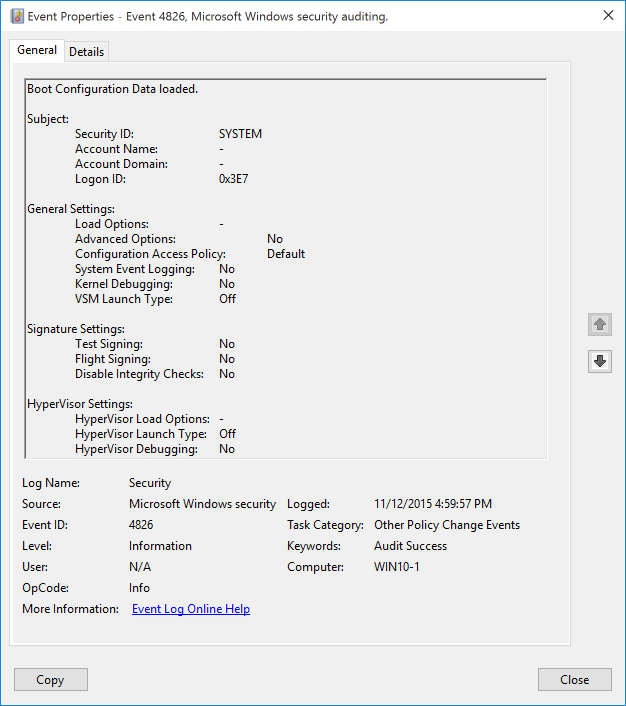

# 4826(S): ブート構成データが読み込まれました。



***サブカテゴリ:***&nbsp;[その他のポリシー変更イベントの監査](audit-other-policy-change-events.md)

***イベントの説明:***

このイベントは、システムが起動し、現在の[ブート構成データ](/previous-versions/windows/hardware/design/dn653287(v=vs.85)) (BCD) 設定を読み込むたびに生成されます。

このイベントは、「その他のポリシー変更イベントの監査」サブカテゴリの設定に関係なく常に記録されます。

> **注**&nbsp;&nbsp;推奨事項については、このイベントの[セキュリティ監視の推奨事項](#security-monitoring-recommendations)を参照してください。

<br clear="all">

***イベント XML:***
```xml
- <Event xmlns="http://schemas.microsoft.com/win/2004/08/events/event">
- <System>
 <Provider Name="Microsoft-Windows-Security-Auditing" Guid="{54849625-5478-4994-A5BA-3E3B0328C30D}" /> 
 <EventID>4826</EventID> 
 <Version>0</Version> 
 <Level>0</Level> 
 <Task>13573</Task> 
 <Opcode>0</Opcode> 
 <Keywords>0x8020000000000000</Keywords> 
 <TimeCreated SystemTime="2015-11-13T00:59:57.553201100Z" /> 
 <EventRecordID>751</EventRecordID> 
 <Correlation /> 
 <Execution ProcessID="4" ThreadID="164" /> 
 <Channel>Security</Channel> 
 <Computer>WIN10-1</Computer> 
 <Security /> 
 </System>
- <EventData>
 <Data Name="SubjectUserSid">S-1-5-18</Data> 
 <Data Name="SubjectUserName">-</Data> 
 <Data Name="SubjectDomainName">-</Data> 
 <Data Name="SubjectLogonId">0x3e7</Data> 
 <Data Name="LoadOptions">-</Data> 
 <Data Name="AdvancedOptions">%%1843</Data> 
 <Data Name="ConfigAccessPolicy">%%1846</Data> 
 <Data Name="RemoteEventLogging">%%1843</Data> 
 <Data Name="KernelDebug">%%1843</Data> 
 <Data Name="VsmLaunchType">%%1848</Data> 
 <Data Name="TestSigning">%%1843</Data> 
 <Data Name="FlightSigning">%%1843</Data> 
 <Data Name="DisableIntegrityChecks">%%1843</Data> 
 <Data Name="HypervisorLoadOptions">-</Data> 
 <Data Name="HypervisorLaunchType">%%1848</Data> 
 <Data Name="HypervisorDebug">%%1843</Data> 
 </EventData>
</Event>

```

***必要なサーバーの役割:*** なし。

***最小 OS バージョン:*** Windows Server 2012, Windows 8。

***イベントバージョン:*** 0。

***フィールドの説明:***

**サブジェクト:**

-   **セキュリティ ID** \[タイプ = SID\]**:** このイベントを報告したアカウントの SID。イベントビューアーは自動的に SID を解決し、アカウント名を表示しようとします。SID を解決できない場合、イベントにソースデータが表示されます。このイベントでは常に “S-1-5-18” です。

> **注**&nbsp;&nbsp;**セキュリティ識別子 (SID)** は、トラスティ (セキュリティプリンシパル) を識別するために使用される可変長の一意の値です。各アカウントには、Active Directory ドメインコントローラーなどの権限によって発行され、セキュリティデータベースに保存される一意の SID があります。ユーザーがログオンするたびに、システムはデータベースからそのユーザーの SID を取得し、そのユーザーのアクセストークンに配置します。システムは、アクセストークン内の SID を使用して、以降のすべての Windows セキュリティとのやり取りでユーザーを識別します。SID がユーザーまたはグループの一意の識別子として使用された場合、それは他のユーザーまたはグループを識別するために再利用されることはありません。SID の詳細については、[セキュリティ識別子](/windows/access-protection/access-control/security-identifiers)を参照してください。

-   **アカウント名** \[タイプ = UnicodeString\]**:** このイベントを報告したアカウントの名前。このイベントでは常に “-” です。

-   **アカウントドメイン** \[タイプ = UnicodeString\]**:** サブジェクトのドメインまたはコンピュータ名。このイベントでは常に “-” です。

-   **ログオンID** \[タイプ = HexInt64\]**:** このイベントを最近のイベントと関連付けるのに役立つ16進数の値。例えば、同じログオンIDを含む可能性のある “[4624](event-4624.md): アカウントが正常にログオンされました。” など。

**一般設定:**

-   **ロードオプション** \[タイプ = UnicodeString\]**:** このフィールドに関する情報はこのドキュメントにはありません。

-   **高度なオプション** \[タイプ = UnicodeString\]**:** 次回の起動時にWindowsがレガシーメニュー（F8メニュー）でシステムブートするように構成されているかどうかを示します（**はい** または **いいえ**）。“bcdedit /set onetimeadvancedoptions yes” コマンドを使用して高度なブートを有効にできます。

-   **構成アクセスポリシー** \[タイプ = UnicodeString\]**:** このフィールドに関する情報はこのドキュメントにはありません。

-   **システムイベントログ** \[タイプ = UnicodeString\]**:** このフィールドに関する情報はこのドキュメントにはありません。

-   **カーネルデバッグ** \[タイプ = UnicodeString\]**:** Windowsの[カーネルデバッグ](/windows-hardware/drivers/devtest/bcdedit--debug)が有効かどうかを示します（**はい** または **いいえ**）。“bcdedit /debug on” コマンドを使用してカーネルデバッグを有効にできます。

-   **VSM起動タイプ** \[タイプ = UnicodeString\]**:** このフィールドに関する情報はこのドキュメントにはありません。

**署名設定:**

-   **テスト署名** \[タイプ = UnicodeString\]**:** Windowsの[テスト署名](/previous-versions/windows/hardware/design/dn653559(v=vs.85))が有効かどうかを示します（**はい** または **いいえ**）。“bcdedit /set testsigning off” コマンドを使用してテスト署名を無効にできます。

> **注**&nbsp;&nbsp;このパラメータは、Windows 8.1、Windows 8、Windows 7、Windows Server 2008、またはWindows Vistaが任意の種類のテスト署名されたカーネルモードコードをロードするかどうかを制御します。このオプションはデフォルトでは設定されていないため、64ビット版のWindows 8.1、Windows 8、Windows 7、Windows Server 2008、およびWindows Vistaではテスト署名されたカーネルモードドライバはデフォルトではロードされません。BCDEditコマンドを実行した後、変更を有効にするためにコンピュータを再起動してください。詳細については、[テスト署名の概要](/windows-hardware/drivers/install/introduction-to-test-signing)を参照してください。

-   **フライト署名** \[タイプ = UnicodeString\]**:** Windowsのフライト署名（フライト署名コード署名証明書を許可するかどうか）が有効かどうかを示します（**Yes** または **No**）。「bcdedit /set flightsigning off」コマンドを使用してフライト署名を無効にすることができます。

-   **整合性チェックの無効化** \[タイプ = UnicodeString\]**:** Windowsの整合性チェックが無効かどうかを示します（**Yes** または **No**）。「bcdedit /set nointegritychecks on」コマンドを使用して整合性チェックを無効にすることができます。

**ハイパーバイザー設定:**

-   **ハイパーバイザーのロードオプション** \[タイプ = UnicodeString\]**:** ハイパーバイザーの**ロードオプション**を示します。詳細はこちらをご覧ください: <https://msdn.microsoft.com/library/windows/hardware/ff542202(v=vs.85).aspx>.

-   **ハイパーバイザーの起動タイプ** \[タイプ = UnicodeString\]**:** ハイパーバイザーの起動オプションを示します（**Off** または **Auto**）。ターゲットコンピューターでHyper-Vをデバッグするためにデバッガーを設定する場合、このオプションをターゲットコンピューターで**Auto**に設定します。詳細については、[Hyper-Vを実行しているターゲットコンピューターへのアタッチ](/windows-hardware/drivers/debugger/setting-up-network-debugging-of-a-virtual-machine-host)をご覧ください。[Hyper-V](/windows/deployment/deploy-whats-new)技術に関する情報はMicrosoft TechNetウェブサイトで入手できます。

-   **ハイパーバイザーのデバッグ** \[タイプ = UnicodeString\]**:** ハイパーバイザーデバッガーが有効かどうかを示します（**Yes** または **No**）。ハイパーバイザーのデバッグに関する情報については、[Hyper-Vを実行しているターゲットコンピューターへのアタッチ](/windows-hardware/drivers/debugger/setting-up-network-debugging-of-a-virtual-machine-host)をご覧ください。

## セキュリティ監視の推奨事項

4826(S): ブート構成データが読み込まれました。

> **重要**&nbsp;&nbsp;このイベントについては、[付録A: 多くの監査イベントに対するセキュリティ監視の推奨事項](appendix-a-security-monitoring-recommendations-for-many-audit-events.md)も参照してください。

-   このイベントは通常SYSTEMアカウントによってトリガーされるため、**「Subject\\Security ID」**がSYSTEMでない場合に報告することをお勧めします。

-   ブート構成データ設定の標準またはベースラインが定義されている場合、このイベントを監視し、イベントによって報告された設定が標準またはベースラインで定義されたものと同じであるかどうかを確認してください。
