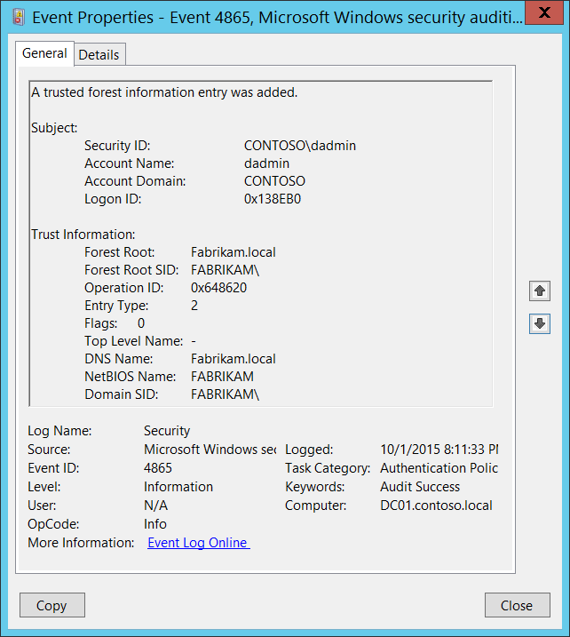

# 4865(S): 信頼されたフォレスト情報エントリが追加されました。



***サブカテゴリ:***&nbsp;[認証ポリシー変更の監査](audit-authentication-policy-change.md)

***イベントの説明:***

このイベントは、新しい信頼されたフォレスト情報エントリが追加されたときに生成されます。

このイベントはドメインコントローラーでのみ生成されます。

> **注**&nbsp;&nbsp;推奨事項については、このイベントの[セキュリティ監視の推奨事項](#security-monitoring-recommendations)を参照してください。

<br clear="all">

***イベント XML:***
```
- <Event xmlns="http://schemas.microsoft.com/win/2004/08/events/event">
- <System>
 <Provider Name="Microsoft-Windows-Security-Auditing" Guid="{54849625-5478-4994-A5BA-3E3B0328C30D}" /> 
 <EventID>4865</EventID> 
 <Version>0</Version> 
 <Level>0</Level> 
 <Task>13569</Task> 
 <Opcode>0</Opcode> 
 <Keywords>0x8020000000000000</Keywords> 
 <TimeCreated SystemTime="2015-10-02T03:11:33.397715700Z" /> 
 <EventRecordID>1049810</EventRecordID> 
 <Correlation /> 
 <Execution ProcessID="500" ThreadID="4808" /> 
 <Channel>Security</Channel> 
 <Computer>DC01.contoso.local</Computer> 
 <Security /> 
 </System>
- <EventData>
 <Data Name="ForestRoot">Fabrikam.local</Data> 
 <Data Name="ForestRootSid">S-1-5-21-2703072690-1374247579-2643703677</Data> 
 <Data Name="OperationId">0x648620</Data> 
 <Data Name="EntryType">2</Data> 
 <Data Name="Flags">0</Data> 
 <Data Name="TopLevelName">-</Data> 
 <Data Name="DnsName">Fabrikam.local</Data> 
 <Data Name="NetbiosName">FABRIKAM</Data> 
 <Data Name="DomainSid">S-1-5-21-2703072690-1374247579-2643703677</Data> 
 <Data Name="SubjectUserSid">S-1-5-21-3457937927-2839227994-823803824-1104</Data> 
 <Data Name="SubjectUserName">dadmin</Data> 
 <Data Name="SubjectDomainName">CONTOSO</Data> 
 <Data Name="SubjectLogonId">0x138eb0</Data> 
 </EventData>
 </Event>

```

***必要なサーバー役割:*** Active Directory ドメインコントローラー。

***最小 OS バージョン:*** Windows Server 2008。

***イベントバージョン:*** 0。

***フィールドの説明:***

**サブジェクト:**

-   **セキュリティ ID** \[タイプ = SID\]**:** 「信頼されたフォレスト情報エントリを追加する」操作を要求したアカウントの SID。イベントビューアーは自動的に SID を解決してアカウント名を表示しようとします。SID を解決できない場合、イベントにソースデータが表示されます。

> **注**&nbsp;&nbsp;**セキュリティ識別子 (SID)** は、トラスティ (セキュリティプリンシパル) を識別するために使用される可変長の一意の値です。各アカウントには、Active Directory ドメインコントローラーなどの権限によって発行され、セキュリティデータベースに保存される一意の SID があります。ユーザーがログオンするたびに、システムはデータベースからそのユーザーの SID を取得し、そのユーザーのアクセス トークンに配置します。システムは、アクセス トークン内の SID を使用して、以降のすべての Windows セキュリティとのやり取りでユーザーを識別します。SID がユーザーまたはグループの一意の識別子として使用された場合、それは他のユーザーまたはグループを識別するために再利用されることはありません。SID の詳細については、[セキュリティ識別子](/windows/access-protection/access-control/security-identifiers)を参照してください。

-   **アカウント名** \[タイプ = UnicodeString\]**:** 「信頼されたフォレスト情報エントリの追加」操作を要求したアカウントの名前。

-   **アカウントドメイン** \[タイプ = UnicodeString\]**:** サブジェクトのドメインまたはコンピュータ名。形式は以下のように異なります：

    -   ドメインのNETBIOS名の例: CONTOSO

    -   小文字の完全なドメイン名: contoso.local

    -   大文字の完全なドメイン名: CONTOSO.LOCAL

    -   一部の[既知のセキュリティプリンシパル](/windows/security/identity-protection/access-control/security-identifiers)の場合、例えばLOCAL SERVICEやANONYMOUS LOGON、このフィールドの値は「NT AUTHORITY」となります。

    -   ローカルユーザーアカウントの場合、このフィールドにはこのアカウントが属するコンピュータまたはデバイスの名前が含まれます。例えば「Win81」。

-   **ログオンID** \[タイプ = HexInt64\]**:** 16進数の値で、最近のイベントと同じログオンIDを含む可能性のあるイベントとこのイベントを関連付けるのに役立ちます。例えば、「[4624](event-4624.md): アカウントが正常にログオンされました。」

**信頼情報:**

-   **フォレストルート** \[タイプ = UnicodeString\]: 信頼されたフォレスト情報エントリが追加されたActive Directoryフォレストの名前。

<!-- -->

-   **フォレストルートSID** \[タイプ = SID\]: 信頼されたフォレスト情報エントリが追加されたActive DirectoryフォレストのSID。イベントビューアは自動的にSIDを解決し、アカウント名を表示しようとします。SIDが解決できない場合、イベントにソースデータが表示されます。

<!-- -->

-   **操作ID** \[タイプ = HexInt64\]: 操作の一意の16進数識別子。このフィールドを使用して、他のイベント（[4866](event-4866.md)(S): 信頼されたフォレスト情報エントリが削除されました、[4867](event-4867.md)(S): 信頼されたフォレスト情報エントリが変更されました。）とこのイベントを関連付けることができます。

<!-- -->

-   **エントリタイプ** \[タイプ = UInt32\]: 追加されたエントリのタイプ：

| 値   | タイプ名                     | 説明                                                                                                                                                                                                                                                                                                                                                                     |
|------|------------------------------|--------------------------------------------------------------------------------------------------------------------------------------------------------------------------------------------------------------------------------------------------------------------------------------------------------------------------------------------------------------------------|
| 0    | ForestTrustTopLevelName      | [信頼されたフォレスト](/openspecs/windows_protocols/ms-lsad/31ca2a31-0be4-4773-bcef-05ad6cd3ccfb#gt_3b76a71f-9697-4836-9c69-09899b23c21b)の[DNS名](/openspecs/windows_protocols/ms-lsad/31ca2a31-0be4-4773-bcef-05ad6cd3ccfb#gt_102a36e2-f66f-49e2-bee3-558736b2ecd5)。このレコードタイプに使用される構造は[LSA\_UNICODE\_STRING](/openspecs/windows_protocols/ms-lsad/4b35e17e-405c-4e99-8ebe-8b28f047156f)と同等です。 |
| 1    | ForestTrustTopLevelNameEx    | このタイプは名前接尾辞の例外に一般的に使用されます。このレコードタイプに使用される構造は[LSA\_UNICODE\_STRING](/openspecs/windows_protocols/ms-lsad/4b35e17e-405c-4e99-8ebe-8b28f047156f)と同等です。                                                                                                                                                                                    |
| 2    | ForestTrustDomainInfo        | このフィールドは識別情報と名前情報を含むレコードを指定します。                                                                                                                                                                                                                                                                                                    |

-   **フラグ** \[タイプ = UInt32\]: 以下の表は可能なフラグを指定しています。

    一部のフラグ値は異なるフォレストレコードタイプで再利用されます。「意味」列を参照してください。

| 値   | 信頼の種類                                                 | 意味                                                                      |
|------|------------------------------------------------------------|---------------------------------------------------------------------------|
| 0    | -                                                          | フラグが設定されていません。                                               |
| 1    | ForestTrustTopLevelNameEx<br>ForestTrustTopLevelName | トップレベル名の信頼レコードは初期作成時に無効化されています。             |
|      | ForestTrustDomainInfo                                      | ドメイン情報の信頼レコードはドメイン管理者によって無効化されています。     |
| 2    | ForestTrustTopLevelNameEx<br>ForestTrustTopLevelName | トップレベル名の信頼レコードはドメイン管理者によって無効化されています。   |
|      | ForestTrustDomainInfo                                      | ドメイン情報の信頼レコードは競合のため無効化されています。                 |
| 4    | ForestTrustTopLevelNameEx<br>ForestTrustTopLevelName | トップレベル名の信頼レコードは競合のため無効化されています。               |
|      | ForestTrustDomainInfo                                      | ドメイン情報の信頼レコードはドメイン管理者によって無効化されています。     |
| 8    | ForestTrustDomainInfo                                      | ドメイン情報の信頼レコードは競合のため無効化されています。                 |

-   **トップレベル名** \[タイプ = UnicodeString\]: 新しい信頼されたフォレスト情報エントリの名前。

-   **DNS名** \[タイプ = UnicodeString\]: 信頼パートナーのDNS名。このパラメータはイベントでキャプチャされない場合があり、その場合は「-」と表示されます。

-   **NetBIOS名** \[タイプ = UnicodeString\]: 信頼パートナーのNetBIOS名。このパラメータはイベントでキャプチャされない場合があり、その場合は「-」と表示されます。

-   **ドメイン SID** \[タイプ = SID\]: 信頼パートナーの SID。このパラメーターはイベントでキャプチャされない場合があり、その場合「NULL SID」として表示されます。

## セキュリティ監視の推奨事項

4865(S): 信頼されたフォレスト情報エントリが追加されました。

-   Active Directory フォレストの信頼に関連する変更（特に新しい信頼の作成）はすべて監視され、アラートがトリガーされる必要があります。この変更が計画されていなかった場合は、変更の理由を調査してください。
