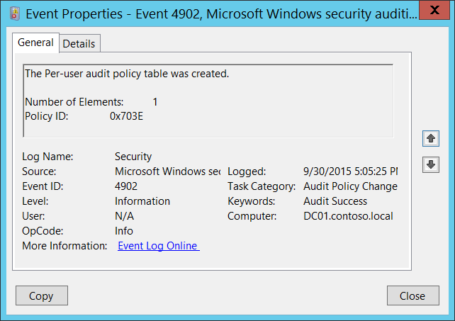
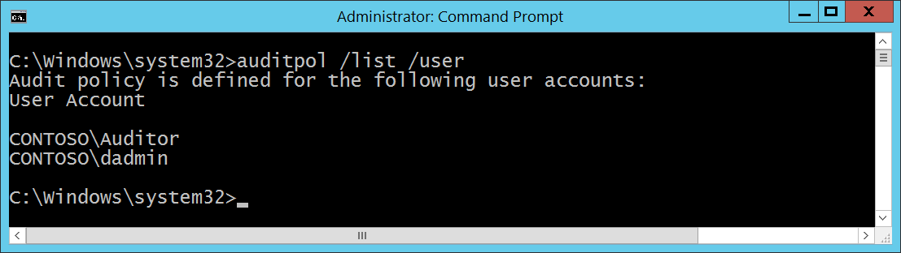

# 4902(S): ユーザーごとの監査ポリシーテーブルが作成されました。




***サブカテゴリ:***&nbsp;[監査ポリシーの変更](audit-audit-policy-change.md)

***イベントの説明:***

このイベントは、コンピューターにユーザーごとの監査ポリシーが定義されている場合にシステムの起動時に生成されます。

> **注**&nbsp;&nbsp;推奨事項については、このイベントの[セキュリティ監視の推奨事項](#security-monitoring-recommendations)を参照してください。

<br clear="all">

***イベント XML:***
```xml
- <Event xmlns="http://schemas.microsoft.com/win/2004/08/events/event">
- <System>
 <Provider Name="Microsoft-Windows-Security-Auditing" Guid="{54849625-5478-4994-A5BA-3E3B0328C30D}" /> 
 <EventID>4902</EventID> 
 <Version>0</Version> 
 <Level>0</Level> 
 <Task>13568</Task> 
 <Opcode>0</Opcode> 
 <Keywords>0x8020000000000000</Keywords> 
 <TimeCreated SystemTime="2015-10-01T00:05:25.814466500Z" /> 
 <EventRecordID>1049490</EventRecordID> 
 <Correlation /> 
 <Execution ProcessID="520" ThreadID="556" /> 
 <Channel>Security</Channel> 
 <Computer>DC01.contoso.local</Computer> 
 <Security /> 
 </System>
- <EventData>
 <Data Name="PuaCount">1</Data> 
 <Data Name="PuaPolicyId">0x703e</Data> 
 </EventData>
 </Event>

```

***必要なサーバー役割:*** なし。

***最小 OS バージョン:*** Windows Server 2008, Windows Vista。

***イベントバージョン:*** 0。

***フィールドの説明:***

**要素の数** \[型 = UInt32\]: ユーザーごとのポリシーが定義されているユーザーの数（ユニークなユーザーの数）。ユーザーごとのポリシーが定義されているユーザーのリストは、「auditpol /list /user」コマンドを使用して取得できます。



**ポリシー ID** \[型 = HexInt64\]: ユーザーごとの監査ポリシーの一意の16進数識別子。

## セキュリティ監視の推奨事項

4902(S): ユーザーごとの監査ポリシーテーブルが作成されました。

-   特定のコンピューター (**コンピューター**) でユーザーごとの監査ポリシーが有効になっていることを期待していない場合、これらのイベントを監視します。

-   ネットワークでユーザーごとの監査ポリシーを使用していない場合、これらのイベントを監視します。

-   通常、これは情報提供のためのイベントであり、セキュリティに関連することはほとんどありません。
