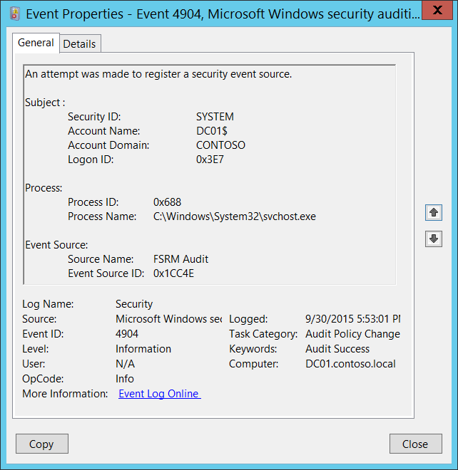
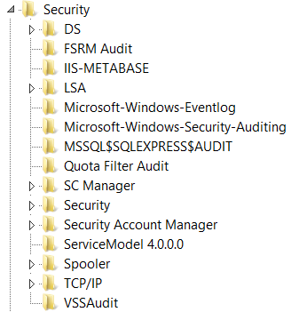

# 4904(S): セキュリティ イベント ソースの登録が試みられました。



***サブカテゴリ:***&nbsp;[監査ポリシーの変更](audit-audit-policy-change.md)

***イベントの説明:***

このイベントは、新しい[セキュリティ イベント ソース](/windows/win32/eventlog/event-sources)が登録されるたびに生成されます。

システムの起動時に、特定のロール (たとえば、Internet Information Services) がシステムにインストールされている場合に、このイベントが表示されることがあります。

> **注**&nbsp;&nbsp;推奨事項については、このイベントの[セキュリティ監視の推奨事項](#security-monitoring-recommendations)を参照してください。

<br clear="all">

***イベント XML:***
```xml
- <Event xmlns="http://schemas.microsoft.com/win/2004/08/events/event">
- <System>
 <Provider Name="Microsoft-Windows-Security-Auditing" Guid="{54849625-5478-4994-A5BA-3E3B0328C30D}" /> 
 <EventID>4904</EventID> 
 <Version>0</Version> 
 <Level>0</Level> 
 <Task>13568</Task> 
 <Opcode>0</Opcode> 
 <Keywords>0x8020000000000000</Keywords> 
 <TimeCreated SystemTime="2015-10-01T00:53:01.030688000Z" /> 
 <EventRecordID>1049538</EventRecordID> 
 <Correlation /> 
 <Execution ProcessID="520" ThreadID="548" /> 
 <Channel>Security</Channel> 
 <Computer>DC01.contoso.local</Computer> 
 <Security /> 
 </System>
- <EventData>
 <Data Name="SubjectUserSid">S-1-5-18</Data> 
 <Data Name="SubjectUserName">DC01$</Data> 
 <Data Name="SubjectDomainName">CONTOSO</Data> 
 <Data Name="SubjectLogonId">0x3e7</Data> 
 <Data Name="AuditSourceName">FSRM Audit</Data> 
 <Data Name="EventSourceId">0x1cc4e</Data> 
 <Data Name="ProcessId">0x688</Data> 
 <Data Name="ProcessName">C:\\Windows\\System32\\svchost.exe</Data> 
 </EventData>
 </Event>

```

***必要なサーバー ロール:*** なし。

***最小 OS バージョン:*** Windows Server 2008、Windows Vista。

***イベント バージョン:*** 0。

***フィールドの説明:***

**サブジェクト:**

-   **セキュリティ ID** \[タイプ = SID\]**:** セキュリティ イベント ソースの登録を試みたアカウントの SID。イベント ビューアーは自動的に SID を解決してアカウント名を表示しようとします。SID を解決できない場合は、イベントにソース データが表示されます。

> **注**&nbsp;&nbsp;**セキュリティ識別子 (SID)** は、トラスティ (セキュリティ プリンシパル) を識別するために使用される可変長の一意の値です。各アカウントには、Active Directory ドメイン コントローラーなどの認証機関によって発行され、セキュリティ データベースに保存される一意の SID があります。ユーザーがログオンするたびに、システムはデータベースからそのユーザーの SID を取得し、そのユーザーのアクセストークンに配置します。システムは、アクセストークン内の SID を使用して、以降のすべての Windows セキュリティとのやり取りでユーザーを識別します。SID がユーザーまたはグループの一意の識別子として使用された場合、それは他のユーザーまたはグループを識別するために再利用されることはありません。SID の詳細については、[セキュリティ識別子](/windows/access-protection/access-control/security-identifiers)を参照してください。

-   **アカウント名** \[タイプ = UnicodeString\]**:** セキュリティイベントソースの登録を試みたアカウントの名前。

-   **アカウントドメイン** \[タイプ = UnicodeString\]**:** サブジェクトのドメインまたはコンピュータ名。形式はさまざまで、以下を含みます：

    -   ドメイン NETBIOS 名の例: CONTOSO

    -   小文字の完全なドメイン名: contoso.local

    -   大文字の完全なドメイン名: CONTOSO.LOCAL

    -   一部の[よく知られたセキュリティプリンシパル](/windows/security/identity-protection/access-control/security-identifiers)の場合、例えば LOCAL SERVICE や ANONYMOUS LOGON、このフィールドの値は「NT AUTHORITY」となります。

    -   ローカルユーザーアカウントの場合、このフィールドにはこのアカウントが属するコンピュータまたはデバイスの名前が含まれます。例えば: “Win81”。

-   **ログオンID** \[タイプ = HexInt64\]**:** 16進数の値で、同じログオンIDを含む可能性のある最近のイベントとこのイベントを関連付けるのに役立ちます。例えば、"[4624](event-4624.md): アカウントが正常にログオンされました。"。

**プロセス:**

-   **プロセスID** \[タイプ = Pointer\]: セキュリティイベントソースの登録を試みたプロセスの16進数のプロセスID。プロセスID (PID) は、オペレーティングシステムがアクティブなプロセスを一意に識別するために使用する番号です。特定のプロセスのPIDを確認するには、例えばタスクマネージャー（詳細タブ、PID列）を使用できます：

    

    16進数の値を10進数に変換すると、タスクマネージャーの値と比較できます。

    また、このプロセスIDを他のイベントのプロセスIDと関連付けることもできます。例えば、"[4688](event-4688.md): 新しいプロセスが作成されました" **プロセス情報\\新しいプロセスID**。

-   **プロセス名** \[タイプ = UnicodeString\]**:** プロセスの実行ファイルのフルパスと名前。

**イベントソース:**

-   **ソース名** \[タイプ = UnicodeString\]: 登録されたセキュリティイベントソースの名前。このレジストリパスで登録されたすべてのセキュリティイベントソース名を確認できます: “HKEY\_LOCAL\_MACHINE\\SYSTEM\\CurrentControlSet\\Services\\EventLog\\Security”。以下はその例です:

    

-   **イベントソースID** \[Type = HexInt64\]: 登録されたセキュリティイベントソースの一意の16進数識別子。

## セキュリティ監視の推奨事項

4904(S): セキュリティイベントソースの登録が試みられました。

> **重要**&nbsp;&nbsp;このイベントについては、[付録A: 多くの監査イベントのためのセキュリティ監視の推奨事項](appendix-a-security-monitoring-recommendations-for-many-audit-events.md)も参照してください。

-   このイベントは通常SYSTEMアカウントによってトリガーされるため、**「Subject\\Security ID」**がSYSTEMでない場合には報告することをお勧めします。

-   このイベントで報告されたプロセスの「**プロセス名**」が事前に定義されたものである場合、定義された値と異なる「**プロセス名**」のすべてのイベントを監視します。

-   「**プロセス名**」が標準フォルダー（例：**System32**や**Program Files**）にない、または制限されたフォルダー（例：**Temporary Internet Files**）にあるかどうかを監視できます。

-   プロセス名に含まれる制限された部分文字列や単語（例：「**mimikatz**」や「**cain.exe**」）の事前定義リストがある場合、「**プロセス名**」にこれらの部分文字列が含まれているかどうかを確認します。

-   特定のコンピューターやコンピュータータイプに対して許可されたセキュリティイベントソースの事前定義リストがある場合、このイベントを使用して「**イベントソース\\ソース名**」が定義リストに含まれているかどうかを確認できます。

-   通常、このイベントは情報提供を目的としています。
