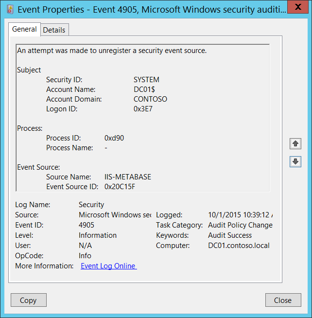

# 4905(S): セキュリティ イベント ソースの登録解除が試行されました。



***サブカテゴリ:***&nbsp;[監査ポリシーの変更](audit-audit-policy-change.md)

***イベントの説明:***

このイベントは、[セキュリティ イベント ソース](/windows/win32/eventlog/event-sources)の登録が解除されるたびに生成されます。

通常、このイベントは特定の役割が削除された場合に表示されます。たとえば、インターネット インフォメーション サービスの場合です。

> **注**&nbsp;&nbsp;推奨事項については、このイベントの[セキュリティ監視の推奨事項](#security-monitoring-recommendations)を参照してください。

<br clear="all">

***イベント XML:***
```
- <Event xmlns="http://schemas.microsoft.com/win/2004/08/events/event">
- <System>
 <Provider Name="Microsoft-Windows-Security-Auditing" Guid="{54849625-5478-4994-A5BA-3E3B0328C30D}" /> 
 <EventID>4905</EventID> 
 <Version>0</Version> 
 <Level>0</Level> 
 <Task>13568</Task> 
 <Opcode>0</Opcode> 
 <Keywords>0x8020000000000000</Keywords> 
 <TimeCreated SystemTime="2015-10-01T17:39:12.039825000Z" /> 
 <EventRecordID>1049718</EventRecordID> 
 <Correlation /> 
 <Execution ProcessID="500" ThreadID="1888" /> 
 <Channel>Security</Channel> 
 <Computer>DC01.contoso.local</Computer> 
 <Security /> 
 </System>
- <EventData>
 <Data Name="SubjectUserSid">S-1-5-18</Data> 
 <Data Name="SubjectUserName">DC01$</Data> 
 <Data Name="SubjectDomainName">CONTOSO</Data> 
 <Data Name="SubjectLogonId">0x3e7</Data> 
 <Data Name="AuditSourceName">IIS-METABASE</Data> 
 <Data Name="EventSourceId">0x20c15f</Data> 
 <Data Name="ProcessId">0xd90</Data> 
 <Data Name="ProcessName">-</Data> 
 </EventData>
 </Event>

```

***必要なサーバーの役割:*** なし。

***最小 OS バージョン:*** Windows Server 2008、Windows Vista。

***イベント バージョン:*** 0。

***フィールドの説明:***

**サブジェクト:**

-   **セキュリティ ID** \[タイプ = SID\]**:** セキュリティ イベント ソースの登録解除を試みたアカウントの SID。イベント ビューアーは自動的に SID を解決してアカウント名を表示しようとします。SID を解決できない場合は、イベントにソース データが表示されます。

> **注**&nbsp;&nbsp;**セキュリティ識別子 (SID)** は、トラスティ (セキュリティ プリンシパル) を識別するために使用される可変長の一意の値です。各アカウントには、Active Directory ドメイン コントローラーなどの認証機関によって発行され、セキュリティ データベースに格納される一意の SID があります。ユーザーがログオンするたびに、システムはデータベースからそのユーザーの SID を取得し、そのユーザーのアクセストークンに配置します。システムはアクセストークン内の SID を使用して、以降のすべての Windows セキュリティとのやり取りでユーザーを識別します。SID がユーザーまたはグループの一意の識別子として使用された場合、それが別のユーザーまたはグループを識別するために再度使用されることはありません。SID の詳細については、[セキュリティ識別子](/windows/access-protection/access-control/security-identifiers)を参照してください。

-   **アカウント名** \[タイプ = UnicodeString\]**:** セキュリティイベントソースの登録解除を試みたアカウントの名前。

-   **アカウントドメイン** \[タイプ = UnicodeString\]**:** サブジェクトのドメインまたはコンピュータ名。形式はさまざまで、以下のようなものが含まれます：

    -   ドメイン NETBIOS 名の例: CONTOSO

    -   小文字の完全ドメイン名: contoso.local

    -   大文字の完全ドメイン名: CONTOSO.LOCAL

    -   一部の[よく知られたセキュリティプリンシパル](/windows/security/identity-protection/access-control/security-identifiers)（例えば、LOCAL SERVICE や ANONYMOUS LOGON）の場合、このフィールドの値は「NT AUTHORITY」となります。

    -   ローカルユーザーアカウントの場合、このフィールドにはこのアカウントが属するコンピュータまたはデバイスの名前が含まれます。例えば、「Win81」のように。

-   **ログオンID** \[タイプ = HexInt64\]**:** 16進数の値で、同じログオンIDを含む最近のイベントとこのイベントを関連付けるのに役立ちます。例えば、「[4624](event-4624.md): アカウントが正常にログオンされました。」

**プロセス情報:**

-   **プロセスID** \[タイプ = Pointer\]: セキュリティイベントソースの登録解除を試みたプロセスの16進数のプロセスID。プロセスID（PID）は、オペレーティングシステムがアクティブなプロセスを一意に識別するために使用する番号です。特定のプロセスのPIDを確認するには、例えばタスクマネージャー（詳細タブ、PID列）を使用できます：

    

    16進数の値を10進数に変換すると、タスクマネージャーの値と比較できます。

    また、このプロセスIDを他のイベントのプロセスIDと関連付けることもできます。例えば、「[4688](event-4688.md): 新しいプロセスが作成されました」 **プロセス情報\\新しいプロセスID**。

-   **プロセス名** \[タイプ = UnicodeString\]**:** プロセスの実行可能ファイルのフルパスと名前。

**イベントソース:**

-   **ソース名** \[タイプ = UnicodeString\]: 登録解除されたセキュリティイベントソースの名前。このレジストリパスで登録されているすべてのセキュリティイベントソース名を確認できます: “HKEY\_LOCAL\_MACHINE\\SYSTEM\\CurrentControlSet\\Services\\EventLog\\Security”。以下はその例です:

    

-   **イベントソースID** \[Type = HexInt64\]: 未登録のセキュリティイベントソースの一意の16進数識別子。

## セキュリティ監視の推奨事項

4905(S): セキュリティイベントソースの登録解除が試みられました。

> **重要**&nbsp;&nbsp;このイベントについては、[付録A: 多くの監査イベントに対するセキュリティ監視の推奨事項](appendix-a-security-monitoring-recommendations-for-many-audit-events.md)も参照してください。

-   このイベントは通常SYSTEMアカウントによってトリガーされるため、**「Subject\\Security ID」**がSYSTEMでない場合に報告することをお勧めします。

-   このイベントで報告されたプロセスの事前定義された「**プロセス名**」がある場合、「**プロセス名**」が定義された値と異なるすべてのイベントを監視します。

-   「**プロセス名**」が標準フォルダ（例：**System32**や**Program Files**）にないか、制限されたフォルダ（例：**Temporary Internet Files**）にあるかを監視できます。

-   プロセス名に含まれる制限された部分文字列や単語（例：「**mimikatz**」や「**cain.exe**」）の事前定義リストがある場合、「**プロセス名**」にこれらの部分文字列が含まれているかを確認します。

-   登録解除されるべきでない重要なセキュリティイベントソースのリストがある場合、このイベントを使用して「**イベントソース\\ソース名**」を確認できます。

-   通常、このイベントは情報提供を目的としています。
