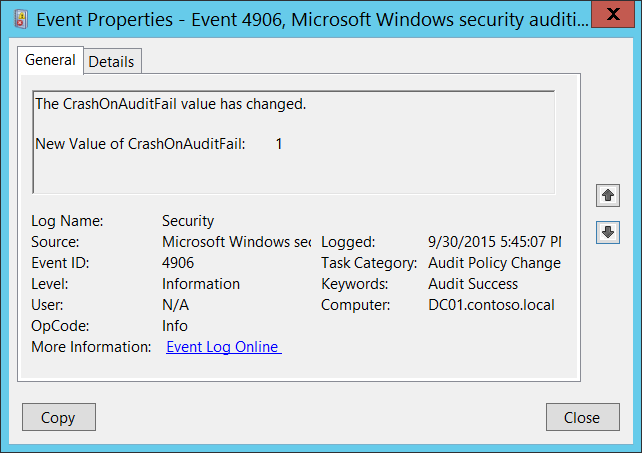

# 4906(S): CrashOnAuditFail の値が変更されました。



***サブカテゴリ:***&nbsp;[監査ポリシーの変更](audit-audit-policy-change.md)

***イベントの説明:***

このイベントは、**CrashOnAuditFail** 監査フラグの値が変更されるたびに生成されます。

このイベントは、「監査ポリシーの変更」サブカテゴリの設定に関係なく常に記録されます。

**CrashOnAuditFail** フラグに関する詳細は[こちら](/previous-versions/windows/it-pro/windows-2000-server/cc963220(v=technet.10))をご覧ください。

> **注**&nbsp;&nbsp;推奨事項については、このイベントの[セキュリティ監視の推奨事項](#security-monitoring-recommendations)を参照してください。

<br clear="all">

***イベント XML:***
```xml
- <Event xmlns="http://schemas.microsoft.com/win/2004/08/events/event">
- <System>
 <Provider Name="Microsoft-Windows-Security-Auditing" Guid="{54849625-5478-4994-A5BA-3E3B0328C30D}" /> 
 <EventID>4906</EventID> 
 <Version>0</Version> 
 <Level>0</Level> 
 <Task>13568</Task> 
 <Opcode>0</Opcode> 
 <Keywords>0x8020000000000000</Keywords> 
 <TimeCreated SystemTime="2015-10-01T00:45:07.048458800Z" /> 
 <EventRecordID>1049529</EventRecordID> 
 <Correlation /> 
 <Execution ProcessID="516" ThreadID="532" /> 
 <Channel>Security</Channel> 
 <Computer>DC01.contoso.local</Computer> 
 <Security /> 
 </System>
- <EventData>
 <Data Name="CrashOnAuditFailValue">1</Data> 
 </EventData>
 </Event>

```

***必要なサーバー役割:*** なし。

***最小 OS バージョン:*** Windows Server 2008, Windows Vista。

***イベントバージョン:*** 0。

***フィールドの説明:***

**CrashOnAuditFail の新しい値** \[Type = UInt32\]**:** **CrashOnAuditFail** フラグの新しい値を含みます。可能な値は次のとおりです:

-   0 - 機能がオフです。システムは、セキュリティログにイベントを記録できない場合でも停止しません。

-   1 - 機能がオンです。システムは、セキュリティログにイベントを記録できない場合に停止します。

-   2 - 機能がオンで、トリガーされました。システムは、セキュリティログに監査可能なイベントを記録できなかったために停止しました。管理者グループのメンバーのみがログオンできます。

## セキュリティ監視の推奨事項

4906(S): CrashOnAuditFail の値が変更されました。

-   このイベントによって報告される **CrashOnAuditFail** 監査フラグの変更はすべて監視され、アラートがトリガーされるべきです。この変更が計画されていなかった場合は、変更の理由を調査してください。
