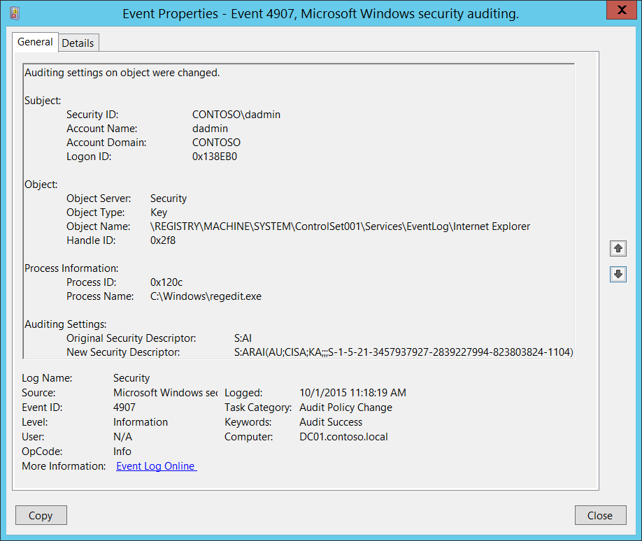
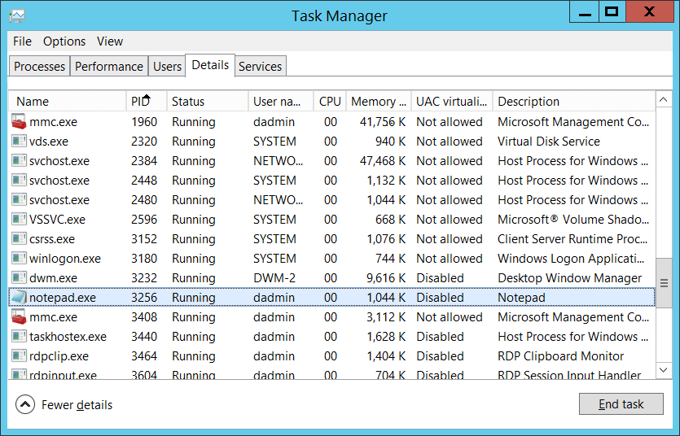

# 4907(S): オブジェクトの監査設定が変更されました。




***サブカテゴリ:***&nbsp;[監査ポリシーの変更](audit-audit-policy-change.md)

***イベントの説明:***

このイベントは、オブジェクト（例えば、レジストリ キーやファイル）の[SACL](/windows/win32/secauthz/access-control-lists)が変更されたときに生成されます。

このイベントは、Active Directory オブジェクトには生成されません。

> **注**&nbsp;&nbsp;推奨事項については、このイベントの[セキュリティ監視の推奨事項](#security-monitoring-recommendations)を参照してください。

<br clear="all">

***イベント XML:***
```xml
- <Event xmlns="http://schemas.microsoft.com/win/2004/08/events/event">
- <System>
 <Provider Name="Microsoft-Windows-Security-Auditing" Guid="{54849625-5478-4994-A5BA-3E3B0328C30D}" /> 
 <EventID>4907</EventID> 
 <Version>0</Version> 
 <Level>0</Level> 
 <Task>13568</Task> 
 <Opcode>0</Opcode> 
 <Keywords>0x8020000000000000</Keywords> 
 <TimeCreated SystemTime="2015-10-01T18:18:19.458828800Z" /> 
 <EventRecordID>1049732</EventRecordID> 
 <Correlation /> 
 <Execution ProcessID="500" ThreadID="508" /> 
 <Channel>Security</Channel> 
 <Computer>DC01.contoso.local</Computer> 
 <Security /> 
 </System>
- <EventData>
 <Data Name="SubjectUserSid">S-1-5-21-3457937927-2839227994-823803824-1104</Data> 
 <Data Name="SubjectUserName">dadmin</Data> 
 <Data Name="SubjectDomainName">CONTOSO</Data> 
 <Data Name="SubjectLogonId">0x138eb0</Data> 
 <Data Name="ObjectServer">Security</Data> 
 <Data Name="ObjectType">Key</Data> 
 <Data Name="ObjectName">\\REGISTRY\\MACHINE\\SYSTEM\\ControlSet001\\Services\\EventLog\\Internet Explorer</Data> 
 <Data Name="HandleId">0x2f8</Data> 
 <Data Name="OldSd">S:AI</Data> 
 <Data Name="NewSd">S:ARAI(AU;CISA;KA;;;S-1-5-21-3457937927-2839227994-823803824-1104)</Data> 
 <Data Name="ProcessId">0x120c</Data> 
 <Data Name="ProcessName">C:\\Windows\\regedit.exe</Data> 
 </EventData>
 </Event>
```

***必要なサーバー ロール:*** なし。

***最小 OS バージョン:*** Windows Server 2008, Windows Vista。

***イベント バージョン:*** 0。

***フィールドの説明:***

**サブジェクト:**

-   **セキュリティ ID** \[タイプ = SID\]**:** オブジェクトの監査設定を変更したアカウントの SID。イベント ビューアーは自動的に SID を解決し、アカウント名を表示しようとします。SID を解決できない場合、イベントにはソース データが表示されます。

> **注**&nbsp;&nbsp;**セキュリティ識別子 (SID)** は、トラスティ (セキュリティ プリンシパル) を識別するために使用される可変長の一意の値です。各アカウントには、Active Directory ドメイン コントローラーなどの権限によって発行され、セキュリティ データベースに保存される一意の SID があります。ユーザーがログオンするたびに、システムはデータベースからそのユーザーの SID を取得し、そのユーザーのアクセストークンに配置します。システムは、アクセストークン内の SID を使用して、以降のすべての Windows セキュリティとのやり取りでユーザーを識別します。SID がユーザーまたはグループの一意の識別子として使用された場合、それは他のユーザーまたはグループを識別するために再利用されることはありません。SID についての詳細は、[セキュリティ識別子](/windows/access-protection/access-control/security-identifiers)を参照してください。

-   **アカウント名** \[タイプ = UnicodeString\]**:** オブジェクトの監査設定を変更したアカウントの名前。

-   **アカウントドメイン** \[タイプ = UnicodeString\]**:** サブジェクトのドメインまたはコンピュータ名。形式は以下のように異なります：

    -   ドメインのNETBIOS名の例: CONTOSO

    -   小文字の完全なドメイン名: contoso.local

    -   大文字の完全なドメイン名: CONTOSO.LOCAL

    -   LOCAL SERVICEやANONYMOUS LOGONなどの[よく知られたセキュリティプリンシパル](/windows/security/identity-protection/access-control/security-identifiers)の場合、このフィールドの値は「NT AUTHORITY」となります。

    -   ローカルユーザーアカウントの場合、このフィールドにはこのアカウントが属するコンピュータまたはデバイスの名前が含まれます。例: “Win81”。

-   **ログオンID** \[タイプ = HexInt64\]**:** 16進数の値で、最近のイベントと同じログオンIDを含む可能性のあるイベントとこのイベントを関連付けるのに役立ちます。例: “[4624](event-4624.md): アカウントが正常にログオンされました。”

**オブジェクト**:

-   **オブジェクトサーバー** \[タイプ = UnicodeString\]: このイベントの値は「**Security**」です。

-   **オブジェクトタイプ** \[タイプ = UnicodeString\]: 操作中にアクセスされたオブジェクトのタイプ。

    以下の表は、最も一般的な**オブジェクトタイプ**のリストを含んでいます：

| ディレクトリ           | イベント      | タイマー            | デバイス           |
|-------------------------|--------------|----------------------|--------------------|
| ミュータント            | タイプ        | ファイル             | トークン           |
| スレッド                | セクション    | ウィンドウステーション | デバッグオブジェクト |
| フィルター通信ポート    | イベントペア  | ドライバー           | IoCompletion       |
| コントローラー          | シンボリックリンク | WmiGuid              | プロセス           |
| プロファイル            | デスクトップ  | キードイベント       | SC\_MANAGER オブジェクト |
| キー                    | 待機可能ポート | コールバック         |                    |
| ジョブ                  | ポート        | フィルター接続ポート |                    |
| ALPC ポート             | セマフォ      | アダプター           |                    |

-   **オブジェクト名** \[タイプ = UnicodeString\]: [SACL](/windows/win32/secauthz/access-control-lists) が変更されたオブジェクトのフルパスと名前。**オブジェクトタイプ** に依存します。以下は例です：

    -   **オブジェクトタイプ** = “Key” の場合の形式は: \\REGISTRY\\HIVE\\PATH です。ここで：

        -   HIVE:

            -   HKEY\_LOCAL\_MACHINE = \\REGISTRY\\MACHINE

            -   HKEY\_CURRENT\_USER = \\REGISTRY\\USER\\\[USER\_SID\]、ここで \[USER\_SID\] は現在のユーザーのSIDです。

            -   HKEY\_CLASSES\_ROOT = \\REGISTRY\\MACHINE\\SOFTWARE\\Classes

            -   HKEY\_USERS = \\REGISTRY\\USER

            -   HKEY\_CURRENT\_CONFIG = \\REGISTRY\\MACHINE\\SYSTEM\\ControlSet001\\Hardware Profiles\\Current

        -   PATH – レジストリキーへのパス。

    -   **オブジェクトタイプ** = “File” の場合の形式は: [SACL](/windows/win32/secauthz/access-control-lists) が変更されたファイルまたはフォルダーのフルパスと名前です。

-   **ハンドルID** \[タイプ = ポインタ\]: **オブジェクト名** へのハンドルの16進数値。このフィールドは、同じハンドルIDを含む可能性のある他のイベントとこのイベントを関連付けるのに役立ちます。例えば、「[4656](event-4656.md): オブジェクトへのハンドルが要求されました。」レジストリキーのイベント、または「[4656](event-4656.md)(S, F): オブジェクトへのハンドルが要求されました。」ファイルシステムオブジェクトのイベント。このパラメータはイベントでキャプチャされない場合があり、その場合は「0x0」と表示されます。

**プロセス情報:**

-   **プロセスID** \[タイプ = ポインタ\]: オブジェクトの [SACL](/windows/win32/secauthz/access-control-lists) が変更されたプロセスの16進数プロセスID。プロセスID (PID) は、オペレーティングシステムがアクティブなプロセスを一意に識別するために使用する番号です。特定のプロセスのPIDを確認するには、例えばタスクマネージャー（詳細タブ、PID列）を使用できます：

    

    16進数値を10進数に変換すると、タスクマネージャーの値と比較できます。

    他のイベントのプロセスIDとこのプロセスIDを関連付けることもできます。例えば、「[4688](event-4688.md): 新しいプロセスが作成されました」**プロセス情報\\新しいプロセスID**。

-   **プロセス名** \[タイプ = UnicodeString\]**:** プロセスの実行ファイルのフルパスと名前。

**監査設定:**

-   **元のセキュリティ記述子** \[タイプ = UnicodeString\]**:** オブジェクトの古いセキュリティ記述子定義言語 (SDDL) の値。

-   **新しいセキュリティ記述子** \[タイプ = UnicodeString\]**:** オブジェクトの新しいセキュリティ記述子定義言語 (SDDL) の値。

> **注**&nbsp;&nbsp;**セキュリティ記述子定義言語 (SDDL)** は、セキュリティ記述子に含まれる情報を列挙するための文字列要素を定義します。
> 
> 例:
> 
> *O*:BA*G*:SY*D*:(D;;0xf0007;;;AN)(D;;0xf0007;;;BG)(A;;0xf0007;;;SY)(A;;0×7;;;BA)*S*:ARAI(AU;SAFA;DCLCRPCRSDWDWO;;;WD)
> 
> - *O*: = 所有者。特定のセキュリティプリンシパルのSID、または予約済み（事前定義された）値。例えば、BA (BUILTIN\_ADMINISTRATORS)、WD (Everyone)、SY (LOCAL\_SYSTEM) など。
> 以下の表に可能な値のリストを示します:

| 値   | 説明                                    | 値   | 説明                             |
|------|-----------------------------------------|------|----------------------------------|
| "AO" | アカウントオペレーター                  | "PA" | グループポリシー管理者           |
| "RU" | Windows 2000以前のエイリアス            | "IU" | インタラクティブにログオンしたユーザー |
| "AN" | 匿名ログオン                            | "LA" | ローカル管理者                   |
| "AU" | 認証されたユーザー                      | "LG" | ローカルゲスト                   |
| "BA" | 組み込み管理者                          | "LS" | ローカルサービスアカウント       |
| "BG" | 組み込みゲスト                          | "SY" | ローカルシステム                 |
| "BO" | バックアップオペレーター                | "NU" | ネットワークログオンユーザー     |
| "BU" | 組み込みユーザー                        | "NO" | ネットワーク構成オペレーター     |
| "CA" | 証明書サーバー管理者                    | "NS" | ネットワークサービスアカウント   |
| "CG" | クリエイターグループ                    | "PO" | プリンターオペレーター           |
| "CO" | クリエイターオーナー                    | "PS" | 個人自身                         |
| "DA" | ドメイン管理者                          | "PU" | パワーユーザー                   |
| "DC" | ドメインコンピューター                  | "RS" | RASサーバーグループ              |
| "DD" | ドメインコントローラー                  | "RD" | ターミナルサーバーユーザー       |
| "DG" | ドメインゲスト                          | "RE" | レプリケーター                   |
| "DU" | ドメインユーザー                        | "RC" | 制限付きコード                   |
| "EA" | エンタープライズ管理者                  | "SA" | スキーマ管理者                   |
| "ED" | エンタープライズドメインコントローラー  | "SO" | サーバーオペレーター             |
| "WD" | すべてのユーザー                        | "SU" | サービストログオンユーザー       |

- *G*: = プライマリグループ。
- *D*: = DACL エントリ。
- *S*: = SACL エントリ。

*DACL/SACL エントリ形式:* entry\_type:inheritance\_flags(ace\_type;ace\_flags;rights;object\_guid;inherit\_object\_guid;account\_sid)

例: D:(A;;FA;;;WD)

- entry\_type:

「D」 - DACL

「S」 - SACL

- inheritance\_flags:

「P」 - SDDL\_PROTECTED、フォルダ階層の上位にあるコンテナからの継承がブロックされます。

「AI」 - SDDL\_AUTO\_INHERITED、継承が許可されます。「P」が設定されていない場合に限ります。

「AR」 - SDDL\_AUTO\_INHERIT\_REQ、子オブジェクトはこのオブジェクトから権限を継承します。

- ace\_type:

「A」 - アクセス許可

「D」 - アクセス拒否

「OA」 - オブジェクトアクセス許可: オブジェクトのサブセットにのみ適用されます。

「OD」 - オブジェクトアクセス拒否: オブジェクトのサブセットにのみ適用されます。

「AU」 - システム監査

「A」 - システムアラーム

「OU」 - オブジェクトシステム監査

「OL」 - オブジェクトシステムアラーム

- ace\_flags:

「CI」 - コンテナ継承: ディレクトリなどのコンテナである子オブジェクトは、ACE を明示的な ACE として継承します。

「OI」 - オブジェクト継承: コンテナでない子オブジェクトは、ACE を明示的な ACE として継承します。

「NP」 - 伝播なし: 直接の子オブジェクトのみがこの ACE を継承します。

「IO」 - 継承のみ: ACE はこのオブジェクトには適用されませんが、継承によって子オブジェクトに影響を与える可能性があります。

「ID」 - ACE が継承されました

「SA」 - 成功したアクセス監査

「FA」 - 失敗したアクセス監査

- rights: アクセスマスクまたは予約値を示す 16 進文字列。例: FA (ファイル全アクセス)、FX (ファイル実行)、FW (ファイル書き込み) など。

| 値                        | 説明                             | 値                   | 説明                      |
|---------------------------|----------------------------------|----------------------|---------------------------|
| 一般的なアクセス権        | ディレクトリサービスアクセス権   |
| 「GA」                    | 一般全アクセス                   | 「RC」                | 読み取り権限              |
| 「GR」                    | 一般読み取り                     | 「SD」                | 削除                      |
| 「GW」                    | 一般書き込み                     | 「WD」                | 権限の変更                |
| 「GX」                    | 一般実行                         | 「WO」                | 所有者の変更              |
| ファイルアクセス権        | 「RP」                           | すべてのプロパティの読み取り |
| 「FA」                    | ファイル全アクセス               | 「WP」                | すべてのプロパティの書き込み |
| 「FR」                    | ファイル一般読み取り             | 「CC」                | すべての子オブジェクトの作成 |
| 「FW」                    | ファイル一般書き込み             | 「DC」                | すべての子オブジェクトの削除 |
| 「FX」                    | ファイル一般実行                 | 「LC」                | コンテンツの一覧表示      |
| レジストリキーアクセス権  | 「SW」                           | すべての検証済み書き込み |
| 「KA」                    | 「LO」                           | 「LO」                | オブジェクトの一覧表示    |
| 「K」                     | キー読み取り                     | 「DT」                | サブツリーの削除          |
| 「KW」                    | キー書き込み                     | 「CR」                | すべての拡張権限          |
| 「KX」                    | キー実行                         |                      |                           |

- object\_guid: N/A
- inherit\_object\_guid: N/A
- account\_sid: 特定のセキュリティプリンシパルのSID、または予約された値、例えば: AN (匿名)、WD (全員)、SY (LOCAL\_SYSTEM)など。詳細は上記の表を参照してください。

SDDL構文の詳細については、以下の記事を参照してください: <https://msdn.microsoft.com/library/cc230374.aspx>, <https://msdn.microsoft.com/library/windows/hardware/aa374892(v=vs.85).aspx>.

## セキュリティ監視の推奨事項

4907(S): オブジェクトの監査設定が変更されました。

> **重要**&nbsp;&nbsp;このイベントについては、[付録A: 多くの監査イベントに対するセキュリティ監視の推奨事項](appendix-a-security-monitoring-recommendations-for-many-audit-events.md)も参照してください。

- 特定のWindowsオブジェクトタイプ（「**オブジェクトタイプ**」）に関連するイベントを監視する必要がある場合、例えば**ファイル**や**キー**、対応する「**オブジェクトタイプ**」のこのイベントを監視してください。

- 特定のファイル、フォルダ、レジストリキー、または他のオブジェクトタイプのすべてのSACL変更を監視する必要がある場合、特定のオブジェクト名を持つ「**オブジェクト名**」フィールド値を監視してください。

<!-- -->

- 重要なファイルやレジストリオブジェクトがあり、すべての変更（特にSACLの変更）を監視する必要がある場合、特定の「**オブジェクト\\オブジェクト名**」を監視してください。

- すべての変更、または特定のファイルやレジストリオブジェクトのすべての変更を監視する必要がある高価値のコンピュータがある場合、これらのコンピュータで発生するすべての[4907](event-4907.md)イベントを監視してください<b>。</b>
