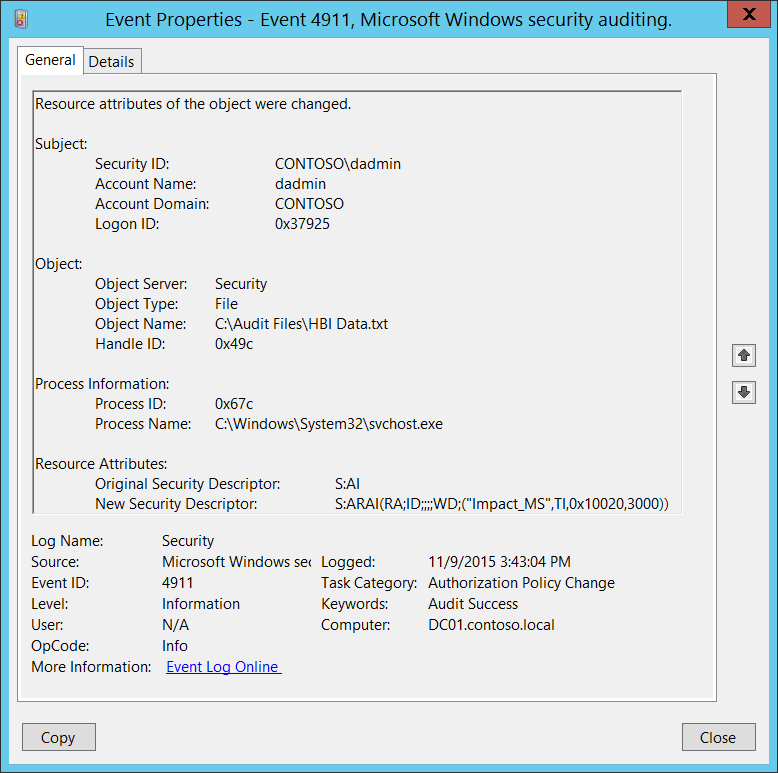

# 4911(S): オブジェクトのリソース属性が変更されました。



***サブカテゴリ:***&nbsp;[監査承認ポリシーの変更](audit-authorization-policy-change.md)

***イベントの説明:***

このイベントは、ファイルシステムオブジェクトの[リソース属性](/windows-server/identity/solution-guides/dynamic-access-control--scenario-overview)が変更されたときに生成されます。

ファイルやフォルダーのリソース属性は、例えば Windows ファイル エクスプローラー (オブジェクトのプロパティ-&gt;分類タブ) を使用して変更できます。

> **注**&nbsp;&nbsp;推奨事項については、このイベントの[セキュリティ監視の推奨事項](#security-monitoring-recommendations)を参照してください。

<br clear="all">

***イベント XML:***
```
- <Event xmlns="http://schemas.microsoft.com/win/2004/08/events/event">
- <System>
 <Provider Name="Microsoft-Windows-Security-Auditing" Guid="{54849625-5478-4994-A5BA-3E3B0328C30D}" /> 
 <EventID>4911</EventID> 
 <Version>0</Version> 
 <Level>0</Level> 
 <Task>13570</Task> 
 <Opcode>0</Opcode> 
 <Keywords>0x8020000000000000</Keywords> 
 <TimeCreated SystemTime="2015-11-09T23:43:04.009319300Z" /> 
 <EventRecordID>1183714</EventRecordID> 
 <Correlation /> 
 <Execution ProcessID="516" ThreadID="524" /> 
 <Channel>Security</Channel> 
 <Computer>DC01.contoso.local</Computer> 
 <Security /> 
 </System>
- <EventData>
 <Data Name="SubjectUserSid">S-1-5-21-3457937927-2839227994-823803824-1104</Data> 
 <Data Name="SubjectUserName">dadmin</Data> 
 <Data Name="SubjectDomainName">CONTOSO</Data> 
 <Data Name="SubjectLogonId">0x37925</Data> 
 <Data Name="ObjectServer">Security</Data> 
 <Data Name="ObjectType">File</Data> 
 <Data Name="ObjectName">C:\\Audit Files\\HBI Data.txt</Data> 
 <Data Name="HandleId">0x49c</Data> 
 <Data Name="OldSd">S:AI</Data> 
 <Data Name="NewSd">S:ARAI(RA;ID;;;;WD;("Impact\_MS",TI,0x10020,3000))</Data> 
 <Data Name="ProcessId">0x67c</Data> 
 <Data Name="ProcessName">C:\\Windows\\System32\\svchost.exe</Data> 
 </EventData>
</Event>
```

***必要なサーバー ロール:*** なし。

***最小 OS バージョン:*** Windows Server 2012, Windows 8。

***イベント バージョン:*** 0。

***フィールドの説明:***

**サブジェクト:**

-   **セキュリティ ID** \[タイプ = SID\]**:** ファイルシステムオブジェクトのリソース属性を変更したアカウントの SID。イベント ビューアーは自動的に SID を解決し、アカウント名を表示しようとします。SID を解決できない場合、イベントにソース データが表示されます。

> **注**&nbsp;&nbsp;**セキュリティ識別子 (SID)** は、トラスティ (セキュリティ プリンシパル) を識別するために使用される可変長の一意の値です。各アカウントには、Active Directory ドメイン コントローラーなどの権限によって発行され、セキュリティ データベースに格納される一意の SID があります。ユーザーがログオンするたびに、システムはデータベースからそのユーザーの SID を取得し、そのユーザーのアクセス トークンに配置します。システムは、アクセス トークン内の SID を使用して、以降のすべての Windows セキュリティとのやり取りでユーザーを識別します。SID がユーザーまたはグループの一意の識別子として使用された場合、それが再び別のユーザーまたはグループを識別するために使用されることはありません。SID の詳細については、[セキュリティ識別子](/windows/access-protection/access-control/security-identifiers)を参照してください。

-   **アカウント名** \[タイプ = UnicodeString\]**:** ファイルシステムオブジェクトのリソース属性を変更したアカウントの名前。

-   **アカウントドメイン** \[タイプ = UnicodeString\]**:** サブジェクトのドメインまたはコンピュータ名。形式は以下のように異なります：

    -   ドメインのNETBIOS名の例: CONTOSO

    -   小文字の完全なドメイン名: contoso.local

    -   大文字の完全なドメイン名: CONTOSO.LOCAL

    -   LOCAL SERVICEやANONYMOUS LOGONなどの[よく知られたセキュリティプリンシパル](/windows/security/identity-protection/access-control/security-identifiers)の場合、このフィールドの値は「NT AUTHORITY」となります。

    -   ローカルユーザーアカウントの場合、このフィールドにはこのアカウントが属するコンピュータまたはデバイスの名前が含まれます。例: “Win81”。

-   **ログオンID** \[タイプ = HexInt64\]**:** 16進数の値で、最近のイベントとこのイベントを関連付けるのに役立ちます。同じログオンIDを含む可能性のあるイベントの例としては、「[4624](event-4624.md): アカウントが正常にログオンされました。」があります。

**オブジェクト**:

-   **オブジェクトサーバー** \[タイプ = UnicodeString\]: このイベントの値は「**Security**」です。

-   **オブジェクトタイプ** \[タイプ = UnicodeString\]: 操作中にアクセスされたオブジェクトのタイプ。このイベントでは常に**「File」**です。

    以下の表は、最も一般的な**オブジェクトタイプ**のリストを含んでいます：

| ディレクトリ           | イベント      | タイマー            | デバイス      |
|-------------------------|--------------|----------------------|--------------|
| ミュータント            | タイプ        | ファイル             | トークン      |
| スレッド                | セクション    | ウィンドウステーション| デバッグオブジェクト|
| フィルター通信ポート    | イベントペア  | ドライバー           | IoCompletion |
| コントローラー          | シンボリックリンク| WmiGuid            | プロセス      |
| プロファイル            | デスクトップ  | キードイベント       | アダプター    |
| キー                    | 待機可能ポート| コールバック         | セマフォ      |
| ジョブ                  | ポート        | フィルター接続ポート | ALPCポート    |

-   **オブジェクト名** \[タイプ = UnicodeString\]: リソース属性が変更されたオブジェクトのフルパスおよび/または名前。

<!-- -->

-   **ハンドル ID** \[タイプ = Pointer\]: **オブジェクト名**へのハンドルの16進数値。このフィールドは、同じハンドル ID を含む可能性のある他のイベントとこのイベントを関連付けるのに役立ちます。例えば、「[4663](event-4663.md)(S): オブジェクトへのアクセスが試みられました。」このパラメータはイベントでキャプチャされない場合があり、その場合は「0x0」と表示されます。

**プロセス情報:**

-   **プロセス ID** \[タイプ = Pointer\]: ファイルシステムオブジェクトのリソース属性が変更されたプロセスの16進数プロセス ID。プロセス ID (PID) は、オペレーティングシステムがアクティブなプロセスを一意に識別するために使用する番号です。特定のプロセスの PID を確認するには、例えばタスクマネージャー（詳細タブ、PID 列）を使用できます。

    

    16進数値を10進数に変換すると、タスクマネージャーの値と比較できます。

    また、このプロセス ID を他のイベントのプロセス ID と関連付けることもできます。例えば、「[4688](event-4688.md): 新しいプロセスが作成されました」 **プロセス情報\\新しいプロセス ID**。

-   **プロセス名** \[タイプ = UnicodeString\]**:** プロセスの実行可能ファイルのフルパスと名前。

**リソース属性:**

-   **元のセキュリティ記述子** \[タイプ = UnicodeString\]**:** 古いリソース属性のセキュリティ記述子定義言語 (SDDL) 値。

    例えば: S:AI(RA;ID;;;;WD;("Impact\_MS",TI,0x10020,3000))

    -   Impact\_MS: リソースプロパティ ***ID***。

    -   3000: リソースプロパティ ***値***。


> オブジェクトにリソース属性が設定されていない場合、SDDL は属性を含まないため、例えば「**S:AI**」となります。

-   **新しいセキュリティ記述子** \[タイプ = UnicodeString\]**:** 新しいリソース属性のセキュリティ記述子定義言語 (SDDL) 値。このイベントの **リソース属性\\元のセキュリティ記述子** フィールドセクションで詳細情報を参照してください。

> **Note**&nbsp;&nbsp;**セキュリティ記述子定義言語 (SDDL)** は、セキュリティ記述子に含まれる情報を列挙するための文字列要素を定義します。
> 
> 例:
> 
> *O*:BA*G*:SY*D*:(D;;0xf0007;;;AN)(D;;0xf0007;;;BG)(A;;0xf0007;;;SY)(A;;0×7;;;BA)*S*:ARAI(AU;SAFA;DCLCRPCRSDWDWO;;;WD)
> 
> - *O*: = 所有者。特定のセキュリティプリンシパルのSID、または予約済み（事前定義された）値。例えば: BA (BUILTIN\_ADMINISTRATORS), WD (Everyone), SY (LOCAL\_SYSTEM) など。可能な値のリストは以下の表を参照してください:

| 値    | 説明                                   | 値    | 説明                             |
|-------|----------------------------------------|-------|----------------------------------|
| "AO"  | アカウントオペレーター                 | "PA"  | グループポリシー管理者           |
| "RU"  | Windows 2000以前のエイリアス           | "IU"  | インタラクティブにログオンしたユーザー |
| "AN"  | 匿名ログオン                           | "LA"  | ローカル管理者                   |
| "AU"  | 認証されたユーザー                     | "LG"  | ローカルゲスト                   |
| "BA"  | 組み込み管理者                         | "LS"  | ローカルサービスアカウント       |
| "BG"  | 組み込みゲスト                         | "SY"  | ローカルシステム                 |
| "BO"  | バックアップオペレーター               | "NU"  | ネットワークログオンユーザー     |
| "BU"  | 組み込みユーザー                       | "NO"  | ネットワーク構成オペレーター     |
| "CA"  | 証明書サーバー管理者                   | "NS"  | ネットワークサービスアカウント   |
| "CG"  | クリエイターグループ                   | "PO"  | プリンターオペレーター           |
| "CO"  | クリエイターオーナー                   | "PS"  | 個人自身                         |
| "DA"  | ドメイン管理者                         | "PU"  | パワーユーザー                   |
| "DC"  | ドメインコンピューター                 | "RS"  | RASサーバーグループ              |
| "DD"  | ドメインコントローラー                 | "RD"  | ターミナルサーバーユーザー       |
| "DG"  | ドメインゲスト                         | "RE"  | レプリケーター                   |
| "DU"  | ドメインユーザー                       | "RC"  | 制限付きコード                   |
| "EA"  | エンタープライズ管理者                 | "SA"  | スキーマ管理者                   |
| "ED"  | エンタープライズドメインコントローラー | "SO"  | サーバーオペレーター             |
| "WD"  | すべてのユーザー                       | "SU"  | サービスログオンユーザー         |

- *G*: = プライマリグループ
- *D*: = DACLエントリ
- *S*: = SACLエントリ

*DACL/SACLエントリ形式:* entry\_type:inheritance\_flags(ace\_type;ace\_flags;rights;object\_guid;inherit\_object\_guid;account\_sid)

例: D:(A;;FA;;;WD)

- entry\_type:

「D」 - DACL

「S」 - SACL

- inheritance\_flags:

「P」 - SDDL\_PROTECTED、フォルダ階層の上位にあるコンテナからの継承がブロックされます。

「AI」 - SDDL\_AUTO\_INHERITED、継承が許可されます。ただし、「P」が設定されていない場合に限ります。

「AR」 - SDDL\_AUTO\_INHERIT\_REQ、子オブジェクトはこのオブジェクトから権限を継承します。

- ace\_type:

「A」 - アクセス許可

「D」 - アクセス拒否

「OA」 - オブジェクトアクセス許可: オブジェクトのサブセットにのみ適用されます。

「OD」 - オブジェクトアクセス拒否: オブジェクトのサブセットにのみ適用されます。

「AU」 - システム監査

「A」 - システムアラーム

「OU」 - オブジェクトシステム監査

「OL」 - オブジェクトシステムアラーム

- ace\_flags:

「CI」 - コンテナ継承: ディレクトリなどのコンテナである子オブジェクトは、ACEを明示的なACEとして継承します。

「OI」 - オブジェクト継承: コンテナでない子オブジェクトは、ACEを明示的なACEとして継承します。

「NP」 - 伝播なし: 直接の子オブジェクトのみがこのACEを継承します。

「IO」 - 継承のみ: ACEはこのオブジェクトには適用されませんが、継承を通じて子オブジェクトに影響を与える可能性があります。

「ID」 - ACEが継承されました

「SA」 - 成功したアクセス監査

「FA」 - 失敗したアクセス監査

- rights: アクセスマスクまたは予約値を示す16進文字列。例: FA (ファイル全アクセス), FX (ファイル実行), FW (ファイル書き込み) など。

| 値                        | 説明                             | 値                   | 説明                      |
|---------------------------|----------------------------------|----------------------|---------------------------|
| 一般的なアクセス権        | ディレクトリサービスアクセス権   |
| 「GA」                    | 全般アクセス                     | 「RC」                | 読み取り権限              |
| 「GR」                    | 全般読み取り                     | 「SD」                | 削除                      |
| 「GW」                    | 全般書き込み                     | 「WD」                | 権限の変更                |
| 「GX」                    | 全般実行                         | 「WO」                | 所有者の変更              |
| ファイルアクセス権        | 「RP」                           | すべてのプロパティの読み取り |
| 「FA」                    | ファイル全アクセス               | 「WP」                | すべてのプロパティの書き込み |
| 「FR」                    | ファイル一般読み取り             | 「CC」                | すべての子オブジェクトの作成 |
| 「FW」                    | ファイル一般書き込み             | 「DC」                | すべての子オブジェクトの削除 |
| 「FX」                    | ファイル一般実行                 | 「LC」                | コンテンツの一覧表示       |
| レジストリキーアクセス権  | 「SW」                           | すべての検証済み書き込み |
| 「KA」                    | 「LO」                           | 「LO」                | オブジェクトの一覧表示     |
| 「K」                     | キー読み取り                     | 「DT」                | サブツリーの削除           |
| 「KW」                    | キー書き込み                     | 「CR」                | すべての拡張権限           |
| 「KX」                    | キー実行                         |                      |                           |

- object\_guid: N/A
- inherit\_object\_guid: N/A
- account\_sid: 特定のセキュリティプリンシパルのSID、または予約値。例えば、AN（匿名）、WD（全員）、SY（LOCAL\_SYSTEM）など。詳細は上記の表を参照してください。

SDDL構文の詳細については、次の記事を参照してください: <https://msdn.microsoft.com/library/cc230374.aspx>, <https://msdn.microsoft.com/library/windows/hardware/aa374892(v=vs.85).aspx>.

## セキュリティ監視の推奨事項

4911(S): オブジェクトのリソース属性が変更されました。

> **重要**&nbsp;&nbsp;このイベントについては、[付録A: 多くの監査イベントに対するセキュリティ監視の推奨事項](appendix-a-security-monitoring-recommendations-for-many-audit-events.md)も参照してください。

-   特定のWindowsオブジェクトタイプ（「**オブジェクトタイプ**」）に関連するイベントを監視する必要がある場合、例えば**ファイル**や**キー**、対応する「**オブジェクトタイプ**」のこのイベントを監視してください。

-   特定のファイルやフォルダー（この場合、リソース属性の変更）へのすべての変更を監視する必要がある場合、ファイルやフォルダーに対応する「**オブジェクト名**」を監視してください。

-   このイベントで報告されたプロセスの事前定義された「**プロセス名**」がある場合、定義された値と異なる「**プロセス名**」のすべてのイベントを監視してください。

-   「**プロセス名**」が標準フォルダー（例えば、**System32**や**Program Files**）にない、または制限されたフォルダー（例えば、**Temporary Internet Files**）にあるかどうかを監視することができます。

<!-- -->

-   プロセス名に制限されたサブストリングや単語（例えば、「**mimikatz**」や「**cain.exe**」）の事前定義リストがある場合、「**プロセス名**」にこれらのサブストリングが含まれているかどうかを確認してください。

-   例えば、ファイルが高影響としてマークされた、または高影響から中影響に変更された、リソースが特定の部門のデータタイプとしてマークされたなどの変更を追跡することができます。このイベントは、「**元のセキュリティ記述子**」および「**新しいセキュリティ記述子**」フィールドで変更とリソース属性の割り当てを追跡するのに役立ちます。
