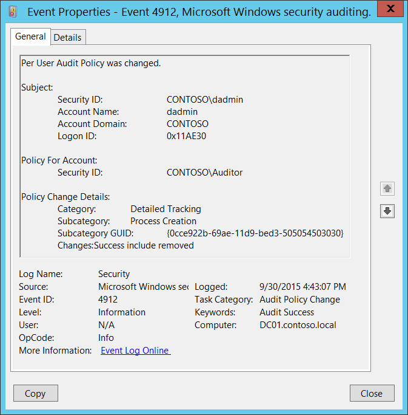
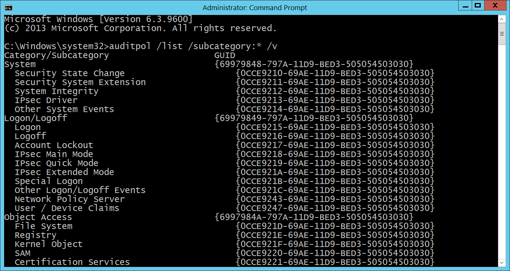

# 4912(S): ユーザーごとの監査ポリシーが変更されました。



***サブカテゴリ:***&nbsp;[監査ポリシーの変更](audit-audit-policy-change.md)

***イベントの説明:***

このイベントは、[ユーザーごとの監査ポリシー](http://windowsitpro.com/systems-management/user-auditing-28-jun-2005)が変更されるたびに生成されます。

このイベントは、「監査ポリシーの変更」サブカテゴリの設定に関係なく常に記録されます。

> **注**&nbsp;&nbsp;推奨事項については、このイベントの[セキュリティ監視の推奨事項](#security-monitoring-recommendations)を参照してください。

<br clear="all">

***イベント XML:***
```xml
- <Event xmlns="http://schemas.microsoft.com/win/2004/08/events/event">
- <System>
 <Provider Name="Microsoft-Windows-Security-Auditing" Guid="{54849625-5478-4994-A5BA-3E3B0328C30D}" /> 
 <EventID>4912</EventID> 
 <Version>0</Version> 
 <Level>0</Level> 
 <Task>13568</Task> 
 <Opcode>0</Opcode> 
 <Keywords>0x8020000000000000</Keywords> 
 <TimeCreated SystemTime="2015-09-30T23:43:07.363195100Z" /> 
 <EventRecordID>1049452</EventRecordID> 
 <Correlation /> 
 <Execution ProcessID="516" ThreadID="1660" /> 
 <Channel>Security</Channel> 
 <Computer>DC01.contoso.local</Computer> 
 <Security /> 
 </System>
- <EventData>
 <Data Name="SubjectUserSid">S-1-5-21-3457937927-2839227994-823803824-1104</Data> 
 <Data Name="SubjectUserName">dadmin</Data> 
 <Data Name="SubjectDomainName">CONTOSO</Data> 
 <Data Name="SubjectLogonId">0x11ae30</Data> 
 <Data Name="TargetUserSid">S-1-5-21-3457937927-2839227994-823803824-2104</Data> 
 <Data Name="CategoryId">%%8276</Data> 
 <Data Name="SubcategoryId">%%13312</Data> 
 <Data Name="SubcategoryGuid">{0CCE922B-69AE-11D9-BED3-505054503030}</Data> 
 <Data Name="AuditPolicyChanges">%%8452</Data> 
 </EventData>
 </Event>

```

***必要なサーバー役割:*** なし。

***最小 OS バージョン:*** Windows Server 2008, Windows Vista。

***イベントバージョン:*** 0。

***フィールドの説明:***

**サブジェクト:**

-   **セキュリティ ID** \[タイプ = SID\]**:** ユーザーごとの監査ポリシーを変更したアカウントのSID。イベントビューアーは自動的にSIDを解決し、アカウント名を表示しようとします。SIDが解決できない場合、イベントにはソースデータが表示されます。

> **注**&nbsp;&nbsp;**セキュリティ識別子 (SID)** は、トラスティ (セキュリティプリンシパル) を識別するために使用される可変長の一意の値です。各アカウントには、Active Directoryドメインコントローラーなどの権限によって発行され、セキュリティデータベースに保存される一意のSIDがあります。ユーザーがログオンするたびに、システムはデータベースからそのユーザーのSIDを取得し、そのユーザーのアクセストークンに配置します。システムはアクセストークン内のSIDを使用して、以降のWindowsセキュリティとのすべてのやり取りでユーザーを識別します。SIDがユーザーまたはグループの一意の識別子として使用された場合、それは他のユーザーまたはグループを識別するために再利用されることはありません。SIDの詳細については、[セキュリティ識別子](/windows/access-protection/access-control/security-identifiers)を参照してください。

-   **アカウント名** \[タイプ = UnicodeString\]**:** ユーザーごとの監査ポリシーを変更したアカウントの名前。

-   **アカウントドメイン** \[タイプ = UnicodeString\]**:** サブジェクトのドメインまたはコンピュータ名。形式は以下のように異なります：

    -   ドメイン NETBIOS 名の例: CONTOSO

    -   小文字の完全ドメイン名: contoso.local

    -   大文字の完全ドメイン名: CONTOSO.LOCAL

    -   一部の[よく知られたセキュリティプリンシパル](/windows/security/identity-protection/access-control/security-identifiers)の場合、このフィールドの値は「NT AUTHORITY」となります（例：LOCAL SERVICE または ANONYMOUS LOGON）。

    -   ローカルユーザーアカウントの場合、このフィールドにはこのアカウントが属するコンピュータまたはデバイスの名前が含まれます。例：「Win81」。

-   **ログオンID** \[タイプ = HexInt64\]**:** 16進数の値で、最近のイベントと同じログオンIDを含む可能性のあるイベントとこのイベントを関連付けるのに役立ちます。例：「[4624](event-4624.md): アカウントが正常にログオンされました。」

**アカウントのポリシー:**

-   **セキュリティID** \[タイプ = SID\]**:** ユーザーごとの監査ポリシーが変更されたアカウントのSID。イベントビューアーは自動的にSIDを解決し、アカウント名を表示しようとします。SIDが解決できない場合、イベントにはソースデータが表示されます。

**ポリシー変更の詳細:**

-   **カテゴリ** \[タイプ = UnicodeString\]**:** サブカテゴリの状態が変更された監査カテゴリの名前。可能な値は以下の通りです：

    -   アカウントログオン

    -   アカウント管理

    -   詳細な追跡

    -   DSアクセス

    -   ログオン/ログオフ

    -   オブジェクトアクセス

    -   ポリシー変更

    -   特権の使用

    -   システム

-   **サブカテゴリ** \[タイプ = UnicodeString\]**:** 状態が変更された監査サブカテゴリの名前。可能な値：

| 値              | 値                    | 値      |
|------------------------------------------|----------------------------------------------|--------------------------------------|
| 資格情報の検証の監査              | プロセス終了の監査                    | その他のログオン/ログオフイベントの監査      |
| Kerberos認証サービスの監査    | RPCイベントの監査                             | 特別なログオンの監査                  |
| Kerberosサービスチケット操作の監査 | 詳細なディレクトリサービスレプリケーションの監査 | アプリケーション生成の監査          |
| その他のログオン/ログオフイベントの監査          | ディレクトリサービスアクセスの監査               | 認証サービスの監査         |
| アプリケーショングループ管理の監査       | ディレクトリサービス変更の監査              | 詳細なファイル共有の監査            |
| コンピュータアカウント管理の監査        | アカウントロックアウトの監査                        | ファイル共有の監査                     |
| 配布グループ管理の監査      | IPsec拡張モードの監査                    | フィルタリングプラットフォーム接続の監査  |
| その他のアカウント管理イベントの監査    | IPsecメインモードの監査                        | フィルタリングプラットフォームパケットドロップの監査 |
| セキュリティグループ管理の監査          | IPsecクイックモードの監査                       | ハンドル操作の監査            |
| ユーザーアカウント管理の監査            | ログオフの監査                                 | カーネルオブジェクトの監査                  |
| DPAPIアクティビティの監査                     | ログオンの監査                                  | IPsecドライバーの監査                   |
| プロセス作成の監査                   | フィルタリングプラットフォームポリシー変更の監査       | その他のシステムイベントの監査            |
| レジストリの監査                           | MPSSVCルールレベルポリシー変更の監査        | セキュリティ状態変更の監査          |
| SAMの監査                                | その他のポリシー変更イベントの監査             | セキュリティシステム拡張の監査      |
| ポリシー変更の監査                      | 非機密特権使用の監査            | システム整合性の監査               |
| 認証ポリシー変更の監査       | 機密特権使用の監査                | PNPアクティビティの監査                   |
| 認可ポリシー変更の監査        | その他の特権使用イベントの監査             |                                      |
| グループメンバーシップの監査                         | ネットワークポリシーサーバーの監査                  |                                      |

-   **サブカテゴリ GUID** \[タイプ = GUID\]**:** 変更されたサブカテゴリの一意のGUID。

> **注**&nbsp;&nbsp;**GUID**は「Globally Unique Identifier」の略です。これはリソース、アクティビティ、またはインスタンスを識別するために使用される128ビットの整数です。

サブカテゴリのGUIDを確認するには、次のコマンドを使用できます: “**auditpol /list /subcategory:\* /v”**:



-   **変更** \[タイプ = UnicodeString\]**:** サブカテゴリに対して行われた変更。考えられる値は次の通りです:

    -   成功を含む削除

    -   成功を含む追加

    -   失敗を含む削除

    -   失敗を含む追加

    -   成功を除く削除

    -   成功を除く追加

    -   失敗を除く削除

    -   失敗を除く追加

## セキュリティ監視の推奨事項

4912(S): ユーザーごとの監査ポリシーが変更されました。

-   ユーザーごとの監査機能を使用している場合、このイベントは常に監視する必要があります。特に高価値の資産やコンピュータでは重要です。この変更が計画されていなかった場合、変更の理由を調査してください。

-   ユーザーごとの監査機能を使用していない場合、このイベントは常に監視する必要があります。これは標準手順外でユーザーごとの監査機能が使用されていることを示しているためです。
