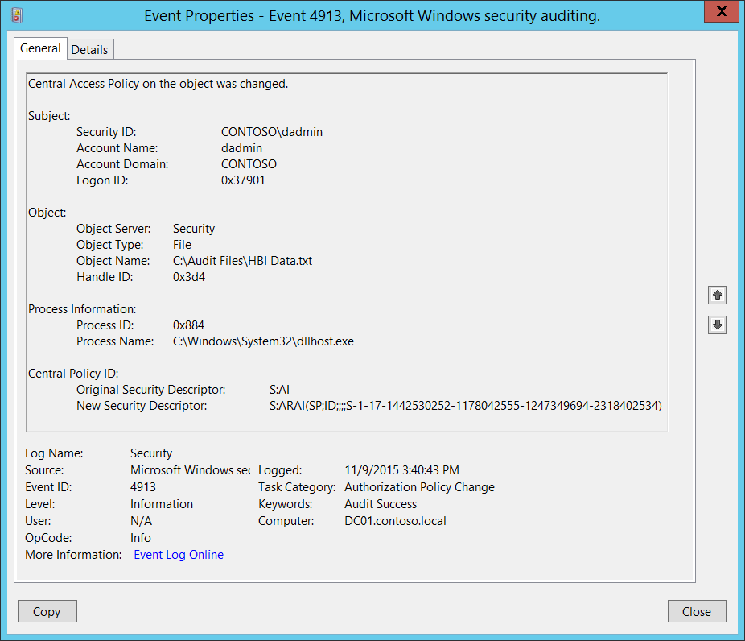

# 4913(S): オブジェクトの中央アクセス ポリシーが変更されました



***サブカテゴリ:***&nbsp;[監査認可ポリシーの変更](audit-authorization-policy-change.md)

***イベントの説明:***

このイベントは、ファイル システム オブジェクトの[中央アクセス ポリシー](/windows-server/identity/solution-guides/scenario--central-access-policy)が変更されたときに生成されます。

このイベントは、オブジェクトの[SACL](/windows/win32/secauthz/access-control-lists)設定に関係なく、常に生成されます。

> [!NOTE]
> 推奨事項については、このイベントの[セキュリティ監視の推奨事項](#security-monitoring-recommendations)を参照してください。


***イベント XML:***

```xml
- <Event xmlns="http://schemas.microsoft.com/win/2004/08/events/event">
- <System>
 <Provider Name="Microsoft-Windows-Security-Auditing" Guid="{54849625-5478-4994-A5BA-3E3B0328C30D}" />
 <EventID>4913</EventID>
 <Version>0</Version>
 <Level>0</Level>
 <Task>13570</Task>
 <Opcode>0</Opcode>
 <Keywords>0x8020000000000000</Keywords>
 <TimeCreated SystemTime="2015-11-09T23:40:43.118758100Z" />
 <EventRecordID>1183666</EventRecordID>
 <Correlation />
 <Execution ProcessID="516" ThreadID="524" />
 <Channel>Security</Channel>
 <Computer>DC01.contoso.local</Computer>
 <Security />
 </System>
- <EventData>
 <Data Name="SubjectUserSid">S-1-5-21-3457937927-2839227994-823803824-1104</Data>
 <Data Name="SubjectUserName">dadmin</Data>
 <Data Name="SubjectDomainName">CONTOSO</Data>
 <Data Name="SubjectLogonId">0x37901</Data>
 <Data Name="ObjectServer">Security</Data>
 <Data Name="ObjectType">File</Data>
 <Data Name="ObjectName">C:\\Audit Files\\HBI Data.txt</Data>
 <Data Name="HandleId">0x3d4</Data>
 <Data Name="OldSd">S:AI</Data>
 <Data Name="NewSd">S:ARAI(SP;ID;;;;S-1-17-1442530252-1178042555-1247349694-2318402534)</Data>
 <Data Name="ProcessId">0x884</Data>
 <Data Name="ProcessName">C:\\Windows\\System32\\dllhost.exe</Data>
 </EventData>
 </Event>
```

***必要なサーバー ロール:*** なし。

***最小 OS バージョン:*** Windows Server 2012、Windows 8。

***イベント バージョン:*** 0。

***フィールドの説明:***

**サブジェクト:**

-   **セキュリティ ID** \[タイプ = SID\]**:** オブジェクトの中央アクセス ポリシーを変更したアカウントの SID。イベント ビューアーは自動的に SID を解決してアカウント名を表示しようとします。SID を解決できない場合は、イベントにソース データが表示されます。

> **注**&nbsp;&nbsp;**セキュリティ識別子 (SID)** は、トラスティ (セキュリティ プリンシパル) を識別するために使用される可変長の一意の値です。各アカウントには、Active Directory ドメイン コントローラーなどの認証機関によって発行され、セキュリティ データベースに格納される一意の SID があります。ユーザーがログオンするたびに、システムはデータベースからそのユーザーの SID を取得し、そのユーザーのアクセス トークンに配置します。システムは、アクセス トークン内の SID を使用して、以降のすべての Windows セキュリティとのやり取りでユーザーを識別します。SID がユーザーまたはグループの一意の識別子として使用された場合、それが別のユーザーまたはグループを識別するために再び使用されることはありません。SID の詳細については、[セキュリティ識別子](/windows/access-protection/access-control/security-identifiers)を参照してください。

-   **アカウント名** \[タイプ = UnicodeString\]**:** オブジェクトの中央アクセスポリシーを変更したアカウントの名前。

-   **アカウントドメイン** \[タイプ = UnicodeString\]**:** サブジェクトのドメインまたはコンピュータ名。形式は以下のように異なります：

    -   ドメインのNETBIOS名の例: CONTOSO

    -   小文字の完全なドメイン名: contoso.local

    -   大文字の完全なドメイン名: CONTOSO.LOCAL

    -   [よく知られたセキュリティプリンシパル](/windows-server/identity/ad-ds/manage/understand-security-identifiers)の場合、例えばLOCAL SERVICEやANONYMOUS LOGON、このフィールドの値は "NT AUTHORITY" です。

    -   ローカルユーザーアカウントの場合、このフィールドにはこのアカウントが属するコンピュータまたはデバイスの名前が含まれます。例えば: "Win81"。

-   **ログオンID** \[タイプ = HexInt64\]**:** 16進数の値で、最近のイベントとこのイベントを関連付けるのに役立ちます。例えば、"[4624](event-4624.md): アカウントが正常にログオンされました。"。

**オブジェクト**:

-   **オブジェクトサーバー** \[タイプ = UnicodeString\]: このイベントの値は "**Security**" です。

-   **オブジェクトタイプ** \[タイプ = UnicodeString\]: 操作中にアクセスされたオブジェクトのタイプ。このイベントでは常に **"File"** です。

    以下の表は、最も一般的な**オブジェクトタイプ**のリストを含んでいます：

| ディレクトリ           | イベント      | タイマー            | デバイス      |
|-------------------------|--------------|----------------------|--------------|
| ミュータント            | タイプ        | ファイル             | トークン      |
| スレッド                | セクション    | ウィンドウステーション | デバッグオブジェクト |
| フィルター通信ポート    | イベントペア  | ドライバー           | IoCompletion |
| コントローラー          | シンボリックリンク | WmiGuid              | プロセス      |
| プロファイル            | デスクトップ  | キードイベント       | アダプター    |
| キー                    | 待機可能ポート | コールバック         | セマフォ      |
| ジョブ                  | ポート        | フィルター接続ポート | ALPCポート    |

-   **オブジェクト名** \[タイプ = UnicodeString\]: 中央アクセスポリシーが変更されたオブジェクトのフルパスおよび/または名前。

<!-- -->

-   **ハンドルID** \[タイプ = ポインタ\]: **オブジェクト名**へのハンドルの16進数値。このフィールドは、同じハンドルIDを含む可能性のある他のイベントとこのイベントを関連付けるのに役立ちます。例えば、"[4663](event-4663.md)(S): オブジェクトへのアクセスが試みられました。" このパラメータはイベントでキャプチャされない場合があり、その場合は "0x0" として表示されます。

**プロセス:**

-   **プロセスID** \[タイプ = ポインタ\]: 中央アクセスポリシーが変更されたプロセスの16進数プロセスID。プロセスID (PID) は、オペレーティングシステムがアクティブなプロセスを一意に識別するために使用する番号です。特定のプロセスのPIDを確認するには、例えばタスクマネージャー（詳細タブ、PID列）を使用できます。

    

    16進数値を10進数に変換すると、タスクマネージャーの値と比較できます。

    また、このプロセスIDを他のイベントのプロセスIDと関連付けることもできます。例えば、"[4688](event-4688.md): 新しいプロセスが作成されました" **プロセス情報\\新しいプロセスID** フィールド。

-   **プロセス名** \[タイプ = UnicodeString\]**:** プロセスの実行可能ファイルのフルパスと名前。

**中央ポリシーID:**

-   **元のセキュリティ記述子** \[タイプ = UnicodeString\]**:** 古い中央ポリシーID（以前オブジェクトに適用されていたポリシー）のセキュリティ記述子定義言語（SDDL）値。

    SDDLには中央アクセスポリシーSIDが含まれています。以下はその例です: S:ARAI(SP;ID;;;;S-1-17-1442530252-1178042555-1247349694-2318402534)、ここでの中央アクセスポリシーSIDは "**S-1-17-1442530252-1178042555-1247349694-2318402534**" です。このSIDを実際の中央アクセスポリシー名に解決するには、次の手順を実行する必要があります。

1.  "CN=Central Access Policies,CN=Claims Configuration,CN=Services,CN=Configuration,DC=XXX,DC=XX" Active Directoryコンテナ内の中央アクセスポリシーActive Directoryオブジェクトを見つけます。

2. オブジェクトの "**プロパティ**" を開きます。

3. "**msAuthz-CentralAccessPolicyID**" 属性を見つけます。

4. 16進数の値をSID（文字列）に変換します。


> オブジェクトに中央アクセスポリシーが適用されていない場合、SDDLにはSIDが含まれません。例えば "**S:AI**" のようになります。

- **新しいセキュリティ記述子** \[Type = UnicodeString\]**:** オブジェクトに適用されたポリシーの新しい中央ポリシーIDのセキュリティ記述子定義言語（SDDL）値。このイベントの **中央ポリシーID\\元のセキュリティ記述子** フィールドセクションで詳細を確認してください。

> [!NOTE]
> **セキュリティ記述子定義言語（SDDL）** は、セキュリティ記述子に含まれる情報を列挙するための文字列要素を定義します。
>
> 例:
>
> `*O*:BA*G*:SY*D*:(D;;0xf0007;;;AN)(D;;0xf0007;;;BG)(A;;0xf0007;;;SY)(A;;0×7;;;BA)*S*:ARAI(AU;SAFA;DCLCRPCRSDWDWO;;;WD)`
>
> - *O*: = 所有者。特定のセキュリティプリンシパルのSID、または予約済み（事前定義済み）の値。例えば: BA (BUILTIN\_ADMINISTRATORS), WD (Everyone), SY (LOCAL\_SYSTEM) など。
> 以下の表で可能な値のリストを確認してください:

| 値   | 説明                                   | 値   | 説明                             |
|------|----------------------------------------|------|----------------------------------|
| "AO" | アカウントオペレーター                 | "PA" | グループポリシー管理者           |
| "RU" | Windows 2000以前のエイリアス           | "IU" | インタラクティブにログオンしたユーザー |
| "AN" | 匿名サインイン                         | "LA" | ローカル管理者                   |
| "AU" | 認証されたユーザー                     | "LG" | ローカルゲスト                   |
| "BA" | 組み込み管理者                         | "LS" | ローカルサービスアカウント       |
| "BG" | 組み込みゲスト                         | "SY" | ローカルシステム                 |
| "BO" | バックアップオペレーター               | "NU" | ネットワークサインインユーザー   |
| "BU" | 組み込みユーザー                       | "NO" | ネットワーク構成オペレーター     |
| "CA" | 証明書サーバー管理者                   | "NS" | ネットワークサービスアカウント   |
| "CG" | クリエイターグループ                   | "PO" | プリンターオペレーター           |
| "CO" | クリエイターオーナー                   | "PS" | 個人自身                         |
| "DA" | ドメイン管理者                         | "PU" | パワーユーザー                   |
| "DC" | ドメインコンピューター                 | "RS" | RASサーバーグループ              |
| "DD" | ドメインコントローラー                 | "RD" | ターミナルサーバーユーザー       |
| "DG" | ドメインゲスト                         | "RE" | レプリケーター                   |
| "DU" | ドメインユーザー                       | "RC" | 制限付きコード                   |
| "EA" | エンタープライズ管理者                 | "SA" | スキーマ管理者                   |
| "ED" | エンタープライズドメインコントローラー | "SO" | サーバーオペレーター             |
| "WD" | すべてのユーザー                       | "SU" | サービスサインインユーザー       |

- *G*: = プライマリグループ
- *D*: = DACLエントリ
- *S*: = SACLエントリ

*DACL/SACLエントリ形式:* entry\_type:inheritance\_flags(ace\_type;ace\_flags;rights;object\_guid;inherit\_object\_guid;account\_sid)

例: D:(A;;FA;;;WD)

- entry\_type:

"D" - DACL

"S" - SACL

- inheritance\_flags:

"P" - SDDL\_PROTECTED、フォルダ階層の上位コンテナからの継承がブロックされます。

"AI" - SDDL\_AUTO\_INHERITED、継承が許可されます。ただし、「P」が設定されていない場合に限ります。

"AR" - SDDL\_AUTO\_INHERIT\_REQ、子オブジェクトはこのオブジェクトから権限を継承します。

- ace\_type:

"A" - アクセス許可

"D" - アクセス拒否

"OA" - オブジェクトアクセス許可: オブジェクトのサブセットにのみ適用されます。

"OD" - オブジェクトアクセス拒否: オブジェクトのサブセットにのみ適用されます。

"AU" - システム監査

"A" - システムアラーム

"OU" - オブジェクトシステム監査

"OL" - オブジェクトシステムアラーム

- ace\_flags:

"CI" - コンテナ継承: ディレクトリなどのコンテナである子オブジェクトは、ACEを明示的なACEとして継承します。

"OI" - オブジェクト継承: コンテナでない子オブジェクトは、ACEを明示的なACEとして継承します。

"NP" - 継承禁止: 直接の子オブジェクトのみがこのACEを継承します。

"IO" - 継承のみ: ACEはこのオブジェクトには適用されませんが、継承を通じて子オブジェクトに影響を与える可能性があります。

"ID" - ACEが継承されました

"SA" - 成功したアクセス監査

"FA" - 失敗したアクセス監査

- rights: アクセスマスクまたは予約値を示す16進数の文字列。例: FA (ファイル全アクセス)、FX (ファイル実行)、FW (ファイル書き込み)など。

| 値                        | 説明                             | 値                  | 説明                      |
|---------------------------|----------------------------------|---------------------|---------------------------|
| 一般的なアクセス権        | ディレクトリサービスアクセス権   |
| "GA"                      | 全般アクセス                     | "RC"                | 読み取り権限              |
| "GR"                      | 全般読み取り                     | "SD"                | 削除                      |
| "GW"                      | 全般書き込み                     | "WD"                | 権限の変更                |
| "GX"                      | 全般実行                         | "WO"                | 所有者の変更              |
| ファイルアクセス権        | "RP"                             | すべてのプロパティの読み取り |
| "FA"                      | ファイル全アクセス               | "WP"                | すべてのプロパティの書き込み |
| "FR"                      | ファイル一般読み取り             | "CC"                | すべての子オブジェクトの作成 |
| "FW"                      | ファイル一般書き込み             | "DC"                | すべての子オブジェクトの削除 |
| "FX"                      | ファイル一般実行                 | "LC"                | コンテンツの一覧表示       |
| レジストリキーアクセス権  | "SW"                             | すべての検証済み書き込み |
| "KA"                      | "LO"                             | "LO"                | オブジェクトの一覧表示     |
| "K"                       | キー読み取り                     | "DT"                | サブツリーの削除          |
| "KW"                      | キー書き込み                     | "CR"                | すべての拡張権限           |
| "KX"                      | キー実行                         |                     |                           |

- object\_guid: 該当なし
- inherit\_object\_guid: 該当なし
- account\_sid: 特定のセキュリティプリンシパルのSID、または予約された値、例えば: AN (匿名)、WD (全員)、SY (LOCAL\_SYSTEM)など。詳細については、上記の表を参照してください。

SDDL構文の詳細については、以下の記事を参照してください:

- [2.5.1.1 構文](/openspecs/windows_protocols/ms-dtyp/f4296d69-1c0f-491f-9587-a960b292d070)
- [ACCESS_MASK](/windows/win32/secauthz/access-mask)

## セキュリティ監視の推奨事項

4913(S): オブジェクトの中央アクセスポリシーが変更されました。

> [!IMPORTANT]
> このイベントについては、[付録A: 多くの監査イベントのためのセキュリティ監視の推奨事項](appendix-a-security-monitoring-recommendations-for-many-audit-events.md)も参照してください。

- 特定のWindowsオブジェクトタイプ（「**オブジェクトタイプ**」）に関連するイベントを監視する必要がある場合、例えば**ファイル**や**キー**、対応する「**オブジェクトタイプ**」のこのイベントを監視してください。

- 特定のファイルやフォルダー（この場合、中央アクセスポリシーの変更）へのすべての変更を監視する必要がある場合、ファイルやフォルダーに対応する「**オブジェクト名**」を監視してください。

- このイベントで報告されたプロセスの事前定義された「**プロセス名**」がある場合、定義された値と異なる「**プロセス名**」のすべてのイベントを監視してください。

- 「**プロセス名**」が標準フォルダー（例えば、**System32**や**Program Files**）にない、または制限されたフォルダー（例えば、**Temporary Internet Files**）にあるかどうかを監視することができます。

- プロセス名に制限された部分文字列や単語（例えば、「**mimikatz**」や「**cain.exe**」）の事前定義されたリストがある場合、「**プロセス名**」にこれらの部分文字列が含まれているかどうかを確認してください。

- 特定の中央アクセスポリシーが適用されるべき特定のファイル、フォルダー、またはシステム全体がある場合、このイベントを監視し、「**新しいセキュリティ記述子**」の中央アクセスポリシーSIDが期待されるポリシーと一致するかどうかを比較することができます。
