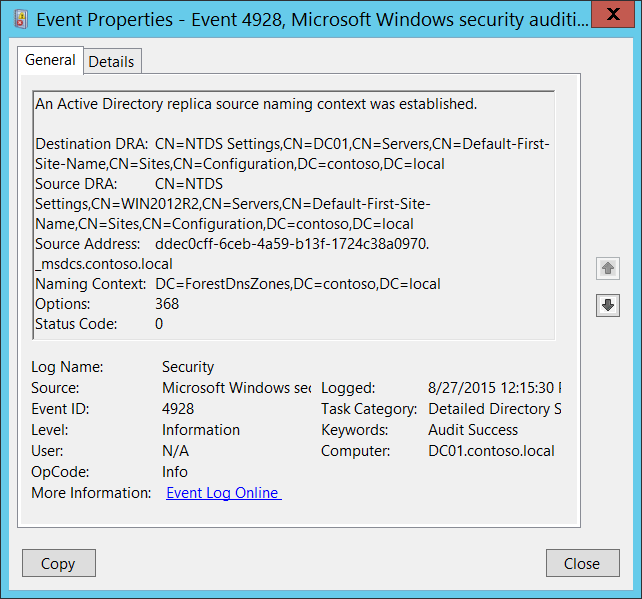
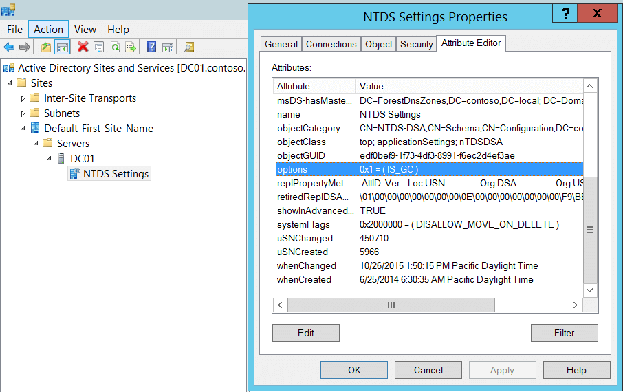

# 4928(S, F): Active Directory レプリカ ソース命名コンテキストが確立されました。




***サブカテゴリ:***&nbsp;[詳細なディレクトリ サービス レプリケーションの監査](audit-detailed-directory-service-replication.md)

***イベントの説明:***

このイベントは、新しい Active Directory レプリカ ソース命名コンテキストが確立されるたびに生成されます。

エラーが発生した場合 (**ステータス コード** != 0)、失敗イベントが生成されます。

> **注**&nbsp;&nbsp;推奨事項については、このイベントの[セキュリティ監視の推奨事項](#security-monitoring-recommendations)を参照してください。

<br clear="all">

***イベント XML:***
```xml
- <Event xmlns="http://schemas.microsoft.com/win/2004/08/events/event">
- <System>
 <Provider Name="Microsoft-Windows-Security-Auditing" Guid="{54849625-5478-4994-A5BA-3E3B0328C30D}" /> 
 <EventID>4928</EventID> 
 <Version>0</Version> 
 <Level>0</Level> 
 <Task>14083</Task> 
 <Opcode>0</Opcode> 
 <Keywords>0x8020000000000000</Keywords> 
 <TimeCreated SystemTime="2015-08-27T19:15:30.067319300Z" /> 
 <EventRecordID>227065</EventRecordID> 
 <Correlation /> 
 <Execution ProcessID="524" ThreadID="1236" /> 
 <Channel>Security</Channel> 
 <Computer>DC01.contoso.local</Computer> 
 <Security /> 
 </System>
- <EventData>
 <Data Name="DestinationDRA">CN=NTDS Settings,CN=DC01,CN=Servers,CN=Default-First-Site-Name,CN=Sites,CN=Configuration,DC=contoso,DC=local</Data> 
 <Data Name="SourceDRA">CN=NTDS Settings,CN=WIN2012R2,CN=Servers,CN=Default-First-Site-Name,CN=Sites,CN=Configuration,DC=contoso,DC=local</Data> 
 <Data Name="SourceAddr">ddec0cff-6ceb-4a59-b13f-1724c38a0970.\_msdcs.contoso.local</Data> 
 <Data Name="NamingContext">DC=ForestDnsZones,DC=contoso,DC=local</Data> 
 <Data Name="Options">368</Data> 
 <Data Name="StatusCode">0</Data> 
 </EventData>
 </Event>
```

***必要なサーバー ロール:*** Active Directory ドメイン コントローラー。

***最小 OS バージョン:*** Windows Server 2008。

***イベント バージョン:*** 0。

***フィールドの説明:***

-   **宛先 DRA** \[タイプ = UnicodeString\]: 宛先ディレクトリ レプリケーション エージェントの識別名。

> **注**&nbsp;&nbsp;**ディレクトリ レプリケーション エージェント (DRA)** は、ドメイン コントローラー間のレプリケーションを処理します。ディレクトリ レプリケーション エージェントは、トポロジ マップ内の接続オブジェクトを使用して、ディレクトリ パーティションの変更をレプリケートする際に関連するパートナーを見つけます。DRA は、ドメイン コントローラーが Active Directory のコピーを更新する必要があるときに、ドメイン コントローラーのパートナーにレプリケーション要求を送信します。

-   **ソース DRA** \[タイプ = UnicodeString\]: ソースディレクトリ レプリケーション エージェントの識別名。

> **注**&nbsp;&nbsp;LDAP API は、LDAP オブジェクトをその**識別名 (DN)** で参照します。DN は、カンマで接続された相対識別名 (RDN) のシーケンスです。
> 
> RDN は、属性=値 の形式で関連付けられた値を持つ属性です。これらは RDN 属性の例です:
> 
> • DC - domainComponent
> 
> • CN - commonName
> 
> • OU - organizationalUnitName
> 
> • O - organizationName

-   **送信元アドレス** \[タイプ = UnicodeString\]: 情報または更新が受信されたサーバーのDNSレコード。

-   **命名コンテキスト** \[タイプ = UnicodeString\]**:** レプリケートする命名コンテキスト。

> **注**&nbsp;&nbsp;Active Directory ツリーのディレクトリ ツリーは、フォレスト内の異なるドメインのドメイン コントローラーにセクションを分散 (レプリケート) できるように分割されています。各ドメイン コントローラーは、**命名コンテキスト** (ディレクトリ パーティションとも呼ばれる) と呼ばれるディレクトリ ツリーの特定の部分のコピーを保存します。**命名コンテキスト** は、同じサブツリーのレプリカを含むフォレスト内の他のドメイン コントローラーに単位としてレプリケートされます。**命名コンテキスト** はディレクトリ パーティションとも呼ばれます。

-   **オプション** \[タイプ = UInt32\]: [DRS オプション](/openspecs/windows_protocols/ms-drsr/ac9c8a11-cd46-4080-acbf-9faa86344030) の10進値。

    

-   **ステータス コード** \[タイプ = UInt32\]**:** 問題やエラーがない場合、ステータス コードは 0 になります。エラーが発生した場合、失敗イベントが発生し、ステータス コードは「**0**」と等しくなりません。エラー コードの意味はここで確認できます: <https://msdn.microsoft.com/library/windows/desktop/ms681381(v=vs.85).aspx>

## セキュリティ監視の推奨事項

4928(S, F): Active Directory レプリカの送信元命名コンテキストが確立されました。

-   **送信元アドレス** フィールドを監視します。新しいレプリケーション (新しい DRA) の送信元は、このアクションのために承認されている必要があります。承認されていない DRA が見つかった場合、イベントをトリガーする必要があります。

-   このイベントは通常、Active Directory レプリケーションのトラブルシューティングに使用されます。
