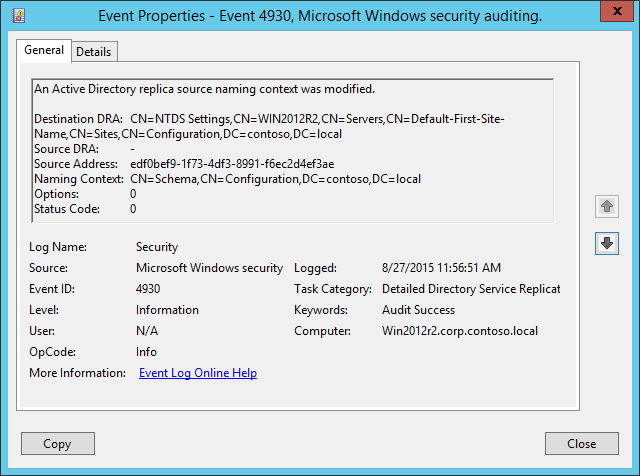

# 4930(S, F): Active Directory レプリカ ソース命名コンテキストが変更されました。



***サブカテゴリ:***&nbsp;[詳細なディレクトリ サービス レプリケーションの監査](audit-detailed-directory-service-replication.md)

***イベントの説明:***

このイベントは、Active Directory レプリカ ソース命名コンテキストが変更されるたびに生成されます。

エラーが発生した場合（**ステータス コード** != 0）、失敗イベントが生成されます。

このイベントから何が正確に変更されたかを理解することはできません。

> **注**&nbsp;&nbsp;推奨事項については、このイベントの[セキュリティ監視の推奨事項](#security-monitoring-recommendations)を参照してください。

<br clear="all">

***イベント XML:***
```xml
- <Event xmlns="http://schemas.microsoft.com/win/2004/08/events/event">
- <System>
 <Provider Name="Microsoft-Windows-Security-Auditing" Guid="{54849625-5478-4994-A5BA-3E3B0328C30D}" /> 
 <EventID>4930</EventID> 
 <Version>0</Version> 
 <Level>0</Level> 
 <Task>14083</Task> 
 <Opcode>0</Opcode> 
 <Keywords>0x8020000000000000</Keywords> 
 <TimeCreated SystemTime="2015-08-27T18:56:51.474057400Z" /> 
 <EventRecordID>1564</EventRecordID> 
 <Correlation /> 
 <Execution ProcessID="504" ThreadID="1280" /> 
 <Channel>Security</Channel> 
 <Computer>Win2012r2.corp.contoso.local</Computer> 
 <Security /> 
 </System>
- <EventData>
 <Data Name="DestinationDRA">CN=NTDS Settings,CN=WIN2012R2,CN=Servers,CN=Default-First-Site-Name,CN=Sites,CN=Configuration,DC=contoso,DC=local</Data> 
 <Data Name="SourceDRA">-</Data> 
 <Data Name="SourceAddr">edf0bef9-1f73-4df3-8991-f6ec2d4ef3ae</Data> 
 <Data Name="NamingContext">CN=Schema,CN=Configuration,DC=contoso,DC=local</Data> 
 <Data Name="Options">0</Data> 
 <Data Name="StatusCode">0</Data> 
 </EventData>
 </Event>
```

***必要なサーバー ロール:*** Active Directory ドメイン コントローラー。

***最小 OS バージョン:*** Windows Server 2008。

***イベント バージョン:*** 0。

***フィールドの説明:***

-   **宛先 DRA** \[タイプ = UnicodeString\]: 宛先ディレクトリ レプリケーション エージェントの識別名。

> **注**&nbsp;&nbsp;**ディレクトリ レプリケーション エージェント (DRA)** は、ドメイン コントローラー間のレプリケーションを処理します。ディレクトリ レプリケーション エージェントは、トポロジ マップ内の接続オブジェクトを使用して、ディレクトリ パーティションに変更をレプリケートする際に関連するパートナーを見つけます。DRA は、ドメイン コントローラーが Active Directory のコピーを更新する必要があるときに、ドメイン コントローラーのパートナーにレプリケーション要求を送信します。

-   **ソース DRA** \[タイプ = UnicodeString\]: ソースディレクトリ レプリケーション エージェントの識別名。通常、このイベントでは「**-**」と等しくなります。

> **Note**&nbsp;&nbsp;LDAP APIはLDAPオブジェクトを**識別名 (DN)**で参照します。DNはカンマで接続された相対識別名 (RDN) のシーケンスです。
> 
> RDNは属性=値の形式で関連付けられた値を持つ属性です。以下はRDN属性の例です：
> 
> • DC - domainComponent
> 
> • CN - commonName
> 
> • OU - organizationalUnitName
> 
> • O - organizationName

-   **送信元アドレス** \[タイプ = UnicodeString\]: 変更リクエストが受信されたコンピュータのDNSレコード。

-   **命名コンテキスト** \[タイプ = UnicodeString\]**:** 変更された命名コンテキスト。

> **Note**&nbsp;&nbsp;Active Directoryツリーのディレクトリツリーは、フォレスト内の異なるドメインのドメインコントローラーにセクションを分散（レプリケート）できるように分割されています。各ドメインコントローラーは、ディレクトリツリーの特定の部分のコピーを保存しており、これを**命名コンテキスト**またはディレクトリパーティションと呼びます。**命名コンテキスト**は、同じサブツリーのレプリカを含むフォレスト内の他のドメインコントローラーにユニットとしてレプリケートされます。**命名コンテキスト**はディレクトリパーティションとも呼ばれます。

-   **オプション** \[タイプ = UInt32\]: [DRSオプション](/openspecs/windows_protocols/ms-drsr/ac9c8a11-cd46-4080-acbf-9faa86344030)の10進値。

-   **ステータスコード** \[タイプ = UInt32\]**:** 問題やエラーがない場合、ステータスコードは0になります。エラーが発生した場合、失敗イベントを受け取り、ステータスコードは「**0**」と等しくなりません。エラーコードの意味はここで確認できます: <https://msdn.microsoft.com/library/windows/desktop/ms681381(v=vs.85).aspx>

## セキュリティ監視の推奨事項

4930(S, F): Active Directoryレプリカの送信元命名コンテキストが変更されました。

-   **送信元アドレス**フィールドを監視します。リクエストの送信元はこのアクションのために認可されている必要があります。認可されていないDRAを発見した場合、イベントをトリガーする必要があります。

-   このイベントは通常、Active Directoryレプリケーションのトラブルシューティングに使用されます。
