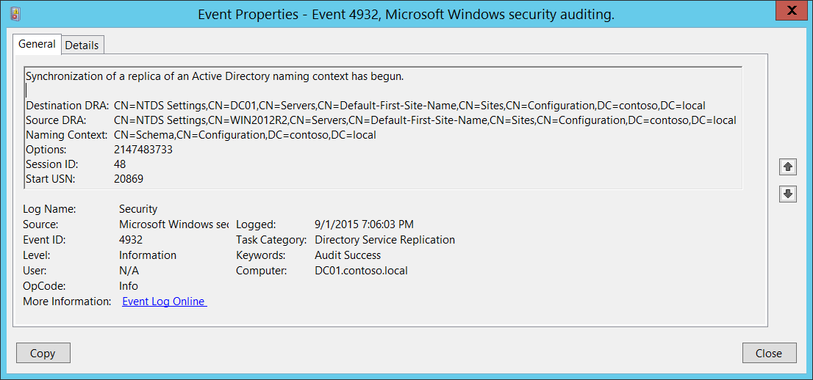

# 4932(S): Active Directory 名前付けコンテキストのレプリカの同期が開始されました。



***サブカテゴリ:***&nbsp;[ディレクトリ サービス レプリケーションの監査](audit-directory-service-replication.md)

***イベントの説明:***

このイベントは、Active Directory 名前付けコンテキストのレプリカの同期が開始されるたびに生成されます。

> **注**&nbsp;&nbsp;推奨事項については、このイベントの[セキュリティ監視の推奨事項](#security-monitoring-recommendations)を参照してください。

<br clear="all">

***イベント XML:***
```xml
- <Event xmlns="http://schemas.microsoft.com/win/2004/08/events/event">
- <System>
 <Provider Name="Microsoft-Windows-Security-Auditing" Guid="{54849625-5478-4994-A5BA-3E3B0328C30D}" /> 
 <EventID>4932</EventID> 
 <Version>0</Version> 
 <Level>0</Level> 
 <Task>14082</Task> 
 <Opcode>0</Opcode> 
 <Keywords>0x8020000000000000</Keywords> 
 <TimeCreated SystemTime="2015-09-02T02:06:03.814642100Z" /> 
 <EventRecordID>413689</EventRecordID> 
 <Correlation /> 
 <Execution ProcessID="524" ThreadID="276" /> 
 <Channel>Security</Channel> 
 <Computer>DC01.contoso.local</Computer> 
 <Security /> 
 </System>
- <EventData>
 <Data Name="DestinationDRA">CN=NTDS Settings,CN=DC01,CN=Servers,CN=Default-First-Site-Name,CN=Sites,CN=Configuration,DC=contoso,DC=local</Data> 
 <Data Name="SourceDRA">CN=NTDS Settings,CN=WIN2012R2,CN=Servers,CN=Default-First-Site-Name,CN=Sites,CN=Configuration,DC=contoso,DC=local</Data> 
 <Data Name="NamingContext">CN=Schema,CN=Configuration,DC=contoso,DC=local</Data> 
 <Data Name="Options">2147483733</Data> 
 <Data Name="SessionID">48</Data> 
 <Data Name="StartUSN">20869</Data> 
 </EventData>
 </Event>
```

***必要なサーバー ロール:*** Active Directory ドメイン コントローラー。

***最小 OS バージョン:*** Windows Server 2008。

***イベント バージョン:*** 0。

***フィールドの説明:***

-   **宛先 DRA** \[タイプ = UnicodeString\]: 宛先ディレクトリ レプリケーション エージェントの識別名。

> **注**&nbsp;&nbsp;**ディレクトリ レプリケーション エージェント (DRA)** は、ドメイン コントローラー間のレプリケーションを処理します。ディレクトリ レプリケーション エージェントは、トポロジ マップ内の接続オブジェクトを使用して、ディレクトリ パーティションの変更をレプリケートする際に関連するパートナーを見つけます。DRA は、ドメイン コントローラーが Active Directory のコピーを更新する必要があるときに、ドメイン コントローラーのパートナーにレプリケーション要求を送信します。

-   **送信元 DRA** \[タイプ = UnicodeString\]: 送信元ディレクトリ レプリケーション エージェントの識別名。

> **注**&nbsp;&nbsp;LDAP API は、LDAP オブジェクトをその**識別名 (DN)** で参照します。DN は、カンマで接続された相対識別名 (RDN) のシーケンスです。
> 
> RDN は、属性=値の形式で関連付けられた値を持つ属性です。これらは RDN 属性の例です:
> 
> • DC - domainComponent
> 
> • CN - commonName
> 
> • OU - organizationalUnitName
> 
> • O - organizationName

-   **命名コンテキスト** \[タイプ = UnicodeString\]**:** レプリケートする命名コンテキスト。

> **注**&nbsp;&nbsp;Active Directory ツリーのディレクトリ ツリーは、フォレスト内の異なるドメインのドメイン コントローラーにセクションを分散 (レプリケート) できるように分割されています。各ドメイン コントローラーは、**命名コンテキスト** (ディレクトリ パーティションとも呼ばれる) と呼ばれるディレクトリ ツリーの特定の部分のコピーを格納します。**命名コンテキスト** は、同じサブツリーのレプリカを含むフォレスト内の他のドメイン コントローラーにユニットとしてレプリケートされます。**命名コンテキスト** はディレクトリ パーティションとも呼ばれます。

-   **オプション** \[タイプ = UInt32\]: [DRS オプション](/openspecs/windows_protocols/ms-drsr/ac9c8a11-cd46-4080-acbf-9faa86344030) の10進値。

-   **セッション ID** \[タイプ = UInt32\]**:** レプリケーション セッションの一意の識別子。このフィールドを使用して、同じセッションの “[4932](event-4932.md): Active Directory 命名コンテキストのレプリカの同期が開始されました。” および “[4933](event-4933.md): Active Directory 命名コンテキストのレプリカの同期が終了しました。” イベントを見つけることができます。

-   **開始 USN** \[タイプ = UnicodeString\]**: 命名コンテキストの** レプリケーション開始前の USN 番号。

> **注**&nbsp;&nbsp;Active Directory レプリケーションは、伝播する必要がある変更を決定するために時間に依存しません。代わりに、各ドメイン コントローラーにローカルなカウンターによって割り当てられる **更新シーケンス番号 (USN)** を使用します。これらの USN カウンターはローカルであるため、信頼性が高く、「逆行」(つまり、値が減少) しないことを確実にするのは簡単です。トレードオフとして、あるドメイン コントローラーで割り当てられた USN を別のドメイン コントローラーで割り当てられた USN と比較することは無意味です。この制限を考慮してレプリケーション システムが設計されています。

## セキュリティ監視の推奨事項

4932(S): Active Directory 命名コンテキストのレプリカの同期が開始されました。

-   **ソース アドレス** フィールドを監視します。レプリケーションのソース (DRA) はこのアクションのために承認されている必要があります。承認されていない DRA が見つかった場合は、イベントをトリガーする必要があります。

-   このイベントは通常、Active Directory レプリケーションのトラブルシューティングに使用されます。
