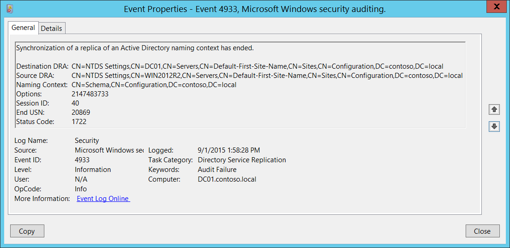

# 4933(S, F): Active Directory 名前付けコンテキストのレプリカの同期が終了しました。



***サブカテゴリ:***&nbsp;[ディレクトリ サービス レプリケーションの監査](audit-directory-service-replication.md)

***イベントの説明:***

このイベントは、Active Directory 名前付けコンテキストのレプリカの同期が終了するたびに生成されます。

失敗イベントは、Active Directory 名前付けコンテキストのレプリカの同期が失敗した場合に発生します。

> **注**&nbsp;&nbsp;推奨事項については、このイベントの[セキュリティ監視の推奨事項](#security-monitoring-recommendations)を参照してください。

<br clear="all">

***イベント XML:***
```
- <Event xmlns="http://schemas.microsoft.com/win/2004/08/events/event">
- <System>
 <Provider Name="Microsoft-Windows-Security-Auditing" Guid="{54849625-5478-4994-A5BA-3E3B0328C30D}" /> 
 <EventID>4933</EventID> 
 <Version>0</Version> 
 <Level>0</Level> 
 <Task>14082</Task> 
 <Opcode>0</Opcode> 
 <Keywords>0x8010000000000000</Keywords> 
 <TimeCreated SystemTime="2015-09-01T20:58:28.854735700Z" /> 
 <EventRecordID>413644</EventRecordID> 
 <Correlation /> 
 <Execution ProcessID="524" ThreadID="2288" /> 
 <Channel>Security</Channel> 
 <Computer>DC01.contoso.local</Computer> 
 <Security /> 
 </System>
- <EventData>
 <Data Name="DestinationDRA">CN=NTDS Settings,CN=DC01,CN=Servers,CN=Default-First-Site-Name,CN=Sites,CN=Configuration,DC=contoso,DC=local</Data> 
 <Data Name="SourceDRA">CN=NTDS Settings,CN=WIN2012R2,CN=Servers,CN=Default-First-Site-Name,CN=Sites,CN=Configuration,DC=contoso,DC=local</Data> 
 <Data Name="NamingContext">CN=Schema,CN=Configuration,DC=contoso,DC=local</Data> 
 <Data Name="Options">2147483733</Data> 
 <Data Name="SessionID">40</Data> 
 <Data Name="EndUSN">20869</Data> 
 <Data Name="StatusCode">1722</Data> 
 </EventData>
 </Event>
```

***必要なサーバー ロール:*** Active Directory ドメイン コントローラー。

***最小 OS バージョン:*** Windows Server 2008。

***イベント バージョン:*** 0。

***フィールドの説明:***

-   **宛先 DRA** \[タイプ = UnicodeString\]: 宛先ディレクトリ レプリケーション エージェントの識別名。

> **注**&nbsp;&nbsp;**ディレクトリ レプリケーション エージェント (DRA)** は、ドメイン コントローラー間のレプリケーションを処理します。ディレクトリ レプリケーション エージェントは、トポロジ マップ内の接続オブジェクトを使用して、ディレクトリ パーティションの変更をレプリケートする際に関連するパートナーを見つけます。ドメイン コントローラーが Active Directory のコピーを更新する必要がある場合、DRA はドメイン コントローラーのパートナーにレプリケーション要求を送信します。

-   **送信元 DRA** \[タイプ = UnicodeString\]: 送信元ディレクトリ レプリケーション エージェントの識別名。

> **注**&nbsp;&nbsp;LDAP API は、LDAP オブジェクトをその**識別名 (DN)** で参照します。DN は、カンマで接続された相対識別名 (RDN) のシーケンスです。
> 
> RDN は、属性=値の形式で関連付けられた値を持つ属性です。これらは RDN 属性の例です:
> 
> • DC - domainComponent
> 
> • CN - commonName
> 
> • OU - organizationalUnitName
> 
> • O - organizationName

-   **ネーミングコンテキスト** \[タイプ = UnicodeString\]**:** レプリケートするネーミングコンテキスト。

> **注**&nbsp;&nbsp;Active Directory ツリーのディレクトリツリーは、フォレスト内の異なるドメインのドメインコントローラーにセクションを分配（レプリケート）できるように分割されています。各ドメインコントローラーは、**ネーミングコンテキスト**（ディレクトリパーティションとも呼ばれる）と呼ばれるディレクトリツリーの特定の部分のコピーを保存します。**ネーミングコンテキスト**は、同じサブツリーのレプリカを含むフォレスト内の他のドメインコントローラーにユニットとしてレプリケートされます。**ネーミングコンテキスト**はディレクトリパーティションとも呼ばれます。

-   **オプション** \[タイプ = UInt32\]: [DRS オプション](/openspecs/windows_protocols/ms-drsr/ac9c8a11-cd46-4080-acbf-9faa86344030)の10進値。

-   **セッション ID** \[タイプ = UInt32\]**:** レプリケーションセッションの一意の識別子。このフィールドを使用して、同じセッションの “[4932](event-4932.md): Active Directory ネーミングコンテキストのレプリカの同期が開始されました。” および “[4933](event-4933.md): Active Directory ネーミングコンテキストのレプリカの同期が終了しました。” イベントを見つけることができます。

-   **終了 USN** \[タイプ = UInt32\]**: ネーミングコンテキストの** レプリケーション終了後の USN 番号。

> **注**&nbsp;&nbsp;Active Directory のレプリケーションは、伝播する必要がある変更を決定するために時間に依存しません。代わりに、各ドメインコントローラーにローカルなカウンターによって割り当てられる **更新シーケンス番号 (USN)** を使用します。これらの USN カウンターはローカルであるため、信頼性が高く、「逆行」（つまり、値が減少する）しないことを簡単に保証できます。トレードオフとして、あるドメインコントローラーで割り当てられた USN を別のドメインコントローラーで割り当てられた USN と比較することは無意味です。この制限を考慮してレプリケーションシステムが設計されています。

-   **ステータスコード** \[タイプ = UInt32\]**:** 問題やエラーがない場合、ステータスコードは “**0**” になります。エラーが発生した場合、失敗イベントが発生し、ステータスコードは “**0**” ではなくなります。エラーコードの意味はここで確認できます: <https://msdn.microsoft.com/library/windows/desktop/ms681381(v=vs.85).aspx>

## セキュリティ監視の推奨事項

4933(S, F): Active Directory 名前付けコンテキストのレプリカの同期が終了しました。

- **ソースアドレス**フィールドを監視します。レプリケーションのソース (DRA) はこのアクションのために承認されている必要があります。承認されていないDRAを見つけた場合は、イベントをトリガーする必要があります。

- このイベントは通常、Active Directory レプリケーションのトラブルシューティングに使用されます。
