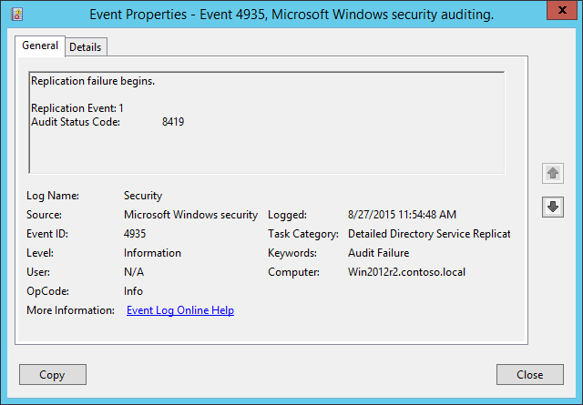

# 4935(F): レプリケーションの失敗が始まります。



***サブカテゴリ:***&nbsp;[詳細なディレクトリ サービス レプリケーションの監査](audit-detailed-directory-service-replication.md)

***イベントの説明:***

Active Directory のレプリケーション失敗が始まると、このイベントが生成されます。

> **注**&nbsp;&nbsp;推奨事項については、このイベントの[セキュリティ監視の推奨事項](#security-monitoring-recommendations)を参照してください。

<br clear="all">

***イベント XML:***
```xml
- <Event xmlns="http://schemas.microsoft.com/win/2004/08/events/event">
- <System>
 <Provider Name="Microsoft-Windows-Security-Auditing" Guid="{54849625-5478-4994-A5BA-3E3B0328C30D}" /> 
 <EventID>4935</EventID> 
 <Version>0</Version> 
 <Level>0</Level> 
 <Task>14083</Task> 
 <Opcode>0</Opcode> 
 <Keywords>0x8010000000000000</Keywords> 
 <TimeCreated SystemTime="2015-08-27T18:54:48.758149800Z" /> 
 <EventRecordID>1552</EventRecordID> 
 <Correlation /> 
 <Execution ProcessID="504" ThreadID="524" /> 
 <Channel>Security</Channel> 
 <Computer>Win2012r2.contoso.local</Computer> 
 <Security /> 
 </System>
- <EventData>
 <Data Name="ReplicationEvent">1</Data> 
 <Data Name="AuditStatusCode">8419</Data> 
 </EventData>
 </Event>

```

***必要なサーバー ロール:*** Active Directory ドメイン コントローラー。

***最小 OS バージョン:*** Windows Server 2008。

***イベント バージョン:*** 0。

***フィールドの説明:***

**レプリケーション イベント** \[型 = UInt32\]**:** このドキュメントには、このフィールドに関する詳細な情報はありません。

**監査ステータス コード** \[型 = UInt32\]**:** このドキュメントには、このフィールドに関する詳細な情報はありません。

## セキュリティ監視の推奨事項

4935(F): レプリケーションの失敗が始まります。

-   このイベントは通常、Active Directory レプリケーションのトラブルシューティングに使用されます。
