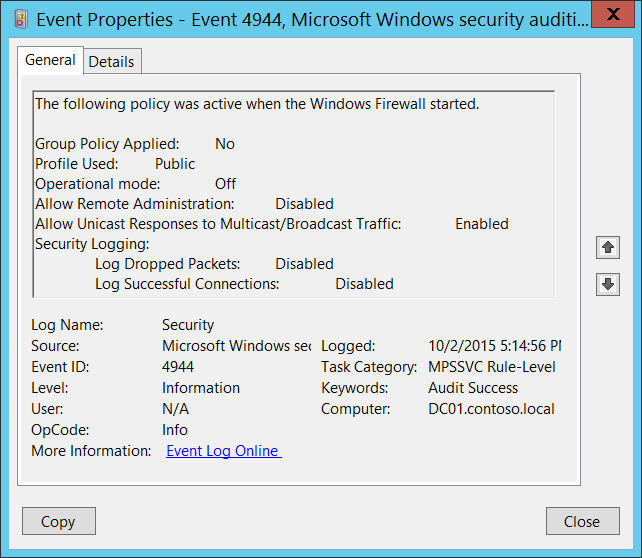
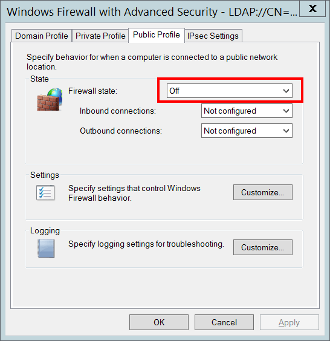
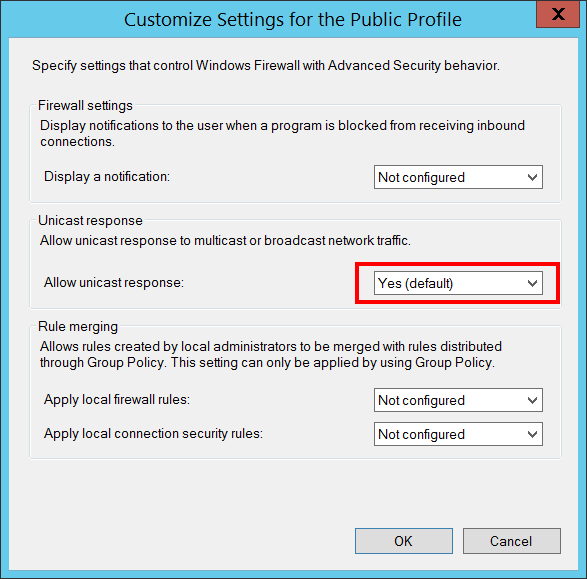
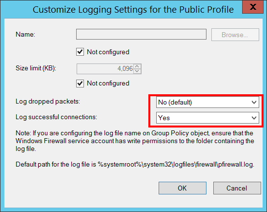

# 4944(S): Windowsファイアウォールが開始されたときにアクティブだったポリシー



***サブカテゴリ:***&nbsp;[MPSSVCルールレベルポリシー変更の監査](audit-mpssvc-rule-level-policy-change.md)

***イベントの説明:***

このイベントは、Windowsファイアウォールサービスが開始されるたびに生成されます。

このイベントは、Windowsファイアウォールサービスが開始されたときに有効だったWindowsファイアウォール設定を示します。

> **注**&nbsp;&nbsp;推奨事項については、このイベントの[セキュリティ監視の推奨事項](#security-monitoring-recommendations)を参照してください。

<br clear="all">

***イベントXML:***
```xml
- <Event xmlns="http://schemas.microsoft.com/win/2004/08/events/event">
- <System>
 <Provider Name="Microsoft-Windows-Security-Auditing" Guid="{54849625-5478-4994-A5BA-3E3B0328C30D}" /> 
 <EventID>4944</EventID> 
 <Version>0</Version> 
 <Level>0</Level> 
 <Task>13571</Task> 
 <Opcode>0</Opcode> 
 <Keywords>0x8020000000000000</Keywords> 
 <TimeCreated SystemTime="2015-10-03T00:14:56.644728300Z" /> 
 <EventRecordID>1050808</EventRecordID> 
 <Correlation /> 
 <Execution ProcessID="500" ThreadID="2216" /> 
 <Channel>Security</Channel> 
 <Computer>DC01.contoso.local</Computer> 
 <Security /> 
 </System>
- <EventData>
 <Data Name="GroupPolicyApplied">No</Data> 
 <Data Name="Profile">Public</Data> 
 <Data Name="OperationMode">Off</Data> 
 <Data Name="RemoteAdminEnabled">Disabled</Data> 
 <Data Name="MulticastFlowsEnabled">Enabled</Data> 
 <Data Name="LogDroppedPacketsEnabled">Disabled</Data> 
 <Data Name="LogSuccessfulConnectionsEnabled">Disabled</Data> 
 </EventData>
 </Event>

```

***必要なサーバー役割:*** なし。

***最小OSバージョン:*** Windows Server 2008, Windows Vista。

***イベントバージョン:*** 0。

***フィールドの説明:***

**適用されたグループポリシー** \[タイプ = UnicodeString\]: このイベントでは常に「いいえ」の値を持ちます。このフィールドは、Windowsファイアウォールが開始されたときにグループポリシーが適用されたかどうかの情報を示す必要があります。

**使用されたプロファイル** \[タイプ = UnicodeString\]: Windowsファイアウォールサービスが開始されたときのアクティブなプロファイル名を示します。このイベントでは常に「**パブリック**」の値を持ちます。このイベントが生成されるとき、アクティブなプロファイルは「**ドメイン**」または「**プライベート**」に切り替わっていません。通常、このイベントの後に「[4956](event-4956.md)(S): Windowsファイアウォールがアクティブなプロファイルを変更しました」が表示され、実際のアクティブなプロファイルがわかります。

**運用モード** \[タイプ = UnicodeString\]:

-   **オン** – 「**ファイアウォールの状態:**」設定が「パブリック」プロファイルに対して「オン」に設定されていた場合。

-   **オフ** - 「**ファイアウォールの状態:**」設定が「パブリック」プロファイルに対して「オフ」に設定されている場合。



**リモート管理の許可** \[タイプ = UnicodeString\]: この設定は「[Windows ファイアウォール: リモート管理の例外を許可する](/previous-versions/windows/it-pro/windows-server-2003/cc738900(v=ws.10))」グループポリシー設定に関連しているようですが、「[Windows ファイアウォール: リモート管理の例外を許可する](/previous-versions/windows/it-pro/windows-server-2003/cc738900(v=ws.10))」グループポリシーのどのオプションが設定されていても、常に無効です。

**ユニキャスト応答をマルチキャスト/ブロードキャストトラフィックに許可** \[タイプ = UnicodeString\]:

-   **有効** - 「**ユニキャスト応答を許可:**」設定が「パブリック」プロファイルに対して「はい」に設定されている場合。

-   **無効** - 「**ユニキャスト応答を許可:**」設定が「パブリック」プロファイルに対して「いいえ」に設定されている場合。



**セキュリティログ:**

-   **ドロップされたパケットをログに記録** \[タイプ = UnicodeString\]:

    -   **有効** - 「**ドロップされたパケットをログに記録:**」ログ設定が「パブリック」プロファイルに対して「はい」に設定されている場合。

    -   **無効** - 「**ドロップされたパケットをログに記録:**」ログ設定が「パブリック」プロファイルに対して「いいえ」に設定されている場合。

-   **成功した接続をログに記録** \[タイプ = UnicodeString\]:

    -   **有効** - 「**成功した接続をログに記録:**」ログ設定が「パブリック」プロファイルに対して「はい」に設定されている場合。

    -   **無効** - 「**ドロップされたパケットをログに記録:**」ログ設定が「パブリック」プロファイルに対して「いいえ」に設定されている場合。



## セキュリティ監視の推奨事項

4944(S)の場合: Windows ファイアウォールが開始されたときにアクティブだったポリシーは次のとおりです。

-   **パブリック**プロファイルに対して定義されたWindowsファイアウォール設定の標準またはベースラインがある場合（例えば、ドメインと同じである可能性があります）、このイベントを監視し、イベントによって報告された設定が標準またはベースラインで定義されたものと同じであるかどうかを確認してください。

-   残念ながら、このイベントは**パブリック**プロファイルの設定のみを表示しますが、異なるコンピュータ上の組織のWindowsファイアウォールのパブリックプロファイルのベースラインとすべての設定を比較し、設定が同じでない場合にアラートをトリガーすることができます。
