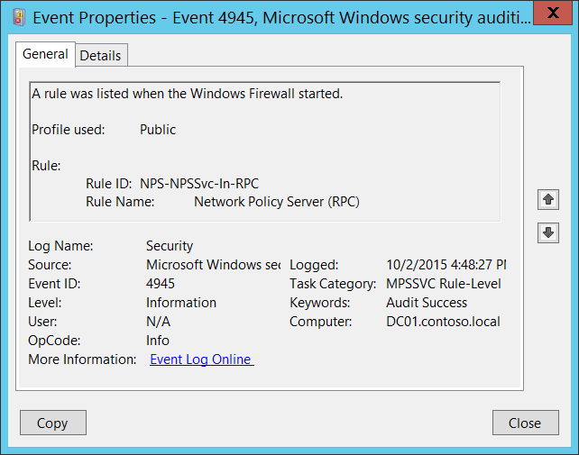
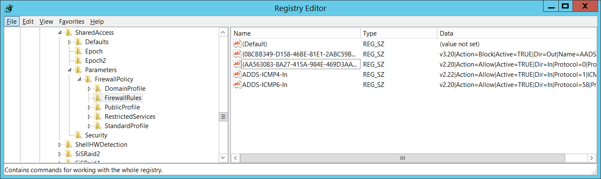
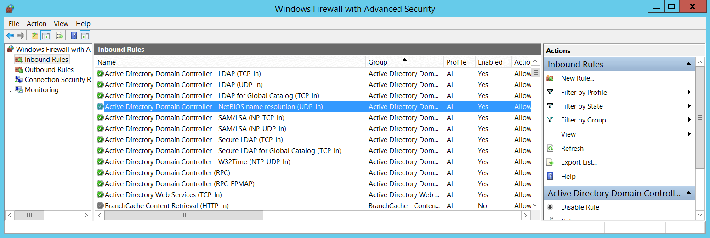

# 4945(S): Windowsファイアウォールが開始されたときにルールが一覧表示されました。




***サブカテゴリ:***&nbsp;[MPSSVCルールレベルポリシー変更の監査](audit-mpssvc-rule-level-policy-change.md)

***イベントの説明:***

このイベントは、Windowsファイアウォールサービスが開始されるたびに生成されます。

このイベントは、Windowsファイアウォールが開始され、「パブリック」プロファイルに適用されたときに一覧表示されたインバウンドおよび/またはアウトバウンドルールを示します。

このイベントはルールごとに生成されます。

> **注**&nbsp;&nbsp;推奨事項については、このイベントの[セキュリティ監視の推奨事項](#security-monitoring-recommendations)を参照してください。

<br clear="all">

***イベントXML:***
```xml
- <Event xmlns="http://schemas.microsoft.com/win/2004/08/events/event">
- <System>
 <Provider Name="Microsoft-Windows-Security-Auditing" Guid="{54849625-5478-4994-A5BA-3E3B0328C30D}" /> 
 <EventID>4945</EventID> 
 <Version>0</Version> 
 <Level>0</Level> 
 <Task>13571</Task> 
 <Opcode>0</Opcode> 
 <Keywords>0x8020000000000000</Keywords> 
 <TimeCreated SystemTime="2015-10-02T23:48:27.535295100Z" /> 
 <EventRecordID>1049946</EventRecordID> 
 <Correlation /> 
 <Execution ProcessID="500" ThreadID="4744" /> 
 <Channel>Security</Channel> 
 <Computer>DC01.contoso.local</Computer> 
 <Security /> 
 </System>
- <EventData>
 <Data Name="ProfileUsed">Public</Data> 
 <Data Name="RuleId">NPS-NPSSvc-In-RPC</Data> 
 <Data Name="RuleName">Network Policy Server (RPC)</Data> 
 </EventData>
 </Event>

```

***必要なサーバーの役割:*** なし。

***最小OSバージョン:*** Windows Server 2008, Windows Vista。

***イベントバージョン:*** 0。

***フィールドの説明:***

**使用されたプロファイル** \[タイプ = UnicodeString\]**:** ルールが属するプロファイルの名前。常に「**パブリック**」という値を持ちます。このイベントは「パブリック」プロファイルのルールのみを表示するためです。

**ルール:**

-   **ルールID** \[タイプ = UnicodeString\]: 一意のファイアウォールルール識別子。

    ルールの一意のIDを確認するには、「**HKEY\_LOCAL\_MACHINE\\SYSTEM\\CurrentControlSet\\Services\\SharedAccess\\Parameters\\FirewallPolicy\\FirewallRules**」レジストリキーに移動し、パラメータ付きのWindowsファイアウォールルールID（名前列）のリストを確認します。



-   **ルール名** \[タイプ = UnicodeString\]: Windowsファイアウォールが開始されたときに一覧表示されたルールの名前。Windowsファイアウォールのルール名は、Windowsファイアウォールの詳細設定管理コンソール（**wf.msc**）を使用して、「名前」列を確認することで確認できます。



## セキュリティ監視の推奨事項

4945(S): Windows ファイアウォールが開始されたときにルールが一覧表示されました。

-   通常、このイベントは情報提供を目的としています。

-   残念ながら、このイベントは**パブリック**プロファイルのルールのみを表示しますが、それでも異なるコンピューターのパブリックプロファイルルールに対する組織のWindowsファイアウォールベースラインとこのリストを比較し、構成が同じでない場合にアラートをトリガーすることができます。
