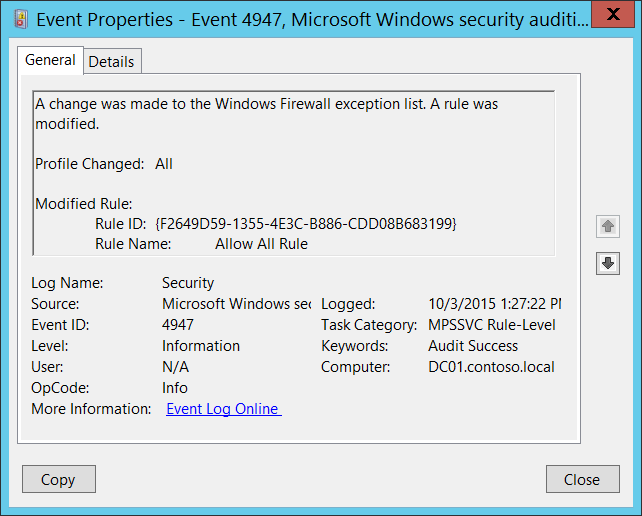

# 4947(S): Windowsファイアウォールの例外リストが変更されました。ルールが変更されました。



***サブカテゴリ:***&nbsp;[MPSSVCルールレベルのポリシー変更の監査](audit-mpssvc-rule-level-policy-change.md)

***イベントの説明:***

このイベントは、Windowsファイアウォールのルールが変更されたときに生成されます。

このイベントは、グループポリシーを介してファイアウォールルールが変更された場合には生成されません。

> **注**&nbsp;&nbsp;推奨事項については、このイベントの[セキュリティ監視の推奨事項](#security-monitoring-recommendations)を参照してください。

<br clear="all">

***イベントXML:***
```
- <Event xmlns="http://schemas.microsoft.com/win/2004/08/events/event">
- <System>
 <Provider Name="Microsoft-Windows-Security-Auditing" Guid="{54849625-5478-4994-A5BA-3E3B0328C30D}" /> 
 <EventID>4947</EventID> 
 <Version>0</Version> 
 <Level>0</Level> 
 <Task>13571</Task> 
 <Opcode>0</Opcode> 
 <Keywords>0x8020000000000000</Keywords> 
 <TimeCreated SystemTime="2015-10-03T20:27:22.485152000Z" /> 
 <EventRecordID>1050908</EventRecordID> 
 <Correlation /> 
 <Execution ProcessID="500" ThreadID="3796" /> 
 <Channel>Security</Channel> 
 <Computer>DC01.contoso.local</Computer> 
 <Security /> 
 </System>
- <EventData>
 <Data Name="ProfileChanged">All</Data> 
 <Data Name="RuleId">{F2649D59-1355-4E3C-B886-CDD08B683199}</Data> 
 <Data Name="RuleName">Allow All Rule</Data> 
 </EventData>
 </Event>

```

***必要なサーバー役割:*** なし。

***最小OSバージョン:*** Windows Server 2008, Windows Vista。

***イベントバージョン:*** 0。

***フィールドの説明:***

**変更されたプロファイル** \[タイプ = UnicodeString\]**:** 変更されたルールが適用されるプロファイルのリスト。例:

-   All

-   Domain,Public

-   Domain,Private

-   Private,Public

-   Public

-   Domain

-   Private

**変更されたルール:**

-   **ルールID** \[タイプ = UnicodeString\]: 変更されたファイアウォールルールの一意の識別子。

    ルールの一意のIDを確認するには、“**HKEY\_LOCAL\_MACHINE\\SYSTEM\\CurrentControlSet\\Services\\SharedAccess\\Parameters\\FirewallPolicy\\FirewallRules”**レジストリキーに移動し、パラメータ付きのWindowsファイアウォールルールID（名前列）のリストを確認します:


-   **ルール名** \[タイプ = UnicodeString\]: 変更されたルールの名前。Windowsファイアウォールのルール名は、Windowsファイアウォールの詳細セキュリティ管理コンソール（**wf.msc**）を使用して、「名前」列を確認することで確認できます:


## セキュリティ監視の推奨事項

4947(S): Windows ファイアウォールの例外リストが変更されました。ルールが変更されました。

-   このイベントは、ローカルで行われたすべてのファイアウォールルールの変更を監視したい場合に役立ちます。
